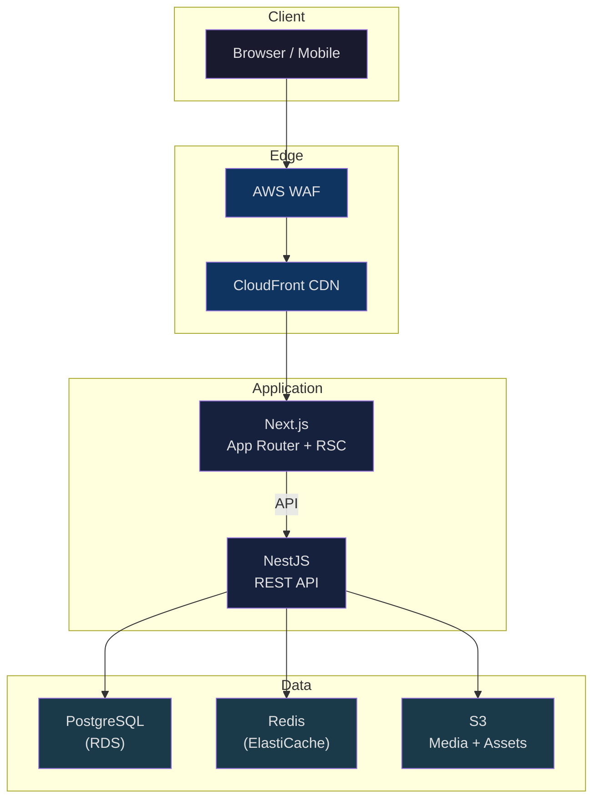

# Habib University — Preferred Partner Platform

> A museum-quality digital experience for university brand partnerships.

[](#)
[](LICENSE)
[](#)
[](#)
[](#)
[](#)

---

## About

The **HU Preferred Partner Platform** is a full-stack web application that transforms Habib University's brand partnerships from fragmented WhatsApp groups and email chains into a curated, searchable digital ecosystem. Students discover partner brands and exclusive offers. Partners manage their own presence through a self-service portal. University administrators oversee everything through a CMS-driven dashboard with real analytics.

This is not a coupon aggregator or a generic SaaS template. Every design decision follows an editorial, typography-first philosophy — intentional whitespace, systematic type scales, and meaningful animation. The platform is built to feel like a curated exhibition: restrained, specific to HU's brand identity, and honest about its data. If a partner has no offers, it says so. If a section has no content, it shows a designed empty state — never filler.

The architecture is a decoupled monorepo: a Next.js App Router frontend with aggressive React Server Components for performance, backed by a NestJS REST API with Prisma ORM and PostgreSQL. Infrastructure runs on AWS (ECS Fargate, RDS, S3, CloudFront) with automated CI/CD. Every technology choice is documented with rationale and version constraints.

---

## Tech Stack

| Layer | Technology | Purpose |
|-------|-----------|---------|
| **Frontend** | Next.js 14+ (App Router) | SSR, RSC, routing, metadata API |
| **UI** | React 18+, TypeScript 5+ | Component model, type safety |
| **Styling** | Tailwind CSS 3+, shadcn/ui | Utility-first CSS, accessible primitives |
| **Animation** | Framer Motion, GSAP, Lenis | Layout animation, scroll-triggered sequences, smooth scroll |
| **3D** | Three.js, React Three Fiber | Selective WebGL experiences |
| **Backend** | NestJS 10+ | REST API, guards, interceptors, DI |
| **ORM** | Prisma 5+ | Type-safe database access, migrations |
| **Database** | PostgreSQL 16 | Relational data store |
| **Validation** | Zod | Schema validation, type inference |
| **Infra** | Docker, AWS (ECS, RDS, S3, CloudFront) | Containerised deployment |
| **Monorepo** | pnpm workspaces, Turborepo | Task orchestration, caching |

---

## Quick Start

### Prerequisites

- **Node.js** ≥ 20 (LTS)
- **pnpm** ≥ 9
- **Docker** ≥ 24
- **PostgreSQL** 16 (or use Docker)

### Setup

```bash
# Clone the repository
git clone <repo-url> && cd HuPrefferedPartner

# Install dependencies
pnpm install

# Copy environment files
cp apps/web/.env.example apps/web/.env.local
cp apps/api/.env.example apps/api/.env

# Start the database
docker compose up -d postgres

# Run database migrations
pnpm --filter api prisma migrate dev

# Seed the database (optional)
pnpm --filter api prisma db seed

# Start development servers
pnpm dev
```

The frontend runs at `http://localhost:3000` and the API at `http://localhost:4000`.

---

## Project Structure

```
HuPrefferedPartner/
├── apps/
│   ├── web/                    # Next.js App Router frontend
│   │   ├── src/
│   │   │   ├── app/            # File-based routing
│   │   │   │   ├── (public)/   # Landing, catalogue, partners
│   │   │   │   ├── (auth)/     # Login, register
│   │   │   │   ├── (admin)/    # Admin dashboard (protected)
│   │   │   │   └── (portal)/   # Brand portal (protected)
│   │   │   ├── components/     # React components (ui/, sections/, three/, shared/)
│   │   │   ├── lib/            # Utilities, hooks, API client
│   │   │   └── styles/         # Tokens, typography, globals
│   │   └── public/             # Static assets
│   │
│   └── api/                    # NestJS backend
│       ├── src/
│       │   ├── modules/        # Feature modules (auth, brands, offers, etc.)
│       │   ├── common/         # Guards, filters, interceptors, decorators
│       │   └── config/         # App, database, auth configuration
│       └── prisma/             # Schema, migrations, seed
│
├── packages/
│   ├── ui/                     # Shared shadcn/ui components (@hu/ui)
│   ├── types/                  # Shared TypeScript types (@hu/types)
│   ├── config/                 # Shared ESLint, TSConfig (@hu/config)
│   └── utils/                  # Shared utilities (@hu/utils)
│
├── docker/                     # Dockerfiles and compose
├── docs/                       # Project documentation
│   └── implementation/         # Implementation roadmap
├── .github/                    # CI/CD workflows
└── infra/                      # AWS infrastructure (CDK/Terraform)
```

---

## Available Scripts

| Command | Description |
|---------|-------------|
| `pnpm dev` | Start all development servers (web + api) |
| `pnpm build` | Build all applications and packages |
| `pnpm lint` | Lint all workspaces |
| `pnpm type-check` | Run TypeScript compiler checks |
| `pnpm test` | Run unit tests across all workspaces |
| `pnpm test:e2e` | Run end-to-end tests |
| `pnpm --filter web dev` | Start only the frontend |
| `pnpm --filter api dev` | Start only the backend |
| `pnpm --filter api prisma studio` | Open Prisma Studio (database GUI) |
| `pnpm --filter api prisma migrate dev` | Run pending migrations |

---

## Documentation

| Document | Description |
|----------|-------------|
| [Vision](docs/Vision.md) | Mission, target audiences, success metrics, phased roadmap |
| [Architecture](docs/Architecture.md) | System design, data flow, AWS deployment, monorepo structure |
| [Tech Stack](docs/Tech-Stack.md) | Every technology with version, purpose, and rationale |
| [Design Principles](docs/Design-Principles.md) | Anti AI-Slop rules, typography-first, whitespace, editorial philosophy |
| [Folder Structure](docs/Folder-Structure.md) | Complete monorepo layout with co-location rules |
| [Frontend Guidelines](docs/Frontend-Guidelines.md) | Next.js conventions, RSC, data fetching, Tailwind, shadcn/ui |
| [Backend Guidelines](docs/Backend-Guidelines.md) | NestJS patterns, DTOs, Prisma, API versioning, RBAC |
| [Animation Guidelines](docs/Animation-Guidelines.md) | Motion hierarchy, durations, easings, library policies |
| [Three.js Guidelines](docs/ThreeJS-Guidelines.md) | 3D usage criteria, performance budgets, mobile fallbacks |
| [Accessibility](docs/Accessibility.md) | WCAG 2.2 AA, semantic HTML, ARIA, keyboard nav |
| [Performance](docs/Performance.md) | Core Web Vitals targets, bundle budgets, caching |
| [Security](docs/Security.md) | Auth, RBAC, XSS/CSRF/SQLi prevention, CSP |
| [Testing Strategy](docs/Testing-Strategy.md) | Unit, integration, E2E testing approach |
| [Master Plan](docs/implementation/MASTER_PLAN.md) | 20-phase implementation roadmap |

---

## Architecture Overview

**Production Environment (AWS)**
The canonical production architecture is strictly AWS-native.

**Pilot Testing (Vercel)**
To enable rapid QA, stakeholder review, and pilot testing, the `apps/web` Next.js frontend is fully compatible with Vercel Deployments. The Vercel deployment acts as an isolated preview tier connecting to the AWS backend infrastructure (or mock APIs), and does not replace the AWS production mandate.



---

## Contributing

See [Contributing](docs/Contributing.md) for development workflow, PR guidelines, and code review process.

---

## License

This project is licensed under the [MIT License](LICENSE).

---

*Built for Habib University · Designed with intention · Engineered for performance*
