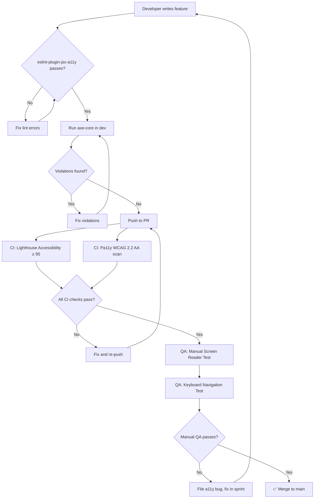

# Accessibility Guidelines

> **WCAG 2.2 AA Compliance Standard**
> The HU Preferred Partner platform is committed to delivering an inclusive digital experience for all users, including those with visual, auditory, motor, and cognitive disabilities.

---

## Commitment Statement

Habib University believes that digital accessibility is not an afterthought—it is a foundational requirement. Every feature, animation, and interaction on this platform **must** meet or exceed WCAG 2.2 Level AA conformance. Accessibility is treated as a first-class citizen alongside performance, security, and design quality.

All contributors—designers, developers, and content authors—share responsibility for maintaining compliance. Pull requests that introduce accessibility regressions **will be blocked**.

---

## WCAG 2.2 AA Requirements — Project Mapping

| WCAG Principle | Guideline | Platform Relevance |
|---|---|---|
| **Perceivable** | 1.1 Text Alternatives | All brand logos, partner images, hero visuals require `alt` text |
| | 1.2 Time-based Media | Video content in partner showcases needs captions/transcripts |
| | 1.3 Adaptable | Semantic structure for catalogue grids, offer cards, newsletter layouts |
| | 1.4 Distinguishable | HU brand color contrast ratios, text resizing, reflow |
| **Operable** | 2.1 Keyboard Accessible | Full keyboard nav for catalogue, filters, admin dashboard |
| | 2.2 Enough Time | Session timeouts in admin/brand portal must be adjustable |
| | 2.3 Seizures & Physical | Three.js scenes, GSAP/Framer Motion animations must respect motion prefs |
| | 2.4 Navigable | Skip links, focus order, breadcrumbs across all routes |
| | 2.5 Input Modalities | Touch targets ≥ 24×24 CSS px, drag alternatives for admin reordering |
| **Understandable** | 3.1 Readable | Language attributes, consistent terminology |
| | 3.2 Predictable | Consistent navigation across App Router layouts |
| | 3.3 Input Assistance | Form validation with React Hook Form + Zod, clear error messaging |
| **Robust** | 4.1 Compatible | Valid HTML, proper ARIA, tested across assistive tech |

---

## Semantic HTML

### Rules

1. **Use native HTML elements first.** A `<button>` is always preferable to a `<div role="button">`.
2. **One `<h1>` per page.** Heading hierarchy must be strictly sequential (`h1 → h2 → h3`), never skip levels.
3. **Landmark regions are mandatory.** Every page must include `<header>`, `<main>`, `<nav>`, and `<footer>`.
4. **Lists for collections.** Brand catalogues, offer lists, and navigation menus must use `<ul>`/`<ol>`.
5. **`<article>` for self-contained content.** Partner cards, offer cards, and newsletter entries are articles.
6. **Tables for tabular data only.** Admin dashboard data grids use `<table>` with `<thead>`, `<th scope>`, and `<caption>`.

```html
<!-- ✅ Correct: Partner card structure -->
<article aria-labelledby="partner-acme-title">
  
  <h3 id="partner-acme-title">Acme Corporation</h3>
  <p>Exclusive 20% discount for HU community members.</p>
  <a href="/partners/acme" aria-label="View Acme Corporation partner details">
    View Details
  </a>
</article>

<!-- ❌ Wrong: Div soup -->
<div class="card" onclick="navigate('/partners/acme')">
  <div class="card-image"></div>
  <div class="card-title">Acme Corporation</div>
</div>
```

---

## ARIA Guidelines

### When to Use ARIA

ARIA supplements semantic HTML—it does **not** replace it. Follow the five rules of ARIA:

1. Don't use ARIA if a native HTML element exists.
2. Don't change native semantics unless absolutely necessary.
3. All interactive ARIA controls must be keyboard operable.
4. Don't use `role="presentation"` or `aria-hidden="true"` on focusable elements.
5. All interactive elements must have an accessible name.

### Platform-Specific ARIA Patterns

| Component | ARIA Pattern | Notes |
|---|---|---|
| Brand Catalogue Filters | `role="listbox"`, `aria-multiselectable` | Category/industry filter dropdowns |
| Offer Cards Grid | `aria-live="polite"` | Announce filter/sort result changes |
| Image Carousel | `role="region"`, `aria-roledescription="carousel"` | Partner page hero galleries |
| Admin Sidebar Nav | `aria-current="page"`, `aria-expanded` | Collapsible navigation sections |
| Modal Dialogs | `role="dialog"`, `aria-modal="true"` | Confirmation dialogs, image previews |
| Toast Notifications | `role="alert"`, `aria-live="assertive"` | CMS save confirmations, error alerts |
| Loading States | `aria-busy="true"`, `aria-live="polite"` | Skeleton screens during data fetches |

### shadcn/ui Components

shadcn/ui components ship with reasonable ARIA defaults. **Do not strip them.** When composing custom components from shadcn/ui primitives, verify that:
- Focus trapping works in dialogs and dropdown menus
- `aria-expanded`, `aria-controls`, and `aria-haspopup` are correctly wired
- Combobox and Select components announce selected values

---

## Keyboard Navigation

### Global Requirements

- **Skip to main content** link on every page (visible on focus).
- **Focus indicators** must be clearly visible — minimum 2px solid outline with sufficient contrast. Never set `outline: none` without a visible replacement.
- **Tab order** must follow visual reading order. Avoid positive `tabindex` values.
- **Focus trapping** inside modals, drawers, and overlay menus. Escape key closes them.
- **Roving tabindex** for composite widgets (tabs, toolbars, menu bars).

### Key Bindings

| Context | Key | Action |
|---|---|---|
| Catalogue Grid | `Arrow Keys` | Navigate between brand cards |
| Filter Dropdown | `Enter` / `Space` | Toggle filter option |
| Modal | `Escape` | Close modal, return focus to trigger |
| Admin Dashboard Tabs | `Arrow Left/Right` | Switch between tab panels |
| Newsletter PDF Viewer | `Page Up/Down` | Scroll PDF content |
| Search | `/` | Focus search input (when not in form) |

---

## Screen Reader Support

### Target Assistive Technologies

| Screen Reader | Browser | Priority |
|---|---|---|
| NVDA | Chrome, Firefox (Windows) | Primary |
| VoiceOver | Safari (macOS, iOS) | Primary |
| JAWS | Chrome (Windows) | Secondary |
| TalkBack | Chrome (Android) | Secondary |

### Content Authoring Rules

1. **Images:** Every `` has a meaningful `alt`. Decorative images use `alt=""` and `aria-hidden="true"`.
2. **Icons:** Icon-only buttons include `aria-label`. Inline SVG icons have `aria-hidden="true"` when paired with text.
3. **Dynamic content:** Route changes in Next.js App Router must announce page titles. Use a live region or `document.title` update strategy.
4. **PDF Newsletters:** Provide an accessible HTML summary alongside the PDF download link. PDFs themselves should be tagged.

---

## Color Contrast

### HU Brand Color Compliance

All HU brand colors must meet the following contrast ratios against their typical backgrounds:

| Color Pairing | Ratio Required | Usage |
|---|---|---|
| Primary text on background | ≥ 4.5:1 (AA normal text) | Body copy, descriptions |
| Large text on background | ≥ 3:1 (AA large text) | Headings, hero text |
| UI components on background | ≥ 3:1 (AA) | Buttons, inputs, icons |
| Focus indicators | ≥ 3:1 against adjacent colors | Outlines, rings |

### Rules

- **Never rely on color alone** to convey information. Status indicators (active/inactive offers) must include icons or text labels.
- **Dark mode** must be independently verified for contrast compliance.
- **Link text** must be distinguishable from surrounding body text by more than color (underline or bold + color).
- **Use tools** during development: Chrome DevTools contrast checker, axe DevTools, Stark plugin.

> Cross-reference: [Design-Principles.md](./Design-Principles.md) for the full brand color palette and approved pairings.

---

## Motion Accessibility

### Respecting `prefers-reduced-motion`

All animations—Framer Motion, GSAP, CSS transitions, and Three.js scenes—**must** honour the user's motion preference.

```typescript
// Framer Motion — global reduction
const prefersReducedMotion = usePrefersReducedMotion();

const variants = prefersReducedMotion
  ? { initial: {}, animate: {}, exit: {} }         // No motion
  : { initial: { opacity: 0 }, animate: { opacity: 1 }, exit: { opacity: 0 } };

// CSS fallback
@media (prefers-reduced-motion: reduce) {
  *, *::before, *::after {
    animation-duration: 0.01ms !important;
    transition-duration: 0.01ms !important;
    scroll-behavior: auto !important;
  }
}
```

### Vestibular Disorder Considerations

- **Parallax scrolling** (Lenis + GSAP) must be disabled entirely under reduced motion.
- **Auto-playing carousels** must pause. Provide explicit play/pause controls regardless.
- **Three.js camera animations** must snap to final position instead of animating.
- **Scale and zoom transitions** should cross-fade instead of zooming.
- **No content should flash** more than 3 times per second.

> Cross-reference: [Animation-Guidelines.md](./Animation-Guidelines.md) for motion design rules, [ThreeJS-Guidelines.md](./ThreeJS-Guidelines.md) for 3D scene accessibility.

---

## Form Accessibility

### React Hook Form + Zod Integration

All forms on the platform (contact forms, admin CMS, brand portal login, newsletter signup) must follow these rules:

1. **Every input has a visible `<label>`** associated via `htmlFor`/`id`. Placeholder text is not a substitute.
2. **Error messages** are linked to inputs via `aria-describedby` and announced by `aria-invalid="true"`.
3. **Required fields** are indicated with both visual markers and `aria-required="true"`.
4. **Group related fields** with `<fieldset>` and `<legend>` (e.g., address fields, date ranges).
5. **Submit feedback** is announced via a live region (`aria-live="polite"`).

```tsx
<div>
  <label htmlFor="email">Email Address *</label>
  <input
    id="email"
    type="email"
    aria-required="true"
    aria-invalid={!!errors.email}
    aria-describedby={errors.email ? "email-error" : undefined}
    {...register("email")}
  />
  {errors.email && (
    <p id="email-error" role="alert">{errors.email.message}</p>
  )}
</div>
```

---

## 3D Content Accessibility

Three.js / React Three Fiber scenes (landing page hero, interactive brand showcases) present unique challenges:

1. **Canvas elements are opaque to screen readers.** Always provide an `aria-label` on the `<Canvas>` element describing the scene.
2. **Provide a static fallback.** Users with `prefers-reduced-motion: reduce` or no WebGL support see a high-quality static image.
3. **Interactive 3D elements** must have 2D HTML alternatives. If a user can click a 3D object, an equivalent HTML button must exist in the DOM.
4. **Do not lock essential content inside 3D scenes.** All information shown in 3D must be available via standard HTML.
5. **Performance degradation** should fallback gracefully—not break the page.

> Cross-reference: [ThreeJS-Guidelines.md](./ThreeJS-Guidelines.md) for implementation details.

---

## Testing Tools & Process

### Required Tools

| Tool | Purpose | Stage |
|---|---|---|
| **axe-core / axe DevTools** | Automated WCAG rule checking | Development, CI |
| **Lighthouse** | Accessibility audit scoring | CI, PR checks |
| **eslint-plugin-jsx-a11y** | Lint-time JSX accessibility checks | Development |
| **NVDA + Chrome** | Manual screen reader testing | QA |
| **VoiceOver + Safari** | Manual screen reader testing (macOS) | QA |
| **Colour Contrast Analyser** | Manual contrast verification | Design review |
| **Keyboard-only navigation** | Manual tab/focus testing | QA |
| **Pa11y CI** | Automated page-level WCAG testing | CI pipeline |

### Accessibility Testing Workflow



### CI Thresholds

| Metric | Minimum | Blocking? |
|---|---|---|
| Lighthouse Accessibility Score | 95 | Yes |
| axe-core Critical Violations | 0 | Yes |
| axe-core Serious Violations | 0 | Yes |
| Pa11y Errors | 0 | Yes |

---

## Checklist — Per-Feature Sign-Off

Before any feature is considered complete, the developer must verify:

- [ ] All content is accessible via keyboard alone
- [ ] Screen reader announces content in logical order
- [ ] All images have appropriate `alt` text
- [ ] Color contrast meets AA ratios
- [ ] Forms have labels, error messages, and ARIA attributes
- [ ] Animations respect `prefers-reduced-motion`
- [ ] 3D content has static fallback and HTML alternatives
- [ ] No Lighthouse accessibility regressions
- [ ] Tested with at least one screen reader (NVDA or VoiceOver)

---

> **Cross-references:**
> - [Animation-Guidelines.md](./Animation-Guidelines.md) — Motion design and reduced-motion rules
> - [ThreeJS-Guidelines.md](./ThreeJS-Guidelines.md) — 3D scene accessibility and fallbacks
> - [Design-Principles.md](./Design-Principles.md) — Brand colors, typography, and contrast
