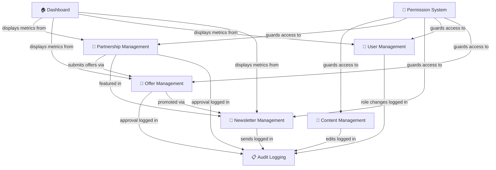

# Admin System Architecture

> **Platform**: Habib University Preferred Partner Program
> **Modules**: Dashboard, Permissions, Content, Partnerships, Newsletters, Users, Offers, Audit
> **Stack**: Next.js (Admin UI) · NestJS (API) · Prisma · PostgreSQL

---

## Table of Contents

- [Dashboard Overview](#dashboard-overview)
- [Permission System](#permission-system)
- [Content Management](#content-management)
- [Partnership Management](#partnership-management)
- [Newsletter Management](#newsletter-management)
- [User Management](#user-management)
- [Offer Management](#offer-management)
- [Audit Logging](#audit-logging)
- [Admin UI Patterns](#admin-ui-patterns)
- [Module Relationships](#module-relationships)

---

## Dashboard Overview

The admin dashboard serves as the central command center for platform administrators. Upon login, admins are presented with a high-level summary of platform health, recent activity, and actionable items requiring attention.

### Key Metrics

| Metric                  | Source              | Refresh Interval |
|-------------------------|---------------------|-------------------|
| Total Active Partners   | `partners` table    | Real-time         |
| Pending Approvals       | `approval_queue`    | Real-time         |
| Active Offers           | `offers` table      | 5 minutes         |
| Newsletter Subscribers  | `subscribers` table | 15 minutes        |
| Monthly Page Views      | Analytics API       | Hourly            |
| New Users (30 days)     | `users` table       | Daily             |

### Recent Activity Feed

The activity feed aggregates the latest actions across all admin modules, displayed in reverse chronological order. Each entry includes the actor, action type, affected resource, and timestamp. Entries are filterable by module (e.g., partnerships, offers, users).

### Quick Actions

Frequently used operations are surfaced as quick-action buttons:

- **Approve Partner** — Navigate directly to the approval queue
- **Create Newsletter** — Open the newsletter editor
- **Review Offer** — Jump to the offer approval queue
- **Add User** — Open the user creation form

---

## Permission System

The platform implements a role-based access control (RBAC) model with two primary admin roles and feature-level permission granularity.

### Role Definitions

#### `super_admin`

Full unrestricted access to all platform features. Super admins can:

- Manage all content, users, partners, offers, and newsletters
- Assign and revoke admin roles
- Access audit logs and system configuration
- Modify permission assignments for other admins
- Perform bulk operations and destructive actions (e.g., permanent deletion)

#### `admin`

Scoped access controlled by feature-level permissions. Standard admins receive a subset of capabilities based on their assigned permission set.

### Feature-Level Permissions

Permissions are defined per module and per operation. The permission matrix is stored in the `admin_permissions` table and evaluated on every API request via a NestJS guard.

| Module        | Permissions Available                         |
|---------------|-----------------------------------------------|
| Content       | `content.read`, `content.write`, `content.delete` |
| Partners      | `partners.read`, `partners.approve`, `partners.manage` |
| Newsletters   | `newsletters.read`, `newsletters.write`, `newsletters.publish` |
| Users         | `users.read`, `users.write`, `users.roles`    |
| Offers        | `offers.read`, `offers.approve`, `offers.manage` |
| Audit         | `audit.read`                                  |

### Permission Evaluation Flow

1. Admin authenticates via JWT-based session
2. API guard extracts the admin's role and permissions from the token payload
3. Each endpoint is decorated with `@RequirePermission('module.action')`
4. Guard checks if the admin's role is `super_admin` (bypass) or if the required permission exists in their permission set
5. Unauthorized requests return `403 Forbidden` with a descriptive error message

---

## Content Management

All public-facing content is managed through a unified CRUD interface. Content types include pages, announcements, FAQs, and promotional banners.

### Supported Content Types

- **Pages** — Static informational pages (About, Terms, Privacy)
- **Announcements** — Time-bound notices displayed on the homepage
- **FAQs** — Categorized question-answer pairs
- **Banners** — Promotional hero banners with image, title, CTA link

### CRUD Operations

Each content type supports full create, read, update, and delete operations. Content is versioned — every edit creates a new revision, and previous versions can be restored.

### Bulk Operations

Admins with appropriate permissions can perform bulk actions:

- **Bulk Publish/Unpublish** — Toggle visibility for multiple items simultaneously
- **Bulk Delete** — Soft-delete multiple items (moved to trash, recoverable for 30 days)
- **Bulk Export** — Export content as CSV or JSON for external use

---

## Partnership Management

Partnerships are the core entity of the platform. Each partnership represents a relationship between Habib University and an external brand partner.

### Partner List

The partner list provides a searchable, filterable, and sortable table of all registered partners. Columns include partner name, tier, status, join date, total active offers, and primary contact.

### Approval Queue

New partner applications appear in the approval queue. Each entry displays the applicant's submitted information, supporting documents, and a review form. Admins can:

- **Approve** — Activate the partnership and trigger a welcome email
- **Reject** — Decline with a required reason (sent to the applicant)
- **Request Info** — Ask the applicant for additional details before making a decision

### Tier Management

Partners are organized into tiers that determine visibility, feature access, and promotional placement:

| Tier       | Benefits                                           |
|------------|-----------------------------------------------------|
| Platinum   | Homepage featured, priority support, unlimited offers |
| Gold       | Category featured, standard support, 20 offers/month |
| Silver     | Listed in directory, email support, 10 offers/month  |

Tier assignments are managed by `super_admin` or admins with `partners.manage` permission.

---

## Newsletter Management

The newsletter module provides a complete workflow for creating, editing, previewing, and publishing email newsletters to platform subscribers.

### Workflow

1. **Create** — Author newsletter content using the rich-text editor with template selection
2. **Edit** — Revise drafts with auto-save and revision history
3. **Preview** — Render the newsletter as it will appear in subscribers' inboxes (desktop and mobile preview)
4. **Publish** — Schedule for immediate or future delivery via the email service (e.g., SendGrid, AWS SES)

### Template System

Newsletters use predefined HTML templates stored in `/packages/email-templates/`. Variables such as `{{partner_name}}`, `{{offer_title}}`, and `{{unsubscribe_link}}` are interpolated at send time.

---

## User Management

Admins can view and manage all registered platform users, including students, faculty, staff, and alumni of Habib University.

### User List

The user list displays name, email, role, registration date, last login, and account status. The list supports full-text search, column sorting, and multi-filter combinations.

### Role Assignment

Roles are assigned per user and determine access to platform features. Available roles: `student`, `faculty`, `staff`, `alumni`, `admin`, `super_admin`. Role changes are logged in the audit trail.

### Account Status

User accounts can be in one of four states:

- **Active** — Full access to the platform
- **Suspended** — Temporarily disabled; user sees a suspension notice on login
- **Deactivated** — Voluntarily deactivated by the user; can be reactivated
- **Banned** — Permanently disabled by an admin; requires `super_admin` to reverse

---

## Offer Management

Offers are time-bound promotions or discounts provided by brand partners to the Habib University community.

### Approval Queue

When a partner submits a new offer, it enters the admin approval queue. Each offer displays: partner name, offer title, description, discount details, validity period, and terms. Admins can approve, reject (with feedback), or request modifications.

### Offer Lifecycle

| Status      | Description                                      |
|-------------|--------------------------------------------------|
| `draft`     | Created by partner, not yet submitted             |
| `pending`   | Submitted for admin review                        |
| `approved`  | Approved and visible to users                     |
| `rejected`  | Declined by admin with feedback                   |
| `active`    | Currently within the validity period               |
| `expired`   | Past the end date; automatically archived          |
| `revoked`   | Manually pulled by admin or partner                |

### Active and Expired Offers

The admin interface provides separate views for active and expired offers. Expired offers are retained for analytics and can be cloned to create new offers with pre-filled data.

---

## Audit Logging

Every administrative action is recorded in an immutable audit log. Audit entries capture the full context of each operation for compliance and traceability.

### Audit Entry Schema

```typescript
interface AuditEntry {
  id: string;
  actor_id: string;        // Admin who performed the action
  actor_email: string;
  action: string;          // e.g., 'partner.approve', 'offer.reject'
  resource_type: string;   // e.g., 'Partner', 'Offer', 'User'
  resource_id: string;
  changes: {               // JSON diff of before/after state
    field: string;
    old_value: any;
    new_value: any;
  }[];
  ip_address: string;
  user_agent: string;
  timestamp: DateTime;
}
```

### Retention and Access

- Audit logs are retained indefinitely and cannot be modified or deleted
- Only admins with the `audit.read` permission can view logs
- Logs are searchable by actor, action, resource type, date range, and keyword
- Export functionality supports CSV and JSON formats for external auditing

---

## Admin UI Patterns

The admin interface follows consistent UI patterns across all modules to ensure a cohesive user experience.

### Data Tables

All list views use a standardized data table component with:

- **Column sorting** — Click column headers to sort ascending/descending
- **Row selection** — Checkbox-based row selection for bulk operations
- **Inline actions** — Edit, delete, and view buttons on each row
- **Empty states** — Descriptive messages and CTAs when no data matches filters

### Filters and Search

- **Global search** — Full-text search across the current module's data
- **Column filters** — Dropdown or date-range filters per column
- **Saved filters** — Admins can save frequently used filter combinations
- **Active filter chips** — Visual indicators of applied filters with one-click removal

### Pagination

- Server-side pagination with configurable page sizes (10, 25, 50, 100)
- Cursor-based pagination for large datasets to maintain performance
- Total count display and page navigation controls

---

## Module Relationships

The following diagram illustrates how admin modules interact with each other and share data flows.



---

> **Related Documentation**: [Brand Portal](./Brand-Portal.md) · [Testing Strategy](./Testing-Strategy.md)
