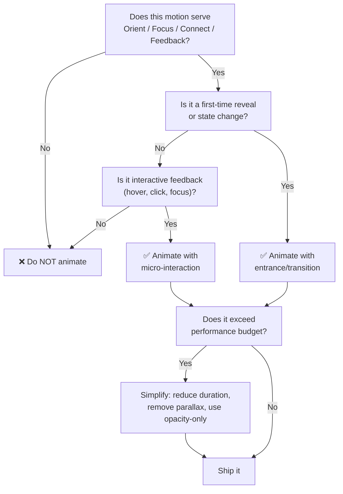
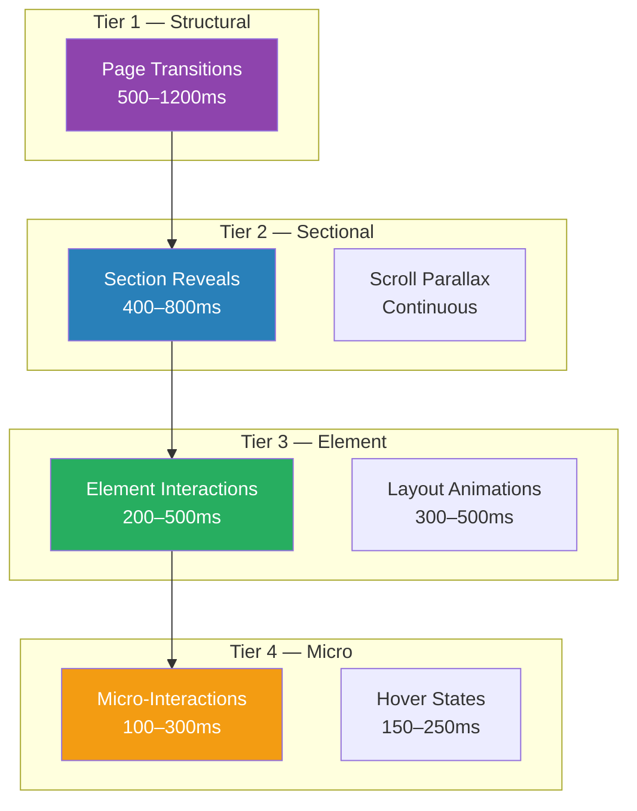

# Animation Guidelines

> Motion design philosophy, technical policies, and implementation rules for the Habib University Preferred Partner platform.

**Related docs:** [Design-Principles.md](file:///D:/Web%20Projects/HuPrefferedPartner/docs/Design-Principles.md) · [Performance.md](file:///D:/Web%20Projects/HuPrefferedPartner/docs/Performance.md) · [Accessibility.md](file:///D:/Web%20Projects/HuPrefferedPartner/docs/Accessibility.md) · [ThreeJS-Guidelines.md](file:///D:/Web%20Projects/HuPrefferedPartner/docs/ThreeJS-Guidelines.md)

---

## 1. Animation Philosophy

Animation exists to **communicate**, not to decorate. Every motion must serve one of these purposes:

1. **Orient** — Help the user understand where they are (page transitions, scroll progress).
2. **Focus** — Direct attention to what matters (reveals, highlights, CTAs).
3. **Connect** — Show relationships between elements (layout shifts, shared transitions).
4. **Feedback** — Confirm user actions (button press, form submit, hover states).

If an animation doesn't serve one of these four purposes, **remove it**. This is the anti-slop principle applied to motion — purposeful, restrained, premium.

---

## 2. Animation Decision Framework

### When to Animate



### When NOT to Animate

- **Repeat visits to the same content** — Animate once, not on every scroll back.
- **Critical-path interactions** — Never delay form submissions, navigation, or data loading with animation.
- **Dense data views** — Admin tables, analytics dashboards. Motion adds noise.
- **Content the user is trying to read** — Never animate body text on scroll.
- **When `prefers-reduced-motion` is set** — See [Section 8](#8-prefers-reduced-motion-mandatory).

---

## 3. Motion Hierarchy

Not all motion is equal. Higher-tier animations are more dramatic; lower-tier animations are subtle. Never invert this hierarchy.



### Rules

| Tier | Max Active Simultaneously | Easing | GPU-Composited Only |
|------|---------------------------|--------|---------------------|
| 1 — Structural | 1 | Custom spring / cubic-bezier | Yes |
| 2 — Sectional | 3 per viewport | Ease-out | Yes |
| 3 — Element | 5 per viewport | Ease-out / spring | Yes |
| 4 — Micro | No hard limit | Ease-in-out | Yes (must be) |

---

## 4. Duration & Easing Scale

### Duration Reference

| Motion Type | Duration | Notes |
|-------------|----------|-------|
| Hover / focus states | 100–200ms | Instant feel |
| Button press / toggle | 150–250ms | Snappy feedback |
| Tooltip / popover show | 150–200ms | Quick but noticeable |
| Dropdown / menu open | 200–300ms | Needs spatial context |
| Modal open / close | 250–400ms | Needs entrance drama |
| Card / element reveal | 300–600ms | Stagger children 50–80ms apart |
| Section scroll reveal | 400–800ms | Ease-out, never ease-in |
| Page transition | 500–1200ms | Cross-fade or shared element |
| 3D camera movement | 800–1500ms | Smooth, cinematic |

> [!WARNING]
> Any animation exceeding **1500ms** requires explicit architectural approval. Users perceive delays beyond this as broken.

### Easing Functions

```typescript
// Standard easings — use these, not CSS keywords
export const easings = {
  // Default for most UI transitions
  easeOut: [0.16, 1, 0.3, 1],

  // Interactive feedback (buttons, toggles)
  easeInOut: [0.65, 0, 0.35, 1],

  // Entrances with personality
  spring: { type: 'spring', stiffness: 300, damping: 30 },

  // Hero / page transitions
  dramatic: [0.76, 0, 0.24, 1],

  // Exits (should be faster than entrances)
  exitEase: [0.4, 0, 1, 1],
} as const;
```

### Rules

- **Entrances are slower than exits.** Enter at 400ms, exit at 250ms.
- **Never use linear easing** for UI elements. Linear is only acceptable for infinite loops (spinners, marquees).
- **Never use `ease-in` alone** — elements that decelerate into view feel natural; elements that accelerate into view feel like they're falling.

---

## 5. Framer Motion Policies

Framer Motion is the **primary animation library** for React component animations.

### Approved Patterns

```typescript
// ✅ Scroll-triggered reveal with IntersectionObserver
<motion.div
  initial={{ opacity: 0, y: 30 }}
  whileInView={{ opacity: 1, y: 0 }}
  viewport={{ once: true, margin: '-10%' }}
  transition={{ duration: 0.5, ease: easings.easeOut }}
/>

// ✅ AnimatePresence for mount/unmount
<AnimatePresence mode="wait">
  {isVisible && (
    <motion.div
      key="modal"
      initial={{ opacity: 0, scale: 0.95 }}
      animate={{ opacity: 1, scale: 1 }}
      exit={{ opacity: 0, scale: 0.95 }}
    />
  )}
</AnimatePresence>

// ✅ Layout animation for reflow
<motion.div layout layoutId={`card-${id}`} />
```

### Prohibited Patterns

```typescript
// ❌ Animating width/height (causes layout thrash)
animate={{ width: 300 }}

// ❌ Missing viewport.once (re-triggers on every scroll)
whileInView={{ opacity: 1 }}
viewport={{}} // Missing once: true

// ❌ Stagger without limit
transition={{ staggerChildren: 0.1 }} // 50 children = 5s delay

// ❌ Motion values in render path without useMemo
const x = useMotionValue(0); // Fine
const derived = useTransform(x, expensiveCalc); // Memoize expensiveCalc
```

### Layout Animations

- Use `layoutId` for shared element transitions between routes.
- Always wrap layout-animated components in `<LayoutGroup>` to prevent conflicts.
- Set `layout="position"` when you only need position animation (avoids scale distortion).

### Stagger Rules

- Maximum stagger delay per child: **80ms**.
- Maximum total stagger duration (all children): **800ms**.
- If a list has 10+ items, only stagger the first 6–8 visible items.

---

## 6. GSAP Policies

GSAP is used for **scroll-driven animations**, **complex timelines**, and **situations where Framer Motion falls short**.

### When to Use GSAP Over Framer Motion

| Scenario | Use |
|----------|-----|
| Component mount/unmount | Framer Motion |
| Layout animations | Framer Motion |
| Hover / focus states | Framer Motion |
| Scroll-pinned sections | **GSAP ScrollTrigger** |
| Complex multi-element timelines | **GSAP** |
| Text split animations | **GSAP SplitText** |
| SVG path morphing | **GSAP MorphSVG** |
| Canvas / WebGL coordination | **GSAP** |

### ScrollTrigger Rules

```typescript
// ✅ Correct: Register plugin, clean up on unmount
useEffect(() => {
  gsap.registerPlugin(ScrollTrigger);

  const ctx = gsap.context(() => {
    gsap.to('.hero-text', {
      y: -50,
      scrollTrigger: {
        trigger: '.hero-section',
        start: 'top center',
        end: 'bottom top',
        scrub: 1,
      },
    });
  }, containerRef);

  return () => ctx.revert(); // ← MANDATORY cleanup
}, []);
```

> [!CAUTION]
> **Every `gsap.context()` must have a `.revert()` in the cleanup.** Failing to clean up GSAP in React causes memory leaks and ghost animations on re-renders.

### Timeline Conventions

- Name timelines descriptively: `heroEntrance`, `brandReveal`, not `tl1`, `tl2`.
- Use labels for synchronization: `tl.addLabel('cardsIn')`.
- Keep timelines under **8 tweens**. Split larger sequences into composed timelines.

---

## 7. Lenis (Smooth Scroll) Configuration

Lenis provides smooth scrolling. It is initialized **once** at the app root.

```typescript
// app/providers/LenisProvider.tsx
const lenis = new Lenis({
  duration: 1.2,
  easing: (t) => Math.min(1, 1.001 - Math.pow(2, -10 * t)),
  orientation: 'vertical',
  smoothWheel: true,
  touchMultiplier: 1.5, // Slightly faster touch scrolling
});
```

### Rules

- **Disable Lenis** on modals, dropdowns, and any overlay with its own scroll context.
- **Disable Lenis** when `prefers-reduced-motion` is active.
- Synchronize Lenis with GSAP ScrollTrigger via the `scrollerProxy` pattern.
- Never fight native scroll on mobile — if Lenis causes jank on low-end devices, bypass it.
- Anchor link navigation must call `lenis.scrollTo('#target')`, not native `scrollIntoView`.

---

## 8. `prefers-reduced-motion` — MANDATORY

This is **non-negotiable**. Every animation must respect the user's OS-level motion preference.

### Implementation

```typescript
// hooks/useReducedMotion.ts
export function useReducedMotion(): boolean {
  const [reduced, setReduced] = useState(false);

  useEffect(() => {
    const mq = window.matchMedia('(prefers-reduced-motion: reduce)');
    setReduced(mq.matches);
    const handler = (e: MediaQueryListEvent) => setReduced(e.matches);
    mq.addEventListener('change', handler);
    return () => mq.removeEventListener('change', handler);
  }, []);

  return reduced;
}
```

### What Changes When Reduced Motion Is Active

| Feature | Normal | Reduced Motion |
|---------|--------|----------------|
| Page transitions | Cross-fade 500ms | Instant cut |
| Scroll reveals | Translate + fade | Fade only, 200ms |
| Parallax | Active | Disabled |
| Lenis smooth scroll | Active | Disabled (native scroll) |
| Hover effects | Scale + shadow | Opacity change only |
| 3D scenes | Full animation | Static render or image fallback |
| Looping animations | Active | Paused on first frame |
| Stagger | 50–80ms per child | All children appear simultaneously |

> [!IMPORTANT]
> Framer Motion's `useReducedMotion()` hook handles most cases automatically, but GSAP animations and Lenis require **manual checks**. Audit every GSAP timeline and ScrollTrigger for reduced motion compliance.

---

## 9. Mobile Animation Policies

### Performance Constraints

- **No parallax** on devices < 768px viewport width.
- **No scroll-pinned sections** on mobile — they conflict with mobile browser chrome resizing.
- **Reduce stagger counts** — max 4 staggered children on mobile.
- **Prefer opacity + transform only** — never animate `clip-path`, `filter`, or `backdrop-filter` on mobile.
- **Test on real devices** — Chrome DevTools throttling is not sufficient.

### Touch Considerations

- `whileHover` does not exist on touch — provide alternative feedback via `whileTap`.
- Long-press animations should complete within **300ms** to avoid conflicting with native gestures.
- Swipe-driven animations must respect the **8px touch slop** before initiating.

---

## 10. Performance Constraints

### Budgets

| Metric | Target | Hard Limit |
|--------|--------|------------|
| JS animation frame time | < 8ms | < 16ms (60fps) |
| Composited layers | < 15 | < 30 |
| Total animated elements (viewport) | < 12 | < 20 |
| Animation JS bundle (Framer + GSAP) | < 45kB gzipped | < 60kB |

### GPU-Composited Properties Only

The **only** CSS properties that should be animated:

- `transform` (translate, scale, rotate)
- `opacity`
- `filter` (desktop only, with caution)
- `clip-path` (desktop only, simple shapes)

Animating `width`, `height`, `margin`, `padding`, `top`, `left`, `border-radius`, `box-shadow` causes layout recalculation and **will** drop frames.

### Profiling Checklist

Before shipping any animation:

- [ ] Chrome DevTools → Performance → Record scroll interaction → No frames > 16ms.
- [ ] Layers panel → Verify only intended elements are promoted to compositor layers.
- [ ] `will-change` applied only to elements that are about to animate, removed after.
- [ ] No layout thrashing visible in the Performance flame chart.

---

## 11. Anti-Patterns

| Anti-Pattern | Why It's Bad | Correct Approach |
|-------------|--------------|------------------|
| Animating on every scroll event | Janky, battery drain | Use IntersectionObserver or ScrollTrigger |
| `setTimeout` for sequencing | Fragile, not frame-synced | GSAP timeline or Framer Motion stagger |
| Inline spring configs everywhere | Inconsistent motion feel | Centralized easing constants |
| `animate` on every re-render | Wasted frames | Use `whileInView` with `viewport.once` |
| Giant `variants` objects | Hard to maintain | Composable motion presets |
| Parallax on images without `will-change` | Layer promotion thrash | Add `will-change: transform` |
| Animating SVGs with CSS + JS simultaneously | Conflicting transforms | Pick one animation driver |
| 3D transforms without `perspective` | Flat-looking "3D" | Set perspective on parent |

---

## 12. Motion Presets

Centralize reusable animation configs to ensure consistency:

```typescript
// lib/motion-presets.ts
export const fadeUp = {
  initial: { opacity: 0, y: 24 },
  animate: { opacity: 1, y: 0 },
  exit: { opacity: 0, y: -12 },
  transition: { duration: 0.45, ease: easings.easeOut },
};

export const scaleIn = {
  initial: { opacity: 0, scale: 0.92 },
  animate: { opacity: 1, scale: 1 },
  exit: { opacity: 0, scale: 0.95 },
  transition: { duration: 0.35, ease: easings.easeOut },
};

export const staggerContainer = {
  animate: {
    transition: {
      staggerChildren: 0.06,
      delayChildren: 0.1,
    },
  },
};
```

Usage:

```tsx
<motion.div {...fadeUp}>
  <h2>Section Title</h2>
</motion.div>
```

---

## 13. Testing Animations

- **Visual regression:** Use Playwright screenshot comparisons for key animation states (initial, mid, final).
- **Reduced motion:** Explicitly test with `prefers-reduced-motion: reduce` enabled.
- **Performance:** Lighthouse CI must not flag "Avoid non-composited animations."
- **Accessibility:** Screen readers must not announce decorative motion. Use `aria-hidden="true"` on purely visual animated elements.

---

## 14. File Organization

```
apps/web/src/
├── lib/
│   ├── motion-presets.ts          # Shared animation configs
│   ├── easings.ts                 # Easing constants
│   └── gsap-utils.ts             # GSAP helpers (context, cleanup)
├── hooks/
│   ├── useReducedMotion.ts        # Motion preference hook
│   ├── useScrollProgress.ts       # Scroll progress (0–1)
│   └── useInViewAnimation.ts      # Reusable InView trigger
├── components/
│   ├── motion/                    # Animation wrapper components
│   │   ├── FadeIn.tsx
│   │   ├── StaggerList.tsx
│   │   ├── ParallaxSection.tsx
│   │   └── PageTransition.tsx
│   └── providers/
│       └── LenisProvider.tsx
```
