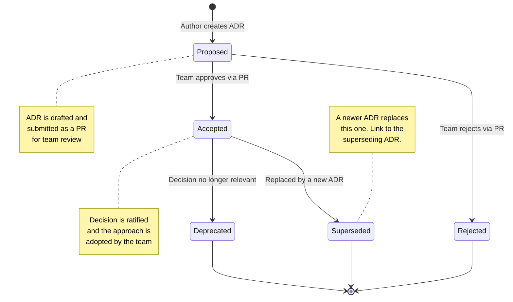

# Architecture Decision Records (ADRs)

> A structured approach to documenting significant architectural and technical decisions for the Habib University Preferred Partner platform.

---

## Table of Contents

- [What Are ADRs?](#what-are-adrs)
- [Why We Use ADRs](#why-we-use-adrs)
- [ADR Lifecycle](#adr-lifecycle)
- [How to Create a New ADR](#how-to-create-a-new-adr)
- [Numbering Convention](#numbering-convention)
- [ADR Index](#adr-index)
- [ADR Template](#adr-template)

---

## What Are ADRs?

An **Architecture Decision Record (ADR)** is a short document that captures a single significant architectural or technical decision along with its context, reasoning, and consequences.

ADRs answer three fundamental questions:

1. **What** decision was made?
2. **Why** was this decision made (and what alternatives were considered)?
3. **What** are the consequences (positive, negative, and neutral)?

### Characteristics of a Good ADR

| Attribute        | Description                                                                |
| ---------------- | -------------------------------------------------------------------------- |
| **Concise**      | One decision per record. Keep it under 2 pages.                            |
| **Contextual**   | Capture the situation and constraints at the time of the decision.         |
| **Reasoned**     | Explain why the chosen option was selected over alternatives.              |
| **Consequential** | Document the trade-offs, risks, and downstream impacts.                   |
| **Immutable**    | Once accepted, the content is not modified — only the status may change.  |

---

## Why We Use ADRs

### The Problem

Without ADRs, architectural decisions live in:

- Slack threads that get buried
- Meeting notes that nobody re-reads
- Individual developers' memories (which leave when they do)
- Undocumented assumptions in the codebase

### The Solution

ADRs provide a **lightweight, version-controlled, discoverable** history of the decisions that shape our platform. They serve as:

- **Onboarding material** — New team members understand *why* things are the way they are.
- **Decision audit trail** — We can trace back to the reasoning behind any architectural choice.
- **Change management** — When revisiting a decision, we have the original context and constraints.
- **Conflict resolution** — Debates are settled with documented rationale, not opinion.

---

## ADR Lifecycle

Every ADR transitions through a defined set of statuses over its lifetime.



### Status Definitions

| Status          | Meaning                                                                               |
| --------------- | ------------------------------------------------------------------------------------- |
| **Proposed**    | The ADR has been drafted and is open for discussion via a Pull Request.                |
| **Accepted**    | The team has reviewed and approved the ADR. The decision is now in effect.            |
| **Rejected**    | The team has reviewed and rejected the proposal. Reasoning is documented.             |
| **Deprecated**  | The decision is no longer relevant due to changes in requirements or technology.       |
| **Superseded**  | A newer ADR has replaced this one. The record links to its successor.                 |

### Status Transition Rules

- **Proposed → Accepted**: Requires PR approval from at least **2 team members** (including one senior/lead).
- **Proposed → Rejected**: Requires documented reasoning in the PR review. The ADR is still merged for historical reference.
- **Accepted → Deprecated**: A team member opens a PR updating the status with a justification.
- **Accepted → Superseded**: A new ADR is created that explicitly references and supersedes the old one.

---

## How to Create a New ADR

### Step-by-Step Process

1. **Identify the decision** — Confirm that the decision is architecturally significant. Minor implementation details do not need ADRs.

2. **Determine the next number** — Check the [ADR Index](#adr-index) below for the latest sequential number.

3. **Create the file** — Copy the [ADR Template](#adr-template) to a new file:
   ```
   docs/Architecture-Decision-Records/NNN-title-in-kebab-case.md
   ```
   Example: `docs/Architecture-Decision-Records/004-authentication-strategy.md`

4. **Fill in all sections** — Complete the template with:
   - A clear, descriptive title
   - The current date
   - Status set to `Proposed`
   - Detailed context, decision, alternatives, and consequences

5. **Submit a Pull Request** — Open a PR with:
   - Title: `docs(adr): NNN - Title of Decision`
   - Label: `adr`
   - Assign at least 2 reviewers

6. **Facilitate discussion** — Address review comments. Update the ADR content as needed based on feedback.

7. **Merge and update status** — Once approved, update the status to `Accepted` and merge.

8. **Update the index** — Add the new ADR to the [ADR Index](#adr-index) table in this README.

### When to Write an ADR

Write an ADR when the decision:

- Affects the overall system architecture or structure
- Introduces a new technology, framework, or library
- Changes a core development pattern or convention
- Has significant trade-offs that should be documented
- Is likely to be questioned or revisited in the future
- Affects multiple teams or packages in the monorepo

### When NOT to Write an ADR

- Routine bug fixes or minor refactors
- Choosing between two equivalent utility functions
- Styling or formatting preferences (these belong in linter rules)
- Decisions that are easily reversible with no consequences

---

## Numbering Convention

ADRs are numbered **sequentially** using a three-digit zero-padded format:

```
001, 002, 003, ..., 010, ..., 100
```

### Rules

- Numbers are **never reused**, even if an ADR is rejected or deprecated.
- Numbers are assigned at the time the ADR file is created (not when it is accepted).
- The number appears in both the filename and the document title.
- Gaps in numbering are acceptable (e.g., if ADR 005 is rejected, the next ADR is still 006).

---

## ADR Index

| Number | Title                       | Status       | Date       | Author        |
| ------ | --------------------------- | ------------ | ---------- | ------------- |
| 001    | [Monorepo Structure](./001-monorepo-structure.md) | ✅ Accepted | 2025-01-15 | Architecture Team |
| 002    | [Next.js App Router](./002-nextjs-app-router.md)  | ✅ Accepted | 2025-02-01 | Frontend Team     |
| 003    | [NestJS Backend](./003-nestjs-backend.md)          | ✅ Accepted | 2025-02-10 | Backend Team      |

### Status Legend

| Emoji | Status     |
| ----- | ---------- |
| 📝    | Proposed   |
| ✅    | Accepted   |
| ❌    | Rejected   |
| ⚠️    | Deprecated |
| 🔄    | Superseded |

---

## ADR Template

Use this template when creating a new ADR. Save it as `docs/Architecture-Decision-Records/NNN-title-in-kebab-case.md`.

```markdown
# NNN - Title of Decision

## Status

Proposed | Accepted | Rejected | Deprecated | Superseded by [ADR-NNN](./NNN-title.md)

## Date

YYYY-MM-DD

## Context

Describe the situation, the problem, and the forces at play.
What constraints exist? What requirements drive this decision?

## Decision

State the decision clearly and concisely.
"We will use X because..."

## Alternatives Considered

### Alternative 1: Name
- **Pros**: ...
- **Cons**: ...
- **Why rejected**: ...

### Alternative 2: Name
- **Pros**: ...
- **Cons**: ...
- **Why rejected**: ...

## Consequences

### Positive
- Benefit 1
- Benefit 2

### Negative
- Trade-off 1
- Trade-off 2

### Neutral
- Observation 1

## References

- [Link to relevant documentation]()
- [Link to related ADR]()
```

---

## Best Practices

### Writing Effective ADRs

1. **Be specific** — "We chose PostgreSQL" is better than "We chose a relational database."
2. **Include constraints** — Document the constraints that influenced the decision (timeline, team expertise, budget).
3. **List real alternatives** — Only include alternatives that were genuinely considered, not straw-man options.
4. **Be honest about trade-offs** — Every decision has downsides. Documenting them builds trust and aids future review.
5. **Keep it short** — If your ADR exceeds 2 pages, you may be documenting more than one decision.

### Reviewing ADRs

- **Evaluate the reasoning**, not just the conclusion.
- **Check for missing alternatives** — Was a viable option overlooked?
- **Verify consequences** — Are the stated trade-offs accurate and complete?
- **Consider reversibility** — How difficult would it be to change this decision later?

---

## Related Documents

- [Release Process](../Release-Process.md)
- [Definition of Done](../Definition-of-Done.md)
