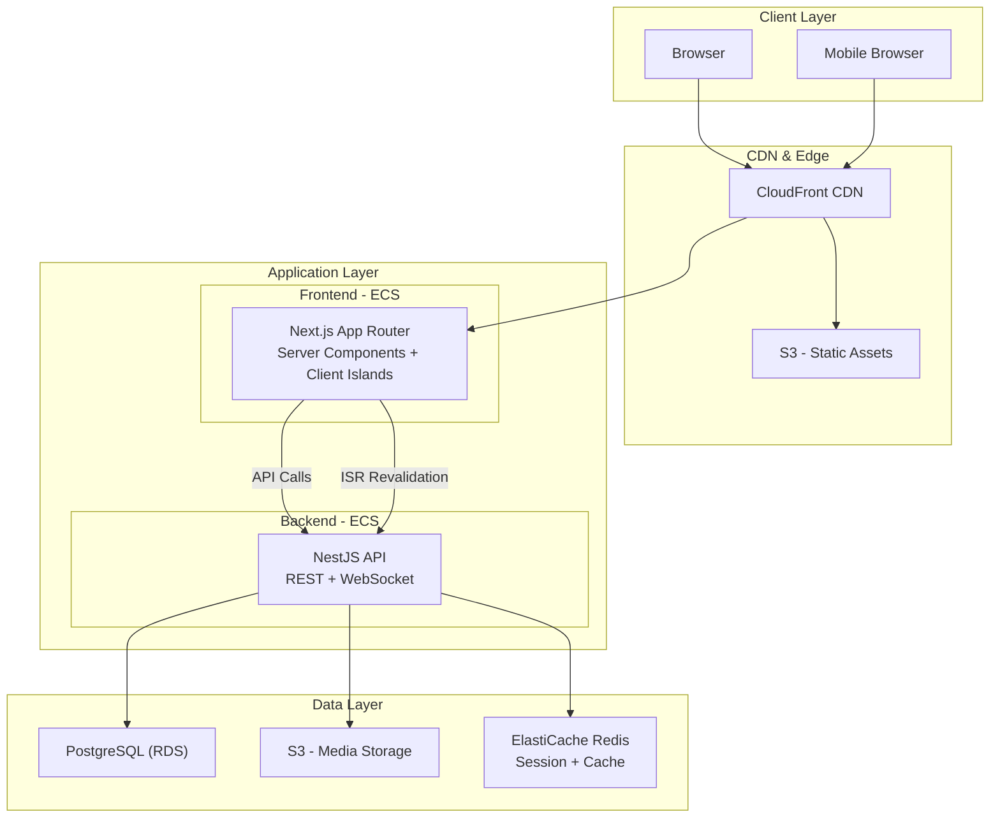
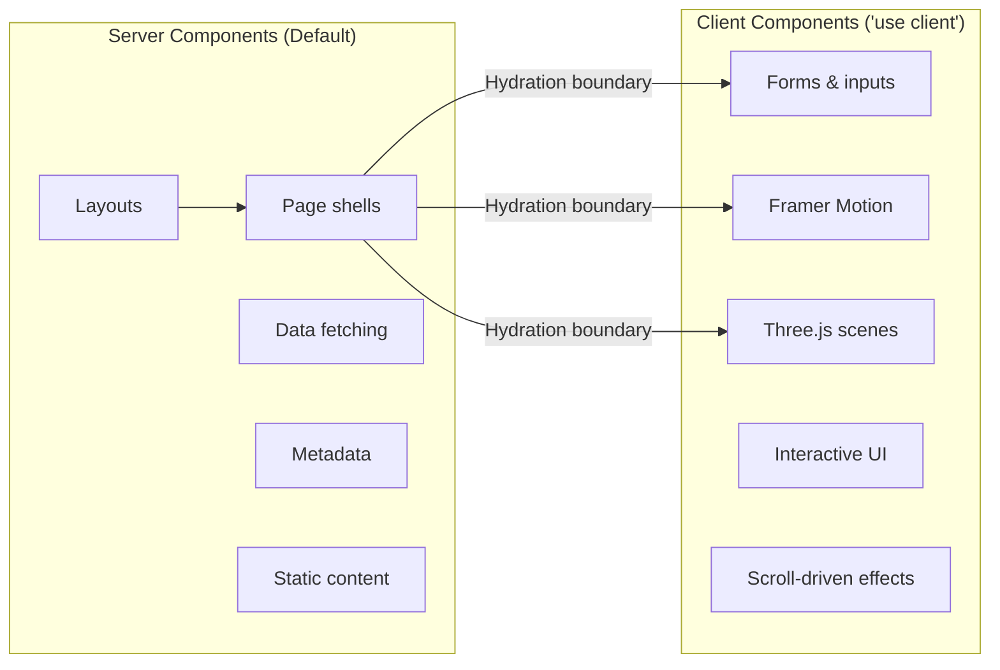
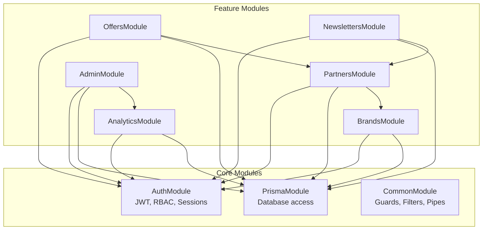
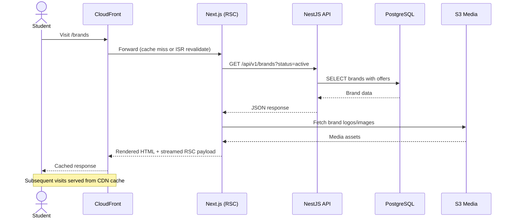
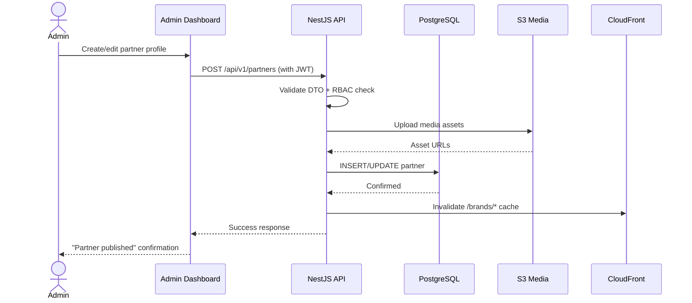
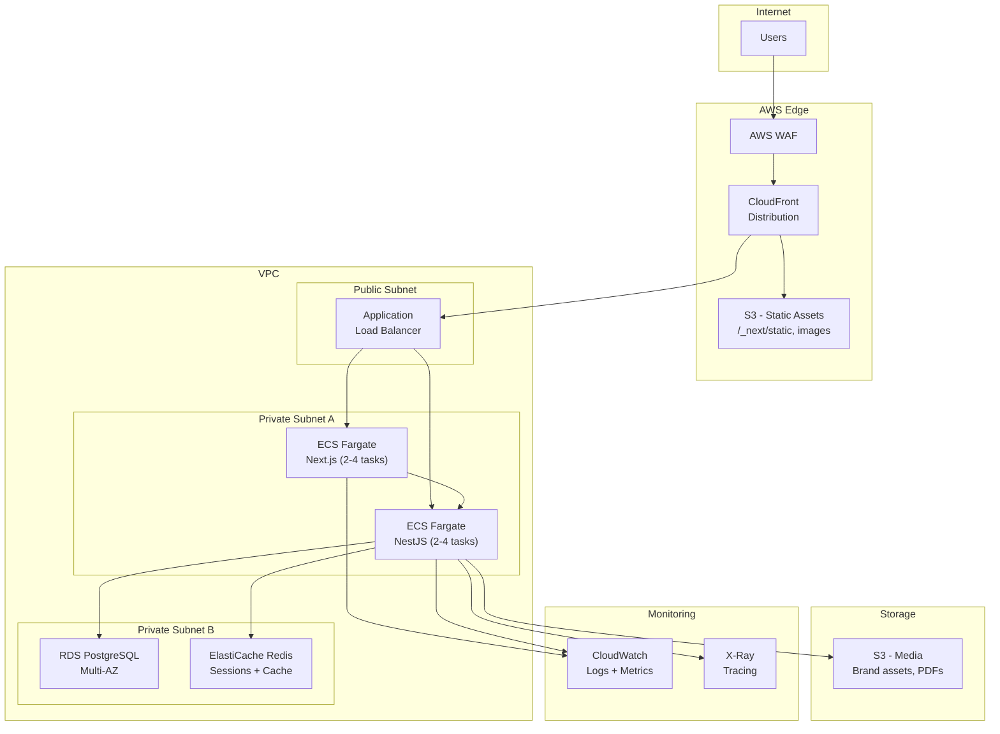

# Architecture — HU Preferred Partner Platform

> System design, data flow, deployment architecture, and technical decisions.

---

## High-Level Architecture

The HU Preferred Partner platform follows a **decoupled frontend-backend architecture** deployed on AWS. The frontend (Next.js) handles rendering, SEO, and client interactions. The backend (NestJS) provides a RESTful API for data operations, authentication, and business logic.



---

## Monorepo Structure

```
HuPrefferedPartner/
├── apps/
│   ├── web/                    # Next.js App Router
│   │   ├── app/                # App Router pages and layouts
│   │   │   ├── (public)/       # Public routes (landing, catalogue, partners)
│   │   │   ├── (auth)/         # Auth routes (login, register)
│   │   │   ├── admin/          # Admin dashboard (protected)
│   │   │   ├── portal/         # Brand portal (protected)
│   │   │   └── layout.tsx      # Root layout
│   │   ├── components/         # React components
│   │   │   ├── ui/             # shadcn/ui components
│   │   │   ├── layout/         # Shells (admin, portal, shared)
│   │   │   ├── sections/       # Page sections (hero, catalogue, etc.)
│   │   │   ├── three/          # Three.js / R3F components
│   │   │   └── shared/         # Shared components
│   │   ├── lib/                # Utilities, hooks, API client
│   │   ├── styles/             # Global styles, Tailwind config
│   │   └── public/             # Static assets
│   │
│   └── api/                    # NestJS Backend
│       ├── src/
│       │   ├── modules/        # Feature modules
│       │   │   ├── auth/       # Authentication & authorization
│       │   │   ├── brands/     # Brand management
│       │   │   ├── partners/   # Partner profiles
│       │   │   ├── offers/     # Offer management
│       │   │   ├── newsletters/# Newsletter generation
│       │   │   ├── analytics/  # Analytics & reporting
│       │   │   └── admin/      # Admin operations
│       │   ├── common/         # Shared guards, filters, interceptors
│       │   ├── prisma/         # Prisma service
│       │   └── main.ts         # Application entry
│       └── test/               # E2E tests
│
├── packages/
│   ├── types/                  # Shared TypeScript interfaces & types
│   ├── utils/                  # Shared utility functions
│   ├── config/                 # ESLint, TSConfig, Prettier configs
│   └── validators/             # Shared Zod schemas
│
├── prisma/
│   ├── schema.prisma           # Database schema
│   ├── migrations/             # Migration history
│   └── seed.ts                 # Database seeding
│
├── infra/                      # Infrastructure as Code
├── docs/                       # Documentation (you are here)
└── scripts/                    # Build & deploy scripts
```

**Why monorepo?** Shared types between frontend and backend eliminate contract drift. Shared Zod schemas ensure validation consistency. Single CI/CD pipeline simplifies deployment.

---

## Frontend Architecture

### App Router Structure

The frontend uses Next.js App Router with aggressive use of **React Server Components (RSC)** for performance.

| Route Group | Purpose | Auth Required |
|-------------|---------|---------------|
| `(public)/*` | Landing, catalogue, partner pages, newsletters | No |
| `(auth)/*` | Login, registration, password reset | No |
| `admin/*` | CMS, analytics, user management | Admin role |
| `portal/*` | Brand self-service dashboard | Brand-manager role |

### Rendering Strategy



**Decision rule:** Everything is a Server Component by default. Add `'use client'` only when the component needs browser APIs, event handlers, React state, or animation libraries. See [Frontend Guidelines](./Frontend-Guidelines.md) for the full decision tree.

### Data Fetching

| Pattern | When | Example |
|---------|------|---------|
| RSC `fetch()` | Page-level data, ISR-compatible | Partner list, brand details |
| Server Actions | Mutations, form submissions | Create offer, update profile. See [Server Action Architecture](./Frontend-Guidelines.md#server-action-architecture) |
| Client `fetch` + SWR | Real-time data, polling | Analytics dashboard |
| Route Handlers | Webhook endpoints, file uploads | Newsletter PDF upload |

---

## Backend Architecture

### Module Graph



### API Design

- **Versioned:** All endpoints prefixed with `/api/v1/`
- **RESTful:** Standard HTTP methods, plural resource names
- **Consistent responses:** `{ data, meta, errors }` envelope
- **Pagination:** Cursor-based for lists, offset-based for admin tables

See [Backend Guidelines](./Backend-Guidelines.md) for detailed patterns.

---

## Data Flow — Key User Journeys

### Brand Discovery (Student)



### Admin CMS — Publish Partner



---

## AWS Deployment Architecture



### Deployment Strategy

| Component | Strategy | Rollback |
|-----------|----------|----------|
| Frontend (ECS) | Blue-green via CodeDeploy | Instant traffic shift |
| Backend (ECS) | Rolling update (min 50% healthy) | Previous task definition |
| Database | Prisma migrations (forward-only) | Revert migration script |
| Static assets | S3 sync + CloudFront invalidation | Previous deployment folder |

---

## Caching Strategy

| Layer | Technology | TTL | Invalidation |
|-------|-----------|-----|-------------|
| **CDN** | CloudFront | 24h for static, 1h for ISR pages | API-triggered invalidation |
| **ISR** | Next.js ISR | 60s–3600s per route | On-demand revalidation |
| **API** | Redis (ElastiCache) | 5–15 min | Cache-aside, write-through |
| **Database** | Prisma query cache | Per-request | Automatic |
| **Browser** | Cache-Control headers | Immutable for hashed assets | Version-based |

**Critical rule:** Admin/portal CMS mutations must invalidate all affected caches immediately. Stale partner data is unacceptable.

---

## Related Documentation

- [Tech Stack](./Tech-Stack.md) — Technology choices and rationale
- [Frontend Guidelines](./Frontend-Guidelines.md) — Next.js conventions
- [Backend Guidelines](./Backend-Guidelines.md) — NestJS patterns
- [Performance](./Performance.md) — Budgets and optimization
- [Security](./Security.md) — Infrastructure security details

---

*Last updated: July 2026*
