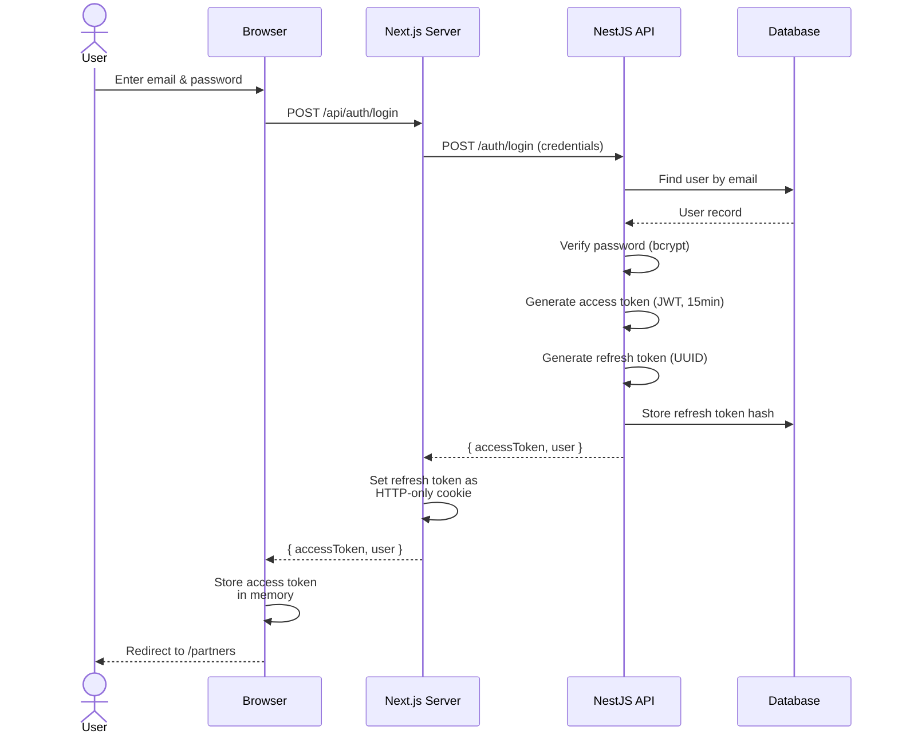
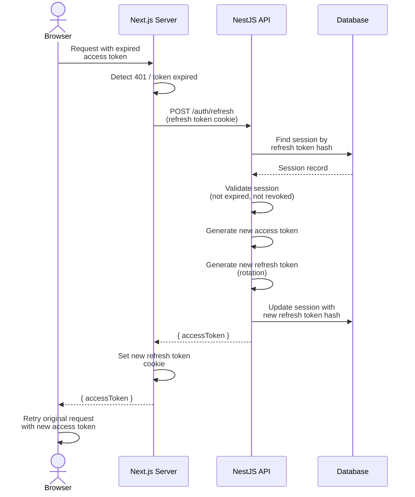

# Authentication & Authorization

> Habib University Preferred Partner Platform — Auth System Architecture

This document specifies the authentication and authorization architecture for the HU Preferred
Partner platform. It covers token management, session handling, role-based access control (RBAC),
authentication flows, and guard patterns across both the Next.js frontend and NestJS API.

---

## 1. Architecture Overview

The platform uses a **JWT-based authentication system** with two token types:

| Token          | Type          | Storage              | Lifetime    | Purpose                    |
| -------------- | ------------- | -------------------- | ----------- | -------------------------- |
| Access Token   | JWT (signed)  | Memory / short-lived | 15 minutes  | Authorize API requests     |
| Refresh Token  | Opaque UUID   | HTTP-only cookie     | 7 days      | Issue new access tokens    |

**Key design decisions:**

- Access tokens are **short-lived** to limit the damage window if compromised.
- Refresh tokens are stored in **HTTP-only, Secure, SameSite=Strict cookies** — inaccessible
  to JavaScript and immune to XSS.
- Sessions are **validated server-side** on every request via middleware.
- Refresh tokens are **rotated** on each use (rotation invalidates the previous token).

---

## 2. Role-Based Access Control (RBAC)

### 2.1 Roles

| Role             | Description                                              |
| ---------------- | -------------------------------------------------------- |
| `admin`          | Platform administrators with full system access          |
| `brand_partner`  | Brand representatives managing their own offers/profile  |
| `public`         | Unauthenticated visitors with read-only public access    |

### 2.2 Permission Matrix

| Feature                    | `public`      | `brand_partner`     | `admin`       |
| -------------------------- | ------------- | ------------------- | ------------- |
| View public partner list   | ✅ Read       | ✅ Read             | ✅ Read       |
| View public offers         | ✅ Read       | ✅ Read             | ✅ Read       |
| View offer details         | ✅ Read       | ✅ Read             | ✅ Read       |
| Browse catalogue           | ✅ Read       | ✅ Read             | ✅ Read       |
| Read newsletters           | ✅ Read       | ✅ Read             | ✅ Read       |
| Manage own offers          | ❌            | ✅ CRUD (own)       | ✅ CRUD (all) |
| Manage own profile         | ❌            | ✅ Update (own)     | ✅ CRUD (all) |
| View portal dashboard      | ❌            | ✅ Read (own)       | ✅ Read (all) |
| Manage all partners        | ❌            | ❌                  | ✅ CRUD       |
| Manage all users           | ❌            | ❌                  | ✅ CRUD       |
| Manage newsletters         | ❌            | ❌                  | ✅ CRUD       |
| Send newsletters           | ❌            | ❌                  | ✅ Execute    |
| Manage content (CMS)       | ❌            | ❌                  | ✅ CRUD       |
| View admin dashboard       | ❌            | ❌                  | ✅ Read       |
| Manage system settings     | ❌            | ❌                  | ✅ Update     |

### 2.3 Ownership Scoping

Brand partners can only access their **own** resources. The API enforces ownership at the
query level:

```typescript
// NestJS guard — OfferOwnershipGuard
@Injectable()
export class OfferOwnershipGuard implements CanActivate {
  canActivate(context: ExecutionContext): boolean {
    const request = context.switchToHttp().getRequest();
    const user = request.user;
    const offerId = request.params.id;

    if (user.role === 'admin') return true;

    const offer = this.offerService.findOne(offerId);
    return offer.partnerId === user.partnerId;
  }
}
```

---

## 3. Login Flow



### Login Implementation

```typescript
// NestJS — auth.service.ts
async login(email: string, password: string) {
  const user = await this.userService.findByEmail(email);
  if (!user) throw new UnauthorizedException('Invalid credentials');

  const isValid = await bcrypt.compare(password, user.passwordHash);
  if (!isValid) throw new UnauthorizedException('Invalid credentials');

  if (!user.emailVerified) {
    throw new ForbiddenException('Please verify your email before logging in');
  }

  const accessToken = this.jwtService.sign(
    { sub: user.id, role: user.role, partnerId: user.partnerId },
    { expiresIn: '15m', secret: this.config.get('JWT_ACCESS_SECRET') },
  );

  const refreshToken = randomUUID();
  const refreshTokenHash = await bcrypt.hash(refreshToken, 10);

  await this.sessionService.create({
    userId: user.id,
    refreshTokenHash,
    expiresAt: addDays(new Date(), 7),
    userAgent: request.headers['user-agent'],
    ipAddress: request.ip,
  });

  return { accessToken, refreshToken, user: this.sanitizeUser(user) };
}
```

---

## 4. Token Refresh Flow



### Refresh Token Rotation

On every refresh, the API:

1. **Invalidates** the old refresh token.
2. **Issues** a new refresh token.
3. **Stores** the new refresh token hash.

If a previously-used refresh token is presented (replay attack), **all sessions for that user
are revoked immediately** — this is the rotation-based theft detection mechanism.

```typescript
async refreshTokens(oldRefreshToken: string) {
  const sessions = await this.sessionService.findByToken(oldRefreshToken);

  if (!sessions.length) {
    // Possible token theft — revoke all user sessions
    await this.sessionService.revokeAllForUser(sessions[0]?.userId);
    throw new UnauthorizedException('Session revoked — please log in again');
  }

  const session = sessions[0];
  if (session.isRevoked || session.expiresAt < new Date()) {
    throw new UnauthorizedException('Session expired');
  }

  // Rotate: invalidate old, issue new
  const newRefreshToken = randomUUID();
  await this.sessionService.rotate(session.id, await bcrypt.hash(newRefreshToken, 10));

  const accessToken = this.jwtService.sign(
    { sub: session.userId, role: session.user.role },
    { expiresIn: '15m' },
  );

  return { accessToken, refreshToken: newRefreshToken };
}
```

---

## 5. Registration Flow

1. User submits registration form (email, password, name).
2. Server validates input with Zod schema.
3. Server checks for duplicate email.
4. Server hashes password with bcrypt (cost factor 12).
5. Server creates user record with `emailVerified: false`.
6. Server generates a secure email verification token (random bytes, hashed in DB).
7. Server sends verification email with a link: `/verify-email?token=<token>`.
8. User clicks the link → server verifies the token → sets `emailVerified: true`.

### Email Verification Token

```typescript
// Generate token
const rawToken = crypto.randomBytes(32).toString('hex');
const hashedToken = await bcrypt.hash(rawToken, 10);

await db.emailVerification.create({
  userId: user.id,
  tokenHash: hashedToken,
  expiresAt: addHours(new Date(), 24),
});

// Send email with rawToken in the URL
await this.emailService.sendVerificationEmail(user.email, rawToken);
```

### Email Change Verification

When a user requests to change their email:
1. Server generates an `EmailChangeToken`.
2. Old email remains active.
3. Verification link sent to the *new* email.
4. Upon clicking the link, the token is validated, and the `email` field is updated to the `pendingEmail` value.
5. All previous pending email change requests are invalidated when a new one is requested.

---

## 6. Password Reset Flow

1. User requests a password reset by providing their email.
2. Server generates a secure reset token (same pattern as verification tokens).
3. Server sends an email with a link: `/forgot-password?token=<token>`.
4. User clicks the link, enters a new password.
5. Server validates the token, hashes the new password, updates the user record.
6. Server **revokes all existing sessions** for the user (force re-login everywhere).

### Security Considerations

- Reset tokens expire after **1 hour**.
- Reset tokens are **single-use** — marked as consumed after successful reset.
- The API returns a generic success message even if the email doesn't exist (prevents
  email enumeration).
- Rate-limit reset requests to **3 per hour per email**.

---

## 7. Multi-Factor Authentication (MFA)

The platform supports **TOTP-based MFA** (Time-based One-Time Password, RFC 6238).

| Role             | MFA Status                    |
| ---------------- | ----------------------------- |
| `admin`          | Optional (strongly encouraged)|
| `brand_partner`  | Recommended                   |
| `public`         | Not applicable                |

### MFA Enrollment

1. User navigates to security settings.
2. Server generates a TOTP secret and returns a QR code (otpauth:// URI).
3. User scans the QR code with an authenticator app (Google Authenticator, Authy, etc.).
4. User enters the 6-digit code to confirm enrollment.
5. Server stores the encrypted TOTP secret and sets `mfaEnabled: true`.
6. Server provides **backup codes** (8 single-use codes, hashed and stored).

### MFA Login Flow

When MFA is enabled, the login flow becomes a two-step process:

1. **Step 1** — email/password validation → returns a short-lived `mfaChallengeToken` (not a
   full access token).
2. **Step 2** — user submits the TOTP code with the `mfaChallengeToken` → server validates
   the code → issues the full access + refresh token pair.

```typescript
// Step 1: Password validation with MFA check
async login(email: string, password: string) {
  const user = await this.validateCredentials(email, password);

  if (user.mfaEnabled) {
    const challengeToken = this.jwtService.sign(
      { sub: user.id, purpose: 'mfa_challenge' },
      { expiresIn: '5m' },
    );
    return { requiresMfa: true, challengeToken };
  }

  return this.issueTokens(user);
}

// Step 2: TOTP verification
async verifyMfa(challengeToken: string, totpCode: string) {
  const payload = this.jwtService.verify(challengeToken);
  if (payload.purpose !== 'mfa_challenge') throw new UnauthorizedException();

  const user = await this.userService.findById(payload.sub);
  const isValid = authenticator.verify({ token: totpCode, secret: user.totpSecret });

  if (!isValid) throw new UnauthorizedException('Invalid MFA code');

  return this.issueTokens(user);
}
```

---

## 8. Auth Middleware — Next.js

The Next.js middleware performs edge-level authentication checks before routes are rendered.

```typescript
// middleware.ts (simplified)
import { NextResponse } from 'next/server';
import { verifyAccessToken } from '@/lib/auth/tokens';

const PROTECTED_PREFIXES = ['/admin', '/portal'];
const AUTH_PAGES = ['/login', '/register', '/forgot-password'];

export async function middleware(request: NextRequest) {
  const token = request.cookies.get('access_token')?.value;
  const session = token ? await verifyAccessToken(token) : null;
  const { pathname } = request.nextUrl;

  // Redirect authenticated users away from auth pages
  if (AUTH_PAGES.some((p) => pathname.startsWith(p)) && session) {
    const dest = session.role === 'ADMIN' ? '/admin/dashboard' : '/partners';
    return NextResponse.redirect(new URL(dest, request.url));
  }

  // Protect admin and portal routes
  if (PROTECTED_PREFIXES.some((p) => pathname.startsWith(p))) {
    if (!session) {
      const loginUrl = new URL('/login', request.url);
      loginUrl.searchParams.set('callbackUrl', pathname);
      return NextResponse.redirect(loginUrl);
    }

    if (pathname.startsWith('/admin') && session.role !== 'ADMIN') {
      return NextResponse.redirect(new URL('/partners', request.url));
    }

    if (pathname.startsWith('/portal') && session.role !== 'BRAND_PARTNER') {
      return NextResponse.redirect(new URL('/partners', request.url));
    }
  }

  return NextResponse.next();
}
```

---

## 9. Auth Guards — NestJS

The NestJS API uses **guards** for route-level authorization.

### JWT Auth Guard

```typescript
@Injectable()
export class JwtAuthGuard implements CanActivate {
  constructor(private jwtService: JwtService) {}

  async canActivate(context: ExecutionContext): Promise<boolean> {
    const request = context.switchToHttp().getRequest();
    const authHeader = request.headers.authorization;

    if (!authHeader?.startsWith('Bearer ')) {
      throw new UnauthorizedException();
    }

    const token = authHeader.slice(7);
    const payload = await this.jwtService.verifyAsync(token);
    request.user = payload;
    return true;
  }
}
```

### Role Guard

```typescript
@Injectable()
export class RolesGuard implements CanActivate {
  constructor(private reflector: Reflector) {}

  canActivate(context: ExecutionContext): boolean {
    const requiredRoles = this.reflector.get<string[]>('roles', context.getHandler());
    if (!requiredRoles) return true;

    const { user } = context.switchToHttp().getRequest();
    return requiredRoles.includes(user.role);
  }
}

// Usage with decorator
@Roles('admin')
@UseGuards(JwtAuthGuard, RolesGuard)
@Get('users')
findAllUsers() { /* ... */ }
```

---

## 10. Token Security Checklist

| Measure                            | Implementation                                    |
| ---------------------------------- | ------------------------------------------------- |
| Access token short-lived           | 15-minute expiry                                  |
| Refresh token HTTP-only cookie     | `httpOnly: true, secure: true, sameSite: 'strict'`|
| Refresh token rotation             | New token on every refresh; old token invalidated |
| Replay detection                   | Reused tokens trigger full session revocation     |
| Password hashing                   | bcrypt with cost factor 12                        |
| Reset tokens single-use            | Marked consumed after use                         |
| Reset token expiry                 | 1 hour                                            |
| Verification token expiry          | 24 hours                                          |
| MFA challenge token expiry         | 5 minutes                                         |
| Rate limiting on auth endpoints    | 5 attempts / 15 min per IP                        |
| CORS restricted                    | Only platform origins allowed                     |
| CSRF protection                    | SameSite cookies + origin header validation        |
