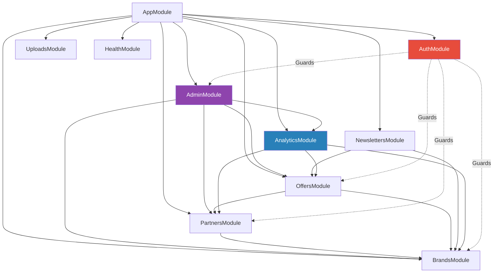
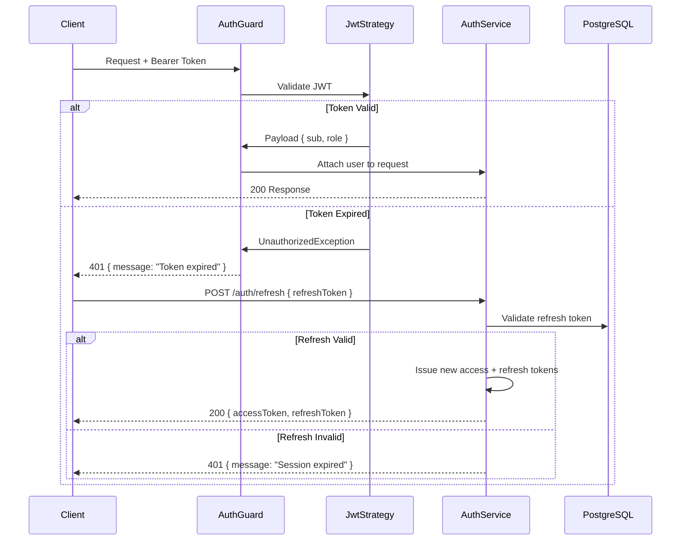

# Backend Guidelines

> NestJS API conventions, patterns, and architectural decisions for the Habib University Preferred Partner platform.

**Related docs:** [Architecture.md](file:///D:/Web%20Projects/HuPrefferedPartner/docs/Architecture.md) · [Security.md](file:///D:/Web%20Projects/HuPrefferedPartner/docs/Security.md)

---

## 1. Project Structure

```
apps/api/
├── src/
│   ├── main.ts                    # Bootstrap, global pipes, versioning
│   ├── app.module.ts              # Root module
│   ├── common/                    # Shared utilities
│   │   ├── decorators/            # @CurrentUser, @Roles, @Public
│   │   ├── filters/               # Global exception filters
│   │   ├── guards/                # AuthGuard, RolesGuard
│   │   ├── interceptors/          # Transform, logging, timeout
│   │   ├── pipes/                 # ZodValidation pipe
│   │   └── utils/                 # Helpers, constants
│   ├── config/                    # ConfigModule schemas (Zod-validated)
│   ├── modules/
│   │   ├── auth/                  # Authentication & authorization
│   │   ├── brands/                # Brand CRUD & catalogue
│   │   ├── partners/              # Partnership management
│   │   ├── offers/                # Offer lifecycle
│   │   ├── newsletters/           # PDF generation & distribution
│   │   ├── analytics/             # Event tracking & reporting
│   │   ├── admin/                 # Dashboard aggregation
│   │   ├── uploads/               # S3 file management
│   │   └── health/                # Readiness & liveness probes
│   └── prisma/                    # PrismaModule, service, seed
├── prisma/
│   ├── schema.prisma
│   ├── migrations/
│   └── seed.ts
├── test/
│   ├── unit/
│   ├── integration/
│   └── e2e/
└── nest-cli.json
```

---

## 2. Module Organization

Every feature module follows this internal structure:

```
modules/<feature>/
├── <feature>.module.ts            # Module declaration
├── <feature>.controller.ts        # Route handlers (thin)
├── <feature>.service.ts           # Business logic
├── <feature>.repository.ts        # Prisma queries (optional, for complex modules)
├── dto/
│   ├── create-<feature>.dto.ts    # Input validation
│   ├── update-<feature>.dto.ts
│   └── <feature>-query.dto.ts     # Pagination/filter params
├── entities/
│   └── <feature>.entity.ts        # Response shape (not Prisma model)
└── <feature>.spec.ts              # Unit tests
```

### Module Dependency Graph



---

## 3. Controller / Service Patterns

### Controllers — Thin by Design

Controllers handle HTTP concerns **only**: routing, status codes, swagger decorators, and delegating to services. No business logic.

```typescript
@Controller('brands')
@ApiTags('Brands')
export class BrandsController {
  constructor(private readonly brandsService: BrandsService) {}

  @Get()
  @Public()
  @ApiPaginatedResponse(BrandEntity)
  async findAll(@Query() query: BrandQueryDto): Promise<Paginated<BrandEntity>> {
    return this.brandsService.findAll(query);
  }

  @Post()
  @Roles(Role.ADMIN)
  @HttpCode(HttpStatus.CREATED)
  async create(@Body() dto: CreateBrandDto, @CurrentUser() user: JwtPayload): Promise<BrandEntity> {
    return this.brandsService.create(dto, user.sub);
  }
}
```

### Services — All Business Logic Lives Here

- Validate business rules (uniqueness, state transitions, permissions beyond RBAC).
- Orchestrate repository/Prisma calls.
- Throw domain-specific exceptions (never raw Prisma errors).
- Return plain objects or entity instances — never Prisma models directly.

---

## 4. DTO Validation

All DTOs use **Zod schemas** with a custom `ZodValidationPipe`. Class-validator is **not used**.

```typescript
// dto/create-brand.dto.ts
import { z } from 'zod';

export const CreateBrandSchema = z.object({
  name: z.string().min(2).max(120),
  slug: z.string().regex(/^[a-z0-9-]+$/).optional(),
  description: z.string().max(2000).optional(),
  logoUrl: z.string().url().optional(),
  websiteUrl: z.string().url().optional(),
  tier: z.enum(['PLATINUM', 'GOLD', 'SILVER']),
  isActive: z.boolean().default(true),
});

export type CreateBrandDto = z.infer<typeof CreateBrandSchema>;
```

### Rules

| Rule | Rationale |
|------|-----------|
| Every input has a Zod schema | Runtime safety, type inference |
| DTOs never expose internal IDs for creation | IDs are server-generated (cuid2) |
| Query DTOs include pagination defaults | `page=1, limit=20, maxLimit=100` |
| Transform in schema, not in service | `.trim()`, `.toLowerCase()` in Zod chain |
| Separate Create / Update / Query DTOs | Never reuse; Update uses `.partial()` |

---

## 5. Exception Handling

### Global Exception Filter

A single `AllExceptionsFilter` catches everything. It normalizes the response shape:

```json
{
  "statusCode": 422,
  "error": "Unprocessable Entity",
  "message": "Brand with slug 'acme' already exists",
  "timestamp": "2026-07-01T10:00:00.000Z",
  "path": "/api/v1/brands",
  "requestId": "req_abc123"
}
```

### Custom Exceptions

```typescript
// Extend NestJS HttpException — never throw raw errors
export class BrandAlreadyExistsException extends ConflictException {
  constructor(slug: string) {
    super(`Brand with slug '${slug}' already exists`);
  }
}
```

### Rules

- **Never** expose Prisma error codes or stack traces to clients.
- Log full error details server-side at `error` level.
- Map `PrismaClientKnownRequestError` codes in the filter (P2002 → 409, P2025 → 404).
- Validation errors return `422` with field-level details.

---

## 6. Prisma Usage

### Schema Conventions

- Model names: `PascalCase` singular (`Brand`, `Partner`, `Offer`).
- Field names: `camelCase`.
- Relations: explicit `@relation` with named foreign keys.
- All models include `createdAt`, `updatedAt` (auto-managed), and `deletedAt` (soft delete via `@default(dbgenerated())` or middleware).
- IDs: `cuid2` strings — never auto-increment integers.

### Migrations

```bash
# Development — create and apply
npx prisma migrate dev --name <descriptive-name>

# Production — apply only (CI/CD)
npx prisma migrate deploy

# Reset (dev only)
npx prisma migrate reset
```

> [!CAUTION]
> Never run `migrate reset` against staging or production databases. Use `migrate deploy` exclusively in CI/CD pipelines.

### Seeding

`prisma/seed.ts` populates dev data: test brands, sample offers, admin user. Uses `upsert` for idempotency.

### Query Optimization

| Technique | When |
|-----------|------|
| `select` over `include` | When you need <50% of relation fields |
| `include` with nested `select` | When you need specific relation fields |
| Cursor-based pagination | Lists > 10k rows |
| `createMany` / `updateMany` | Batch operations |
| Raw SQL via `$queryRaw` | Complex aggregations, reporting |
| Connection pooling (PgBouncer) | Production always |

### Soft Deletes

Implemented via Prisma middleware that:
1. Rewrites `delete` → `update` with `deletedAt = now()`.
2. Appends `deletedAt: null` to all `findMany` / `findFirst` queries.
3. Exposes `includeDeleted` option for admin audit views.

---

## 7. API Versioning

URI-based versioning: `/api/v1/...`

```typescript
// main.ts
app.enableVersioning({
  type: VersioningType.URI,
  defaultVersion: '1',
  prefix: 'api/v',
});
```

- Current version: `v1`.
- When breaking changes are necessary, create `v2` controllers alongside `v1`.
- Deprecation: add `@ApiDeprecated()` and `Sunset` header 90 days before removal.
- Non-breaking changes (new optional fields, new endpoints) do **not** require a version bump.

---

## 8. Authentication Flow

### Request Lifecycle



### Token Strategy

| Token | Lifetime | Storage (Client) | Storage (Server) |
|-------|----------|-------------------|-------------------|
| Access (JWT) | 15 minutes | Memory / httpOnly cookie | Not stored |
| Refresh | 7 days | httpOnly cookie (Secure, SameSite=Strict) | Hashed in DB |

### Rules

- Access tokens are **stateless** — no DB lookup per request.
- Refresh tokens are **one-time use** — rotation on every refresh.
- On suspicious activity (token reuse), invalidate **all** sessions for that user.
- Passwords hashed with `argon2id` (memory=64MB, iterations=3).

---

## 9. Role-Based Access Control (RBAC)

### Roles

| Role | Scope | Permissions |
|------|-------|-------------|
| `ADMIN` | Global | Full CRUD on all resources, user management, analytics |
| `BRAND_MANAGER` | Own brand(s) | Edit own brand profile, manage own offers, view own analytics |
| `VIEWER` | Public | Read-only access to published brands, offers, newsletters |

### Implementation

```typescript
// Custom decorator
@Roles(Role.ADMIN, Role.BRAND_MANAGER)

// Guard checks
@UseGuards(AuthGuard, RolesGuard)
```

- `@Public()` decorator bypasses both guards for public endpoints.
- `BRAND_MANAGER` ownership is verified in the service layer, not the guard.
- Role changes require `ADMIN` approval and are audit-logged.

---

## 10. Logging

### Strategy

- **Logger:** NestJS built-in logger wrapping `pino` for structured JSON in production.
- **Request logging:** Global interceptor logs method, path, status, duration, user ID.
- **Sensitive data:** Never log passwords, tokens, or full request bodies containing PII.
- **Correlation:** Every request gets a `requestId` (UUID) propagated via `AsyncLocalStorage`.

### Log Levels

| Environment | Level |
|-------------|-------|
| Development | `debug` |
| Staging | `log` |
| Production | `warn` (with `error` always on) |

---

## 11. Testing Strategy

### Test Pyramid

| Layer | Tool | Coverage Target | What to Test |
|-------|------|-----------------|--------------|
| Unit | Jest | 80%+ services | Business logic, edge cases, error paths |
| Integration | Jest + Supertest | Critical paths | Controller → Service → Prisma (test DB) |
| E2E | Jest + Supertest | Happy paths | Full request lifecycle, auth flows |

### Conventions

- Test files: `*.spec.ts` (unit), `*.integration-spec.ts`, `*.e2e-spec.ts`.
- Integration tests use a **dedicated test database** via Docker Compose.
- Mock Prisma with a **repository pattern** or `jest.mock` at the module boundary.
- Never mock what you don't own — use real Prisma against the test DB for integration tests.
- Factory functions (not fixtures) for test data — `createMockBrand()`, `createMockUser()`.

### Running Tests

```bash
# Unit tests
pnpm --filter api test

# Integration (starts test DB)
pnpm --filter api test:integration

# E2E
pnpm --filter api test:e2e

# Coverage
pnpm --filter api test:cov
```

---

## 12. API Response Conventions

### Success Responses

```typescript
// Single resource
{ "data": { ... } }

// Paginated list
{
  "data": [ ... ],
  "meta": {
    "total": 142,
    "page": 1,
    "limit": 20,
    "totalPages": 8
  }
}
```

### Error Responses

All errors follow the shape defined in [Section 5](#5-exception-handling).

### HTTP Status Codes

| Code | Usage |
|------|-------|
| `200` | Successful GET, PUT, PATCH |
| `201` | Successful POST (resource created) |
| `204` | Successful DELETE |
| `400` | Malformed request |
| `401` | Missing or invalid authentication |
| `403` | Authenticated but insufficient permissions |
| `404` | Resource not found |
| `409` | Conflict (duplicate slug, etc.) |
| `422` | Validation failure (Zod) |
| `429` | Rate limit exceeded |
| `500` | Unhandled server error |

---

## 13. Rate Limiting & Security Middleware

- **Rate limiting:** `@nestjs/throttler` — 100 requests/minute per IP (public), 300/minute (authenticated).
- **CORS:** Whitelist frontend origin(s) only.
- **Helmet:** Enabled globally for security headers.
- **CSRF:** Not applicable (API uses Bearer tokens, not cookies for auth state).
- **Input sanitization:** HTML stripped from all string inputs via Zod `.transform()`.

For full security policies, see [Security.md](file:///D:/Web%20Projects/HuPrefferedPartner/docs/Security.md).

---

## 14. Environment Configuration

All environment variables are validated at startup via a Zod schema in `src/config/`. The app **refuses to start** if validation fails.

```typescript
const EnvSchema = z.object({
  NODE_ENV: z.enum(['development', 'staging', 'production']),
  PORT: z.coerce.number().default(4000),
  DATABASE_URL: z.string().url(),
  JWT_SECRET: z.string().min(32),
  JWT_REFRESH_SECRET: z.string().min(32),
  AWS_S3_BUCKET: z.string(),
  AWS_REGION: z.string().default('ap-south-1'),
  REDIS_URL: z.string().url().optional(),
});
```

> [!IMPORTANT]
> Never commit `.env` files. Use `.env.example` with placeholder values. Secrets are injected via AWS Parameter Store / Secrets Manager in production.
