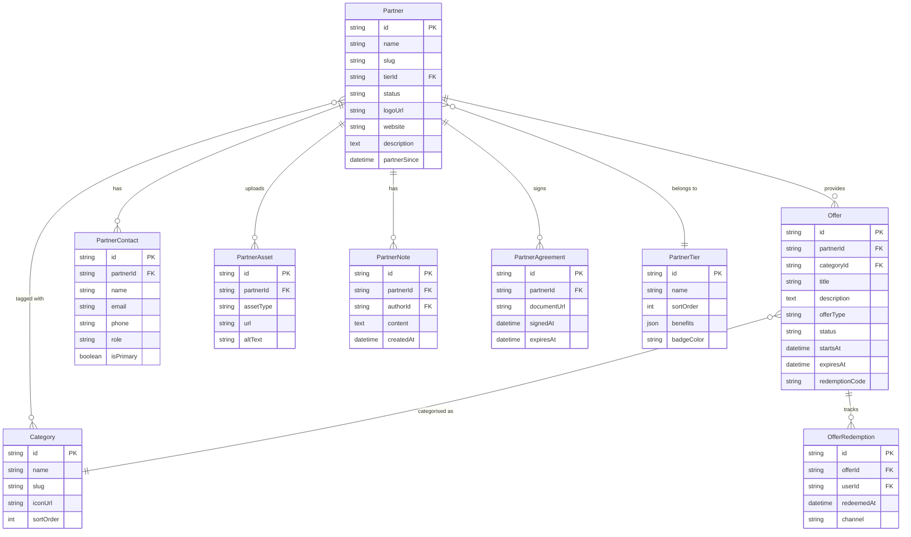
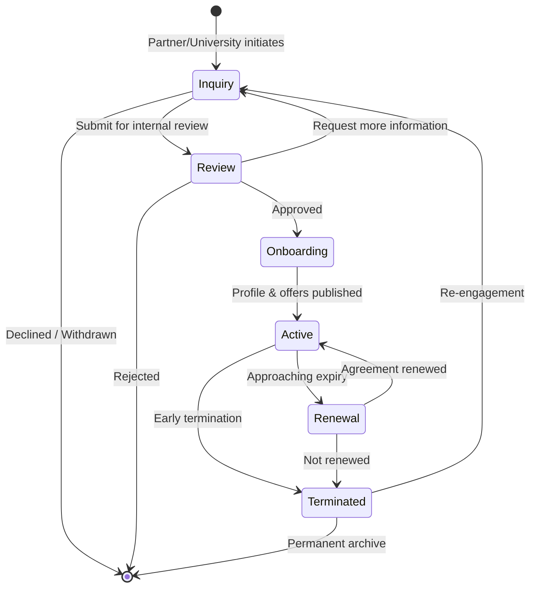

# Brand Partnership System

> Partnership Management Architecture for the Habib University Preferred Partner Platform

## 1. Overview

The Brand Partnership System is the commercial backbone of the platform. It manages the full lifecycle of brand partnerships — from initial inquiry through onboarding, active engagement, and eventual renewal or termination. The system provides:

- A structured **tier system** that governs partner benefits and visibility.
- A comprehensive **offers engine** for creating, approving, and tracking promotional deals.
- A public-facing **catalogue** with search, filtering, and individual partner profile pages.
- **Redemption tracking** to measure offer engagement and demonstrate ROI to partners.

---

## 2. Conceptual Data Model

### 2.1 Core Entities

| Entity            | Description                                                  |
| ----------------- | ------------------------------------------------------------ |
| `Partner`         | A brand or organisation in a formal partnership with Habib University |
| `PartnerTier`     | A classification level (Platinum, Gold, Silver) defining benefit packages |
| `Offer`           | A promotional deal or discount offered by a partner          |
| `Category`        | A taxonomy for organising partners and offers (e.g., Food, Tech, Retail) |
| `PartnerContact`  | A named contact person within a partner organisation         |

### 2.2 Supporting Entities

| Entity              | Description                                              |
| ------------------- | -------------------------------------------------------- |
| `PartnerAsset`      | Logos, banners, and brand guidelines uploaded by partners |
| `OfferRedemption`    | A record of a user redeeming or claiming an offer        |
| `PartnerNote`       | Internal notes and communication logs                    |
| `PartnerAgreement`  | Contract documents and terms                             |

### 2.3 Entity-Relationship Diagram



---

## 3. Partnership Lifecycle

### 3.1 Stages

| Stage           | Description                                                     | Duration (Typical) |
| --------------- | --------------------------------------------------------------- | ------------------- |
| `INQUIRY`       | Partner or university initiates interest; basic info collected   | 1–2 weeks           |
| `REVIEW`        | Internal review of brand alignment, terms, and tier eligibility | 1–2 weeks           |
| `ONBOARDING`    | Agreement signed, assets collected, profile created             | 1–3 weeks           |
| `ACTIVE`        | Partner is live on the platform with published offers           | 6–12 months         |
| `RENEWAL`       | Partnership approaching expiry; renewal discussions underway    | 1–2 months          |
| `TERMINATED`    | Partnership ended; profile archived, offers deactivated         | —                   |

### 3.2 State Diagram



### 3.3 Automated Transitions

| Trigger                          | Action                                               |
| -------------------------------- | ---------------------------------------------------- |
| Agreement `expiresAt` ≤ 60 days | Transition to `RENEWAL`; notify admin and partner    |
| Agreement `expiresAt` passed     | Transition to `TERMINATED`; deactivate offers        |
| All offers expired               | Send alert to admin for review                       |

---

## 4. Tier System

### 4.1 Tier Definitions

| Tier        | Badge Colour | Benefits                                                                 |
| ----------- | ------------ | ------------------------------------------------------------------------ |
| **Platinum** | `#E5E4E2`   | Homepage hero placement, dedicated landing page, priority newsletter feature, unlimited offers |
| **Gold**     | `#FFD700`   | Homepage secondary placement, partner page, newsletter mention, up to 10 offers |
| **Silver**   | `#C0C0C0`   | Catalogue listing, partner page, up to 5 offers                          |

### 4.2 Tier Assignment

- Tier is assigned during **onboarding** based on the signed agreement terms.
- Tier can be upgraded or downgraded during **renewal** — changes take effect at the start of the new agreement period.
- Tier governs API-level access controls: the `OfferGuard` middleware enforces the offer count limit per tier.

### 4.3 Benefits Engine

Benefits are stored as a structured JSON blob on the `PartnerTier` model:

```json
{
  "maxOffers": 999,
  "homepagePlacement": "hero",
  "newsletterFeature": "priority",
  "dedicatedPage": true,
  "analyticsAccess": "full",
  "supportLevel": "dedicated"
}
```

Business logic in the `PartnerBenefitsService` reads this configuration to enforce limits and toggle features dynamically.

---

## 5. Offers Management

### 5.1 Offer Lifecycle

| State        | Description                                      |
| ------------ | ------------------------------------------------ |
| `DRAFT`      | Created but not yet submitted                    |
| `PENDING`    | Submitted for approval                           |
| `ACTIVE`     | Approved and visible to users                    |
| `EXPIRED`    | Past the `expiresAt` date; automatically transitioned |
| `ARCHIVED`   | Manually archived by admin                       |

### 5.2 Offer Types

| Type          | Description                            | Example                            |
| ------------- | -------------------------------------- | ---------------------------------- |
| `DISCOUNT`    | Percentage or fixed-amount discount    | 20% off all meals                  |
| `BOGO`        | Buy-one-get-one promotions             | Buy 1 coffee, get 1 free           |
| `FREEBIE`     | Complimentary item or service          | Free gym trial for 7 days          |
| `EXCLUSIVE`   | Access to exclusive events or products | VIP campus event invitation        |
| `CASHBACK`    | Cashback on qualifying purchases       | 10% cashback on orders over Rs 2000 |

### 5.3 Approval Flow

1. Partner liaison creates the offer in the admin panel.
2. Offer is auto-validated (date range, tier limits, required fields).
3. Reviewer approves or requests changes.
4. On approval, the offer transitions to `ACTIVE` and appears in the catalogue.

---

## 6. Catalogue System

### 6.1 Public Catalogue

The catalogue is the primary discovery surface for students and staff. Located at `/partners` and `/offers`, it presents:

- **Partner directory** — grid/list of all active partners with logos, tier badges, and category tags.
- **Offers listing** — all active offers with filtering and search.
- **Featured section** — Platinum partners and highlighted offers on the catalogue homepage.

### 6.2 Catalogue Cards

Each catalogue card displays:

```
┌─────────────────────────────────┐
│  [Partner Logo]                 │
│  Partner Name          ★ Gold   │
│  Category: Food & Beverage      │
│  ────────────────────────────── │
│  🏷️ 20% off all meals          │
│  Valid until 31 Dec 2026        │
│  [View Partner →]               │
└─────────────────────────────────┘
```

---

## 7. Search and Filtering

### 7.1 Filter Dimensions

| Dimension      | Options                                         | Implementation              |
| -------------- | ----------------------------------------------- | --------------------------- |
| **Category**   | Dynamic from `Category` table                   | Multi-select checkboxes     |
| **Tier**       | Platinum, Gold, Silver                          | Single-select dropdown      |
| **Offer Type** | Discount, BOGO, Freebie, Exclusive, Cashback    | Multi-select checkboxes     |
| **Status**     | Active offers only (default), include expired   | Toggle switch               |
| **Keyword**    | Free-text search                                | Debounced input field       |

### 7.2 Search Implementation

- **Database**: PostgreSQL full-text search using `tsvector` / `tsquery` on partner name, description, and offer title.
- **API**: `GET /api/partners?q=coffee&category=food&tier=gold&page=1`
- **Frontend**: URL-driven state — filters are reflected in the URL for shareable, bookmarkable searches.

---

## 8. Partner Pages

Each active partner has a dedicated profile page at `/partners/:slug`.

### 8.1 Page Sections

| Section              | Content                                           |
| -------------------- | ------------------------------------------------- |
| **Hero**             | Partner logo, name, tier badge, cover banner       |
| **About**            | Rich-text description rendered via `<RichContent />`|
| **Active Offers**    | List of current offers with redemption details     |
| **Contact**          | Primary contact information (if public)            |
| **Brand Assets**     | Gallery of partner-provided images                 |
| **Location / Map**   | Embedded map if physical location is provided      |

### 8.2 Dynamic Rendering

Partner pages are rendered using Next.js **ISR** with a 5-minute revalidation interval. On-demand revalidation is triggered via a webhook when the partner profile is updated in the admin panel.

---

## 9. Offer Redemption Tracking (Conceptual)

### 9.1 Tracking Model

When a user "claims" an offer, the system records an `OfferRedemption` entry:

| Field          | Description                                  |
| -------------- | -------------------------------------------- |
| `id`           | UUID primary key                             |
| `offerId`      | Reference to the claimed offer               |
| `userId`       | Reference to the authenticated user          |
| `redeemedAt`   | Timestamp of the claim                       |
| `channel`      | Where the claim occurred (web, QR, email)    |

### 9.2 Reporting

Redemption data feeds into admin dashboards:

- **Per-partner** — total redemptions, unique users, top offers.
- **Per-offer** — daily/weekly redemption trends, conversion rate.
- **Platform-wide** — overall engagement metrics, tier performance comparison.

### 9.3 Verification

Two conceptual verification models are supported:

1. **Code-based** — user presents a unique or shared redemption code at the partner venue.
2. **QR-based** — user scans a QR code at the partner location; the app validates and records the redemption.

---

## 10. Technical Stack Summary

| Concern              | Technology                            |
| --------------------- | ------------------------------------- |
| API                   | NestJS (REST + GraphQL where needed)  |
| Database              | PostgreSQL via Prisma                 |
| Search                | PostgreSQL full-text search           |
| File storage          | AWS S3                                |
| CDN                   | AWS CloudFront                        |
| Frontend              | Next.js (ISR + App Router)            |
| State management      | URL-driven + React Query              |
| Validation            | class-validator (NestJS DTOs)         |
| Background jobs       | Bull + Redis                          |

---

## 11. Future Considerations

- **Partner self-service portal** — allow partners to manage their own profiles and offers.
- **Geo-fenced offers** — surface location-relevant offers to users on campus.
- **Loyalty programme** — accumulate points across partner redemptions.
- **API integrations** — connect with partner POS systems for real-time redemption verification.
