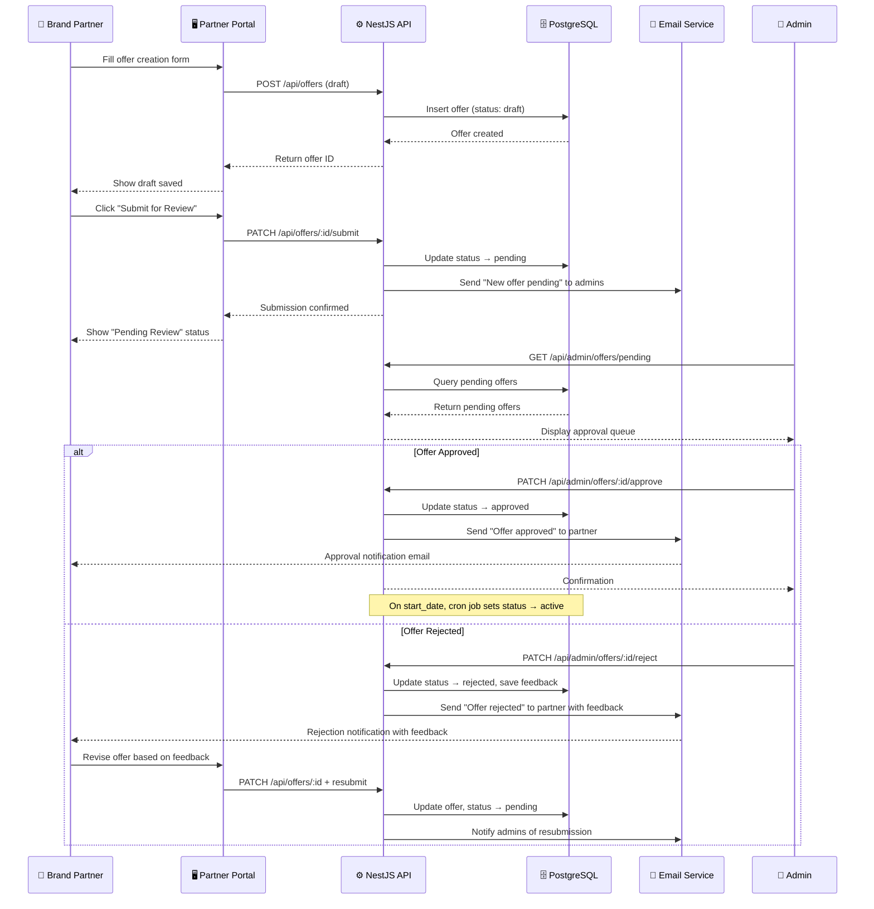

# Brand Partner Portal

> **Platform**: Habib University Preferred Partner Program
> **Purpose**: Self-service portal for brand partners to manage their presence, offers, and profile
> **Stack**: Next.js (Portal UI) · NestJS (API) · Prisma · PostgreSQL · AWS S3

---

## Table of Contents

- [Purpose and Scope](#purpose-and-scope)
- [Partner Authentication](#partner-authentication)
- [Partner Dashboard](#partner-dashboard)
- [Offer Management](#offer-management)
- [Profile Management](#profile-management)
- [Approval Workflows](#approval-workflows)
- [Asset Uploads](#asset-uploads)
- [Notification System](#notification-system)
- [Offer Submission Workflow](#offer-submission-workflow)

---

## Purpose and Scope

The Brand Partner Portal is a dedicated self-service interface that allows approved brand partners to manage their own presence on the Habib University Preferred Partner platform. By providing partners with direct control over their profile, offers, and assets, the portal reduces administrative overhead, accelerates content updates, and improves partner satisfaction.

### Key Objectives

- **Autonomy** — Partners can create and manage offers without waiting for admin intervention
- **Transparency** — Full visibility into approval statuses, performance metrics, and account health
- **Quality Control** — All partner-submitted content passes through an admin approval workflow before going live
- **Scalability** — Self-service model supports growth in partner count without proportional increase in admin workload

### Access Model

The brand portal is accessible at `/portal` and operates under a separate authentication context from the main platform. Only users with an active `partner` role and an associated `partner_organization_id` can access the portal.

---

## Partner Authentication

Partner authentication is handled through a dedicated login flow, separate from the student/faculty-facing platform and the admin dashboard.

### Invitation-Based Onboarding

New partners do not self-register. Instead, the onboarding process is initiated by a platform administrator:

1. Admin creates a new partner organization record in the admin dashboard
2. System generates a unique, time-limited invitation link (valid for 72 hours)
3. Invitation email is sent to the partner's designated primary contact
4. Partner clicks the link, sets their password, and completes the onboarding form
5. Account is activated upon form submission; no additional admin approval is required for the account itself

### Authentication Flow

- Partners authenticate via email and password
- Sessions are managed using HTTP-only secure cookies with JWT tokens
- Tokens expire after 24 hours of inactivity; active sessions are extended on each request
- Multi-factor authentication (MFA) is available via TOTP (e.g., Google Authenticator) and is encouraged but not mandatory
- Password reset is handled via a standard email-based reset flow with rate limiting

### Session Security

| Security Measure         | Implementation                          |
|--------------------------|-----------------------------------------|
| Token Storage            | HTTP-only, Secure, SameSite=Strict cookie |
| Token Expiry             | 24-hour sliding window                   |
| Rate Limiting            | 5 failed login attempts per 15 minutes   |
| CSRF Protection          | Double-submit cookie pattern             |
| IP Logging               | Login IP recorded in audit log           |

---

## Partner Dashboard

Upon login, partners are presented with a personalized dashboard summarizing their account health and activity.

### Dashboard Metrics

| Metric                   | Description                                  |
|--------------------------|----------------------------------------------|
| Active Offers            | Count of currently live offers               |
| Pending Approvals        | Offers awaiting admin review                 |
| Total Redemptions (30d)  | Number of offer redemptions in the last month |
| Profile Completeness     | Percentage of profile fields filled          |
| Average Offer Rating     | Mean user rating across all offers           |
| Days Until Renewal       | Countdown to partnership renewal date        |

### Activity Feed

A chronological feed of recent events relevant to the partner:

- Offer approved or rejected (with admin feedback)
- New offer redemptions
- Profile update confirmations
- System announcements from platform administrators

### Quick Actions

- **Create New Offer** — Opens the offer creation form
- **Update Profile** — Navigates to the profile editor
- **View Analytics** — Opens the detailed analytics view
- **Contact Support** — Opens a support request form

---

## Offer Management

Partners can create, edit, and manage their promotional offers through the portal. All new offers and significant edits require admin approval before becoming visible to platform users.

### Creating an Offer

The offer creation form collects the following information:

| Field              | Type       | Required | Notes                                    |
|--------------------|------------|----------|------------------------------------------|
| Title              | Text       | Yes      | Max 100 characters                       |
| Description        | Rich Text  | Yes      | Supports basic formatting                |
| Discount Type      | Select     | Yes      | Percentage, Fixed Amount, BOGO, Custom   |
| Discount Value     | Number     | Conditional | Required for Percentage and Fixed Amount |
| Start Date         | Date       | Yes      | Cannot be in the past                    |
| End Date           | Date       | Yes      | Must be after start date                 |
| Terms & Conditions | Text       | Yes      | Plain text, max 2000 characters          |
| Redemption Method  | Select     | Yes      | Online Code, In-Store, QR Code           |
| Cover Image        | File       | No       | JPG/PNG, max 2MB, 16:9 aspect ratio     |
| Category           | Multi-Select | Yes   | From predefined category list            |

### Offer Statuses

Partners can view their offers filtered by status:

- **Draft** — Saved but not submitted; editable without restrictions
- **Pending Review** — Submitted to admin; edits are locked until review is complete
- **Approved** — Accepted by admin; will go live on the start date
- **Rejected** — Declined with admin feedback; partner can revise and resubmit
- **Active** — Currently live and visible to users
- **Expired** — Past the end date; archived and available for cloning
- **Revoked** — Pulled by the partner or admin before the end date

### Editing Offers

- **Drafts** can be edited freely
- **Approved/Active offers** can receive minor edits (description, terms) that are auto-approved, but changes to discount value, dates, or title trigger a re-approval flow
- **Rejected offers** can be revised and resubmitted with a response to admin feedback

---

## Profile Management

Partners maintain their organization's public-facing profile through a dedicated profile editor.

### Editable Profile Fields

| Field                | Type       | Notes                                      |
|----------------------|------------|--------------------------------------------|
| Company Name         | Text       | Legal entity name                          |
| Display Name         | Text       | Name shown on the platform                 |
| Logo                 | File       | SVG/PNG, max 1MB, square aspect ratio      |
| Cover Image          | File       | JPG/PNG, max 5MB, 3:1 aspect ratio        |
| Description          | Rich Text  | Company overview, max 5000 characters      |
| Industry/Category    | Select     | From predefined list                       |
| Website URL          | URL        | Must be a valid URL                        |
| Primary Contact Name | Text       | Main point of contact                      |
| Primary Contact Email| Email      | Used for platform communications           |
| Phone Number         | Text       | Optional, for admin contact only           |
| Address              | Text       | Physical location(s)                       |
| Social Media Links   | URL[]      | LinkedIn, Instagram, Facebook, Twitter     |

### Profile Completeness Score

The dashboard displays a profile completeness percentage calculated as:

```
completeness = (filled_fields / total_fields) * 100
```

Partners with a completeness score below 70% see a persistent banner encouraging profile completion. A complete profile improves visibility in search results and partner listings.

### Change Tracking

All profile updates are versioned. Admins can view the change history of any partner profile, and partners can see their own edit history.

---

## Approval Workflows

The approval workflow is the central quality-control mechanism ensuring all partner-submitted content meets platform standards before publication.

### Workflow States

1. **Partner submits** an offer or significant profile change
2. **System validates** the submission against business rules (required fields, date ranges, image dimensions)
3. **Admin receives** a notification that a new item is pending review
4. **Admin reviews** the submission in the admin dashboard
5. **Admin decides**:
   - **Approve** — Item is published or change is applied
   - **Reject** — Item is returned to the partner with mandatory feedback explaining the reason
   - **Request Changes** — Item is returned with specific modification requests
6. **Partner is notified** of the decision via email and in-portal notification
7. If rejected or changes requested, the partner can **revise and resubmit**

### Approval SLA

The platform targets a **24-hour review turnaround** for all submissions. Items pending longer than 24 hours are escalated in the admin dashboard with a visual indicator.

### Approval Rules

| Change Type                          | Requires Approval |
|--------------------------------------|-------------------|
| New offer submission                 | Yes               |
| Offer title or discount value change | Yes               |
| Offer description or terms update    | No (auto-approved) |
| Profile description update           | No                |
| Logo or cover image change           | Yes               |
| Contact information update           | No                |

---

## Asset Uploads

Partners can upload various digital assets (logos, images, documents) to support their profile and offers. All assets are stored in AWS S3.

### Upload Architecture

```
Partner Browser → Next.js API Route → NestJS API → Pre-signed S3 URL → S3 Bucket
```

1. Partner selects a file in the portal UI
2. Frontend requests a pre-signed upload URL from the NestJS API
3. API generates a pre-signed S3 PUT URL (valid for 15 minutes) with the appropriate content-type restrictions
4. Frontend uploads the file directly to S3 using the pre-signed URL (bypassing the server for large files)
5. Upon successful upload, the frontend notifies the API with the S3 object key
6. API validates the upload (file size, type, dimensions) and creates an `asset` record in the database

### File Restrictions

| Asset Type      | Allowed Formats    | Max Size | Dimensions             |
|-----------------|--------------------|----------|------------------------|
| Logo            | SVG, PNG           | 1 MB     | Square (1:1)           |
| Cover Image     | JPG, PNG           | 5 MB     | 1200×400 min (3:1)     |
| Offer Image     | JPG, PNG           | 2 MB     | 1200×675 min (16:9)    |
| Document        | PDF                | 10 MB    | N/A                    |

### CDN Delivery

Uploaded assets are served via CloudFront CDN with automatic format conversion (WebP where supported) and responsive image variants generated on upload.

---

## Notification System

Partners receive notifications for key events through both in-portal notifications and email.

### Notification Events

| Event                          | In-Portal | Email |
|--------------------------------|-----------|-------|
| Offer approved                 | ✅        | ✅    |
| Offer rejected (with feedback) | ✅        | ✅    |
| Changes requested              | ✅        | ✅    |
| Offer about to expire (7 days) | ✅        | ✅    |
| Offer expired                  | ✅        | ❌    |
| Partnership renewal reminder   | ✅        | ✅    |
| System announcement            | ✅        | ❌    |
| Monthly performance report     | ❌        | ✅    |

### Email Configuration

Emails are sent via AWS SES using HTML templates stored in `/packages/email-templates/`. Each template supports variable interpolation for partner name, offer title, admin feedback, and action URLs.

### In-Portal Notifications

In-portal notifications are displayed via a notification bell icon in the portal header. Unread notifications are indicated by a badge count. Notifications are stored in the `notifications` table and support mark-as-read, mark-all-as-read, and deletion.

---

## Offer Submission Workflow

The following sequence diagram illustrates the complete lifecycle of an offer from creation to publication.



---

> **Related Documentation**: [Admin System](./Admin-System.md) · [Testing Strategy](./Testing-Strategy.md)
