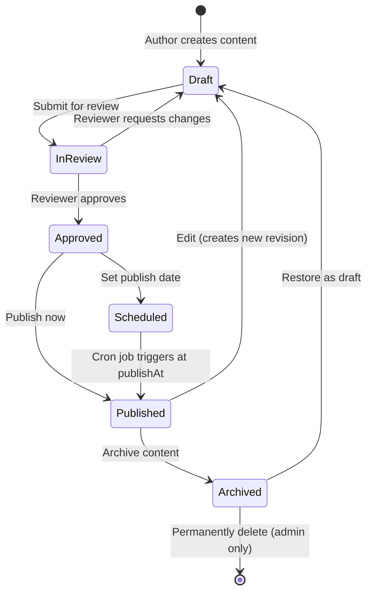

# CMS Strategy

> Content Management Architecture for the Habib University Preferred Partner Platform

## 1. Philosophy

The platform adopts a **headless CMS built directly into the admin panel** rather than relying on an external CMS service (e.g., Strapi, Contentful). This decision provides:

- **Full control** over content schemas, validation rules, and rendering behaviour.
- **Tight integration** with the NestJS API and Prisma data layer — no network boundary between content and business logic.
- **Cost efficiency** — eliminates per-seat SaaS licensing and third-party API rate limits.
- **Security** — content management lives behind the same authentication and RBAC system that governs the rest of the admin surface.

Content is authored via the admin panel (`/apps/web/admin`), stored in PostgreSQL through Prisma models, and served to the public Next.js frontend via internal API routes.

---

## 2. Content Types

| Content Type       | Description                                          | Typical Editor     |
| ------------------ | ---------------------------------------------------- | ------------------ |
| **Page**           | Full CMS-managed pages (About, FAQ, Terms)           | Admin / Marketing  |
| **Section**        | Reusable content blocks embedded in pages             | Admin / Marketing  |
| **Offer**          | Partner promotional offers with terms and imagery     | Partner Liaison     |
| **Partner Profile**| Branded profile pages for each partner organisation  | Partner Liaison     |
| **Newsletter**     | Newsletter editions composed of articles & sections   | Communications     |
| **Announcement**   | Time-bound banners and notifications                  | Admin / Marketing  |

Each content type maps to a dedicated Prisma model with shared traits (status, SEO metadata, audit timestamps) extracted into a common pattern.

---

## 3. Admin Editing Interface

### 3.1 Rich Text Editor

The admin panel embeds a **Tiptap** editor (built on ProseMirror) for all rich-text fields.

| Feature                | Implementation Detail                              |
| ---------------------- | -------------------------------------------------- |
| Bold / Italic / Lists  | Standard Tiptap extensions                         |
| Headings               | H2–H4 with enforced hierarchy                      |
| Links                  | URL validation, `rel="noopener"` enforcement       |
| Images                 | Inline upload to S3 via drag-and-drop              |
| Embeds                 | YouTube / Vimeo via `iframe` allow-list            |
| Tables                 | Tiptap `@tiptap/extension-table`                   |
| Code Blocks            | Syntax-highlighted via `lowlight`                  |

### 3.2 Media Uploads

- Files are uploaded directly from the editor to a **presigned S3 URL** generated by the NestJS API.
- On upload completion the API records the asset in the `Media` table (key, size, MIME type, dimensions).
- Thumbnails are generated via **Sharp** on upload for gallery views.

### 3.3 Preview

Editors can preview content exactly as it will appear on the public site. The Next.js frontend exposes a `?preview=true&token=<jwt>` query parameter that fetches **draft** content from the API instead of published content.

---

## 4. Content Versioning

Every content item follows a three-state lifecycle with full version history.

### 4.1 States

| State         | Visibility           | Editable | Description                            |
| ------------- | -------------------- | -------- | -------------------------------------- |
| `DRAFT`       | Admin preview only   | Yes      | Work-in-progress content               |
| `PUBLISHED`   | Public               | No*      | Live content served to visitors        |
| `ARCHIVED`    | Hidden               | No       | Retired content preserved for audit    |

\* To edit published content, a new draft revision is created automatically.

### 4.2 Version History

- Each save creates a `ContentVersion` record containing the full serialised content snapshot, author ID, and timestamp.
- Editors can **compare** any two versions via a diff view.
- **Rollback** creates a new draft pre-populated with the selected historical version's content.
- A configurable retention policy prunes versions older than 12 months (excluding the current published version).

---

## 5. Media Management

### 5.1 Upload Pipeline

```
Browser → Presigned PUT (S3) → S3 Bucket → Lambda (resize/optimise) → CloudFront CDN
```

### 5.2 Image Optimisation

| Step               | Tool / Service          | Output                        |
| ------------------ | ----------------------- | ----------------------------- |
| Upload             | AWS SDK (presigned URL) | Original stored in S3         |
| Resize             | Sharp (Lambda)          | 320w, 640w, 1280w variants    |
| Format conversion  | Sharp (Lambda)          | WebP + AVIF alongside JPEG    |
| CDN delivery       | CloudFront              | Edge-cached, cache-busted     |

### 5.3 CDN Delivery

- All media URLs resolve to `https://cdn.hupartners.habib.edu.pk/<key>`.
- CloudFront is configured with a 30-day default TTL and versioned object keys for cache busting.
- `Accept` header–based content negotiation serves WebP/AVIF to supported browsers.

---

## 6. Rich Text Handling

### 6.1 Storage

Rich text is stored as **sanitised HTML** in a `TEXT` column. Sanitisation is performed server-side on every write using `sanitize-html` with a strict allow-list of tags and attributes.

### 6.2 Rendering

The Next.js frontend renders stored HTML via a `<RichContent />` React component that:

1. Parses HTML with `rehype-parse`.
2. Applies custom component mappings (e.g., `` → `<OptimisedImage>`).
3. Outputs React elements — **never** `dangerouslySetInnerHTML`.

---

## 7. Approval Workflow

Content items that require editorial oversight (Offers, Announcements, Newsletter articles) pass through a four-stage approval workflow.

### 7.1 Workflow Stages

1. **Create Draft** — Author writes and saves content.
2. **Submit for Review** — Author marks the draft as "In Review"; reviewers are notified.
3. **Approve / Request Changes** — Reviewer approves or returns with comments.
4. **Publish** — Approved content is published immediately or at a scheduled date/time.

### 7.2 Roles

| Role            | Permissions                                    |
| --------------- | ---------------------------------------------- |
| `AUTHOR`        | Create, edit own drafts, submit for review     |
| `REVIEWER`      | View all drafts, approve, request changes      |
| `PUBLISHER`     | Publish approved content, manage schedule       |
| `ADMIN`         | All of the above, plus delete and archive      |

---

## 8. Draft / Publish System

### 8.1 Preview Drafts

- The admin panel renders a full-fidelity preview using the same Next.js components as the public site.
- Preview URLs are shareable within the admin team via short-lived signed tokens (15-minute expiry).

### 8.2 Scheduled Publishing

- Content can be assigned a `publishAt` timestamp.
- A NestJS **cron job** (`@nestjs/schedule`) runs every minute, querying for approved content where `publishAt <= NOW()` and `status = 'APPROVED'`, then transitions those items to `PUBLISHED`.

---

## 9. SEO Metadata Management

Every content item exposes the following SEO fields in the admin editor:

| Field              | Constraint                   | Default Fallback              |
| ------------------ | ---------------------------- | ----------------------------- |
| `metaTitle`        | Max 60 characters            | Content title                 |
| `metaDescription`  | Max 160 characters           | First 160 chars of body       |
| `ogImage`          | Must be uploaded media       | Platform default OG image     |
| `canonicalUrl`     | Valid URL or empty            | Auto-generated from slug      |
| `slug`             | Unique per content type      | Slugified title               |
| `noIndex`          | Boolean                      | `false`                       |

The Next.js frontend injects these values into `<head>` via the App Router `metadata` export, ensuring proper `<title>`, `<meta>`, and Open Graph tags on every page.

---

## 10. Content Lifecycle — State Diagram



---

## 11. Technical Stack Summary

| Concern             | Technology                                   |
| -------------------- | -------------------------------------------- |
| Rich text editing    | Tiptap (ProseMirror) — React                 |
| HTML sanitisation    | `sanitize-html` — NestJS middleware           |
| Media upload         | AWS S3 presigned URLs                        |
| Image optimisation   | Sharp via AWS Lambda                         |
| CDN                  | AWS CloudFront                               |
| Scheduled publishing | `@nestjs/schedule` cron                      |
| Content rendering    | Rehype + custom React components             |
| Database             | PostgreSQL via Prisma ORM                    |
| Preview              | Next.js draft mode with signed JWT tokens    |

---

## 12. Future Considerations

- **Localisation** — multi-language content support via a `locale` field and translation workflow.
- **A/B testing** — serve variant content blocks and track engagement metrics.
- **AI-assisted writing** — integrate LLM-based suggestions for SEO metadata and content summaries.
- **Webhooks** — emit events on publish/archive for downstream integrations (Slack notifications, analytics).
