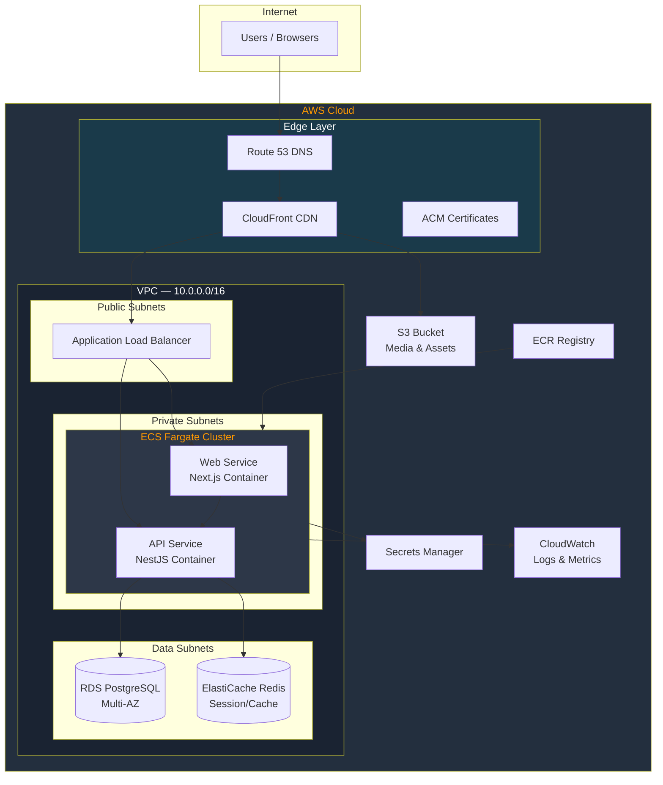

# Deployment Architecture

> Habib University Preferred Partner Platform — AWS Infrastructure & CI/CD

---

## Table of Contents

- [Architecture Overview](#architecture-overview)
- [Deployment Architecture Diagram](#deployment-architecture-diagram)
- [Docker Strategy](#docker-strategy)
- [CI/CD Pipeline](#cicd-pipeline)
- [Environment Configuration](#environment-configuration)
- [Database Migrations](#database-migrations)
- [SSL/TLS & HTTPS](#ssltls--https)
- [Monitoring & Observability](#monitoring--observability)
- [Pilot Testing (Vercel)](#pilot-testing-vercel)

---

## Pilot Testing (Vercel)

To enable rapid iteration and stakeholder review, the repository is compatible with **Vercel** exclusively for pilot testing the Next.js frontend (`apps/web`). 
This is **NOT** a platform migration. AWS remains the canonical production target.

### Vercel Configuration
- **Framework Preset:** Next.js
- **Root Directory:** `apps/web` (Vercel automatically detects the Turbo workspace and runs `turbo run build --filter=@hu-partner/web...`)
- **Environment Variables:** Only frontend variables (e.g., `NEXT_PUBLIC_API_URL`) are required. Backend variables like `DATABASE_URL` and `REDIS_HOST` are omitted since Vercel only compiles the frontend.

By keeping the Next.js frontend physically decoupled from the NestJS backend, we ensure zero Vercel-specific hacks pollute the core infrastructure or API environment.

---

## Architecture Overview

The platform runs on **AWS** using a fully containerized architecture. Both the Next.js frontend and the NestJS API are deployed as Docker containers on **ECS Fargate**, providing serverless container orchestration without managing EC2 instances.

### Core Services

| Service            | AWS Resource         | Purpose                                  |
| ------------------ | -------------------- | ---------------------------------------- |
| Web Application    | ECS Fargate          | Next.js SSR frontend                     |
| API Server         | ECS Fargate          | NestJS REST/GraphQL backend              |
| Database           | RDS PostgreSQL 15    | Primary relational data store            |
| Media Storage      | S3                   | Partner logos, documents, uploaded assets |
| CDN                | CloudFront           | Static asset delivery, edge caching      |
| DNS                | Route 53             | Domain management and routing            |
| Secrets            | Secrets Manager      | API keys, DB credentials, tokens         |
| Container Registry | ECR                  | Docker image storage                     |
| Load Balancing     | ALB                  | HTTPS termination, traffic distribution  |
| VPC                | VPC + Private Subnets| Network isolation                        |

### Deployment Architecture Diagram



---

## Docker Strategy

### Multi-Stage Builds

Both applications use multi-stage Docker builds to minimize image size and attack surface.

**Web (Next.js) — `apps/web/Dockerfile`**

```dockerfile
# Stage 1: Dependencies
FROM node:20-alpine AS deps
WORKDIR /app
COPY pnpm-lock.yaml pnpm-workspace.yaml ./
COPY apps/web/package.json ./apps/web/
COPY packages/*/package.json ./packages/*/
RUN corepack enable pnpm && pnpm install --frozen-lockfile

# Stage 2: Build
FROM node:20-alpine AS builder
WORKDIR /app
COPY --from=deps /app/node_modules ./node_modules
COPY . .
RUN pnpm --filter @hu/web build

# Stage 3: Production
FROM node:20-alpine AS runner
WORKDIR /app
ENV NODE_ENV=production
COPY --from=builder /app/apps/web/.next/standalone ./
COPY --from=builder /app/apps/web/.next/static ./apps/web/.next/static
COPY --from=builder /app/apps/web/public ./apps/web/public
EXPOSE 3000
CMD ["node", "apps/web/server.js"]
```

**API (NestJS) — `apps/api/Dockerfile`**

```dockerfile
# Stage 1: Dependencies
FROM node:20-alpine AS deps
WORKDIR /app
COPY pnpm-lock.yaml pnpm-workspace.yaml ./
COPY apps/api/package.json ./apps/api/
COPY packages/*/package.json ./packages/*/
RUN corepack enable pnpm && pnpm install --frozen-lockfile

# Stage 2: Build
FROM node:20-alpine AS builder
WORKDIR /app
COPY --from=deps /app/node_modules ./node_modules
COPY . .
RUN pnpm --filter @hu/api build

# Stage 3: Production
FROM node:20-alpine AS runner
WORKDIR /app
ENV NODE_ENV=production
COPY --from=builder /app/apps/api/dist ./dist
COPY --from=builder /app/apps/api/node_modules ./node_modules
COPY --from=builder /app/apps/api/prisma ./prisma
EXPOSE 4000
CMD ["node", "dist/main.js"]
```

### Local Development with Docker Compose

`docker-compose.yml` provides a complete local development stack:

```yaml
services:
  web:
    build:
      context: .
      dockerfile: apps/web/Dockerfile
      target: deps
    ports: ["3000:3000"]
    volumes: ["./apps/web:/app/apps/web"]
    command: pnpm --filter @hu/web dev

  api:
    build:
      context: .
      dockerfile: apps/api/Dockerfile
      target: deps
    ports: ["4000:4000"]
    volumes: ["./apps/api:/app/apps/api"]
    command: pnpm --filter @hu/api dev
    depends_on: [postgres, redis]

  postgres:
    image: postgres:15-alpine
    environment:
      POSTGRES_DB: hu_partners
      POSTGRES_USER: hu_admin
      POSTGRES_PASSWORD: localdev
    ports: ["5432:5432"]
    volumes: ["pgdata:/var/lib/postgresql/data"]

  redis:
    image: redis:7-alpine
    ports: ["6379:6379"]

volumes:
  pgdata:
```

---

## CI/CD Pipeline

The CI/CD pipeline uses **GitHub Actions** with a progressive deployment strategy: build → test → deploy to staging → manual approval → deploy to production.

### CI/CD Pipeline Diagram

```mermaid
flowchart LR
    subgraph Trigger["Trigger"]
        PR[Pull Request]
        PUSH[Push to main]
    end

    subgraph CI["CI — Build & Test"]
        LINT[Lint & Type Check]
        UTEST[Unit Tests]
        ITEST[Integration Tests]
        BUILD[Docker Build]
        PUSH_ECR[Push to ECR]
    end

    subgraph Staging["Deploy — Staging"]
        MIG_S[Run Migrations]
        DEPLOY_S[Update ECS Tasks]
        SMOKE[Smoke Tests]
    end

    subgraph Production["Deploy — Production"]
        APPROVE[Manual Approval]
        MIG_P[Run Migrations]
        DEPLOY_P[Rolling Update]
        HEALTH[Health Check]
    end

    PR --> LINT --> UTEST --> ITEST
    PUSH --> LINT
    ITEST --> BUILD --> PUSH_ECR
    PUSH_ECR --> MIG_S --> DEPLOY_S --> SMOKE
    SMOKE --> APPROVE --> MIG_P --> DEPLOY_P --> HEALTH

    style CI fill:#1e3a5f,color:#fff
    style Staging fill:#2d4a2d,color:#fff
    style Production fill:#5a2d2d,color:#fff
```



### Workflow File Structure

```
.github/
  workflows/
    ci.yml            # Lint, test, build on PRs
    deploy-staging.yml  # Auto-deploy to staging on merge to main
    deploy-prod.yml     # Manual production deployment
    db-migrate.yml      # Database migration runner
```

### Key Workflow: Deploy to Staging

```yaml
# .github/workflows/deploy-staging.yml
name: Deploy to Staging
on:
  push:
    branches: [main]
jobs:
  deploy:
    runs-on: ubuntu-latest
    steps:
      - uses: actions/checkout@v4
      - uses: aws-actions/configure-aws-credentials@v4
      - uses: aws-actions/amazon-ecr-login@v2
      - run: docker build -t $ECR_REPO:$GITHUB_SHA -f apps/web/Dockerfile .
      - run: docker push $ECR_REPO:$GITHUB_SHA
      - run: aws ecs update-service --cluster hu-staging --service web --force-new-deployment
```

---

## Environment Configuration

### Environment Hierarchy

| Variable              | Development       | Staging                    | Production                |
| --------------------- | ----------------- | -------------------------- | ------------------------- |
| `NODE_ENV`            | `development`     | `staging`                  | `production`              |
| `DATABASE_URL`        | Local PostgreSQL  | RDS Staging Instance       | RDS Production (Multi-AZ) |
| `NEXT_PUBLIC_API_URL` | `localhost:4000`  | `api-staging.hu.edu.pk`    | `api.hu.edu.pk`           |
| `S3_BUCKET`           | Local MinIO       | `hu-partners-staging`      | `hu-partners-prod`        |
| `LOG_LEVEL`           | `debug`           | `info`                     | `warn`                    |

### Secrets Management

- **Local**: `.env.local` files (git-ignored) per app
- **CI/CD**: GitHub Actions Secrets & Variables
- **AWS**: Secrets Manager for runtime credentials injected into ECS task definitions

> **Rule**: Never commit secrets. All `.env*` files except `.env.example` are in `.gitignore`.

---

## Database Migrations

Prisma Migrate handles all schema changes with a deterministic migration history.

### Migration Workflow

1. **Develop**: `pnpm --filter @hu/api prisma migrate dev --name <description>`
2. **Commit**: Migration SQL files are committed to `apps/api/prisma/migrations/`
3. **CI**: `prisma migrate deploy` runs as a pre-deployment step in the CI/CD pipeline
4. **Rollback**: Manual rollback via reverse migration scripts

### CI/CD Integration

```yaml
# Migration step in deploy workflow
- name: Run Database Migrations
  env:
    DATABASE_URL: ${{ secrets.DATABASE_URL_STAGING }}
  run: |
    cd apps/api
    npx prisma migrate deploy
```

### Safety Rules

- Always review generated SQL before committing
- Test migrations against a staging database clone before production
- Never use `prisma db push` in staging or production
- Keep migrations small and reversible

---

## SSL/TLS & HTTPS

| Layer          | Certificate Source | Termination Point |
| -------------- | ------------------ | ----------------- |
| CloudFront     | ACM (us-east-1)    | Edge locations    |
| ALB            | ACM (ap-south-1)   | Load balancer     |
| ECS → ALB      | N/A (plaintext)    | Internal only     |

- All public traffic is **HTTPS-only** via CloudFront and ALB listeners
- HTTP requests receive a **301 redirect** to HTTPS
- Internal service-to-service communication within the VPC uses plain HTTP (encrypted at the network level by VPC)
- ACM certificates auto-renew — no manual intervention required

---

## Monitoring & Observability

### CloudWatch Integration

| Metric                     | Source         | Alert Threshold |
| -------------------------- | -------------- | --------------- |
| CPU Utilization            | ECS            | > 80% for 5m   |
| Memory Utilization         | ECS            | > 85% for 5m   |
| HTTP 5xx Rate              | ALB            | > 1% for 3m    |
| Response Latency (p99)     | ALB            | > 2s for 5m    |
| Database Connections       | RDS            | > 80% max      |
| Disk IOPS                  | RDS            | > 90% baseline  |

### Health Checks

- **ALB Health Check**: `GET /api/health` — returns `200` with DB connectivity status
- **ECS Health Check**: Container-level liveness probe every 30 seconds
- **Synthetic Monitoring**: CloudWatch Synthetics canary for critical user flows

### Alerting

Alerts are routed via **SNS** to:
- **Slack** `#hu-platform-alerts` channel for P1/P2 issues
- **Email** to the engineering team for P3 notifications
- **PagerDuty** for production-down scenarios (P0)

### Log Aggregation

- All container logs stream to **CloudWatch Logs** via the `awslogs` driver
- Log groups: `/ecs/hu-web-{env}`, `/ecs/hu-api-{env}`
- Retention: 30 days (staging), 90 days (production)
- Structured JSON logging enables CloudWatch Insights queries
