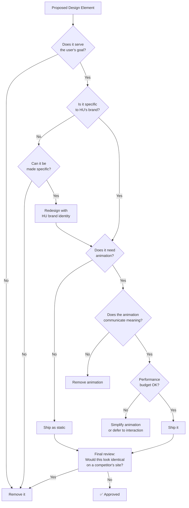

# Design Principles

> Habib University Preferred Partner Platform — Anti AI-Slop Design Philosophy

---

## Overview

This document defines the visual and interactive design philosophy for the HU Preferred Partner platform. Every design decision must pass through the lens of **intentionality** — if you cannot articulate *why* a design choice exists, it should not exist.

We build editorial-quality, museum-grade digital experiences. We do not build generic SaaS dashboards.

---

## What "Anti AI-Slop" Means

**AI-Slop** is the visual equivalent of filler content: designs that look "modern" at a glance but communicate nothing, differentiate nothing, and respect nobody's intelligence. It is the default output of every template marketplace, landing page generator, and AI design tool.

Anti AI-Slop is the commitment to:

1. **Intentional over decorative** — Every element earns its place.
2. **Specific over generic** — Design *for* Habib University, not *like* a SaaS template.
3. **Restrained over maximal** — Confidence is quiet. Insecurity is loud.
4. **Editorial over commercial** — Treat content like a publication, not a sales funnel.
5. **Honest over impressive** — Show real data or show nothing. Never fake it.

---

## Design Decision Tree



---

## Typography-First Design

Typography is not decoration — it is the primary design material. The hierarchy, rhythm, and personality of the platform are established through type before any other element.

### Principles

| Principle | Guideline |
|---|---|
| **Hierarchy is non-negotiable** | Every page must have a clear typographic hierarchy: headline → subhead → body → caption. No ambiguity. |
| **Type scale is systematic** | Use a modular scale (e.g., 1.250 Major Third). No arbitrary `font-size` values. |
| **Weight carries meaning** | Bold = emphasis. Semi-bold = section headers. Regular = body. Light = captions. Never use weight decoratively. |
| **Line length is controlled** | Body text: 55–75 characters per line. No full-width paragraphs on desktop. |
| **Vertical rhythm is sacred** | All spacing between text elements follows a baseline grid (multiples of 4px or 8px). |
| **Font loading is invisible** | Use `font-display: swap` with system font fallbacks that match metrics. No FOUT flashes. |

### Type Pairing

- **Headings**: A distinctive serif or display typeface that carries HU's academic gravitas.
- **Body**: A clean sans-serif optimised for screen readability (e.g., Inter, Söhne, or similar).
- **Monospace**: For data tables, codes, or technical content only.

> Never use more than 2 typeface families on a single page.

---

## Whitespace Philosophy

Whitespace is not empty space — it is *active* design. It creates hierarchy, breathing room, and focus.

### Rules

1. **Generous by default** — When in doubt, add more space, not less.
2. **Consistent spacing tokens** — Use the Tailwind spacing scale (`4`, `8`, `12`, `16`, `24`, `32`, `48`, `64`, `96`). No magic numbers.
3. **Sections breathe** — Major content sections have a minimum of `py-24` (96px) vertical padding.
4. **Density is earned** — Dense layouts (data tables, admin dashboards) are exceptions, not defaults.
5. **Negative space tells a story** — The space around a brand logo communicates as much as the logo itself.

---

## Colour Philosophy

### HU Brand Alignment

The colour palette derives from Habib University's institutional identity. Every colour must map to the HU brand guidelines or serve a functional UI purpose.

| Token | Usage | Guideline |
|---|---|---|
| `brand-primary` | HU primary brand colour | Used sparingly — CTAs, active states, key accents |
| `brand-secondary` | HU secondary colour | Supporting elements, hover states |
| `neutral-*` | Greys scale (50–950) | Background, borders, body text — the workhorse palette |
| `semantic-success` | Confirmation, positive states | Green family — used only for true success states |
| `semantic-warning` | Caution, pending states | Amber family — used only for genuine warnings |
| `semantic-error` | Errors, destructive actions | Red family — never decorative, always functional |

### Rules

1. **Colour is information** — If a colour doesn't communicate status, hierarchy, or brand, remove it.
2. **Neutrals dominate** — 80% of the UI surface should be neutral tones. Colour is the exception.
3. **No gradient vomit** — Gradients are permitted only when they serve a specific visual function (e.g., depth simulation, brand identity). Never as "just make it look modern."
4. **Dark mode is designed, not inverted** — Dark mode has its own palette, not a CSS `filter: invert()`.
5. **Contrast ratios are law** — WCAG AA minimum (4.5:1 body, 3:1 large text). No exceptions.

---

## Animation Philosophy

> See also: [Animation-Guidelines.md](./Animation-Guidelines.md) for implementation details.

### Core Belief

Animation is communication, not decoration. Every motion must answer: **"What is this telling the user?"**

### The Three Valid Reasons to Animate

1. **Feedback** — Confirming a user action (button press, form submit, toggle).
2. **Orientation** — Showing where something came from or is going (page transition, modal entry).
3. **Attention** — Drawing focus to a meaningful change (notification, state update).

If an animation does not serve one of these three purposes, it must be removed.

### Timing & Easing

| Context | Duration | Easing |
|---|---|---|
| Micro-interactions (hover, focus) | 150–200ms | `ease-out` |
| Component transitions (modal, dropdown) | 200–350ms | `ease-in-out` |
| Page transitions | 300–500ms | Custom cubic-bezier |
| Scroll-triggered reveals | 400–800ms | `ease-out` with stagger |

### Rules

1. **Entrance animations fire once** — No replaying on scroll-back unless content has changed.
2. **Respect `prefers-reduced-motion`** — All animations must have a reduced-motion fallback.
3. **No jank** — Animate only `transform` and `opacity`. Never animate `width`, `height`, `top`, `left`.
4. **Stagger is intentional** — Staggered reveals imply a reading order. If there's no meaningful order, don't stagger.

---

## Editorial & Museum-Quality Standards

The HU Preferred Partner platform is a **publication**, not a product page. Every screen should feel like a page in a well-designed annual report or a gallery in a curated exhibition.

### What This Means in Practice

| Standard | Application |
|---|---|
| **Photography is curated** | No stock photos. Every image is sourced, reviewed, and cropped intentionally. |
| **Copy is written, not filled** | No lorem ipsum in production. No "Welcome to our platform." Every string is crafted. |
| **Layout is composed** | Pages are composed like editorial spreads — asymmetry, intentional alignment breaks, visual rhythm. |
| **Data is real** | If a partner has 0 offers, show an elegant empty state. Never show fake numbers. |
| **Detail is obsessive** | Icon alignment, border radius consistency, shadow uniformity — these are not "nice-to-haves." |

---

## Explicit Anti-Patterns

These patterns are **banned** from the platform. If a PR contains any of these, it must be reworked.

### ❌ Gradient Vomit
Multicolour gradients slapped onto backgrounds, cards, or text with no purpose. Gradients that exist because "it looks modern."

### ❌ Unnecessary Parallax
Parallax scrolling on every section. Parallax on text. Parallax on images that don't benefit from depth. Parallax that causes motion sickness.

### ❌ Stock Photo Grids
3×3 grids of generic handshake/team/office photos. If we don't have real photography, we design around the absence — not fill it with garbage.

### ❌ Generic SaaS Layouts
Hero with gradient background → 3-column feature grid → testimonial carousel → CTA banner → footer. This layout communicates "we used a template."

### ❌ Cookie-Cutter Cards
Identical cards with icon + title + description repeated 6+ times in a grid. If every card looks the same, the information hierarchy has failed.

### ❌ Decorative-Only Animations
Floating particles, animated backgrounds, spinning logos, bouncing elements that serve no informational purpose.

### ❌ Fake Social Proof
"Trusted by 10,000+ users" with no verification. "★★★★★ rated" with no source. Fabricated testimonials.

### ❌ Dark Patterns
Misleading CTAs, confirm-shaming, hidden unsubscribe, pre-checked consent boxes.

---

## Component Design Principles

### Composition Over Configuration

Components should be small, composable, and single-purpose. A `Card` component does not need 15 props — it needs well-designed children.

```
✅  <Card>
      <Card.Image src={...} />
      <Card.Body>
        <Card.Title>...</Card.Title>
        <Card.Description>...</Card.Description>
      </Card.Body>
    </Card>

❌  <Card
      image={...}
      title="..."
      description="..."
      variant="featured"
      showBadge
      badgeText="New"
      onClick={...}
    />
```

### Principles

1. **Server Components by default** — Only add `"use client"` when the component genuinely needs browser APIs, event handlers, or state.
2. **Props are minimal** — If a component has more than 5 required props, it's doing too much.
3. **Variants are semantic** — `variant="destructive"` not `variant="red"`. Colour is an implementation detail.
4. **Accessibility is structural** — ARIA attributes, keyboard navigation, and focus management are not bolt-ons.
5. **Empty states are designed** — Every list, grid, and data view has a thoughtful empty state. See Data Integrity below.

---

## Data Integrity

### The Golden Rule

> **Show real data or show nothing. Never show fake data.**

### Principles

1. **Empty states over placeholder data** — If a partner has no offers, display a designed empty state with a clear message. Never show "Coming soon" cards filled with dummy text.
2. **Loading states are honest** — Skeleton screens match the shape of real content. Spinners are a last resort.
3. **Error states are helpful** — "Something went wrong" is not acceptable. Show what happened and what the user can do.
4. **Counts are real** — "12 partners" means exactly 12 partners exist in the database. Not "12+" or "dozens."
5. **Timestamps are precise** — "Updated 3 hours ago" is better than "Recently updated." Relative time with absolute time on hover.
6. **Images have fallbacks** — If a brand logo fails to load, show a typographic fallback with the brand initial — never a broken image icon.

---

## Cross-References

- [Animation-Guidelines.md](./Animation-Guidelines.md) — Implementation details for Framer Motion & GSAP
- [Frontend-Guidelines.md](./Frontend-Guidelines.md) — Next.js component patterns and conventions
- [Tech-Stack.md](./Tech-Stack.md) — Technology choices and version constraints
- [Performance.md](./Performance.md) — Lighthouse budgets and optimisation standards

---

*Last updated: 2026-07-01*
