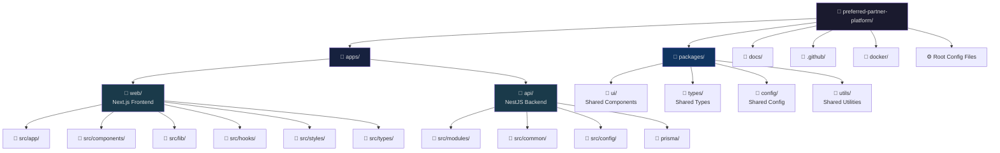

# Folder Structure

> Complete monorepo layout for the Habib University Preferred Partner Platform.

---

## Table of Contents

- [Overview](#overview)
- [Structure Diagram](#structure-diagram)
- [Root Level](#root-level)
- [Web Application (`apps/web/`)](#web-application-appsweb)
- [API Application (`apps/api/`)](#api-application-appsapi)
- [Shared Packages (`packages/`)](#shared-packages-packages)
- [Infrastructure & Tooling](#infrastructure--tooling)
- [Co-location Rules](#co-location-rules)
- [Feature-Based Organization](#feature-based-organization)

---

## Overview

This project is a **pnpm workspace monorepo** managed by **Turborepo**. It contains two deployable applications and four shared packages, organized for maximum code reuse and clear ownership boundaries.

### Principles

1. **Co-location**: Tests, styles, and types live alongside the source code they relate to
2. **Feature-first**: Within apps, code is organized by domain feature, not by technical layer
3. **Shared contracts**: Types, UI components, and utilities live in packages consumed by both apps
4. **Clear boundaries**: Each package and app has explicit public exports via barrel files

---

## Structure Diagram



---

## Root Level

```
preferred-partner-platform/
├── apps/                        # Deployable applications
│   ├── web/                     # Next.js frontend
│   └── api/                     # NestJS backend
├── packages/                    # Shared libraries
│   ├── ui/                      # React component library
│   ├── types/                   # Shared TypeScript types
│   ├── config/                  # Shared configuration (ESLint, TSConfig)
│   └── utils/                   # Shared utility functions
├── docs/                        # Project documentation
│   ├── Deployment.md
│   ├── Contributing.md
│   ├── Code-Style.md
│   └── Folder-Structure.md
├── docker/                      # Docker configurations
│   ├── web.Dockerfile
│   ├── api.Dockerfile
│   └── docker-compose.yml
├── .github/                     # GitHub configuration
│   ├── workflows/               # CI/CD pipelines
│   ├── PULL_REQUEST_TEMPLATE.md
│   └── ISSUE_TEMPLATE/
├── turbo.json                   # Turborepo pipeline config
├── pnpm-workspace.yaml          # Workspace package definitions
├── package.json                 # Root scripts and devDependencies
├── pnpm-lock.yaml               # Lockfile (never edit manually)
├── .gitignore
├── .eslintrc.js                 # Root ESLint config
├── .prettierrc                  # Prettier config
├── .env.example                 # Root environment template
└── README.md
```

### Root Config Files

| File                   | Purpose                                              |
| ---------------------- | ---------------------------------------------------- |
| `turbo.json`           | Defines task pipelines (`build`, `dev`, `lint`, `test`) with caching |
| `pnpm-workspace.yaml`  | Declares workspace packages: `apps/*`, `packages/*`  |
| `package.json`         | Root scripts (`dev`, `build`, `lint`, `test`) and shared devDependencies |
| `.eslintrc.js`         | Base ESLint config extended by all apps and packages  |
| `.prettierrc`          | Consistent formatting rules across the monorepo      |

---

## Web Application (`apps/web/`)

The frontend is a **Next.js 14+** application using the App Router.

```
apps/web/
├── public/                      # Static assets served at /
│   ├── fonts/
│   ├── images/
│   └── favicon.ico
├── src/
│   ├── app/                     # App Router — file-based routing
│   │   ├── (auth)/              # Route group: authentication pages
│   │   │   ├── login/
│   │   │   │   └── page.tsx
│   │   │   └── register/
│   │   │       └── page.tsx
│   │   ├── (dashboard)/         # Route group: authenticated area
│   │   │   ├── layout.tsx       # Dashboard shell with sidebar
│   │   │   ├── partners/
│   │   │   │   ├── page.tsx     # Partner listing
│   │   │   │   ├── [id]/
│   │   │   │   │   └── page.tsx # Partner detail
│   │   │   │   └── loading.tsx  # Suspense fallback
│   │   │   ├── applications/
│   │   │   │   └── page.tsx
│   │   │   └── settings/
│   │   │       └── page.tsx
│   │   ├── api/                 # Route Handlers (BFF pattern)
│   │   │   └── auth/
│   │   │       └── [...nextauth]/
│   │   │           └── route.ts
│   │   ├── layout.tsx           # Root layout
│   │   ├── page.tsx             # Landing page
│   │   ├── loading.tsx          # Global loading state
│   │   ├── error.tsx            # Global error boundary
│   │   ├── not-found.tsx        # 404 page
│   │   └── globals.css          # Global styles
│   ├── components/              # Shared components
│   │   ├── ui/                  # Primitives (Button, Input, Modal)
│   │   ├── layout/              # Shell components (Header, Sidebar, Footer)
│   │   ├── forms/               # Form components (PartnerForm, SearchBar)
│   │   └── data-display/        # Tables, Cards, Charts
│   ├── lib/                     # Utilities and clients
│   │   ├── api-client.ts        # Typed HTTP client for the backend
│   │   ├── auth.ts              # Authentication utilities
│   │   ├── constants.ts         # App-wide constants
│   │   └── validations.ts      # Zod schemas for client-side validation
│   ├── hooks/                   # Custom React hooks
│   │   ├── usePartnerSearch.ts
│   │   ├── useDebounce.ts
│   │   └── useMediaQuery.ts
│   ├── styles/                  # Design tokens and theme
│   │   ├── tokens.css           # CSS custom properties
│   │   └── typography.css       # Font definitions
│   └── types/                   # App-specific type definitions
│       ├── api.ts               # API response types
│       └── forms.ts             # Form state types
├── next.config.js
├── tsconfig.json
├── package.json
└── .env.example
```

### Key Conventions

- **Route Groups**: Use `(groupName)` folders for logical grouping without affecting URL paths
- **Layouts**: Each route group has its own `layout.tsx` for nested UI shells
- **Loading States**: Every data-fetching route has a `loading.tsx` for instant feedback
- **Error Boundaries**: Every route segment has `error.tsx` for graceful failure
- **Server Components**: Default — only add `'use client'` when interactivity is required

---

## API Application (`apps/api/`)

The backend is a **NestJS** application with Prisma ORM.

```
apps/api/
├── src/
│   ├── modules/                 # Domain modules (feature-based)
│   │   ├── auth/
│   │   │   ├── auth.module.ts
│   │   │   ├── auth.controller.ts
│   │   │   ├── auth.service.ts
│   │   │   ├── auth.guard.ts
│   │   │   ├── dto/
│   │   │   │   ├── login.dto.ts
│   │   │   │   └── register.dto.ts
│   │   │   ├── strategies/
│   │   │   │   └── jwt.strategy.ts
│   │   │   └── __tests__/
│   │   │       └── auth.service.spec.ts
│   │   ├── partners/
│   │   │   ├── partners.module.ts
│   │   │   ├── partners.controller.ts
│   │   │   ├── partners.service.ts
│   │   │   ├── partners.repository.ts
│   │   │   ├── dto/
│   │   │   │   ├── create-partner.dto.ts
│   │   │   │   └── update-partner.dto.ts
│   │   │   ├── entities/
│   │   │   │   └── partner.entity.ts
│   │   │   └── __tests__/
│   │   │       ├── partners.controller.spec.ts
│   │   │       └── partners.service.spec.ts
│   │   ├── users/
│   │   │   ├── users.module.ts
│   │   │   ├── users.controller.ts
│   │   │   ├── users.service.ts
│   │   │   └── dto/
│   │   └── applications/
│   │       ├── applications.module.ts
│   │       ├── applications.controller.ts
│   │       ├── applications.service.ts
│   │       └── dto/
│   ├── common/                  # Cross-cutting concerns
│   │   ├── decorators/          # Custom decorators (@CurrentUser, @Roles)
│   │   ├── filters/             # Exception filters (HttpExceptionFilter)
│   │   ├── guards/              # Auth guards (JwtGuard, RolesGuard)
│   │   ├── interceptors/        # Logging, transform interceptors
│   │   ├── pipes/               # Validation pipes
│   │   └── middleware/          # Request logging, CORS
│   ├── config/                  # Configuration
│   │   ├── app.config.ts        # App-level config with validation
│   │   ├── database.config.ts   # Database connection config
│   │   └── auth.config.ts       # JWT and auth config
│   ├── app.module.ts            # Root module
│   └── main.ts                  # Application bootstrap
├── prisma/
│   ├── schema.prisma            # Database schema
│   ├── migrations/              # SQL migration history
│   └── seed.ts                  # Database seeding script
├── test/
│   ├── app.e2e-spec.ts          # End-to-end tests
│   └── jest-e2e.json
├── nest-cli.json
├── tsconfig.json
├── tsconfig.build.json
├── package.json
└── .env.example
```

### Key Conventions

- **Module-per-domain**: Each business domain (partners, auth, users) is a self-contained module
- **Controller → Service → Repository**: Strict layered architecture
- **DTOs at the boundary**: All controller inputs are validated DTOs
- **Repository pattern**: Prisma queries are encapsulated in repository classes, not called directly from services

---

## Shared Packages (`packages/`)

### `packages/ui/` — Component Library

```
packages/ui/
├── src/
│   ├── components/
│   │   ├── Button/
│   │   │   ├── Button.tsx
│   │   │   ├── Button.module.css
│   │   │   ├── Button.test.tsx
│   │   │   └── index.ts
│   │   ├── Input/
│   │   ├── Modal/
│   │   ├── Card/
│   │   └── Table/
│   ├── hooks/
│   └── index.ts               # Barrel export
├── package.json               # @hu/ui
└── tsconfig.json
```

### `packages/types/` — Shared Type Definitions

```
packages/types/
├── src/
│   ├── partner.ts              # Partner domain types
│   ├── user.ts                 # User domain types
│   ├── application.ts          # Application domain types
│   ├── api.ts                  # API response/request types
│   └── index.ts                # Barrel export
├── package.json                # @hu/types
└── tsconfig.json
```

### `packages/config/` — Shared Configuration

```
packages/config/
├── eslint/
│   ├── base.js                 # Base ESLint rules
│   ├── react.js                # React-specific rules
│   └── nestjs.js               # NestJS-specific rules
├── typescript/
│   ├── base.json               # Base tsconfig
│   ├── react.json              # React tsconfig
│   └── node.json               # Node.js tsconfig
└── package.json                # @hu/config
```

### `packages/utils/` — Shared Utilities

```
packages/utils/
├── src/
│   ├── date.ts                 # Date formatting and parsing
│   ├── string.ts               # String manipulation helpers
│   ├── validation.ts           # Shared validation schemas
│   ├── result.ts               # Result type implementation
│   └── index.ts                # Barrel export
├── package.json                # @hu/utils
└── tsconfig.json
```

---

## Infrastructure & Tooling

### `.github/` — GitHub Configuration

```
.github/
├── workflows/
│   ├── ci.yml                  # PR checks: lint, type-check, test, build
│   ├── deploy-staging.yml      # Auto-deploy on merge to main
│   ├── deploy-prod.yml         # Manual production deploy
│   └── db-migrate.yml          # Database migration runner
├── PULL_REQUEST_TEMPLATE.md    # PR description template
├── ISSUE_TEMPLATE/
│   ├── bug_report.md
│   └── feature_request.md
└── CODEOWNERS                  # Auto-assign reviewers by path
```

### `docker/` — Container Configuration

```
docker/
├── web.Dockerfile              # Multi-stage build for Next.js
├── api.Dockerfile              # Multi-stage build for NestJS
├── docker-compose.yml          # Local dev stack
├── docker-compose.test.yml     # CI test environment
└── .dockerignore
```

---

## Co-location Rules

Files that change together should live together. The following co-location rules apply:

| File Type         | Location Rule                              | Example                                     |
| ----------------- | ------------------------------------------ | -------------------------------------------- |
| Unit tests        | Next to source file, `.test.ts(x)` suffix  | `Button.tsx` → `Button.test.tsx`             |
| CSS Modules       | Next to component, `.module.css` suffix    | `Card.tsx` → `Card.module.css`               |
| Component types   | Inside component directory                 | `Button/types.ts`                            |
| Feature hooks     | Inside feature directory                   | `partners/hooks/usePartnerSearch.ts`         |
| Storybook stories | Next to component (when applicable)        | `Button.stories.tsx`                         |
| E2E tests         | In `test/` directory at app root           | `apps/web/test/partners.e2e.ts`              |

### Anti-Patterns to Avoid

- ❌ A single `tests/` directory containing all tests
- ❌ A single `styles/` directory containing all CSS modules
- ❌ A single `types/` directory containing all type definitions
- ❌ Importing from deeply nested paths across feature boundaries

---

## Feature-Based Organization

Within each app, complex features should be organized as self-contained directories:

```
src/app/(dashboard)/partners/
├── page.tsx                    # Route entry point
├── loading.tsx                 # Suspense fallback
├── error.tsx                   # Error boundary
├── _components/                # Route-specific components (underscore = private)
│   ├── PartnerList.tsx
│   ├── PartnerFilters.tsx
│   └── PartnerCard.tsx
├── _hooks/                     # Route-specific hooks
│   └── usePartnerFilters.ts
├── _lib/                       # Route-specific utilities
│   └── partner-helpers.ts
└── [id]/
    ├── page.tsx                # Dynamic route
    └── _components/
        └── PartnerDetail.tsx
```

### Rules

- Prefix private directories with `_` (Next.js convention — excluded from routing)
- Feature directories are **self-contained**: they should not import from other feature directories
- Shared code goes into `src/components/`, `src/hooks/`, or `src/lib/` at the app level
- If a component is used in 2+ features, promote it to the shared `components/` directory
- If a utility is used across apps, promote it to the relevant shared `packages/*`
