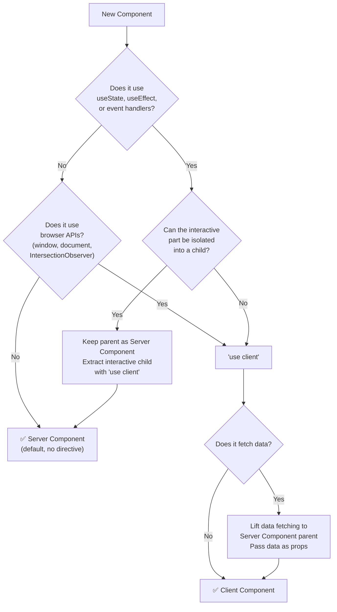
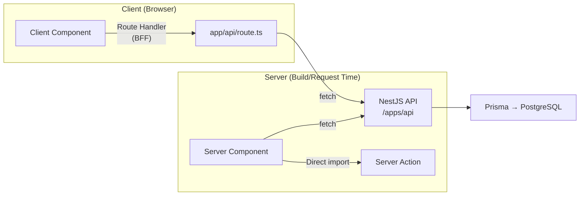
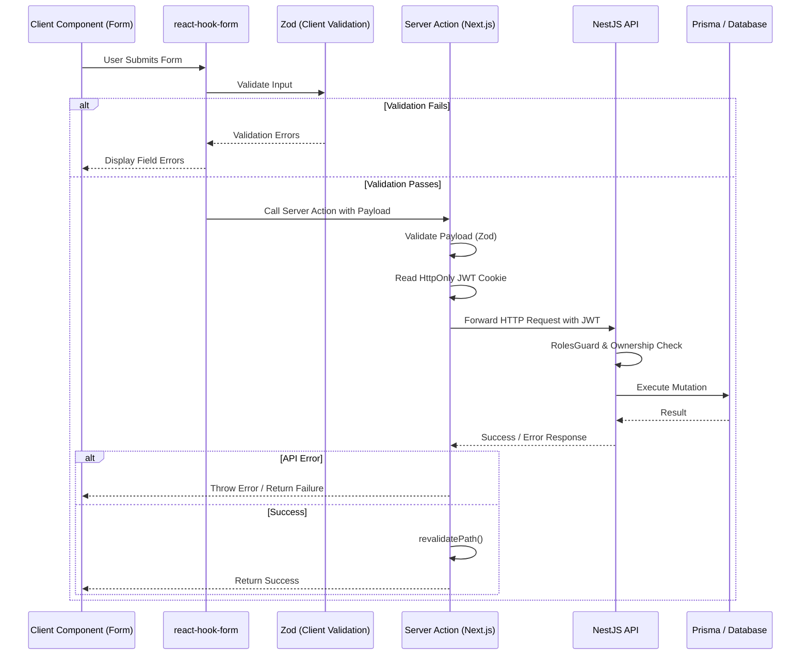

# Frontend Guidelines

> Habib University Preferred Partner Platform — Next.js App Router Conventions

---

## Overview

This document defines the conventions, patterns, and constraints for the `/apps/web` Next.js application. Every frontend contributor must read this before writing code. When in doubt, follow the principle: **Server Components by default, Client Components by necessity.**

---

## `/apps/web` Directory Structure

```
apps/web/
├── src/
│   ├── app/                    # App Router — routes, layouts, pages
│   │   ├── (marketing)/        # Public-facing route group
│   │   │   ├── page.tsx        # Landing page
│   │   │   ├── brands/
│   │   │   │   ├── page.tsx    # Brand catalogue
│   │   │   │   └── [slug]/
│   │   │   │       └── page.tsx # Individual brand page
│   │   │   ├── offers/
│   │   │   └── newsletters/
│   │   ├── (dashboard)/        # Admin dashboard route group
│   │   │   ├── layout.tsx      # Dashboard shell with sidebar
│   │   │   ├── admin/
│   │   │   └── portal/         # Brand portal
│   │   ├── (auth)/             # Auth route group
│   │   │   ├── login/
│   │   │   └── register/
│   │   ├── api/                # Route handlers (BFF pattern)
│   │   ├── layout.tsx          # Root layout
│   │   ├── loading.tsx         # Global loading UI
│   │   ├── error.tsx           # Global error boundary
│   │   ├── not-found.tsx       # 404 page
│   │   └── globals.css         # Tailwind directives + CSS custom properties
│   ├── components/
│   │   ├── ui/                 # shadcn/ui primitives (Button, Dialog, etc.)
│   │   ├── layout/             # Header, Footer, Sidebar, Navigation
│   │   ├── marketing/          # Landing page sections, brand cards
│   │   ├── dashboard/          # Admin tables, forms, charts
│   │   └── shared/             # Cross-cutting components (ErrorBoundary, EmptyState)
│   ├── hooks/                  # Custom React hooks
│   ├── lib/                    # Utility functions, API client, constants
│   ├── styles/                 # Additional CSS files if needed
│   └── types/                  # Frontend-specific TypeScript types
├── public/                     # Static assets (favicons, og-images)
├── next.config.ts
├── tailwind.config.ts
├── tsconfig.json
└── package.json
```

---

## App Router Conventions

### Route Groups

Use parenthesised route groups `(groupName)` to organise routes by concern without affecting the URL structure.

| Group | Purpose | Layout |
|---|---|---|
| `(marketing)` | Public pages — landing, brands, offers, newsletters | Marketing layout with header + footer |
| `(dashboard)` | Admin panel and brand portal | Dashboard layout with sidebar + topbar |
| `(auth)` | Login, register, forgot password | Minimal centered layout |

### File Conventions

| File | Purpose | When to Use |
|---|---|---|
| `page.tsx` | Route UI | Every route segment |
| `layout.tsx` | Shared UI wrapper | Route groups, persistent navigation |
| `loading.tsx` | Suspense fallback | Routes with async data |
| `error.tsx` | Error boundary | Every route group minimum |
| `not-found.tsx` | 404 UI | Root + any custom 404 needs |
| `template.tsx` | Re-mounted layout | When layout must reset state on navigation |

### Naming Rules

- **Files**: `kebab-case` for route segments, `PascalCase` for components.
- **Route params**: `[slug]`, `[id]` — always singular, descriptive.
- **Route handlers**: `route.ts` inside `api/` — REST verbs as named exports.

---

## Server vs Client Components



### Rules

1. **Default to Server Components** — No `"use client"` unless required.
2. **Push `"use client"` to the leaves** — The interactive boundary should be as small as possible.
3. **Never fetch data in Client Components** — Fetch in Server Components or Route Handlers, pass via props.
4. **Third-party libraries** — If a library requires `"use client"` (e.g., Framer Motion, Lenis), wrap it in a thin client component.

---

## Data Fetching Patterns



### Patterns

| Pattern | When to Use | Example |
|---|---|---|
| **Server Component `fetch`** | Page-level data for SSR/SSG | Brand catalogue, partner pages |
| **Server Actions** | Mutations (form submissions, toggles) | Newsletter signup, offer claim |
| **Route Handlers (BFF)** | Client-side data needs, external API proxy | Dashboard real-time updates, search |
| **React `use` + Suspense** | Streaming deferred data | Below-the-fold content, analytics |

### Fetch Configuration

```typescript
// Static data — revalidate every hour
fetch(url, { next: { revalidate: 3600 } });

// Dynamic data — no cache
fetch(url, { cache: 'no-store' });

// Static at build time — cache forever
fetch(url, { cache: 'force-cache' });
```

### Rules

1. **Never call the NestJS API from Client Components directly** — Always go through Route Handlers (BFF pattern).
2. **Colocate data fetching with the component that uses it** — Don't prop-drill from 5 levels up.
3. **Use Suspense boundaries** — Wrap async Server Components in `<Suspense>` with meaningful loading UI.
4. **Error boundaries per data source** — Each independent data fetch should have its own error boundary.

---

## Server Action Architecture

Server Actions serve as the secure bridge between our Next.js frontend and the NestJS backend for all mutations. They act as a secure proxy layer that ensures strict validation before data reaches the API.

### Request Lifecycle



### Layer Responsibilities

- **Client Component**: Renders the UI, captures user input, and provides instant visual feedback.
- **react-hook-form & Zod (Client)**: Prevents unnecessary network requests by catching schema violations immediately in the browser.
- **Server Action**: The secure execution context. Responsible for re-validating the payload (never trust the client), extracting the HTTP-only auth cookie, appending it to the backend request, and triggering Next.js cache revalidations.
- **NestJS API**: The ultimate source of truth. Enforces business logic, RBAC (`RolesGuard`), data ownership, and orchestrates database transactions.
- **Prisma**: Executes safe, parameterized SQL queries.

### Validation Boundaries
Validation happens twice:
1. **Client-side** for instant user feedback.
2. **Server-side (Server Action)** to protect against malicious payloads bypassing the UI. Both use the identical Zod schemas imported from `packages/validators`.

### Optimistic UI
For actions requiring immediate feedback (e.g., toggling an offer status), use React's `useOptimistic` hook. The UI updates instantly, and rolls back if the Server Action returns an error.

### Revalidation
Always call `revalidatePath()` or `revalidateTag()` inside the Server Action upon a successful mutation. This ensures the Next.js router clears its cache and fetches the fresh data on the next render.

### Security Considerations
- Server Actions must never blindly trust user input. Always parse with Zod.
- Server Actions must forward the user's JWT to NestJS to ensure the mutation is executed under the correct identity.
- Never expose sensitive backend error messages or stack traces directly to the client; catch them in the Server Action and return generic, human-readable error messages.

---

## State Management

| State Type | Solution | Example |
|---|---|---|
| **Server state** | Server Components + `fetch` | Brand data, partner lists |
| **URL state** | `useSearchParams`, `usePathname` | Filters, pagination, tabs |
| **Form state** | React Hook Form | Contact form, admin CRUD |
| **UI state (local)** | `useState` | Modal open/close, accordion |
| **UI state (shared)** | React Context (sparingly) | Theme, sidebar collapsed |
| **Complex client state** | Zustand (if needed) | Shopping-cart-like features |

### Rules

1. **No global state library by default** — React Server Components + URL state covers 90% of cases.
2. **URL is the source of truth for filters/pagination** — Never store these in `useState`.
3. **Avoid `useEffect` for data sync** — If you're syncing state in `useEffect`, you're likely doing it wrong. Use Server Components or derived state.

---

## Tailwind CSS Conventions

### Design Tokens

All design tokens live in `tailwind.config.ts`. Never use arbitrary values (`[#1a2b3c]`, `[37px]`) — extend the config instead.

```typescript
// tailwind.config.ts
export default {
  theme: {
    extend: {
      colors: {
        brand: {
          primary: 'hsl(var(--brand-primary))',
          secondary: 'hsl(var(--brand-secondary))',
        },
      },
      fontFamily: {
        display: ['var(--font-display)', 'serif'],
        body: ['var(--font-body)', 'sans-serif'],
      },
      spacing: {
        'section': '6rem',      // 96px — section vertical padding
        'section-lg': '8rem',   // 128px — hero sections
      },
    },
  },
};
```

### Rules

1. **No arbitrary values** — If you need a value not in the scale, add it to the config as a named token.
2. **Responsive is mobile-first** — `text-base md:text-lg lg:text-xl`. Never desktop-first.
3. **Dark mode via `class` strategy** — `dark:bg-neutral-900`. Never media query strategy.
4. **Component classes via `@apply`** — Only in the component's CSS module or `globals.css`, never inline.
5. **No `!important`** — If specificity is a problem, fix the structure.

---

## shadcn/ui Usage

### Installation

Components are installed via the shadcn CLI into `src/components/ui/`. They are **owned code** — modify them freely.

### Rules

1. **Don't wrap shadcn components unnecessarily** — Use them directly. They're already composable.
2. **Extend, don't fork** — Add variants to existing components via `cva` rather than creating parallel components.
3. **Consistent variant naming** — Follow shadcn's convention: `default`, `destructive`, `outline`, `secondary`, `ghost`, `link`.
4. **Radix primitives first** — If shadcn doesn't have a component, check Radix UI before building from scratch.

---

## React Hook Form + Zod

### Pattern

```typescript
// 1. Define schema (shared with backend via packages/types)
const partnerFormSchema = z.object({
  name: z.string().min(2, 'Name must be at least 2 characters'),
  email: z.string().email('Invalid email address'),
  website: z.string().url().optional(),
});

type PartnerFormData = z.infer<typeof partnerFormSchema>;

// 2. Use in component
const form = useForm<PartnerFormData>({
  resolver: zodResolver(partnerFormSchema),
  defaultValues: { name: '', email: '', website: '' },
});
```

### Rules

1. **Schemas in `packages/types`** — Share validation between frontend and backend.
2. **`zodResolver` always** — Never use manual validation with React Hook Form.
3. **Server-side validation mirrors client-side** — The Zod schema is the single source of truth.
4. **Error messages are human-readable** — "This field is required" → "Please enter the partner's name."
5. **Form state never in URL** — Forms use React Hook Form state, not search params.

---

## Error Handling

| Error Type | Handling | UI |
|---|---|---|
| **Route-level** | `error.tsx` boundary | Full-page error with retry action |
| **Component-level** | `ErrorBoundary` wrapper | Inline error message with fallback UI |
| **Form validation** | React Hook Form + Zod | Inline field-level error messages |
| **API errors** | Try/catch in Server Actions / Route Handlers | Toast notification or inline message |
| **404** | `not-found.tsx` or `notFound()` | Custom 404 page with navigation |

### Rules

1. **Never swallow errors silently** — Every `catch` must log and surface the error.
2. **Error messages for users, stack traces for logs** — Users see "Unable to load partners." Logs see the full error.
3. **Retry is always an option** — Every error state must have a clear retry path.
4. **Graceful degradation** — If a non-critical section fails, the rest of the page still renders.

---

## Image Optimisation

1. **Use `next/image` exclusively** — Never use raw `` tags.
2. **Always set `width` and `height`** — Prevent layout shift (CLS).
3. **Use `priority` for LCP images** — Hero images, above-the-fold brand logos.
4. **Remote images in `next.config.ts`** — Whitelist S3/CloudFront domains in `images.remotePatterns`.
5. **Format: WebP/AVIF** — Next.js auto-serves modern formats. Ensure source images are high quality.
6. **Blur placeholders** — Use `placeholder="blur"` with `blurDataURL` for local images.

---

## SEO & Metadata API

### Pattern

```typescript
// Static metadata
export const metadata: Metadata = {
  title: 'Brand Partners | HU Preferred Partner',
  description: 'Explore exclusive brand partnerships with Habib University.',
  openGraph: {
    title: 'Brand Partners | HU Preferred Partner',
    description: 'Explore exclusive brand partnerships with Habib University.',
    images: ['/og/brands.png'],
  },
};

// Dynamic metadata
export async function generateMetadata({ params }): Promise<Metadata> {
  const brand = await getBrand(params.slug);
  return {
    title: `${brand.name} | HU Preferred Partner`,
    description: brand.description,
    openGraph: { images: [brand.ogImage] },
  };
}
```

### Checklist

- [ ] Every page has a unique `title` and `description`
- [ ] Dynamic pages use `generateMetadata`
- [ ] OpenGraph images exist for all shareable pages
- [ ] `robots.txt` and `sitemap.xml` are generated via Next.js conventions
- [ ] Structured data (JSON-LD) for brand pages and offers
- [ ] Canonical URLs set for all pages
- [ ] `<h1>` — one per page, always

---

## Performance Targets

| Metric | Target | Measurement |
|---|---|---|
| LCP | < 2.5s | Lighthouse lab + field data |
| FID / INP | < 200ms | Web Vitals |
| CLS | < 0.1 | Lighthouse |
| Bundle size (first load JS) | < 100kB | `next build` output |
| Time to Interactive | < 3.5s | Lighthouse |

> See [Performance.md](./Performance.md) for detailed optimisation strategies.

---

## Cross-References

- [Design-Principles.md](./Design-Principles.md) — Anti AI-Slop philosophy and visual standards
- [Animation-Guidelines.md](./Animation-Guidelines.md) — Framer Motion & GSAP implementation patterns
- [Tech-Stack.md](./Tech-Stack.md) — Version constraints and upgrade strategy
- [Performance.md](./Performance.md) — Lighthouse budgets, bundle analysis, caching

---

*Last updated: 2026-07-01*
