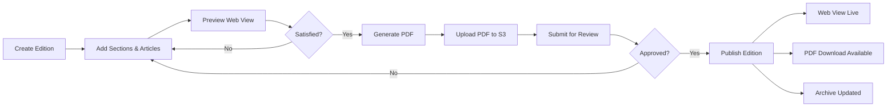

# Newsletter System

> Architecture for the Habib University Preferred Partner Newsletter Platform

## 1. Overview

The Newsletter System enables the Habib University Preferred Partner team to create, publish, and distribute branded newsletters that highlight new partnerships, active offers, and campus announcements. Newsletters are:

- **Authored** in the admin panel using the same Tiptap rich-text editor as other CMS content.
- **Rendered** as both a responsive **web page** and a downloadable **PDF**.
- **Archived** in a searchable, browsable catalogue for historical reference.

The system is designed to operate entirely within the monorepo — PDF generation runs server-side on the NestJS API, and the web view is served by the Next.js frontend.

---

## 2. Newsletter Data Model

### 2.1 Core Entities

| Entity             | Description                                                |
| ------------------ | ---------------------------------------------------------- |
| `Newsletter`       | The overarching newsletter series (e.g., "HU Partner Digest") |
| `Edition`          | A single issue of a newsletter (e.g., "Vol. 3, Issue 7")   |
| `Section`          | A thematic grouping within an edition (e.g., "New Partners") |
| `Article`          | An individual content piece within a section                |

### 2.2 Prisma Schema (Conceptual)

```prisma
model Newsletter {
  id          String    @id @default(uuid())
  name        String    @unique
  description String?
  editions    Edition[]
  createdAt   DateTime  @default(now())
  updatedAt   DateTime  @updatedAt
}

model Edition {
  id            String       @id @default(uuid())
  newsletterId  String
  newsletter    Newsletter   @relation(fields: [newsletterId], references: [id])
  title         String
  volumeNumber  Int
  issueNumber   Int
  status        EditionStatus @default(DRAFT)
  publishedAt   DateTime?
  pdfUrl        String?
  templateId    String?
  template      Template?    @relation(fields: [templateId], references: [id])
  sections      Section[]
  seoMeta       Json?
  createdAt     DateTime     @default(now())
  updatedAt     DateTime     @updatedAt

  @@unique([newsletterId, volumeNumber, issueNumber])
}

model Section {
  id         String   @id @default(uuid())
  editionId  String
  edition    Edition  @relation(fields: [editionId], references: [id])
  title      String
  sortOrder  Int      @default(0)
  articles   Article[]
}

model Article {
  id         String   @id @default(uuid())
  sectionId  String
  section    Section  @relation(fields: [sectionId], references: [id])
  title      String
  body       String   // Sanitised HTML
  coverImage String?
  authorId   String?
  sortOrder  Int      @default(0)
  createdAt  DateTime @default(now())
  updatedAt  DateTime @updatedAt
}

enum EditionStatus {
  DRAFT
  IN_REVIEW
  APPROVED
  PUBLISHED
  ARCHIVED
}
```

### 2.3 Relationships

```
Newsletter 1 ──── * Edition
Edition    1 ──── * Section
Section    1 ──── * Article
Edition    * ──── 1 Template
```

---

## 3. PDF Generation

### 3.1 Approach

PDF generation uses **Puppeteer** running in a headless Chromium instance on the NestJS API server.

| Step | Action                                                   |
| ---- | -------------------------------------------------------- |
| 1    | API receives a `POST /newsletters/:editionId/generate-pdf` request |
| 2    | NestJS renders the edition data into an HTML template using the assigned `Template` |
| 3    | Puppeteer launches headless Chromium and loads the rendered HTML |
| 4    | Puppeteer generates a PDF with print-optimised CSS (`@media print`) |
| 5    | The PDF buffer is uploaded to S3 under `newsletters/<editionId>.pdf` |
| 6    | The `Edition.pdfUrl` field is updated with the CloudFront URL |

### 3.2 Configuration

```typescript
const pdfOptions: puppeteer.PDFOptions = {
  format: 'A4',
  printBackground: true,
  margin: { top: '20mm', bottom: '20mm', left: '15mm', right: '15mm' },
  displayHeaderFooter: true,
  headerTemplate: '<div style="font-size:8px;text-align:center;width:100%;">Habib University Preferred Partner</div>',
  footerTemplate: '<div style="font-size:8px;text-align:center;width:100%;"><span class="pageNumber"></span> / <span class="totalPages"></span></div>',
};
```

### 3.3 Infrastructure Considerations

- **Memory**: Puppeteer requires ~300 MB RAM per render. The ECS task definition allocates a dedicated container with 512 MB for PDF jobs.
- **Concurrency**: A Bull queue (`@nestjs/bull`) serialises PDF generation requests to prevent memory spikes.
- **Timeout**: A 60-second hard timeout kills stalled renders.

---

## 4. Web View

Each published edition is accessible at `/newsletters/:slug` on the public Next.js frontend.

### 4.1 Features

- **Responsive layout** — optimised for desktop (two-column) and mobile (single-column).
- **Anchor navigation** — a floating table-of-contents sidebar links to each section.
- **Share controls** — copy link, share to LinkedIn/Twitter.
- **PDF download** — prominent button linking to the CloudFront-hosted PDF.
- **Print stylesheet** — `@media print` rules mirror the PDF layout for browser printing.

### 4.2 Data Fetching

The page uses Next.js **ISR (Incremental Static Regeneration)** with a 60-second revalidation window:

```typescript
export async function generateStaticParams() {
  const editions = await api.newsletters.listPublished();
  return editions.map((e) => ({ slug: e.slug }));
}

export const revalidate = 60;
```

---

## 5. Archive

### 5.1 Archive Page

Located at `/newsletters`, the archive page displays a paginated, searchable list of all published editions.

| Feature          | Implementation                                      |
| ---------------- | --------------------------------------------------- |
| Search           | Full-text search on edition title and article body   |
| Filters          | By year, volume, newsletter series                   |
| Sort             | Most recent first (default), oldest first            |
| Pagination       | Cursor-based, 12 editions per page                   |
| Thumbnails       | Auto-generated cover image from first article image  |

### 5.2 SEO

Each archived edition generates its own `<title>`, `<meta description>`, and Open Graph tags from the `seoMeta` JSON field on the `Edition` model, ensuring discoverability via search engines.

---

## 6. Templates

### 6.1 Template System

Templates define the visual structure and branding of newsletter editions. Each template is stored in the database and consists of:

| Field            | Type     | Description                                     |
| ---------------- | -------- | ----------------------------------------------- |
| `id`             | UUID     | Primary key                                     |
| `name`           | String   | Human-readable label (e.g., "Quarterly Report") |
| `htmlLayout`     | Text     | Handlebars-based HTML layout                    |
| `cssStyles`      | Text     | Scoped CSS for the template                     |
| `isDefault`      | Boolean  | Used when no template is explicitly selected     |
| `previewImage`   | String   | S3 URL of a thumbnail preview                   |

### 6.2 Template Variables

Templates use Handlebars syntax to inject dynamic data:

```handlebars
<header class="nl-header">
  
  <h1>{{edition.title}}</h1>
  <p class="nl-subtitle">Volume {{edition.volumeNumber}}, Issue {{edition.issueNumber}}</p>
</header>

{{#each sections}}
<section class="nl-section">
  <h2>{{this.title}}</h2>
  {{#each this.articles}}
  <article class="nl-article">
    <h3>{{this.title}}</h3>
    <div class="nl-body">{{{this.body}}}</div>
  </article>
  {{/each}}
</section>
{{/each}}
```

### 6.3 Brand Consistency

- All templates inherit from a **base layout** that includes the university logo, colour palette (`#003366`, `#C8102E`, `#FFFFFF`), and typography (Inter / Noto Sans).
- Template changes go through the same approval workflow as other CMS content to prevent accidental brand violations.

---

## 7. Creation Workflow

### 7.1 Step-by-Step

1. **Create Edition** — Admin selects a newsletter series, enters volume/issue numbers, and picks a template.
2. **Add Sections** — Admin adds thematic sections and reorders via drag-and-drop.
3. **Add Articles** — Within each section, admin composes articles using the Tiptap editor.
4. **Preview** — Admin previews the web view in a modal overlay.
5. **Generate PDF** — Admin triggers PDF generation; the system queues the job and notifies on completion.
6. **Review** — A reviewer approves the edition or requests changes.
7. **Publish** — The edition status transitions to `PUBLISHED`, making it available on the public site and archive.

### 7.2 Pipeline Diagram



---

## 8. Distribution

### 8.1 Download Links

- Published PDF URLs follow the pattern: `https://cdn.hupartners.habib.edu.pk/newsletters/<edition-id>.pdf`
- Short URLs (e.g., `hu.partners/nl/2026-q2`) redirect to the web view for easy sharing.

### 8.2 Email Integration Hooks

The system exposes webhook-style hooks that external email services (e.g., SendGrid, AWS SES) can consume:

| Event                  | Payload                                  | Use Case                            |
| ---------------------- | ---------------------------------------- | ----------------------------------- |
| `edition.published`    | Edition metadata, PDF URL, web URL       | Trigger email campaign to subscribers |
| `edition.updated`      | Edition metadata, diff summary           | Notify stakeholders of corrections  |

Integration is handled via a `WebhookDispatcher` service in NestJS that `POST`s JSON payloads to configured endpoint URLs stored in the `IntegrationConfig` table.

### 8.3 Subscriber Management

Newsletter subscribers are tracked in a `Subscriber` table:

| Field           | Type     | Description                         |
| --------------- | -------- | ----------------------------------- |
| `id`            | UUID     | Primary key                         |
| `email`         | String   | Subscriber email (unique)           |
| `name`          | String?  | Optional display name               |
| `subscribedAt`  | DateTime | Subscription timestamp              |
| `isActive`      | Boolean  | Opt-out flag                        |
| `preferences`   | Json     | Category preferences                |

---

## 9. Technical Stack Summary

| Concern             | Technology                         |
| -------------------- | ---------------------------------- |
| Rich text editing    | Tiptap (ProseMirror)               |
| PDF generation       | Puppeteer (headless Chromium)      |
| Job queue            | Bull + Redis (`@nestjs/bull`)      |
| Template engine      | Handlebars                         |
| File storage         | AWS S3                             |
| CDN                  | AWS CloudFront                     |
| Web rendering        | Next.js (ISR)                      |
| Database             | PostgreSQL via Prisma              |
| Email hooks          | Webhook dispatcher → SendGrid/SES |

---

## 10. Future Considerations

- **Automated content ingestion** — pull partner offers directly into newsletter articles.
- **Analytics** — track PDF downloads and web view engagement per edition.
- **Personalised editions** — generate subscriber-specific content based on preferences.
- **RSS feed** — expose published editions as an RSS/Atom feed for aggregators.
