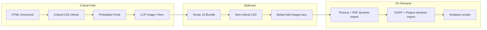

# Performance Guidelines

> **Performance First** is a core philosophy of the HU Preferred Partner platform.
> Every byte, every render, and every network request must justify its existence.

---

## Core Web Vitals Targets

All pages must meet or exceed these thresholds at the **75th percentile** of real user data:

| Metric | Target | Hard Limit | Description |
|---|---|---|---|
| **LCP** (Largest Contentful Paint) | < 2.0s | < 2.5s | Perceived load speed |
| **FID** (First Input Delay) | < 50ms | < 100ms | Input responsiveness (legacy) |
| **INP** (Interaction to Next Paint) | < 150ms | < 200ms | Overall responsiveness |
| **CLS** (Cumulative Layout Shift) | < 0.05 | < 0.1 | Visual stability |
| **TTFB** (Time to First Byte) | < 400ms | < 600ms | Server response time |
| **FCP** (First Contentful Paint) | < 1.2s | < 1.8s | First visual response |

### Page-Specific LCP Targets

| Page | LCP Element | Target |
|---|---|---|
| Landing Page | Hero image / 3D canvas | < 2.5s |
| Brand Catalogue | First visible brand card | < 2.0s |
| Partner Detail | Partner hero image | < 2.0s |
| Admin Dashboard | Dashboard shell / first widget | < 1.5s |
| Newsletter Archive | Newsletter list | < 1.8s |

---

## Bundle Size Budgets

### JavaScript Budgets

| Bundle | Max Size (gzipped) | Notes |
|---|---|---|
| **Initial JS (First Load)** | 120 KB | Shared framework + layout |
| **Per-route JS** | 50 KB | Individual page bundles |
| **Total JS (all routes)** | 400 KB | Entire application |
| **Single third-party lib** | 40 KB | Any individual dependency |

### Monitoring

```bash
# Analyze bundle during build
ANALYZE=true next build

# Check individual route sizes
next build && cat .next/routes-manifest.json
```

Bundle size is checked in CI. Any PR that increases the initial JS bundle by more than **5 KB** triggers a warning; more than **15 KB** blocks the merge.

### Critical Dependencies — Size Constraints

| Package | Budget (gzipped) | Strategy |
|---|---|---|
| React + React DOM | ~42 KB | Framework cost (unavoidable) |
| Framer Motion | ~30 KB | Tree-shake, import only used features |
| Three.js | ~45 KB | Dynamic import, load only on 3D pages |
| GSAP | ~25 KB | Dynamic import, register only used plugins |
| React Three Fiber | ~20 KB | Dynamic import alongside Three.js |
| Zod | ~12 KB | Shared validation, no duplication |
| Lenis | ~5 KB | Loaded globally but deferred |

---

## Image Optimization

### Format Priority

1. **AVIF** — Primary format for all raster images (best compression)
2. **WebP** — Fallback where AVIF is not supported
3. **PNG** — Only for images requiring transparency where AVIF/WebP quality is insufficient
4. **SVG** — Logos, icons, and geometric illustrations

### Next.js Image Rules

```tsx
// ✅ Always use next/image
import Image from 'next/image';

<Image
  src="/partners/acme-hero.jpg"
  alt="Acme Corporation campus partnership event"
  width={1200}
  height={630}
  priority               // Only for above-the-fold LCP images
  sizes="(max-width: 768px) 100vw, (max-width: 1200px) 50vw, 33vw"
  placeholder="blur"
  blurDataURL={blurHash}  // Generate at build time
/>
```

### Size Limits

| Image Type | Max File Size | Max Dimensions |
|---|---|---|
| Hero / Banner | 200 KB | 1920 × 1080 |
| Brand Logo | 30 KB | 400 × 400 |
| Card Thumbnail | 50 KB | 600 × 400 |
| Avatar | 15 KB | 200 × 200 |
| Newsletter Cover | 100 KB | 800 × 1100 |

### Delivery

- All images served via **CloudFront CDN** with aggressive caching.
- S3 stores originals; CloudFront serves optimized variants via Next.js image loader or a Lambda@Edge transform.
- **Lazy loading** is the default. Only above-the-fold LCP images use `priority`.

---

## Font Loading

### Strategy: `font-display: swap` + Preload

```html
<!-- Preload the primary font in the root layout -->
<link
  rel="preload"
  href="/fonts/brand-primary.woff2"
  as="font"
  type="font/woff2"
  crossorigin="anonymous"
/>
```

### Rules

1. **Maximum 2 font families** loaded globally (brand primary + monospace for code/admin).
2. **Subset fonts** to Latin characters unless Urdu/Arabic glyphs are required.
3. **Self-host all fonts** — no external Google Fonts requests at runtime.
4. **WOFF2 only** — no WOFF, TTF, or EOT files.
5. **Total font payload** must not exceed **80 KB** (all weights and styles combined).
6. Use `next/font` for automatic optimization and zero-layout-shift loading.

```typescript
import { Inter } from 'next/font/google';

const inter = Inter({
  subsets: ['latin'],
  display: 'swap',
  variable: '--font-primary',
});
```

---

## Code Splitting

### Route-Level Splitting (Automatic)

Next.js App Router handles route-level code splitting automatically. Each route segment in `/app` produces its own bundle.

### Component-Level Splitting (Manual)

Heavy components must be dynamically imported:

```typescript
// ✅ Three.js scene — only loaded when route renders
const HeroScene = dynamic(() => import('@/components/hero-scene'), {
  ssr: false,
  loading: () => <HeroFallbackImage />,
});

// ✅ Admin-only chart library
const AnalyticsChart = dynamic(() => import('@/components/analytics-chart'), {
  loading: () => <ChartSkeleton />,
});
```

### Rules

1. **Three.js, React Three Fiber, and GSAP** are never in the initial bundle. Always dynamic.
2. **Admin dashboard** components are isolated to `/app/admin/` — they must not leak into public bundles.
3. **Brand portal** components are isolated to `/app/portal/`.
4. **Shared UI** (shadcn/ui) is in the common bundle but tree-shaken to used components only.

---

## Caching Strategy

### Caching Layers Diagram

```mermaid
flowchart TD
    U[User Browser] --> CDN[CloudFront CDN]
    CDN --> |Cache HIT| U
    CDN --> |Cache MISS| NEXT[Next.js Server]
    NEXT --> |ISR Cache| SC[Static Cache / .next/cache]
    NEXT --> |SWR / fetch cache| RC[React Server Cache]
    NEXT --> |API call| API[NestJS API]
    API --> |Query cache| QC[Prisma Query Engine Cache]
    QC --> |Cache MISS| DB[(PostgreSQL RDS)]
    
    subgraph Browser Cache
        BH[HTML: no-store or short TTL]
        BJ[JS/CSS: immutable, 1 year]
        BI[Images: 30 days]
        BF[Fonts: 1 year, immutable]
    end
    
    U --> Browser Cache
```

### Cache TTLs

| Asset Type | CDN TTL | Browser TTL | Invalidation |
|---|---|---|---|
| Static assets (JS/CSS) | 1 year | 1 year (immutable) | Content-hashed filenames |
| Images | 30 days | 30 days | Version query strings |
| Fonts | 1 year | 1 year (immutable) | Content-hashed filenames |
| HTML (ISR) | 60s (stale-while-revalidate) | no-store | On-demand revalidation |
| API responses (public) | 60s | 60s (SWR) | Cache tags |
| API responses (auth'd) | No CDN cache | no-store | N/A |

### ISR & On-Demand Revalidation

```typescript
// Brand catalogue — revalidate every 5 minutes
export const revalidate = 300;

// On-demand revalidation when admin updates a partner
// In the NestJS API webhook handler:
await fetch(`${NEXT_URL}/api/revalidate?tag=partners`, {
  headers: { 'x-revalidation-secret': process.env.REVALIDATION_SECRET },
});
```

---

## 3D Performance Budgets

Three.js / React Three Fiber scenes have dedicated performance constraints:

| Metric | Budget | Measured By |
|---|---|---|
| **Triangle count** (per scene) | < 100K | Three.js renderer info |
| **Draw calls** (per frame) | < 50 | Three.js renderer info |
| **Texture memory** | < 50 MB | GPU memory monitoring |
| **Target FPS** | 60 fps desktop / 30 fps mobile | `Stats.js` or `r3f-perf` |
| **Canvas resolution** | Max 1x DPR on mobile | `renderer.setPixelRatio()` |
| **Load time** (3D assets) | < 3s on 4G | Network waterfall |

### Rules

1. Use **glTF/GLB** format exclusively. No FBX or OBJ.
2. **Draco compression** for all geometry.
3. **Texture atlasing** — minimize individual texture loads.
4. Implement **LOD (Level of Detail)** for complex models.
5. **Dispose resources** on unmount — geometries, materials, textures.
6. **Suspend rendering** when the canvas is off-screen (Intersection Observer).

> Cross-reference: [ThreeJS-Guidelines.md](./ThreeJS-Guidelines.md) for full implementation details.

---

## Animation Performance Rules

| Rule | Enforcement |
|---|---|
| Animate only `transform` and `opacity` | Lint rule + code review |
| No layout-triggering properties in animations | Prohibited: `width`, `height`, `top`, `left`, `margin`, `padding` |
| `will-change` applied sparingly | Only on elements about to animate; remove after |
| Framer Motion `layout` animations | Limited to small DOM regions, never on full-page layouts |
| GSAP ScrollTrigger | Batch callbacks, debounce scroll handlers |
| Lenis smooth scroll | Disabled on low-power devices and reduced-motion preference |
| CSS `contain: layout style paint` | Applied to animation containers for isolation |

> Cross-reference: [Animation-Guidelines.md](./Animation-Guidelines.md) for motion design guidelines.

---

## Server Performance

### API Response Time Targets

| Endpoint Type | P50 Target | P99 Hard Limit |
|---|---|---|
| Public read (catalogue, partner) | < 100ms | < 300ms |
| Authenticated read (admin, portal) | < 150ms | < 400ms |
| Write operations (CMS updates) | < 300ms | < 800ms |
| File upload (pre-signed URL gen) | < 200ms | < 500ms |
| Search / filter queries | < 200ms | < 500ms |

### Database Query Limits

1. **No query may exceed 100ms** at the P95. Queries exceeding this are flagged for optimization.
2. **N+1 queries are forbidden.** Use Prisma's `include` and `select` to fetch related data in one query.
3. **Maximum 5 queries per API request.** If more are needed, restructure the data model or use a materialized view.
4. **Pagination is mandatory** for all list endpoints. Default page size: 20, maximum: 100.
5. **Database indexes** must exist for all columns used in `WHERE`, `ORDER BY`, and `JOIN` clauses.

```typescript
// ✅ Efficient: Single query with includes
const partners = await prisma.partner.findMany({
  take: 20,
  skip: page * 20,
  include: { offers: { where: { active: true } }, brand: true },
  orderBy: { createdAt: 'desc' },
});

// ❌ N+1: Separate queries in a loop
const partners = await prisma.partner.findMany();
for (const p of partners) {
  p.offers = await prisma.offer.findMany({ where: { partnerId: p.id } }); // BAD
}
```

---

## Asset Loading Pipeline



---

## Monitoring & Enforcement

### CI Pipeline

| Check | Tool | Threshold | Blocking? |
|---|---|---|---|
| Lighthouse Performance Score | Lighthouse CI | ≥ 90 | Yes |
| Bundle Size | `next build` + `@next/bundle-analyzer` | See budgets above | Yes (on increase > 15 KB) |
| Core Web Vitals (lab) | Lighthouse CI | See CWV targets | Yes |
| Image sizes | Custom script | See image limits | Yes |

### Production Monitoring

| Metric | Tool | Alert Threshold |
|---|---|---|
| Core Web Vitals (field) | `web-vitals` library → analytics | P75 exceeds targets |
| Server response times | CloudWatch (ECS) | P99 > hard limits |
| Database query duration | Prisma Metrics / CloudWatch (RDS) | P95 > 100ms |
| Error rates | CloudWatch Alarms | > 1% of requests |
| CDN cache hit ratio | CloudFront metrics | < 85% |

### `web-vitals` Integration

```typescript
// app/layout.tsx — report CWV to analytics
import { onCLS, onFID, onLCP, onINP, onTTFB } from 'web-vitals';

function reportMetric(metric: Metric) {
  // Send to your analytics endpoint
  fetch('/api/analytics/vitals', {
    method: 'POST',
    body: JSON.stringify(metric),
    headers: { 'Content-Type': 'application/json' },
  });
}

onCLS(reportMetric);
onFID(reportMetric);
onLCP(reportMetric);
onINP(reportMetric);
onTTFB(reportMetric);
```

---

## Performance Review Checklist

Before shipping any feature:

- [ ] Core Web Vitals pass in Lighthouse (Performance ≥ 90)
- [ ] Bundle size within budget (check `next build` output)
- [ ] Images optimized (AVIF/WebP, correct sizes, lazy loaded)
- [ ] Fonts self-hosted, subset, WOFF2 only
- [ ] Heavy libraries dynamically imported (Three.js, GSAP)
- [ ] No N+1 database queries
- [ ] API response times within targets
- [ ] 3D scenes within triangle/draw-call budgets
- [ ] Animations use only `transform`/`opacity`
- [ ] Caching headers correctly set for asset type

---

> **Cross-references:**
> - [Frontend-Guidelines.md](./Frontend-Guidelines.md) — Component architecture and rendering strategy
> - [Animation-Guidelines.md](./Animation-Guidelines.md) — Motion performance and reduced-motion
> - [ThreeJS-Guidelines.md](./ThreeJS-Guidelines.md) — 3D asset optimization and rendering budgets
