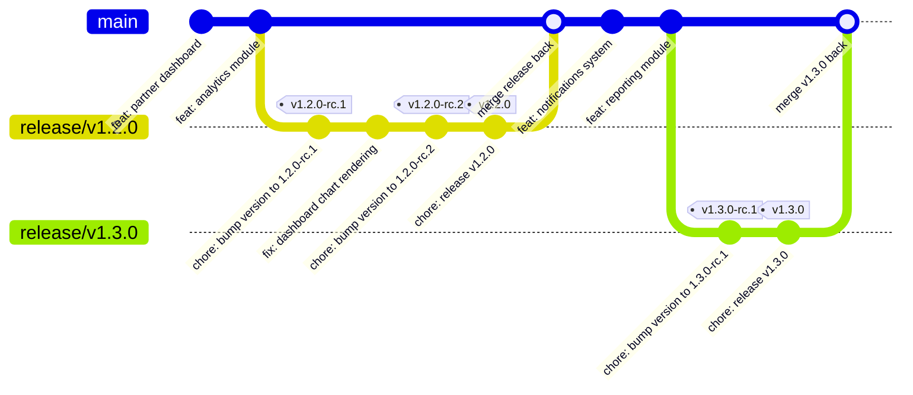
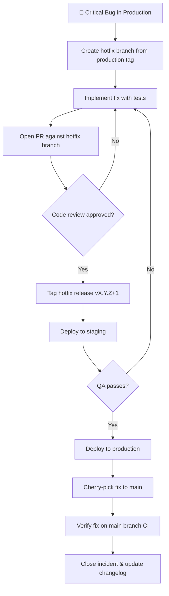

# Release Process

> Release management guidelines for the Habib University Preferred Partner platform.

---

## Table of Contents

- [Semantic Versioning](#semantic-versioning)
- [Release Workflow](#release-workflow)
- [Release Branching Strategy](#release-branching-strategy)
- [Changelog Generation](#changelog-generation)
- [Release Branches](#release-branches)
- [Hotfix Process](#hotfix-process)
- [Rollback Procedures](#rollback-procedures)
- [Feature Flags](#feature-flags)
- [Release Checklist](#release-checklist)

---

## Semantic Versioning

All releases follow [Semantic Versioning 2.0.0](https://semver.org/) with the format **MAJOR.MINOR.PATCH**.

| Component | Increment When | Example |
| --------- | -------------------------------------------------- | --------------- |
| **MAJOR** | Breaking API changes, incompatible schema changes | `1.0.0 → 2.0.0` |
| **MINOR** | New features added in a backward-compatible manner | `1.0.0 → 1.1.0` |
| **PATCH** | Backward-compatible bug fixes and security patches | `1.1.0 → 1.1.1` |

### Pre-release Identifiers

- **Release Candidate**: `v1.2.0-rc.1`, `v1.2.0-rc.2`
- **Beta**: `v1.2.0-beta.1` (internal testing only)
- **Alpha**: `v1.2.0-alpha.1` (development builds)

---

## Release Workflow

Every release follows a structured five-phase workflow to ensure quality and stability.

| Phase            | Duration   | Description                                                      |
| ---------------- | ---------- | ---------------------------------------------------------------- |
| **Feature Freeze** | Day 0      | No new features merged into `main`; only bug fixes allowed.     |
| **Release Candidate** | Day 1–2 | Branch `release/vX.Y.Z` from `main`. Tag as `-rc.1`.           |
| **Testing**       | Day 2–4   | QA, regression testing, UAT on staging environment.              |
| **Release**       | Day 5     | Tag final version, generate changelog, create GitHub Release.    |
| **Deploy**        | Day 5     | Deploy to production via CI/CD pipeline.                         |

### Workflow Steps

1. **Feature Freeze** — Announce freeze in `#engineering` channel. All pending PRs must be merged or deferred.
2. **Branch Creation** — Create `release/vX.Y.Z` from `main`. No direct commits; all fixes go through PRs.
3. **RC Tagging** — Tag the release branch as `vX.Y.Z-rc.1`. Deploy to staging.
4. **QA & Regression Testing** — Execute the full test suite. Perform manual testing on critical user flows.
5. **Bug Fixes** — Fix any issues found during QA directly on the release branch via PRs.
6. **Final Tag** — Once QA passes, tag the final release `vX.Y.Z`.
7. **Changelog & GitHub Release** — Auto-generate changelog. Create a GitHub Release with release notes.
8. **Production Deploy** — Trigger the production deployment pipeline.
9. **Merge Back** — Merge the release branch back into `main` to capture any fixes.

---

## Release Branching Strategy



---

## Changelog Generation

Changelogs are automatically generated from **Conventional Commits** using [changesets](https://github.com/changesets/changesets).

### Commit Message Format

```
<type>(<scope>): <description>

[optional body]

[optional footer(s)]
```

| Type       | Description                        | Changelog Section |
| ---------- | ---------------------------------- | ----------------- |
| `feat`     | New feature                        | Features          |
| `fix`      | Bug fix                            | Bug Fixes         |
| `perf`     | Performance improvement            | Performance       |
| `docs`     | Documentation changes              | Documentation     |
| `refactor` | Code refactoring                   | Code Refactoring  |
| `chore`    | Maintenance tasks                  | (hidden)          |
| `ci`       | CI/CD configuration changes        | (hidden)          |
| `test`     | Adding or modifying tests          | (hidden)          |

### Changeset Workflow

1. Run `npx changeset` when making a notable change.
2. Select the affected packages (`@hu/web`, `@hu/api`, etc.).
3. Choose the semver bump level (major, minor, patch).
4. Write a human-readable summary of the change.
5. Commit the generated `.changeset/*.md` file with your PR.
6. During release, `npx changeset version` consolidates all changesets into `CHANGELOG.md` files.

---

## Release Branches

| Branch Pattern      | Source   | Purpose                              | Lifetime       |
| -------------------- | -------- | ------------------------------------ | -------------- |
| `release/vX.Y.Z`    | `main`   | Stabilize upcoming release           | Until merged   |
| `hotfix/vX.Y.Z`     | Tag      | Emergency fix for production         | Until merged   |

### Branch Protection Rules

- Release branches require **1 approval** before merging.
- All CI checks must pass (lint, type-check, test, build).
- Force pushes are **disabled** on release branches.
- Branch is deleted after merge.

---

## Hotfix Process

Hotfixes address critical production issues that cannot wait for the next scheduled release.

### Hotfix Workflow Diagram



### Hotfix Steps

1. **Identify** — Confirm the issue is critical (P0/P1 severity) and cannot wait.
2. **Branch** — Create `hotfix/vX.Y.Z` from the current production Git tag.
3. **Fix** — Implement the minimal fix. Include regression tests.
4. **Review** — Open a PR. Require expedited review (1 reviewer minimum).
5. **Tag** — Tag the hotfix as `vX.Y.(Z+1)`.
6. **Staging Deploy** — Deploy to staging for verification.
7. **Production Deploy** — Deploy to production after QA sign-off.
8. **Cherry-pick** — Cherry-pick the commit(s) onto `main` to keep branches in sync.
9. **Post-mortem** — Document the root cause and preventive measures.

---

## Rollback Procedures

### Application Rollback (ECS)

1. Identify the last stable ECS task definition revision in the AWS Console or via CLI.
2. Update the ECS service to use the previous task definition:
   ```bash
   aws ecs update-service \
     --cluster hu-partner-cluster \
     --service hu-partner-api \
     --task-definition hu-partner-api:<previous-revision>
   ```
3. Monitor deployment status and health checks.
4. Verify application functionality after rollback.

### Database Rollback Considerations

| Scenario                     | Strategy                                                        |
| ---------------------------- | --------------------------------------------------------------- |
| Additive migration (new column) | Generally safe to rollback app; column remains unused.        |
| Destructive migration (drop column) | Must restore from backup or apply reverse migration.      |
| Data transformation          | Requires a reverse migration script. Test in staging first.     |

> **⚠️ Warning**: Always take a database snapshot before running destructive migrations in production.

---

## Feature Flags

Feature flags enable gradual rollout and environment-specific control of new features.

### Flag Types

| Type              | Description                                      | Example                       |
| ----------------- | ------------------------------------------------ | ----------------------------- |
| **Release Flag**  | Gate unreleased features                         | `ENABLE_NEW_DASHBOARD`        |
| **Ops Flag**      | Control operational behavior                     | `ENABLE_RATE_LIMITING`        |
| **Experiment**    | A/B testing and gradual rollout                  | `EXPERIMENT_ONBOARDING_V2`    |
| **Permission**    | Role-based feature access                        | `ADMIN_ADVANCED_ANALYTICS`    |

### Gradual Rollout Strategy

1. **Internal** — Enable for HU staff accounts only.
2. **Beta** — Enable for 10% of users (canary).
3. **Wider rollout** — Increase to 50%, then 100%.
4. **Cleanup** — Remove the flag and dead code within 2 sprints of full rollout.

### Environment-Specific Flags

| Environment   | Flag Default | Override Allowed |
| ------------- | ------------ | ---------------- |
| Development   | `true`       | Yes              |
| Staging       | `true`       | Yes              |
| Production    | `false`      | Yes (via config) |

### Flag Cleanup Process

- Flags older than **30 days after full rollout** must be removed.
- Create a cleanup ticket when the flag is first enabled at 100%.
- Remove the flag, conditional logic, and any fallback code paths.
- Verify removal does not break existing tests.

---

## Release Checklist

### Pre-Release Checklist

- [ ] All planned features are merged into `main`
- [ ] Feature freeze announced in `#engineering`
- [ ] Release branch `release/vX.Y.Z` created from `main`
- [ ] Version bumped in `package.json` files
- [ ] All CI checks pass (lint, type-check, unit tests, integration tests)
- [ ] E2E tests pass on staging environment
- [ ] Changelog generated and reviewed
- [ ] Database migrations tested in staging
- [ ] No critical or high-severity security vulnerabilities
- [ ] Performance benchmarks show no regression
- [ ] Feature flags configured for new features
- [ ] Environment variables documented for any new config
- [ ] Release notes drafted for GitHub Release

### Post-Release Checklist

- [ ] Production deployment successful
- [ ] Health checks passing on all services
- [ ] Smoke tests completed on production
- [ ] Monitoring dashboards reviewed (error rates, latency)
- [ ] Release branch merged back into `main`
- [ ] Release branch deleted
- [ ] GitHub Release published with changelog
- [ ] Stakeholders notified of release
- [ ] Release retrospective scheduled (if applicable)

---

## Related Documents

- [Architecture Decision Records](./Architecture-Decision-Records/README.md)
- [Definition of Done](./Definition-of-Done.md)
