# Routing Architecture

> Habib University Preferred Partner Platform — Next.js App Router Structure

This document defines the routing architecture for the HU Preferred Partner web application
(`/apps/web`), built on the **Next.js App Router**. It covers route groups, layout hierarchy,
dynamic segments, middleware, route protection, and error boundaries.

---

## 1. Route Groups Overview

Route groups organize routes by **audience and concern** without affecting the URL path. Each
group has its own root layout, enabling distinct UI shells for different parts of the platform.

| Route Group      | Purpose                               | Layout                  |
| ---------------- | ------------------------------------- | ----------------------- |
| `(marketing)`    | Public-facing pages (home, about)     | Marketing layout        |
| `(platform)`     | Authenticated student/user experience | Platform layout         |
| `(admin)`        | Administrative dashboard              | Admin sidebar layout    |
| `(auth)`         | Authentication flows                  | Minimal centered layout |
| `(brand-portal)` | Brand partner self-service portal     | Brand portal layout     |

---

## 2. Route Hierarchy Diagram

```mermaid
graph TD
    Root["app/layout.tsx<br/>(Root Layout)"]

    Root --> Auth["(auth)/layout.tsx"]
    Auth --> Login["/login"]
    Auth --> Register["/register"]
    Auth --> Forgot["/forgot-password"]
    Auth --> Verify["/verify-email"]

    Root --> Marketing["(marketing)/layout.tsx"]
    Marketing --> Home["/"]
    Marketing --> About["/about"]
    Marketing --> Contact["/contact"]
    Marketing --> FAQ["/faq"]

    Root --> Platform["(platform)/layout.tsx"]
    Platform --> Partners["/partners"]
    Platform --> PartnerDetail["/partners/[slug]"]
    Platform --> Offers["/offers"]
    Platform --> OfferDetail["/offers/[id]"]
    Platform --> Catalogue["/catalogue"]
    Platform --> CatDetail["/catalogue/[category]"]
    Platform --> Newsletter["/newsletters"]

    Root --> Admin["(admin)/layout.tsx"]
    Admin --> ADash["/admin/dashboard"]
    Admin --> APartners["/admin/partners"]
    Admin --> AContent["/admin/content"]
    Admin --> ANewsletters["/admin/newsletters"]
    Admin --> AUsers["/admin/users"]

    Root --> Portal["(brand-portal)/layout.tsx"]
    Portal --> PDash["/portal/dashboard"]
    Portal --> POffers["/portal/offers"]
    Portal --> PProfile["/portal/profile"]

    style Root fill:#1e1b4b,color:#fff
    style Auth fill:#7c3aed,color:#fff
    style Marketing fill:#059669,color:#fff
    style Platform fill:#0891b2,color:#fff
    style Admin fill:#dc2626,color:#fff
    style Portal fill:#d97706,color:#fff
```



---

## 3. Directory Structure

```
apps/web/src/app/
├── layout.tsx                         # Root layout (html, body, providers, fonts)
├── not-found.tsx                      # Global 404 page
├── error.tsx                          # Global error boundary
│
├── (auth)/
│   ├── layout.tsx                     # Centered card layout, no nav
│   ├── login/
│   │   └── page.tsx
│   ├── register/
│   │   └── page.tsx
│   ├── forgot-password/
│   │   └── page.tsx
│   └── verify-email/
│       └── page.tsx
│
├── (marketing)/
│   ├── layout.tsx                     # Header + footer, no sidebar
│   ├── page.tsx                       # Home "/"
│   ├── about/
│   │   └── page.tsx
│   ├── contact/
│   │   └── page.tsx
│   └── faq/
│       └── page.tsx
│
├── (platform)/
│   ├── layout.tsx                     # Platform nav, search bar, user menu
│   ├── partners/
│   │   ├── page.tsx                   # Partner listing with filters
│   │   ├── [slug]/
│   │   │   ├── page.tsx              # Partner detail page
│   │   │   ├── loading.tsx           # Skeleton for partner detail
│   │   │   └── error.tsx             # Error boundary for partner detail
│   │   └── loading.tsx               # Skeleton for partner listing
│   ├── offers/
│   │   ├── page.tsx                   # Offer listing
│   │   ├── [id]/
│   │   │   └── page.tsx              # Offer detail
│   │   └── loading.tsx
│   ├── catalogue/
│   │   ├── page.tsx                   # Category overview
│   │   └── [category]/
│   │       └── page.tsx              # Category-filtered view
│   └── newsletters/
│       └── page.tsx                   # Newsletter archive
│
├── (admin)/
│   ├── layout.tsx                     # Admin sidebar + top bar
│   └── admin/
│       ├── dashboard/
│       │   └── page.tsx
│       ├── partners/
│       │   ├── page.tsx               # Partner management table
│       │   ├── [id]/
│       │   │   └── page.tsx           # Edit partner
│       │   └── new/
│       │       └── page.tsx           # Create partner form
│       ├── content/
│       │   └── page.tsx               # CMS content management
│       ├── newsletters/
│       │   ├── page.tsx               # Newsletter management
│       │   └── [id]/
│       │       └── page.tsx           # Edit / preview newsletter
│       └── users/
│           └── page.tsx               # User management
│
└── (brand-portal)/
    ├── layout.tsx                     # Brand portal nav
    └── portal/
        ├── dashboard/
        │   └── page.tsx               # Brand partner dashboard
        ├── offers/
        │   ├── page.tsx               # Manage own offers
        │   ├── [id]/
        │   │   └── page.tsx           # Edit own offer
        │   └── new/
        │       └── page.tsx           # Create new offer
        └── profile/
            └── page.tsx               # Brand profile settings
```

---

## 4. Layout Hierarchy

Each route group provides a **distinct layout shell**. Layouts are nested automatically by
the App Router — child layouts compose inside parent layouts.

### Root Layout

The root layout (`app/layout.tsx`) wraps the entire application. It provides:

- `<html>` and `<body>` tags with language and font configuration.
- Global providers (theme, toast notifications).
- Analytics scripts.
- Metadata defaults.

### Route Group Layouts

| Layout               | Provides                                                          |
| -------------------- | ----------------------------------------------------------------- |
| `(auth)/layout`      | Centered card container, university branding, no navigation       |
| `(marketing)/layout` | Public header with login CTA, footer, breadcrumbs                 |
| `(platform)/layout`  | Authenticated header, search bar, user avatar menu, sidebar       |
| `(admin)/layout`     | Admin sidebar navigation, top bar with notifications, breadcrumbs |
| `(brand-portal)/layout` | Brand portal nav, partner logo, notification bell              |

---

## 5. Dynamic Routes

| Route Pattern              | Segment       | Source of Truth     | Example URL                   |
| -------------------------- | ------------- | ------------------- | ----------------------------- |
| `/partners/[slug]`         | `slug`        | `partner.slug`      | `/partners/sapphire-foods`    |
| `/offers/[id]`             | `id`          | `offer.id` (UUID)   | `/offers/a1b2c3d4`           |
| `/catalogue/[category]`    | `category`    | `category.slug`     | `/catalogue/dining`          |
| `/admin/partners/[id]`     | `id`          | `partner.id` (UUID) | `/admin/partners/x9y8z7`     |
| `/admin/newsletters/[id]`  | `id`          | `newsletter.id`     | `/admin/newsletters/n1m2`    |
| `/portal/offers/[id]`      | `id`          | `offer.id` (UUID)   | `/portal/offers/a1b2c3d4`    |

### Static Generation with `generateStaticParams`

For public-facing dynamic routes, generate static pages at build time:

```tsx
// app/(platform)/partners/[slug]/page.tsx
export async function generateStaticParams() {
  const partners = await getAllPartnerSlugs();
  return partners.map((slug) => ({ slug }));
}
```

---

## 6. Parallel & Intercepting Routes

### Intercepting Routes

Offer detail pages use **intercepting routes** to show a modal preview when navigating from
the offers list, while preserving the full page for direct navigation and sharing.

```
app/(platform)/offers/
├── page.tsx                  # Offers listing
├── [id]/
│   └── page.tsx              # Full offer detail (direct navigation)
└── @modal/
    └── (.)[id]/
        └── page.tsx          # Intercepted modal (in-list navigation)
```

**Behavior:**

- Clicking an offer card from `/offers` → renders the modal overlay (`@modal`).
- Navigating directly to `/offers/abc123` → renders the full page.
- Sharing the URL always gives the full page experience.

### Parallel Routes

The admin dashboard uses **parallel routes** to render independent panels that load and
error independently.

```
app/(admin)/admin/dashboard/
├── layout.tsx                # Dashboard grid layout
├── @stats/
│   ├── page.tsx              # Key metrics panel
│   └── loading.tsx           # Independent loading state
├── @recent/
│   ├── page.tsx              # Recent activity feed
│   └── loading.tsx
└── @alerts/
    ├── page.tsx              # System alerts panel
    └── loading.tsx
```

---

## 7. Middleware

The Next.js middleware (`middleware.ts` at the project root) handles cross-cutting concerns
before the request reaches route handlers.

```typescript
// middleware.ts
import { NextResponse } from 'next/server';
import type { NextRequest } from 'next/server';
import { verifyAccessToken } from '@/lib/auth/tokens';

export async function middleware(request: NextRequest) {
  const { pathname } = request.nextUrl;

  // --- Auth route redirect (logged-in users) ---
  if (pathname.startsWith('/login') || pathname.startsWith('/register')) {
    const token = request.cookies.get('access_token')?.value;
    if (token && (await verifyAccessToken(token))) {
      return NextResponse.redirect(new URL('/partners', request.url));
    }
  }

  // --- Protected route check ---
  if (isProtectedRoute(pathname)) {
    const token = request.cookies.get('access_token')?.value;
    if (!token) {
      return NextResponse.redirect(new URL('/login', request.url));
    }

    const session = await verifyAccessToken(token);
    if (!session) {
      return NextResponse.redirect(new URL('/login', request.url));
    }

    // --- Role-based access ---
    if (pathname.startsWith('/admin') && session.role !== 'ADMIN') {
      return NextResponse.redirect(new URL('/partners', request.url));
    }
    if (pathname.startsWith('/portal') && session.role !== 'BRAND_PARTNER') {
      return NextResponse.redirect(new URL('/partners', request.url));
    }
  }

  return NextResponse.next();
}

export const config = {
  matcher: [
    '/admin/:path*',
    '/portal/:path*',
    '/login',
    '/register',
  ],
};
```

### Middleware Responsibilities

| Concern                | Implementation                                             |
| ---------------------- | ---------------------------------------------------------- |
| Authentication check   | Verify access token cookie; redirect to `/login` if absent |
| Role-based redirect    | Check `session.role` against route prefix                  |
| Logged-in redirect     | Redirect authenticated users away from auth pages          |
| Rate limiting          | Apply via edge middleware or upstream reverse proxy         |

---

## 8. Route Protection Patterns

Route protection uses a **two-layer** strategy:

1. **Middleware** — fast, edge-level redirect for unauthenticated users.
2. **Server Component** — authoritative check with full session data and role-based UI rendering.

```tsx
// app/(admin)/admin/layout.tsx
import { getServerSession } from '@/lib/auth/session';
import { redirect } from 'next/navigation';

export default async function AdminLayout({ children }: { children: React.ReactNode }) {
  const session = await getServerSession();

  if (!session || session.role !== 'ADMIN') {
    redirect('/login');
  }

  return (
    <div className="admin-shell">
      <AdminSidebar user={session.user} />
      <main>{children}</main>
    </div>
  );
}
```

This ensures that even if middleware is bypassed (e.g., during ISR revalidation), the server
component provides an authoritative guard.

---

## 9. Loading & Error Boundaries

Every route segment that performs data fetching should provide `loading.tsx` and `error.tsx`
files for graceful degradation.

| File           | Purpose                                        | Scope                |
| -------------- | ---------------------------------------------- | -------------------- |
| `loading.tsx`  | Renders a skeleton / spinner during streaming   | Per route segment    |
| `error.tsx`    | Catches runtime errors, shows recovery UI       | Per route segment    |
| `not-found.tsx`| Handles 404 for `notFound()` calls              | Per route segment    |
| `global-error.tsx` | Catches errors in the root layout            | Entire application   |

### Skeleton Example

```tsx
// app/(platform)/partners/loading.tsx
export default function PartnersLoading() {
  return (
    <div className="partner-grid">
      {Array.from({ length: 8 }).map((_, i) => (
        <div key={i} className="partner-card-skeleton animate-pulse" />
      ))}
    </div>
  );
}
```

### Error Boundary Example

```tsx
// app/(platform)/partners/[slug]/error.tsx
'use client';

export default function PartnerError({ error, reset }: { error: Error; reset: () => void }) {
  return (
    <div className="error-container">
      <h2>Something went wrong</h2>
      <p>{error.message}</p>
      <button onClick={reset}>Try again</button>
    </div>
  );
}
```

---

## 10. API Routes

API routes live under `app/api/` and handle webhook callbacks, authentication endpoints, and
any server-side logic that doesn't fit into Server Actions.

```
app/api/
├── auth/
│   ├── login/route.ts
│   ├── register/route.ts
│   ├── refresh/route.ts
│   └── logout/route.ts
├── webhooks/
│   └── stripe/route.ts
└── health/
    └── route.ts
```

> **Note:** Most data mutations should use Server Actions, not API routes. API routes are
> reserved for external integrations, webhooks, and authentication token management.
