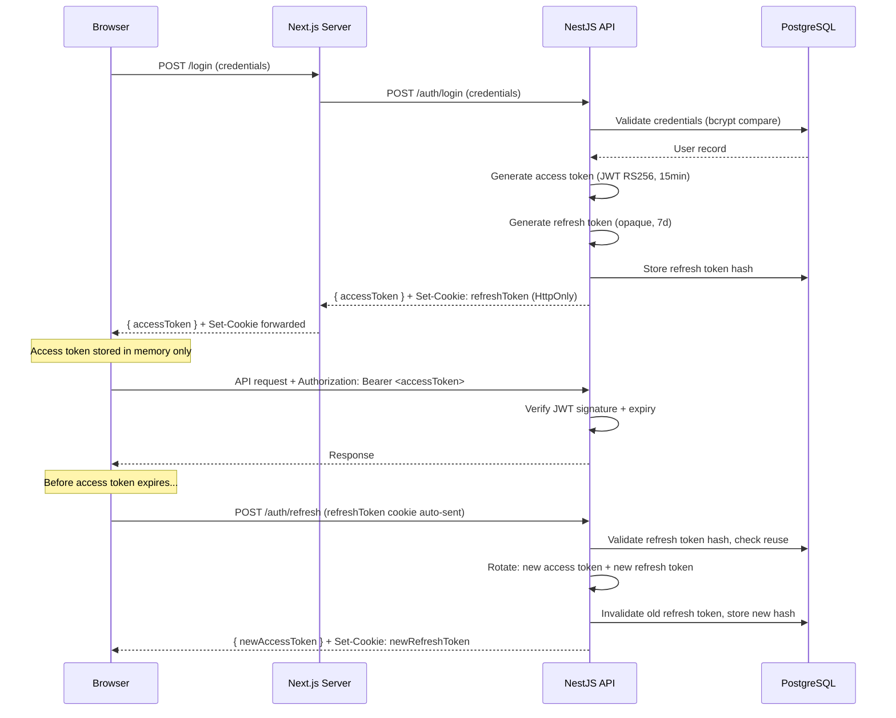
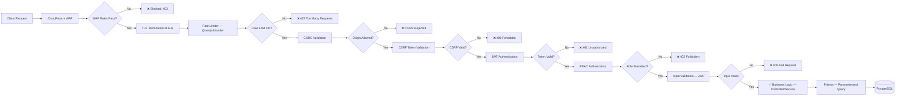

# Security Guidelines

> **Defence in depth.** No single layer is trusted to stop an attack.
> Every layer—browser, CDN, application, API, database, infrastructure—must independently enforce security controls.

---

## Security Principles

1. **Least Privilege.** Every user, service, and process has the minimum permissions required—nothing more.
2. **Defence in Depth.** Multiple independent security layers ensure that a failure in one does not compromise the system.
3. **Secure by Default.** Features ship locked down. Access is granted explicitly, never implicitly.
4. **Zero Trust.** No request is trusted based solely on its origin. Every request is authenticated and authorized.
5. **Data Integrity.** Aligned with the project's core philosophy—data is validated, sanitized, and never blindly trusted.
6. **Fail Securely.** Errors never leak internal state, stack traces, or sensitive data to the client.

---

## Authentication Security

### JWT Strategy

The platform uses **short-lived access tokens** with **long-lived refresh tokens** for session management.

| Token | Type | Lifetime | Storage |
|---|---|---|---|
| Access Token | JWT (signed, RS256) | 15 minutes | Memory only (JavaScript variable) |
| Refresh Token | Opaque token | 7 days | `HttpOnly`, `Secure`, `SameSite=Strict` cookie |
| CSRF Token | Random nonce | Per session | `HttpOnly`, `Secure` cookie + request header |

### Token Rotation

- **Access tokens** are refreshed silently via the `/auth/refresh` endpoint before expiry.
- **Refresh tokens** are **rotated on every use** — the old token is invalidated immediately.
- **Refresh token reuse detection**: If a previously-used refresh token is presented, **all sessions for that user are revoked** (indicates potential token theft).

### Secure Storage Rules

1. **Never store JWTs in `localStorage` or `sessionStorage`** — vulnerable to XSS.
2. Access tokens live in **JavaScript memory only** (React context / in-memory variable).
3. Refresh tokens are stored in **`HttpOnly` cookies** — inaccessible to JavaScript.
4. **No tokens in URL parameters** — ever. Tokens in URLs leak via Referer headers, logs, and browser history.

### Auth Flow



---

## Role-Based Access Control (RBAC)

### Roles

| Role | Description | Access Scope |
|---|---|---|
| `admin` | Platform administrators (HU staff) | Full access: CMS, analytics, user management, all brand data |
| `brand-manager` | Partner brand representatives | Own brand profile, own offers, own analytics |
| `viewer` | Authenticated viewers (optional) | Read-only access to authenticated content |
| `public` | Unauthenticated users | Landing page, catalogue, public partner pages, newsletter archive |

### Authorization Rules

1. **RBAC is enforced at the API layer** (NestJS guards), never solely on the frontend.
2. **Frontend route guards** provide UX convenience only—they are not security controls.
3. **Resource-level authorization**: `brand-manager` users can only access resources belonging to their own brand. This is enforced by a `BrandOwnerGuard` that checks `req.user.brandId` against the requested resource.
4. **Admin actions are audit-logged.** Every create, update, and delete by an admin is recorded with timestamp, user ID, and the change made.

### NestJS Guard Implementation

```typescript
// ✅ Route-level RBAC with custom decorator
@UseGuards(JwtAuthGuard, RolesGuard)
@Roles('admin', 'brand-manager')
@Put('/partners/:id')
async updatePartner(
  @Param('id') id: string,
  @Body() dto: UpdatePartnerDto,
  @CurrentUser() user: AuthUser,
) {
  // BrandOwnerGuard already verified user.brandId === partner.brandId
  return this.partnerService.update(id, dto);
}
```

---

## Input Validation

### Zod Validation — Shared Schemas

Validation schemas are defined once in `packages/shared` and used on **both** the frontend (React Hook Form) and the backend (NestJS pipes).

```typescript
// packages/shared/src/schemas/partner.schema.ts
import { z } from 'zod';

export const CreatePartnerSchema = z.object({
  name: z.string().min(2).max(100).trim(),
  description: z.string().min(10).max(2000).trim(),
  website: z.string().url(),
  logoUrl: z.string().url().optional(),
  category: z.enum(['food', 'retail', 'tech', 'education', 'lifestyle']),
  isActive: z.boolean().default(true),
});
```

### Sanitization Rules

1. **Strip HTML from all text inputs** — use `DOMPurify` or `sanitize-html` before storing.
2. **Parameterized queries only** — Prisma handles this, but raw queries are forbidden without explicit approval.
3. **Validate file MIME types server-side** — never trust the client-provided `Content-Type`.
4. **Reject unexpected fields** — Zod schemas use `.strict()` in API validation pipes to strip unknown properties.
5. **Limit string lengths** — every string field has explicit `min` and `max` constraints.

---

## XSS Prevention

### Multi-Layer Defence

| Layer | Control | Implementation |
|---|---|---|
| **React** | Auto-escapes JSX expressions | Built-in — never bypass with `dangerouslySetInnerHTML` |
| **CSP** | Content Security Policy header | Strict policy via Next.js `headers()` config |
| **Output Encoding** | HTML entity encoding | React default + server-rendered content |
| **Input Sanitization** | Strip HTML from user inputs | `DOMPurify` on rich text fields |
| **HttpOnly Cookies** | Tokens inaccessible to JS | Refresh token cookie configuration |

### Content Security Policy

```typescript
// next.config.ts — Security headers
const securityHeaders = [
  {
    key: 'Content-Security-Policy',
    value: [
      "default-src 'self'",
      "script-src 'self' 'unsafe-eval'",   // Required for Next.js dev; remove in production
      "style-src 'self' 'unsafe-inline'",   // Required for styled-components / Tailwind
      "img-src 'self' data: blob: https://*.amazonaws.com",
      "font-src 'self'",
      "connect-src 'self' https://api.hupartners.com",
      "frame-ancestors 'none'",
      "base-uri 'self'",
      "form-action 'self'",
    ].join('; '),
  },
];
```

### `dangerouslySetInnerHTML` Policy

**Banned by default.** If absolutely required (e.g., rendering CMS rich text), the content must:
1. Pass through `DOMPurify.sanitize()` with a strict allowlist.
2. Be reviewed and approved in the PR by a security-aware reviewer.
3. Include an inline comment explaining why it's necessary.

---

## CSRF Protection

1. **SameSite=Strict cookies** prevent CSRF for cookie-based auth flows.
2. **Double-submit cookie pattern**: A CSRF token is set in a cookie and must be echoed in a custom request header (`X-CSRF-Token`).
3. **State-changing operations** (`POST`, `PUT`, `PATCH`, `DELETE`) require the CSRF token.
4. **GET requests must never mutate state.** This is enforced by code review.

---

## SQL Injection Prevention

**Prisma ORM is the only allowed database access layer.** Prisma uses parameterized queries by default, eliminating SQL injection in standard usage.

### Rules

1. **Raw SQL (`prisma.$queryRaw`) is prohibited** unless explicitly approved and code-reviewed.
2. If raw SQL is unavoidable, **use `Prisma.sql` tagged template literals** for parameterization:
   ```typescript
   // ✅ Safe: Parameterized
   const users = await prisma.$queryRaw(
     Prisma.sql`SELECT * FROM users WHERE email = ${email}`
   );
   
   // ❌ Dangerous: String interpolation
   const users = await prisma.$queryRaw(`SELECT * FROM users WHERE email = '${email}'`);
   ```
3. **Database user permissions** follow least privilege — the application DB user has no `DROP`, `ALTER`, or `GRANT` permissions.

---

## File Upload Security

### S3 Pre-Signed URL Flow

File uploads (brand logos, newsletter PDFs) use **pre-signed S3 URLs** — files never pass through the application server.

| Control | Implementation |
|---|---|
| **Pre-signed URL expiry** | 5 minutes |
| **Max file size** | 10 MB (enforced in pre-signed URL policy) |
| **Allowed MIME types** | `image/jpeg`, `image/png`, `image/webp`, `image/avif`, `application/pdf` |
| **File name sanitization** | UUIDs replace original filenames |
| **Content-Type validation** | Server-side magic byte verification after upload (Lambda trigger) |
| **Antivirus scan** | ClamAV Lambda trigger on S3 `ObjectCreated` events |
| **Separate S3 bucket** | Upload bucket ≠ public serving bucket; files are copied after validation |

---

## API Security

### Rate Limiting

| Endpoint Type | Rate Limit | Window |
|---|---|---|
| Public read endpoints | 100 req/min per IP | Sliding window |
| Auth endpoints (login, register) | 5 req/min per IP | Fixed window |
| Password reset | 3 req/hour per email | Fixed window |
| Admin write endpoints | 30 req/min per user | Sliding window |
| File upload (pre-signed URL) | 10 req/min per user | Fixed window |

Rate limiting is implemented via `@nestjs/throttler` with Redis as the backing store.

### CORS Policy

```typescript
// NestJS CORS configuration
app.enableCors({
  origin: ['https://hupartners.com', 'https://admin.hupartners.com'],
  methods: ['GET', 'POST', 'PUT', 'PATCH', 'DELETE'],
  allowedHeaders: ['Content-Type', 'Authorization', 'X-CSRF-Token'],
  credentials: true,
  maxAge: 3600,
});
```

**No wildcard origins (`*`) in production.** Development uses `localhost` origins only.

---

## Secrets Management

### Rules

1. **No secrets in code, config files, or Git history.** Ever.
2. **Environment variables** for local development (`.env.local`, never committed).
3. **AWS Secrets Manager** for production secrets (DB credentials, JWT keys, API keys).
4. **Rotate secrets regularly:** Database passwords every 90 days, JWT signing keys every 180 days.
5. **Separate secrets per environment.** Dev, staging, and production use different credentials.

### `.env` Files

| File | Committed? | Purpose |
|---|---|---|
| `.env.example` | ✅ Yes | Template with placeholder values |
| `.env.local` | ❌ No | Local development secrets |
| `.env.production` | ❌ No | Never exists in repo; secrets injected at deploy |

### Pre-Commit Hook

```bash
# .husky/pre-commit — prevent accidental secret commits
npx secretlint "**/*"
```

---

## Infrastructure Security

### AWS Architecture

| Control | Implementation |
|---|---|
| **VPC Isolation** | API and DB in private subnets; no direct internet access |
| **Security Groups** | DB accepts connections only from ECS task security group |
| **TLS Everywhere** | CloudFront → ALB → ECS: TLS 1.2+ enforced end-to-end |
| **WAF** | AWS WAF on CloudFront: OWASP Core Rule Set, rate limiting |
| **RDS Encryption** | At-rest (AES-256) and in-transit (TLS) |
| **S3 Bucket Policies** | Public read only on the CDN-serving bucket; all others private |
| **ECS Task Roles** | Least-privilege IAM roles per service |
| **CloudTrail** | All API calls logged for audit |

---

## Dependency Security

### Automated Auditing

| Tool | Frequency | Action on Critical |
|---|---|---|
| **`npm audit`** | Every CI run | Block merge |
| **Dependabot** | Daily scan | Auto-open PR |
| **Snyk** (optional) | Continuous | Alert + PR |
| **Socket.dev** (optional) | On PR | Supply chain risk analysis |

### Rules

1. **Review every new dependency** before adding. Check: maintenance status, download count, known vulnerabilities, bundle size.
2. **Pin exact versions** in `package.json` (no `^` or `~`). Use `package-lock.json` for deterministic installs.
3. **Critical/High vulnerabilities** must be patched within **48 hours** or the dependency is replaced.
4. **No `postinstall` scripts** from untrusted packages — use `ignore-scripts` for suspicious deps.

---

## Security Headers

All responses from the platform include these headers:

| Header | Value | Purpose |
|---|---|---|
| `Content-Security-Policy` | See CSP section | Prevent XSS, injection |
| `X-Content-Type-Options` | `nosniff` | Prevent MIME sniffing |
| `X-Frame-Options` | `DENY` | Prevent clickjacking |
| `Referrer-Policy` | `strict-origin-when-cross-origin` | Limit referrer data leakage |
| `Strict-Transport-Security` | `max-age=63072000; includeSubDomains; preload` | Enforce HTTPS |
| `Permissions-Policy` | `camera=(), microphone=(), geolocation=()` | Disable unnecessary browser APIs |
| `X-DNS-Prefetch-Control` | `off` | Prevent DNS prefetch data leaks |

---

## Request Security Pipeline



---

## Incident Response

### Severity Levels

| Level | Description | Response Time | Example |
|---|---|---|---|
| **P0 — Critical** | Active exploitation or data breach | Immediate (< 30 min) | Token theft, DB exfiltration |
| **P1 — High** | Exploitable vulnerability discovered | < 4 hours | Auth bypass, IDOR |
| **P2 — Medium** | Potential vulnerability, not yet exploited | < 24 hours | Missing rate limit, weak CSP |
| **P3 — Low** | Best practice deviation | Next sprint | Missing security header |

### Response Steps

1. **Contain** — Isolate affected systems (revoke tokens, block IPs, disable feature).
2. **Assess** — Determine scope and impact of the incident.
3. **Remediate** — Deploy fix, rotate compromised secrets, patch vulnerability.
4. **Notify** — Inform affected users if personal data was exposed.
5. **Post-mortem** — Document root cause, timeline, and preventive actions.

---

## Security Checklist — Per-Feature Sign-Off

- [ ] All inputs validated with Zod schemas (frontend + backend)
- [ ] No `dangerouslySetInnerHTML` without DOMPurify + review
- [ ] Authentication required for non-public routes
- [ ] RBAC enforced at API layer (NestJS guards)
- [ ] File uploads use pre-signed URLs with validation
- [ ] No secrets in code or config
- [ ] Rate limiting applied to new endpoints
- [ ] Security headers present in response
- [ ] `npm audit` clean (no critical/high vulnerabilities)
- [ ] CSRF token required for state-changing operations

---

> **Cross-references:**
> - [Backend-Guidelines.md](./Backend-Guidelines.md) — API architecture, NestJS patterns, Prisma usage
> - [Architecture.md](./Architecture.md) — Infrastructure diagram, AWS service layout, deployment pipeline
