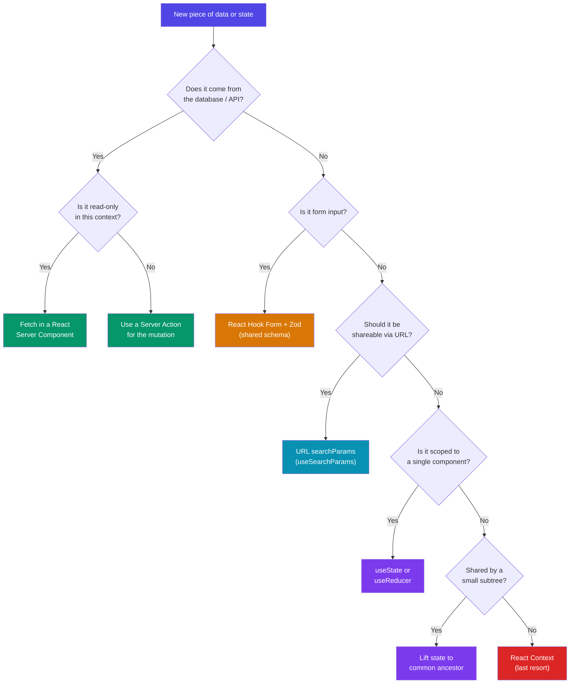

# State Management Strategy

> Habib University Preferred Partner Platform — Data & State Architecture

This document defines how data flows through the HU Preferred Partner platform. The guiding
principle is **server-first**: treat the server as the source of truth, keep client state minimal,
and leverage the platform's framework primitives before reaching for third-party libraries.

---

## 1. Philosophy

| Principle                     | Rationale                                                    |
| ----------------------------- | ------------------------------------------------------------ |
| Server state is the default   | Most data originates from the database — fetch it on the server. |
| Minimal client state          | Every piece of client state is a synchronization liability.  |
| URL is state                  | Filters, pagination, and search are shareable via URL.       |
| Collocate state with usage    | State lives in the lowest component that needs it.           |
| No global state library       | React Server Components + URL state eliminates the need.     |

### Why no Redux / Zustand / Jotai?

Global client state libraries solve a problem this platform does not have. The HU Preferred Partner
application is a **content-driven, read-heavy platform** where:

- **90%+ of data** (partners, offers, categories, newsletters) comes from the API and is best
  fetched on the server via React Server Components.
- **UI state** (modal open/closed, accordion expanded) is local by nature and scoped to a single
  component tree.
- **Form state** is transient and managed by React Hook Form.
- **Shareable state** (filters, search, pagination) belongs in the URL.

A global store would add bundle size, indirection, and hydration complexity with no tangible
benefit.

---

## 2. State Categories

### 2.1 Server State — React Server Components

React Server Components (RSC) are the **primary data layer**. Data is fetched at the route segment
level, streamed to the client, and never serialized into a client-side store.

```tsx
// app/(platform)/partners/page.tsx — Server Component
import { getPartners } from '@/lib/api/partners';

export default async function PartnersPage({ searchParams }: { searchParams: SearchParams }) {
  const { tier, page } = searchParams;
  const partners = await getPartners({ tier, page: Number(page) || 1 });

  return (
    <section>
      <PartnerFilterBar activeTier={tier} />
      <PartnerGrid partners={partners.data} />
      <Pagination meta={partners.pagination} />
    </section>
  );
}
```

**Key rules:**

- Fetch data as close to where it is rendered as possible.
- Use `async/await` directly in server components — no `useEffect`, no loading spinners for
  initial data.
- Pass data **down** to client components as props; never fetch data in a client component that
  a parent server component could have provided.

### 2.2 Server Actions for Mutations

All write operations (create, update, delete) use **Next.js Server Actions**. Server Actions
co-locate the mutation logic with the form, validate input on the server, and trigger
revalidation automatically.

```tsx
// app/(admin)/admin/partners/actions.ts
'use server';

import { revalidatePath } from 'next/cache';
import { createPartnerSchema } from '@repo/validation-schemas';
import { db } from '@/lib/db';

export async function createPartner(formData: FormData) {
  const raw = Object.fromEntries(formData.entries());
  const validated = createPartnerSchema.parse(raw);

  await db.partner.create({ data: validated });

  revalidatePath('/admin/partners');
  revalidatePath('/partners');
}
```

**Mutation flow:**

1. Client component calls the Server Action (via `useActionState` or `form action`).
2. Server validates input with Zod.
3. Server performs the database write.
4. Server calls `revalidatePath` / `revalidateTag` to bust the cache.
5. Next.js re-renders affected server components with fresh data.

### 2.3 UI State — `useState` / `useReducer`

Ephemeral, component-scoped state that has no persistence requirements.

| Example                     | Hook             | Scope              |
| --------------------------- | ---------------- | ------------------ |
| Modal open / closed         | `useState`       | Single component   |
| Accordion expanded index    | `useState`       | Single component   |
| Multi-step form step index  | `useReducer`     | Component subtree  |
| Dropdown selection          | `useState`       | Single component   |
| Toast notification queue    | `useReducer`     | Layout-level       |

**Rules:**

- Never lift UI state higher than the closest common ancestor.
- If two distant components need the same UI state, reconsider the component tree before reaching
  for context.

### 2.4 Form State — React Hook Form + Zod

All forms — login, registration, offer creation, newsletter compose, profile editing — use
**React Hook Form** (RHF) with **Zod** schemas for validation.

```tsx
// components/forms/CreateOfferForm.tsx
'use client';

import { useForm } from 'react-hook-form';
import { zodResolver } from '@hookform/resolvers/zod';
import { createOfferSchema, type CreateOfferFormData } from '@repo/validation-schemas';
import { createOffer } from '@/app/(brand-portal)/portal/offers/actions';

export function CreateOfferForm({ partnerId }: { partnerId: string }) {
  const form = useForm<CreateOfferFormData>({
    resolver: zodResolver(createOfferSchema),
    defaultValues: { title: '', description: '', partnerId },
  });

  return (
    <form action={createOffer}>
      <input {...form.register('title')} />
      {form.formState.errors.title && <p>{form.formState.errors.title.message}</p>}
      {/* ... */}
      <button type="submit" disabled={form.formState.isSubmitting}>
        Create Offer
      </button>
    </form>
  );
}
```

**Why RHF + Zod?**

- **Shared schemas** — validation schemas live in `/packages/validation-schemas` and are reused
  across the Next.js frontend and NestJS API. One schema, two runtimes.
- **Performance** — RHF uses uncontrolled inputs, minimizing re-renders.
- **Type safety** — Zod infers TypeScript types from schemas, so form data types are always in
  sync with validation rules.

### 2.5 URL State — `searchParams` & `useSearchParams`

Filters, pagination, sorting, and search queries are stored in the **URL query string**.

```tsx
// components/PartnerFilterBar.tsx
'use client';

import { useRouter, useSearchParams, usePathname } from 'next/navigation';

export function PartnerFilterBar({ activeTier }: { activeTier?: string }) {
  const router = useRouter();
  const pathname = usePathname();
  const searchParams = useSearchParams();

  function setFilter(key: string, value: string) {
    const params = new URLSearchParams(searchParams.toString());
    if (value) params.set(key, value);
    else params.delete(key);
    params.delete('page'); // reset pagination on filter change
    router.push(`${pathname}?${params.toString()}`);
  }

  return (
    <div>
      {['ALL', 'PLATINUM', 'GOLD', 'SILVER'].map((tier) => (
        <button
          key={tier}
          onClick={() => setFilter('tier', tier === 'ALL' ? '' : tier)}
          data-active={activeTier === tier}
        >
          {tier}
        </button>
      ))}
    </div>
  );
}
```

**Benefits of URL state:**

- **Shareable** — users can share filtered views via link.
- **Bookmarkable** — browser history tracks filter changes.
- **SSR-compatible** — server components read `searchParams` directly, no hydration mismatch.
- **Back/forward navigation** works automatically.

---

## 3. Caching Strategy

### 3.1 Next.js `fetch` Cache

Server-side `fetch` calls leverage Next.js caching with **tag-based revalidation**.

```typescript
// lib/api/partners.ts
export async function getPartners(filters: PartnerFilters) {
  const url = buildUrl('/api/brand-partners', filters);

  const res = await fetch(url, {
    next: {
      tags: ['partners'],
      revalidate: 3600, // time-based: revalidate every hour
    },
  });

  return res.json() as Promise<PartnerListResponse>;
}
```

### 3.2 Revalidation Patterns

| Pattern               | When to use                                       | API                       |
| --------------------- | ------------------------------------------------- | ------------------------- |
| Time-based            | Data that changes infrequently (partner profiles) | `{ revalidate: 3600 }`   |
| On-demand (path)      | After a mutation affecting a specific route        | `revalidatePath('/...')` |
| On-demand (tag)       | After a mutation affecting a data category         | `revalidateTag('...')`  |

### 3.3 On-Demand Revalidation Example

```typescript
// Server Action — after creating an offer
'use server';

import { revalidateTag } from 'next/cache';

export async function createOffer(formData: FormData) {
  // ... validate and persist ...

  // Bust all caches tagged with 'offers'
  revalidateTag('offers');
  // Also revalidate the specific partner's page
  revalidateTag(`partner:${partnerId}`);
}
```

---

## 4. State Management Decision Tree

Use the following diagram to determine the correct state strategy for any new piece of data in
the application.



---

## 5. Anti-Patterns to Avoid

| ❌ Anti-pattern                              | ✅ Correct approach                                |
| -------------------------------------------- | -------------------------------------------------- |
| `useEffect` + `fetch` in client components   | Fetch in the parent server component               |
| Global store for API data                    | React Server Components + cache tags               |
| Duplicating server data in client state      | Pass server data as props                          |
| Storing filters in `useState`               | Store filters in URL `searchParams`                |
| Inline Zod schemas per component             | Shared schemas from `@repo/validation-schemas`     |
| `useContext` for theme/auth across the app   | Use middleware + server components for auth; CSS variables for theme |

---

## 6. Summary

The HU Preferred Partner platform achieves a robust, scalable state architecture with **zero
global state libraries** by combining:

1. **React Server Components** — for all read operations.
2. **Server Actions** — for all write operations.
3. **React Hook Form + Zod** — for form state with shared validation.
4. **URL search params** — for shareable, bookmarkable UI state.
5. **`useState` / `useReducer`** — for ephemeral, component-local UI state.
6. **Next.js cache + revalidation** — for fine-grained cache control.

This architecture keeps the client bundle lean, eliminates hydration mismatches, and ensures the
server remains the single source of truth.
