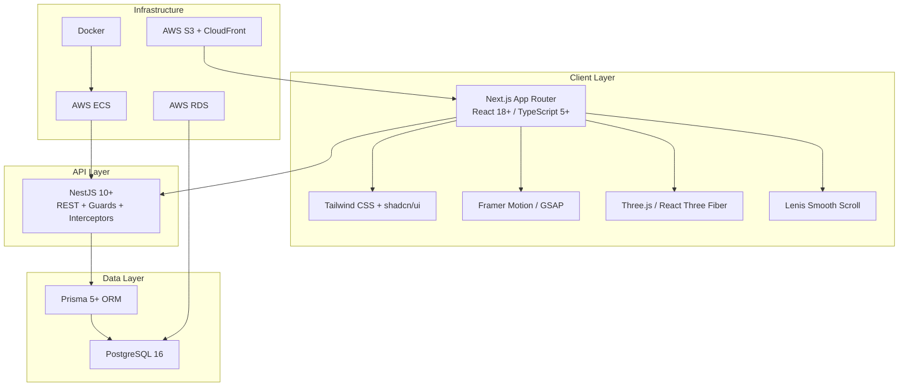

# Tech Stack

> Habib University Preferred Partner Platform — Technology Reference

---

## Overview

This document catalogues every technology in the HU Preferred Partner monorepo, the reasoning behind each choice, and the version constraints that keep the stack stable. Use this as the single source of truth when evaluating upgrades, onboarding new engineers, or auditing dependencies.

---

## Architecture Layers



---

## Frontend Technologies

| Category | Technology | Version | Purpose | Why Chosen | Alternatives Considered |
|---|---|---|---|---|---|
| Framework | Next.js (App Router) | 14.x+ | SSR, RSC, routing, metadata API | First-class RSC support, file-based routing, built-in image/font optimisation, Vercel ecosystem | Remix (less RSC maturity), Astro (less dynamic capability) |
| UI Library | React | 18.x+ | Component model, concurrent features | Industry standard, RSC support, Suspense boundaries | Solid.js (smaller ecosystem), Svelte (different paradigm) |
| Language | TypeScript | 5.x+ | Static typing across full stack | End-to-end type safety, superior DX, Prisma/Zod integration | Plain JS (no type safety), Flow (declining ecosystem) |
| Styling | Tailwind CSS | 3.x+ | Utility-first CSS | Rapid iteration, design-token alignment, purge-safe production builds | CSS Modules (more boilerplate), Styled Components (runtime cost) |
| Component Library | shadcn/ui | latest | Accessible, unstyled primitives | Copy-paste ownership, Radix primitives, zero lock-in | Radix raw (more assembly), MUI (opinionated styling) |
| Animation (layout) | Framer Motion | 11.x+ | Layout animations, page transitions, gesture | Declarative API, `AnimatePresence`, layout animation engine | React Spring (less layout support), CSS transitions (limited) |
| Animation (timeline) | GSAP | 3.x+ | Scroll-triggered sequences, timeline choreography | Unmatched timeline control, ScrollTrigger plugin, battle-tested performance | Anime.js (less scroll support), Motion One (smaller feature set) |
| 3D Rendering | Three.js | 0.16x+ | WebGL scenes, 3D brand showcases | De facto WebGL standard, massive ecosystem | Babylon.js (heavier), PlayCanvas (editor-centric) |
| 3D React Binding | React Three Fiber | 8.x+ | Declarative Three.js in React | React reconciler for Three.js, composable, hooks-based | Raw Three.js (imperative, harder to maintain) |
| Smooth Scroll | Lenis | 1.x+ | Inertia-based smooth scrolling | Lightweight, no layout thrashing, pairs with GSAP ScrollTrigger | Locomotive Scroll (heavier, more opinionated), native CSS (inconsistent) |
| Forms | React Hook Form | 7.x+ | Performant form state management | Uncontrolled inputs by default, minimal re-renders | Formik (more re-renders), native forms (no validation DX) |
| Validation | Zod | 3.x+ | Schema validation, type inference | TypeScript-first, composable schemas, Prisma type alignment | Yup (less TS inference), Joi (Node-centric) |

---

## Backend Technologies

| Category | Technology | Version | Purpose | Why Chosen | Alternatives Considered |
|---|---|---|---|---|---|
| API Framework | NestJS | 10.x+ | REST API, guards, interceptors, modules | Opinionated architecture, DI system, decorator-based routing, enterprise patterns | Express raw (no structure), Fastify raw (no DI), Hono (less mature ecosystem) |
| ORM | Prisma | 5.x+ | Database access, migrations, type-safe queries | Auto-generated types, declarative schema, migration workflow | TypeORM (less type safety), Drizzle (newer, less battle-tested), Knex (query builder only) |
| Database | PostgreSQL | 16.x | Relational data store | ACID compliance, JSONB support, mature ecosystem, AWS RDS compatibility | MySQL (less feature-rich), MongoDB (document model mismatch) |

---

## Infrastructure & DevOps

| Category | Technology | Version | Purpose | Why Chosen | Alternatives Considered |
|---|---|---|---|---|---|
| Containerisation | Docker | 24.x+ | Reproducible builds, local dev parity | Industry standard, multi-stage builds, compose for local stack | Podman (less ecosystem support), Nix (steeper learning curve) |
| Container Orchestration | AWS ECS (Fargate) | — | Production container hosting | Serverless containers, no cluster management, IAM integration | EKS (over-engineered for scale), Lambda (cold starts for API) |
| Managed Database | AWS RDS | — | Managed PostgreSQL hosting | Automated backups, read replicas, security groups | Self-hosted (operational burden), PlanetScale (MySQL only) |
| Object Storage | AWS S3 | — | Static assets, newsletter PDFs, brand logos | Virtually unlimited storage, lifecycle policies, cheap | Cloudflare R2 (less AWS integration), MinIO (self-hosted) |
| CDN | AWS CloudFront | — | Edge caching, asset delivery | Native S3 integration, global PoPs, custom domain SSL | Cloudflare (separate ecosystem), Fastly (cost at scale) |

---

## Version Compatibility Matrix

This matrix defines the **tested and supported** version combinations. Deviating from these ranges requires a spike and team sign-off.

| Dependency | Minimum | Recommended | Maximum | Notes |
|---|---|---|---|---|
| Node.js | 18.17 | 20.x LTS | 22.x | Next.js 14 requires ≥ 18.17 |
| Next.js | 14.0 | 14.2+ | 15.x (with audit) | App Router stable from 14.0 |
| React | 18.2 | 18.3+ | 19.x (with audit) | RSC requires 18.2+ |
| TypeScript | 5.0 | 5.4+ | 5.x | Prisma 5 requires ≥ 5.0 |
| Tailwind CSS | 3.3 | 3.4+ | 3.x | v4 migration requires dedicated sprint |
| NestJS | 10.0 | 10.3+ | 10.x | Major upgrades require migration guide review |
| Prisma | 5.0 | 5.10+ | 5.x | Schema engine changes between minors |
| PostgreSQL | 15 | 16 | 16 | RDS version pinned |
| GSAP | 3.12 | 3.12+ | 3.x | ScrollTrigger compatibility |
| Three.js | 0.160 | 0.165+ | 0.17x | R3F version must match |
| React Three Fiber | 8.15 | 8.16+ | 8.x | Tied to Three.js version |

---

## Package Manager & Monorepo

| Tool | Version | Purpose |
|---|---|---|
| pnpm | 8.x+ | Fast, disk-efficient package manager with strict hoisting |
| Turborepo | 1.x+ | Monorepo task orchestration, caching, dependency graph |

### Workspace Structure

```
/
├── apps/
│   ├── web/          # Next.js App Router frontend
│   └── api/          # NestJS backend
├── packages/
│   ├── ui/           # Shared shadcn/ui components
│   ├── types/        # Shared TypeScript types
│   ├── config/       # Shared ESLint, Tailwind, TS configs
│   └── utils/        # Shared utility functions
├── docker/
│   ├── Dockerfile.web
│   └── Dockerfile.api
├── docs/
├── turbo.json
├── pnpm-workspace.yaml
└── package.json
```

---

## Upgrade Strategy

### Principles

1. **Pin exact versions** in `package.json` — no `^` or `~` for core dependencies.
2. **Renovate/Dependabot** for automated PR creation on patch/minor updates.
3. **Major upgrades** require a dedicated spike, documented in an ADR (Architecture Decision Record).
4. **Canary testing** — run the full test suite against the upgrade in CI before merging.
5. **One major at a time** — never upgrade Next.js and NestJS in the same PR.

### Upgrade Cadence

| Tier | Dependencies | Cadence | Process |
|---|---|---|---|
| Critical | Next.js, NestJS, Prisma, React | Quarterly review | Spike → ADR → staged rollout |
| Standard | Tailwind, shadcn/ui, GSAP, Framer Motion | Monthly patch review | Automated PR → CI → merge |
| Infra | Docker base images, Node.js | Per LTS release | Dockerfile update → staging test |
| Low-risk | Lenis, React Hook Form, Zod | As needed | Automated PR → CI → merge |

### Migration Checklist (Major Upgrades)

- [ ] Read official migration guide end-to-end
- [ ] Create feature branch from `main`
- [ ] Update dependency + run `pnpm install`
- [ ] Fix all TypeScript errors
- [ ] Run full test suite
- [ ] Manual smoke test on staging
- [ ] Performance benchmark comparison
- [ ] Update this document with new version ranges
- [ ] Create ADR documenting the decision

---

## Decision Records

When a technology is added, replaced, or significantly upgraded, create an ADR in `docs/adr/` following this template:

```
# ADR-{NNN}: {Title}

## Status: Proposed | Accepted | Deprecated | Superseded

## Context
What is the problem or opportunity?

## Decision
What did we decide and why?

## Consequences
What are the trade-offs?
```

---

## Cross-References

- [Design-Principles.md](./Design-Principles.md) — Anti AI-Slop philosophy driving UI/UX technology choices
- [Frontend-Guidelines.md](./Frontend-Guidelines.md) — Next.js App Router conventions and component patterns
- [Animation-Guidelines.md](./Animation-Guidelines.md) — Framer Motion / GSAP usage standards
- [Performance.md](./Performance.md) — Lighthouse targets and optimisation techniques

---

*Last updated: 2026-07-01*
