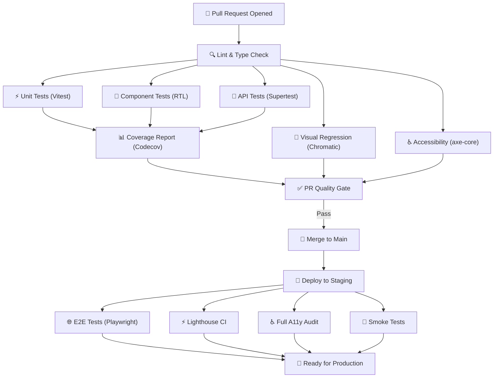

# Testing Strategy

> **Platform**: Habib University Preferred Partner Program
> **Monorepo**: `/apps/web` (Next.js) · `/apps/api` (NestJS) · `/packages/*`
> **Tools**: Vitest · React Testing Library · Supertest · Playwright · Lighthouse CI · axe-core

---

## Table of Contents

- [Test Pyramid](#test-pyramid)
- [Unit Testing](#unit-testing)
- [Component Testing](#component-testing)
- [API Testing](#api-testing)
- [End-to-End Testing](#end-to-end-testing)
- [Visual Regression Testing](#visual-regression-testing)
- [Performance Testing](#performance-testing)
- [Accessibility Testing](#accessibility-testing)
- [Coverage Targets](#coverage-targets)
- [CI Integration](#ci-integration)
- [Test File Organization](#test-file-organization)
- [CI Test Pipeline](#ci-test-pipeline)

---

## Test Pyramid

The testing strategy follows the standard test pyramid model, emphasizing a large base of fast, isolated unit tests with progressively fewer (but broader) integration and end-to-end tests.

| Layer         | Volume   | Speed     | Scope              | Primary Tool              |
|---------------|----------|-----------|---------------------|---------------------------|
| Unit          | Many     | Fast      | Functions, hooks    | Vitest                    |
| Component     | Moderate | Fast      | UI components       | React Testing Library     |
| Integration   | Some     | Medium    | API endpoints       | Supertest + Prisma        |
| E2E           | Few      | Slow      | Critical user flows | Playwright                |

### Guiding Principles

- **Test behavior, not implementation** — Focus on what the code does, not how it does it
- **Isolate dependencies** — Mock external services, databases, and APIs in unit and component tests
- **Prioritize critical paths** — E2E tests cover only the most important user journeys
- **Keep tests deterministic** — No flaky tests; eliminate time-dependent or order-dependent test logic
- **Fast feedback loops** — Unit and component tests must run in under 30 seconds locally

---

## Unit Testing

Unit tests form the foundation of the testing strategy. They validate individual functions, utilities, hooks, and service methods in complete isolation.

### Framework: Vitest

Vitest is used across the entire monorepo for unit testing. It provides native ESM support, TypeScript integration, and compatibility with the Jest API surface.

### Configuration

```typescript
// vitest.config.ts (root)
import { defineConfig } from 'vitest/config';

export default defineConfig({
  test: {
    globals: true,
    environment: 'node',
    include: ['**/*.test.ts', '**/*.spec.ts'],
    exclude: ['**/e2e/**', '**/node_modules/**'],
    coverage: {
      provider: 'v8',
      reporter: ['text', 'lcov', 'html'],
      thresholds: { lines: 80, branches: 75, functions: 80 },
    },
  },
});
```

### What to Unit Test

| Target                  | Examples                                              |
|-------------------------|-------------------------------------------------------|
| Utility functions       | `formatDate()`, `slugify()`, `calculateDiscount()`    |
| Custom React hooks      | `useAuth()`, `usePartnerOffers()`, `usePagination()`  |
| Service methods         | `OfferService.validate()`, `UserService.hashPassword()` |
| Validation schemas      | Zod schemas for form inputs and API payloads          |
| State reducers          | Zustand store reducers and selectors                  |
| Guard logic             | Permission evaluation functions                       |
| Data transformers       | API response → UI model mappers                       |

### Mocking Strategy

- **External APIs** — Mock with `vi.mock()` or MSW (Mock Service Worker) for HTTP-level mocking
- **Database** — Mock Prisma client using `vitest-mock-extended`
- **Environment variables** — Set via `vi.stubEnv()` for config-dependent logic
- **Date/Time** — Use `vi.useFakeTimers()` for time-sensitive tests

---

## Component Testing

Component tests verify that React components render correctly, respond to user interactions, and integrate with their immediate dependencies (state, context, hooks).

### Framework: React Testing Library

React Testing Library (RTL) is used for all component tests. Tests interact with components through their public API — DOM output and user events — not internal state or implementation details.

### Testing Patterns

```typescript
// Example: OfferCard component test
import { render, screen, fireEvent } from '@testing-library/react';
import { OfferCard } from './OfferCard';

describe('OfferCard', () => {
  const mockOffer = {
    id: '1',
    title: '20% Off Textbooks',
    partner: 'BookWorld',
    status: 'active',
    expiresAt: '2026-12-31',
  };

  it('renders offer title and partner name', () => {
    render(<OfferCard offer={mockOffer} />);
    expect(screen.getByText('20% Off Textbooks')).toBeInTheDocument();
    expect(screen.getByText('BookWorld')).toBeInTheDocument();
  });

  it('calls onRedeem when redeem button is clicked', () => {
    const onRedeem = vi.fn();
    render(<OfferCard offer={mockOffer} onRedeem={onRedeem} />);
    fireEvent.click(screen.getByRole('button', { name: /redeem/i }));
    expect(onRedeem).toHaveBeenCalledWith('1');
  });
});
```

### What to Component Test

- Conditional rendering based on props and state
- User interaction handlers (click, type, select)
- Form validation and error display
- Accessible markup (roles, labels, aria attributes)
- Loading, empty, and error states

---

## API Testing

API tests validate the NestJS backend endpoints, ensuring correct request handling, authorization, validation, and database interactions.

### Framework: Supertest + Prisma Test Utilities

Supertest is used to make HTTP requests against the NestJS application instance. A dedicated Prisma test client connects to an isolated test database.

### Test Database Setup

```typescript
// test/setup.ts
import { PrismaClient } from '@prisma/client';
import { execSync } from 'child_process';

const prisma = new PrismaClient({
  datasources: { db: { url: process.env.TEST_DATABASE_URL } },
});

beforeAll(async () => {
  execSync('npx prisma migrate deploy', {
    env: { ...process.env, DATABASE_URL: process.env.TEST_DATABASE_URL },
  });
});

afterEach(async () => {
  // Clean all tables between tests
  const tables = await prisma.$queryRaw<{ tablename: string }[]>`
    SELECT tablename FROM pg_tables WHERE schemaname = 'public'
  `;
  for (const { tablename } of tables) {
    await prisma.$executeRawUnsafe(`TRUNCATE TABLE "${tablename}" CASCADE`);
  }
});

afterAll(async () => {
  await prisma.$disconnect();
});
```

### What to API Test

| Category             | Examples                                                   |
|----------------------|------------------------------------------------------------|
| Authentication       | Login, token refresh, unauthorized access                  |
| Authorization        | Role-based access, permission enforcement                  |
| CRUD Operations      | Create/read/update/delete for all resources                |
| Validation           | Invalid payloads, missing fields, type mismatches          |
| Business Logic       | Offer approval workflows, status transitions               |
| Error Handling       | 404 for missing resources, 409 for conflicts, 500 handling |
| Pagination & Filters | Query parameter handling, cursor-based pagination          |

---

## End-to-End Testing

E2E tests validate complete user flows through the browser, ensuring that the frontend and backend work together correctly in a production-like environment.

### Framework: Playwright

Playwright is used for all E2E tests. Tests run against a local development server with a seeded test database.

### Critical User Flows

| Flow                   | Description                                              |
|------------------------|----------------------------------------------------------|
| Authentication         | Login, logout, password reset, session persistence       |
| Partnership Browsing   | Search partners, filter by category, view partner details |
| Offer Redemption       | Browse offers, view details, redeem with code/QR         |
| Admin: Partner Approval| Admin logs in, reviews partner application, approves     |
| Admin: Offer Approval  | Admin reviews pending offer, approves or rejects         |
| Partner Portal: Offer  | Partner creates offer draft, submits, tracks status      |
| Newsletter Signup      | User subscribes to newsletter, receives confirmation     |

### Playwright Configuration

```typescript
// playwright.config.ts
import { defineConfig } from '@playwright/test';

export default defineConfig({
  testDir: './e2e',
  timeout: 30_000,
  retries: process.env.CI ? 2 : 0,
  workers: process.env.CI ? 2 : 4,
  use: {
    baseURL: 'http://localhost:3000',
    screenshot: 'only-on-failure',
    video: 'retain-on-failure',
    trace: 'retain-on-failure',
  },
  projects: [
    { name: 'chromium', use: { browserName: 'chromium' } },
    { name: 'firefox', use: { browserName: 'firefox' } },
    { name: 'webkit', use: { browserName: 'webkit' } },
  ],
  webServer: {
    command: 'npm run dev',
    port: 3000,
    reuseExistingServer: !process.env.CI,
  },
});
```

---

## Visual Regression Testing

Visual regression tests catch unintended UI changes by comparing screenshots against approved baselines.

### Tool: Chromatic (Primary) / Percy (Alternative)

- **Chromatic** integrates with Storybook to capture and compare component snapshots
- Every PR triggers a visual diff review in Chromatic's web UI
- Reviewers approve or reject visual changes before the PR can merge

### Workflow

1. Developer pushes a branch with UI changes
2. CI builds Storybook and publishes to Chromatic
3. Chromatic compares screenshots against the baseline (main branch)
4. Changed components are flagged for visual review
5. Reviewer approves or requests changes in the Chromatic dashboard
6. Approved changes become the new baseline on merge

### Configuration

Visual regression tests run on every PR that modifies files in:

- `apps/web/src/components/**`
- `apps/web/src/app/**`
- `packages/ui/**`

---

## Performance Testing

Performance testing ensures the platform meets speed and responsiveness standards across devices and network conditions.

### Lighthouse CI

Lighthouse CI runs automated audits on every PR and staging deployment. Performance budgets are enforced via assertions.

```json
{
  "ci": {
    "collect": {
      "url": [
        "http://localhost:3000/",
        "http://localhost:3000/partners",
        "http://localhost:3000/offers"
      ],
      "numberOfRuns": 3
    },
    "assert": {
      "assertions": {
        "categories:performance": ["error", { "minScore": 0.9 }],
        "categories:accessibility": ["error", { "minScore": 0.9 }],
        "categories:best-practices": ["warn", { "minScore": 0.9 }],
        "first-contentful-paint": ["error", { "maxNumericValue": 2000 }],
        "largest-contentful-paint": ["error", { "maxNumericValue": 2500 }],
        "cumulative-layout-shift": ["error", { "maxNumericValue": 0.1 }]
      }
    }
  }
}
```

### Web Vitals Monitoring

Core Web Vitals are monitored in production using the `web-vitals` library, with metrics reported to an analytics endpoint:

- **LCP** (Largest Contentful Paint) — Target: < 2.5s
- **FID** (First Input Delay) — Target: < 100ms
- **CLS** (Cumulative Layout Shift) — Target: < 0.1
- **INP** (Interaction to Next Paint) — Target: < 200ms
- **TTFB** (Time to First Byte) — Target: < 800ms

---

## Accessibility Testing

Accessibility testing ensures the platform is usable by all members of the Habib University community, including those with disabilities.

### axe-core Integration

axe-core is integrated at two levels:

1. **Component tests** — `@testing-library/jest-dom` matchers combined with `axe-core` via `jest-axe` for automated accessibility checks on rendered components
2. **E2E tests** — `@axe-core/playwright` runs full-page accessibility audits during Playwright test execution

### WCAG 2.1 AA Compliance

All pages and components must meet WCAG 2.1 Level AA standards:

| Criterion                  | Requirement                                      |
|----------------------------|--------------------------------------------------|
| Color Contrast             | Minimum 4.5:1 for normal text, 3:1 for large text |
| Keyboard Navigation        | All interactive elements accessible via keyboard  |
| Focus Management           | Visible focus indicators on all focusable elements |
| Screen Reader Compatibility| Semantic HTML, ARIA labels, and live regions       |
| Form Labels                | All form inputs have associated labels             |
| Error Identification       | Form errors are clearly described and associated   |
| Alt Text                   | All meaningful images have descriptive alt text    |

### Automated A11y Checks in CI

Accessibility violations at the "critical" and "serious" severity levels cause CI to fail. "Moderate" and "minor" violations are reported as warnings.

---

## Coverage Targets

Coverage targets are enforced per test layer and reported in every PR.

| Layer        | Line Coverage | Branch Coverage | Function Coverage |
|--------------|---------------|-----------------|-------------------|
| Unit         | 80%           | 75%             | 80%               |
| Integration  | 60%           | 55%             | 60%               |
| E2E          | Critical paths only (not measured by line coverage) | — | — |

### Coverage Enforcement

- Coverage thresholds are configured in `vitest.config.ts` and enforced in CI
- PRs that reduce coverage below thresholds are blocked from merging
- Coverage reports are generated in LCOV format and uploaded to Codecov for trend tracking
- The Codecov bot comments on every PR with a coverage diff summary

---

## CI Integration

All tests are integrated into the CI pipeline and run on every pull request. The pipeline is designed to provide fast feedback while ensuring comprehensive validation before deployment.

### PR Pipeline (All PRs)

1. **Lint & Format** — ESLint, Prettier, TypeScript type checking
2. **Unit Tests** — Vitest across all packages (parallelized)
3. **Component Tests** — React Testing Library tests
4. **API Tests** — Supertest against a Docker-based PostgreSQL instance
5. **Visual Regression** — Chromatic build and comparison
6. **Accessibility Audit** — axe-core component-level checks
7. **Coverage Report** — Codecov upload and threshold enforcement

### Staging Deploy Pipeline

Triggered when a PR merges to `main` and the staging deployment completes:

1. **E2E Tests** — Full Playwright suite against the staging environment
2. **Lighthouse CI** — Performance audits on key pages
3. **Full Accessibility Audit** — Page-level axe-core audits via Playwright
4. **Smoke Tests** — Quick validation of critical endpoints and pages

### Pipeline Optimization

- **Affected-only testing** — Turborepo detects changed packages and runs only affected tests
- **Parallel execution** — Unit and component tests run in parallel across CI workers
- **Test caching** — Turborepo caches test results; unchanged packages skip re-execution
- **Artifact retention** — Screenshots, videos, and traces from failed E2E tests are uploaded as CI artifacts

---

## Test File Organization

Tests are co-located with the source code they test, following a consistent naming convention across the monorepo.

### Naming Conventions

| Test Type    | Pattern                          | Location              |
|--------------|----------------------------------|-----------------------|
| Unit         | `*.test.ts` / `*.spec.ts`       | Adjacent to source    |
| Component    | `*.test.tsx` / `*.spec.tsx`      | Adjacent to component |
| API          | `*.e2e-spec.ts`                  | `apps/api/test/`      |
| E2E          | `*.spec.ts`                      | `e2e/`                |

### Directory Structure

```
apps/
  web/
    src/
      components/
        OfferCard/
          OfferCard.tsx
          OfferCard.test.tsx        # Component test
          OfferCard.stories.tsx     # Storybook story
      hooks/
        useAuth.ts
        useAuth.test.ts            # Unit test
      utils/
        formatDate.ts
        formatDate.test.ts         # Unit test
  api/
    src/
      offers/
        offers.service.ts
        offers.service.spec.ts     # Unit test
        offers.controller.ts
    test/
      offers.e2e-spec.ts           # API integration test
e2e/
  auth.spec.ts                     # E2E test
  offers.spec.ts                   # E2E test
  admin-approval.spec.ts           # E2E test
```

### Test Utilities

Shared test utilities are placed in a dedicated package:

```
packages/
  test-utils/
    src/
      factories/        # Test data factories (e.g., createMockOffer())
      fixtures/         # Static test data and seed scripts
      helpers/          # Common test helper functions
      setup/            # Global test setup and teardown
```

---

## CI Test Pipeline

The following diagram illustrates the complete test pipeline as it runs in the CI environment.



---

> **Related Documentation**: [Admin System](./Admin-System.md) · [Brand Portal](./Brand-Portal.md)
