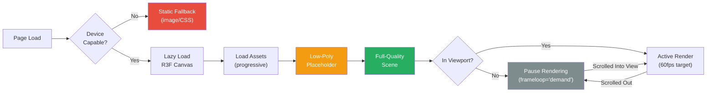
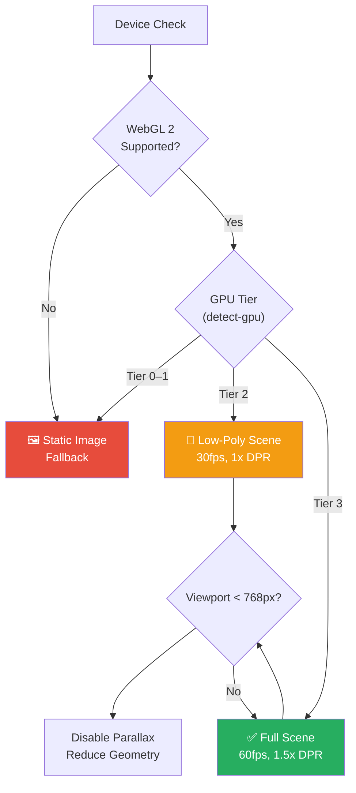

# Three.js & React Three Fiber Guidelines

> Rules for using 3D in the Habib University Preferred Partner platform. Every 3D element must justify its existence.

**Related docs:** [Animation-Guidelines.md](file:///D:/Web%20Projects/HuPrefferedPartner/docs/Animation-Guidelines.md) · [Performance.md](file:///D:/Web%20Projects/HuPrefferedPartner/docs/Performance.md) · [Accessibility.md](file:///D:/Web%20Projects/HuPrefferedPartner/docs/Accessibility.md)

---

## 1. Philosophy: Justify Every Polygon

3D is the most expensive visual feature on the platform. It demands GPU resources, increases bundle size, and creates accessibility barriers. Before adding any 3D element, you must answer **all three**:

1. **Does it communicate something 2D cannot?** — If a gradient, illustration, or CSS transform achieves the same effect, use that instead.
2. **Does the target audience benefit?** — Brand partners and university stakeholders expect polish, not tech demos.
3. **Can it degrade gracefully?** — If the fallback is a broken experience, the 3D element is not approved.

> [!IMPORTANT]
> The bar for 3D is intentionally high. A single poorly-performing WebGL canvas can tank the entire page's Lighthouse score and alienate users on mid-range devices.

---

## 2. Approved Use Cases

| Use Case | Justification | Fallback |
|----------|---------------|----------|
| Hero background (abstract geometry) | Brand identity, first impression | CSS gradient + subtle motion |
| Brand logo showcase (rotating 3D logo) | Premium feel for partner highlight | Static logo with CSS hover effect |
| Interactive data visualization | Spatial data that 2D charts can't convey | 2D chart (Recharts / D3) |
| Scroll-driven scene transitions | Cinematic storytelling for about/impact page | Parallax image sequence |

### Explicitly Prohibited

- **3D navigation menus** — Inaccessible, slow, confusing.
- **3D text rendering** — Use CSS/SVG text. 3D text is heavy and unreadable.
- **Full-page 3D scenes on content-heavy pages** — Catalogue, offers, admin dashboard.
- **3D for the sake of "wow"** — If you can't articulate the communication purpose, it doesn't ship.

---

## 3. Performance Budgets

### Per-Scene Limits

| Metric | Budget | Hard Limit | Measurement |
|--------|--------|------------|-------------|
| Triangle count | < 50K | 100K | `renderer.info.render.triangles` |
| Draw calls | < 30 | 50 | `renderer.info.render.calls` |
| Texture memory | < 20MB | 40MB | `renderer.info.memory.textures` |
| Geometry memory | < 10MB | 20MB | `renderer.info.memory.geometries` |
| Canvas resolution | 1x DPR (mobile) / 1.5x (desktop) | 2x DPR | `renderer.setPixelRatio()` |
| Target framerate | 60fps (desktop) / 30fps (mobile) | — | DevTools Performance |

### Page-Level Limits

| Metric | Budget |
|--------|--------|
| Max active Canvas elements per page | 1 |
| Three.js + R3F bundle size (gzipped) | < 80kB |
| Total 3D asset downloads per page | < 2MB |
| Time to first 3D render | < 2s (with progressive loading) |

> [!WARNING]
> Exceeding triangle or draw-call budgets on mobile **will** cause thermal throttling, dropped frames, and battery drain. Test on real mid-range devices (e.g., Moto G series, Samsung A series).

---

## 4. Rendering Pipeline



---

## 5. React Three Fiber Patterns

### Canvas Setup

```tsx
import { Canvas } from '@react-three/fiber';
import { Suspense } from 'react';

export function Scene3D() {
  const isCapable = useWebGLCapability();
  const reducedMotion = useReducedMotion();

  if (!isCapable) return <StaticFallback />;
  if (reducedMotion) return <StaticFallback />;

  return (
    <ErrorBoundary fallback={<StaticFallback />}>
      <Canvas
        dpr={[1, 1.5]}
        gl={{ antialias: true, alpha: true, powerPreference: 'high-performance' }}
        frameloop="demand"
        camera={{ position: [0, 0, 5], fov: 45 }}
      >
        <Suspense fallback={<LoadingPlaceholder />}>
          <SceneContent />
        </Suspense>
      </Canvas>
    </ErrorBoundary>
  );
}
```

### Required Wrappers

Every `<Canvas>` **must** be wrapped in:

1. **`<ErrorBoundary>`** — Catches WebGL context loss, shader errors, asset failures. Falls back to static content.
2. **`<Suspense>`** — Shows a loading state while assets (models, textures) are streamed.
3. **Device capability check** — Detects WebGL support and GPU tier before mounting Canvas.

### Frame Loop Control

```typescript
// Only render when something changes (saves GPU when static)
frameloop="demand"

// Force a render when needed
invalidate(); // from useThree()
```

- Use `frameloop="demand"` by default. Only switch to `"always"` for continuously animated scenes.
- Call `invalidate()` from interaction handlers, animation callbacks, or after asset loads.

---

## 6. Mobile Fallback Strategy

### Decision Tree



### GPU Tier Detection

```typescript
import { getGPUTier } from 'detect-gpu';

export async function useWebGLCapability(): Promise<boolean> {
  const gpu = await getGPUTier();
  // Tier 0 = no WebGL, Tier 1 = integrated/weak
  return gpu.tier >= 2;
}
```

### Mobile-Specific Rules

- **Max triangles on mobile:** 25K (half the desktop budget).
- **Disable shadows** on mobile entirely.
- **Disable post-processing** (bloom, SSAO) on mobile.
- **Use `1x` DPR** — never `window.devicePixelRatio` on mobile.
- **Pause rendering** when the canvas scrolls out of viewport.

---

## 7. Accessibility

3D content is inherently inaccessible to screen readers, keyboard users, and users with vestibular disorders.

### Requirements

| Requirement | Implementation |
|-------------|----------------|
| Alt content | Every Canvas has an `aria-label` + adjacent `<div>` with text description |
| Keyboard navigation | Interactive 3D elements must have keyboard equivalents |
| Reduced motion | Check `prefers-reduced-motion` — show static fallback |
| Focus management | Canvas must not trap focus; skip-link must bypass 3D sections |
| Screen reader | `role="img"` on Canvas wrapper; meaningful `aria-label` |

```tsx
<div role="img" aria-label="Interactive 3D visualization of Habib University partner brands arranged in a constellation pattern">
  <Canvas aria-hidden="true" tabIndex={-1}>
    {/* 3D content */}
  </Canvas>
</div>
{/* Screen reader alternative */}
<div className="sr-only">
  <p>Our partner brands include Acme Corp, Nova Industries, and 12 others...</p>
</div>
```

---

## 8. Memory Management

WebGL memory leaks are the most common cause of degraded performance over time.

### Dispose Pattern

```typescript
// ✅ Always dispose geometries, materials, and textures
useEffect(() => {
  return () => {
    geometry.dispose();
    material.dispose();
    if (material.map) material.map.dispose();
    if (material.normalMap) material.normalMap.dispose();
  };
}, []);

// ✅ Use drei's useGLTF with dispose
import { useGLTF } from '@react-three/drei';

function Model() {
  const { scene } = useGLTF('/models/brand-logo.glb');
  // drei handles dispose on unmount
  return <primitive object={scene} />;
}

// Preload for instant rendering
useGLTF.preload('/models/brand-logo.glb');
```

### Rules

- **Every `new THREE.Geometry/Material/Texture`** must have a corresponding `.dispose()` call.
- Use `@react-three/drei` hooks (`useGLTF`, `useTexture`) — they handle disposal automatically.
- Monitor `renderer.info.memory` in development — geometries and textures should not grow unbounded.
- On route change, **unmount the Canvas entirely** — don't try to reuse across pages.

> [!CAUTION]
> WebGL context loss is unrecoverable. If the browser reclaims the GPU context (common on mobile under memory pressure), the ErrorBoundary must catch it and show the static fallback. Never attempt to re-initialize a lost context.

---

## 9. Asset Loading Strategy

### Progressive Loading

1. **Immediate:** Render a simple placeholder geometry (colored plane or low-poly shape) with the loading skeleton.
2. **Deferred:** Load the full model/texture via `useGLTF` / `useTexture` inside `<Suspense>`.
3. **Enhanced:** Apply post-processing or high-res textures after first meaningful render.

### Level of Detail (LOD)

```tsx
import { Detailed } from '@react-three/drei';

function BrandLogo({ position }) {
  return (
    <Detailed distances={[0, 10, 25]}>
      <HighDetailModel />   {/* < 10 units away */}
      <MediumDetailModel />  {/* 10–25 units away */}
      <LowDetailModel />     {/* > 25 units away */}
    </Detailed>
  );
}
```

### Instancing

For repeated geometry (particle fields, grid layouts):

```tsx
import { Instances, Instance } from '@react-three/drei';

function ParticleField({ count = 200 }) {
  return (
    <Instances limit={count}>
      <sphereGeometry args={[0.05, 8, 8]} />
      <meshBasicMaterial color="#ffffff" />
      {Array.from({ length: count }, (_, i) => (
        <Instance key={i} position={randomPosition()} />
      ))}
    </Instances>
  );
}
```

- Instancing reduces draw calls from N to 1 for identical geometry.
- Use for any scene with > 10 identical objects.

### Asset Format Rules

| Asset Type | Format | Max Size | Notes |
|------------|--------|----------|-------|
| 3D Models | `.glb` (binary glTF) | 1MB | Use Draco compression |
| Textures | `.webp` or `.ktx2` | 512KB each | Power-of-2 dimensions |
| HDR Environment | `.hdr` | 2MB | Use `@react-three/drei` `Environment` |
| Cube Maps | Compressed `.ktx2` | 1MB total | Prefer equirectangular |

---

## 10. Shader Policies

Custom shaders are powerful but dangerous. They bypass Three.js's built-in optimizations and are difficult to debug.

### Rules

- **Use built-in materials** (`MeshStandardMaterial`, `MeshPhysicalMaterial`) wherever possible.
- Custom shaders require **code review** and performance profiling before merge.
- Keep shader complexity low: max **4 texture lookups** per fragment shader.
- Use `shaderMaterial` from drei for R3F integration, not raw `THREE.ShaderMaterial`.
- All custom shaders must include a `uniform float uTime` for animation and must **pause** when `prefers-reduced-motion` is active.
- **No shader compilation at runtime** — pre-warm shaders by rendering a hidden frame on load.

---

## 11. Testing

### Unit / Integration

- Test 3D wrapper components render without errors.
- Test fallback behavior when `isCapable` returns `false`.
- Test reduced motion path renders static fallback.
- Mock `@react-three/fiber` and `@react-three/drei` in Jest — **do not** run WebGL in CI.

### Visual / Performance

- **Manual testing** on target devices (see device matrix below).
- **Lighthouse CI** must not regress on performance score.
- Monitor `renderer.info` values in dev mode via a debug overlay (drei `Stats` component).

### Target Device Matrix

| Device Class | Example | Expected Behavior |
|-------------|---------|-------------------|
| High-end desktop | M-series Mac, RTX GPU | Full scene, 60fps, post-processing |
| Mid-range desktop | Intel UHD, GTX 1650 | Full scene, 60fps, no post-processing |
| High-end mobile | iPhone 15, Pixel 8 | Simplified scene, 30fps |
| Mid-range mobile | Samsung A54, Moto G | Static fallback or minimal 3D |
| Low-end mobile | Budget Android < $150 | Static fallback only |

---

## 12. File Organization

```
apps/web/src/
├── components/
│   └── 3d/
│       ├── Canvas3D.tsx           # Shared Canvas wrapper (ErrorBoundary + Suspense)
│       ├── scenes/
│       │   ├── HeroScene.tsx      # Landing page hero
│       │   └── BrandShowcase.tsx  # Partner highlight
│       ├── models/
│       │   └── BrandLogo.tsx      # Individual model components
│       ├── effects/
│       │   └── PostProcessing.tsx # Bloom, etc. (desktop only)
│       └── fallbacks/
│           ├── StaticFallback.tsx  # Image/CSS replacement
│           └── LoadingPlaceholder.tsx
├── hooks/
│   ├── useWebGLCapability.ts      # GPU tier detection
│   └── useCanvasInView.ts         # Pause/resume rendering
├── lib/
│   └── three-utils.ts             # Shared helpers, dispose utilities
└── public/
    └── models/
        ├── brand-logo.glb         # Draco-compressed models
        └── hero-geometry.glb
```

---

## 13. Checklist Before Shipping 3D

- [ ] **Justified** — Can articulate why 2D/CSS is insufficient.
- [ ] **Fallback** — Static alternative works on unsupported devices.
- [ ] **Performance** — Within triangle, draw-call, and memory budgets.
- [ ] **Mobile** — Tested on real mid-range device. Degrades gracefully.
- [ ] **Accessibility** — `aria-label`, `role="img"`, `sr-only` text, keyboard bypass.
- [ ] **Reduced motion** — Shows static content when preference is set.
- [ ] **Memory** — All geometries, materials, textures disposed on unmount.
- [ ] **Error boundary** — Canvas wrapped; WebGL context loss handled.
- [ ] **Bundle size** — Three.js tree-shaken; total < 80kB gzipped.
- [ ] **Loading** — Progressive loading with visible placeholder.
