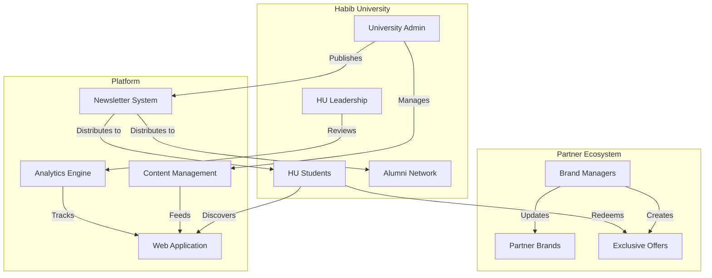

# Vision — HU Preferred Partner Platform

> The strategic vision for Habib University's digital partnership ecosystem.

---

## Mission Statement

**Build a museum-quality digital platform that elevates Habib University's brand partnerships from transactional discount programs into a curated, prestigious ecosystem — one that enhances student life, strengthens partner brands, and reinforces HU's position as Pakistan's most innovative university.**

This is not a coupon aggregator. This is a digital embodiment of Habib University's design ethos: intentional, refined, and deeply considered.

---

## Problem Statement

### The Current State

Brand partnerships at Habib University are managed through fragmented channels: WhatsApp groups, email blasts, notice boards, and word of mouth. This creates several problems:

1. **Discovery Failure** — Students don't know what partnerships exist or what offers are available
2. **Partner Invisibility** — Brands invest in partnerships but have no digital presence within the HU ecosystem
3. **Administrative Overhead** — University staff manually manage partner communications, offer updates, and newsletter distribution
4. **No Measurable Impact** — There's no data on partner engagement, offer redemption, or student satisfaction
5. **Brand Dilution** — The ad-hoc presentation of partnerships doesn't reflect HU's premium brand identity

### The Opportunity

A purpose-built platform transforms partnerships from a static list into a living, interactive ecosystem that serves every stakeholder.

---

## Target Audiences

### Primary

| Audience | Needs | Success Looks Like |
|----------|-------|-------------------|
| **HU Students** | Discover offers, browse partners, access exclusive benefits | Weekly active usage, offer engagement |
| **Partner Brands** | Showcase their brand, manage offers, track engagement | Self-service portal, measurable ROI |
| **University Admin** | Manage partnerships, publish newsletters, view analytics | Reduced manual work, data-driven decisions |

### Secondary

| Audience | Needs | Success Looks Like |
|----------|-------|-------------------|
| **Prospective Students** | See HU's partner ecosystem as a value proposition | Increased enrollment interest |
| **HU Alumni** | Stay connected with partner benefits | Alumni engagement metrics |
| **HU Leadership** | Strategic overview of partnership health | Executive dashboards |

---

## Stakeholder Ecosystem

---

## Strategic Objectives

### O1: Digital Partnership Excellence
**Objective:** Create the definitive digital experience for HU brand partnerships.

| Key Result | Target | Timeline |
|-----------|--------|----------|
| All active partners have digital presence | 100% coverage | MVP |
| Partner pages load in under 2.5 seconds | LCP < 2.5s | MVP |
| Platform design rated as "premium" by stakeholders | >90% approval | V1 |

### O2: Student Engagement
**Objective:** Make the platform a regular touchpoint in student life.

| Key Result | Target | Timeline |
|-----------|--------|----------|
| Monthly active student users | >60% of student body | V1 |
| Average session duration | >2 minutes | V1 |
| Offer engagement rate | >15% of viewed offers | V2 |

### O3: Partner Empowerment
**Objective:** Give brands self-service tools to manage their presence.

| Key Result | Target | Timeline |
|-----------|--------|----------|
| Partners using self-service portal | >80% of active partners | V1 |
| Average time to publish new offer | <5 minutes | V1 |
| Partner satisfaction score | >4.2/5.0 | V2 |

### O4: Administrative Efficiency
**Objective:** Reduce manual overhead for the university team.

| Key Result | Target | Timeline |
|-----------|--------|----------|
| Newsletter creation time | <30 minutes (from hours) | MVP |
| Manual partner management tasks | Reduced by 70% | V1 |
| Data-driven partnership decisions | 100% evidence-based | V2 |

---

## Success Metrics Framework

### North Star Metric
**Partner Ecosystem Health Score** — A composite metric combining:
- Partner coverage (% of partners with active digital presence)
- Student engagement (MAU / total students)
- Offer vitality (% of offers with recent engagement)
- Content freshness (average age of last partner update)

### KPI Dashboard

| Category | Metric | Target | Measurement |
|----------|--------|--------|-------------|
| **Engagement** | Monthly Active Users | 60%+ students | Analytics |
| **Engagement** | Pages per Session | >3 | Analytics |
| **Engagement** | Return Visit Rate | >40% weekly | Analytics |
| **Content** | Active Partner Profiles | 100% coverage | CMS |
| **Content** | Offer Freshness | Updated within 30 days | CMS |
| **Content** | Newsletter Open Rate | >35% | Email analytics |
| **Performance** | Core Web Vitals Pass | All green | Lighthouse CI |
| **Performance** | API P95 Latency | <300ms | Server monitoring |
| **Satisfaction** | Student NPS | >50 | Surveys |
| **Satisfaction** | Partner NPS | >40 | Surveys |

---

## Phased Roadmap

### Phase 1: MVP (Months 1–3)
**Goal:** Launch the public-facing platform with core content.

- ✅ Landing page with hero, brand showcase, value proposition
- ✅ Brand catalogue with search and filtering
- ✅ Individual partner pages with offers
- ✅ Newsletter archive (PDF viewer)
- ✅ Admin CMS for content management
- ✅ Responsive design, accessibility baseline
- ✅ AWS deployment (ECS, RDS, S3, CloudFront)

### Phase 2: V1 — Partner Portal (Months 4–6)
**Goal:** Enable partner self-service and deepen engagement.

- 🔲 Brand portal with authentication
- 🔲 Self-service offer management
- 🔲 Analytics dashboard for partners
- 🔲 Enhanced animations and 3D elements
- 🔲 Newsletter builder with templates
- 🔲 Push notifications for new offers
- 🔲 Student authentication (HU SSO)

### Phase 3: V2 — Intelligence (Months 7–12)
**Goal:** Data-driven partnership optimization.

- 🔲 Recommendation engine for offers
- 🔲 A/B testing framework
- 🔲 Advanced analytics and reporting
- 🔲 Alumni portal integration
- 🔲 Mobile app (React Native)
- 🔲 Partner API for integrations
- 🔲 Automated partnership health monitoring

---

## What This Platform Is NOT

To maintain focus and quality, we explicitly exclude:

| Not This | Why |
|----------|-----|
| A coupon/discount aggregator | We showcase partnerships, not just deals |
| A generic university portal | Purpose-built for partner ecosystem |
| A social media platform | No user-generated content, comments, or feeds |
| An e-commerce store | No transactions happen on-platform |
| A template site | Every element is designed with intention |

---

## Design North Star

> *"If the Victoria and Albert Museum built a website for university partnerships, it would look like this."*

The platform should feel like walking through a curated exhibition — every element placed with intention, generous whitespace guiding the eye, typography carrying the narrative. See [Design Principles](./Design-Principles.md) for the full philosophy.

---

## Related Documentation

- [Architecture](./Architecture.md) — How we build it
- [Tech Stack](./Tech-Stack.md) — What we build with
- [Design Principles](./Design-Principles.md) — How it should feel

---

*Last updated: July 2026*
