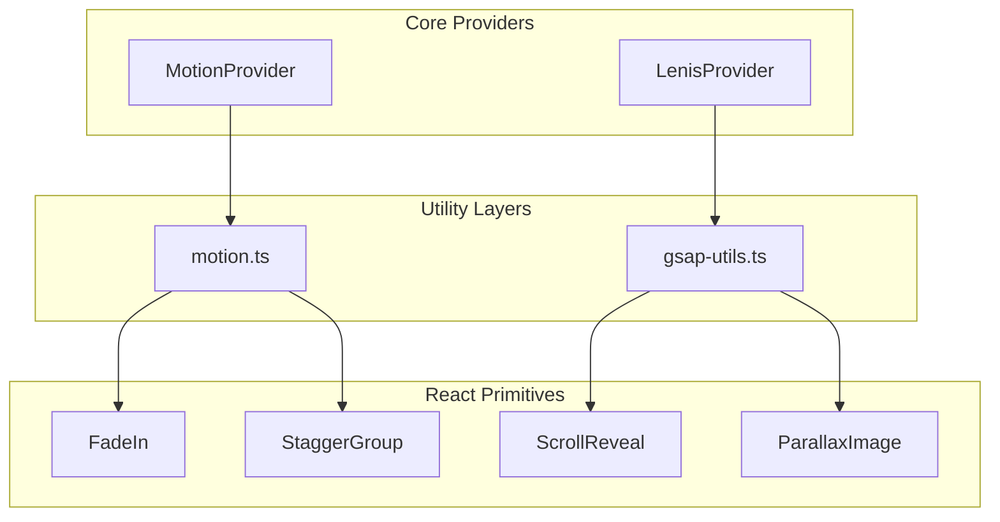
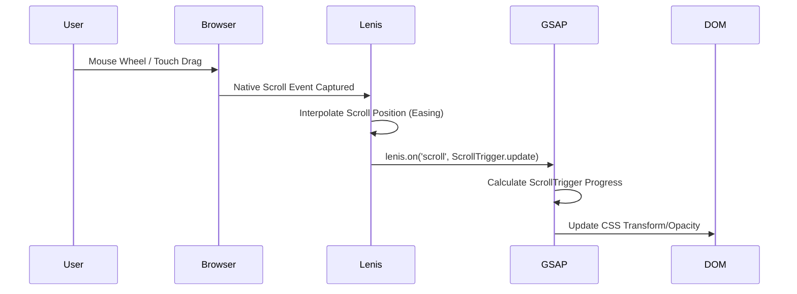

# Architecture: Animation Framework (Master Phase 3 Alignment)

## Repository Realignment Context
This architecture document was produced as a retrospective gap analysis. Because the repository's development progressed into later phases (such as Phase 8 CMS Foundation and Phase 9 Authentication) before strictly completing this phase, this document serves to formally realign the repository with the Master Implementation Plan. It identifies and fulfills the missing animation framework requirements without redesigning or disrupting the already completed features.

## 1. Executive Summary
The Animation Framework acts as the crucial connective tissue between the visual Design System and the user experience. This architecture document formalizes the integration of Framer Motion, GSAP, Lenis, and Three.js to provide a "museum-quality" editorial feel. It outlines a strategy that prioritizes accessibility (reduced-motion), performance (avoiding main-thread blocking), and strict modularity (reusable primitives over bespoke page-level animations).

## 2. Repository Gap Analysis
An audit of the current repository against the Master Plan reveals that while the infrastructural shell was scaffolded during Phase 2, the actual functional primitives and deep integrations are incomplete.

| Subsystem | Master Plan Requirement | Current State | Status |
|-----------|-------------------------|---------------|--------|
| **Framer Motion** | Reusable variants, layout transitions, exit animations | `motion.ts` exists with basic `fadeIn`/`slideUp` variants | 🟡 Partially Complete |
| **GSAP** | Scroll-driven timelines, pinning, parallax | `gsap-utils.ts` exists with basic `createScrollReveal` | 🟡 Partially Complete |
| **Lenis** | Smooth scrolling, GSAP sync, reduced-motion bypass | `LenisProvider.tsx` exists but lacks GSAP sync and accessibility bypass | 🟠 Requires Refactoring |
| **Three.js** | Canvas provider, lazy loading, performance budgets | Stub files exist but lack strict performance boundaries | 🔴 Missing |
| **Primitives** | Shared `<FadeIn>`, `<ScrollReveal>` React components | Utility objects exist, but React wrapper components do not | 🔴 Missing |

## 3. Existing Infrastructure Assessment
- **`MotionProvider.tsx`**: Correctly implements `<MotionConfig reducedMotion="user">`. This is structurally sound and satisfies accessibility baseline requirements.
- **`motion.ts`**: Contains foundational easings (`fast`, `base`, `slow`) and variants. Needs expansion for complex staggered lists and layout morphing.
- **`LenisProvider.tsx`**: Sets up the basic RequestAnimationFrame (RAF) loop. However, it critically misses the integration with GSAP `ScrollTrigger` and fails to check `window.matchMedia('(prefers-reduced-motion: reduce)')` before initializing.
- **`gsap-utils.ts`**: Contains `ScrollTrigger` registration, but needs a centralized context manager (like `@gsap/react` `useGSAP`) to handle cleanup effectively in React 18 Strict Mode.

## 4. Motion Design Principles
1. **Editorial & Deliberate:** Motion should feel curated. Elements should glide smoothly rather than snap aggressively.
2. **Hierarchy of Attention:** Use motion to guide the eye to primary Value Propositions and Partner Offers, not to distract with background noise.
3. **Spatial Awareness:** Elements entering the screen should move in the direction of the scroll (e.g., sliding up when scrolling down).
4. **Performance First:** Exclusively animate `transform` (translate, scale, rotate) and `opacity`. Never animate `width`, `height`, `top`, or `box-shadow` as they trigger expensive layout reflows.

## 5. Animation Architecture

The platform splits animation responsibilities across specific libraries to avoid bloat and utilize the right tool for the job:
- **Framer Motion:** Micro-interactions (hover, tap), layout animations, modal transitions, and route transitions.
- **GSAP + ScrollTrigger:** Macro-interactions, complex scroll-tied narratives, scrubbing timelines, and pinning.
- **Lenis:** Smooth scrolling interpolation.
- **Three.js:** Dedicated WebGL canvas contexts for high-end hero visualizers (strictly lazy-loaded).

## 6. Framer Motion Architecture
- **Tokens:** Driven by `src/lib/motion.ts`. All components must import easings and durations from this file rather than hardcoding them.
- **Route Transitions:** `<AnimatePresence>` must wrap the Next.js `children` in a top-level template file to enable cross-page fade/slide transitions.
- **Shared Layout:** Use `layoutId` strictly for continuous elements navigating between lists and detail views (e.g., Partner Logo moving from Grid to Partner Header).

## 7. GSAP Architecture
- **Context Management:** Use `@gsap/react` to ensure that all timelines are properly reverted on component unmount, preventing memory leaks in the Next.js App Router.
- **Timeline Composition:** Break complex scroll narratives into discrete functional timelines (e.g., `animateHero`, `animateGrid`) and assemble them in a master `useGSAP` hook.
- **Pinning:** Limit pinned sections to desktop viewports (`ScrollTrigger.matchMedia`) to prevent disastrous usability issues on mobile devices.

## 8. Three.js Strategy
- **Isolation:** Three.js code must exist entirely within dynamic imports (`next/dynamic` with `ssr: false`).
- **Fallbacks:** Every WebGL component must accept a static React `fallback` (e.g., an optimized WebP image) that displays while the canvas initializes, or permanently if WebGL fails.
- **Performance:** Pause the render loop (`invalidate`) when the canvas intersects outside the viewport using `framer-motion`'s `useInView` or IntersectionObserver.

## 9. Lenis Strategy
- **GSAP Sync:** Lenis must sync its RAF with GSAP to prevent scroll-trigger jitter:
  ```javascript
  lenis.on('scroll', ScrollTrigger.update)
  gsap.ticker.add((time)=>{ lenis.raf(time * 1000) })
  ```
- **Accessibility:** If the OS requests reduced motion, Lenis must instantly `destroy()` itself or never initialize, reverting the page to native browser scrolling.

## 10. Accessibility Strategy
- **Strict Opt-Out:** Respect `prefers-reduced-motion: reduce`. Framer Motion handles this automatically via `<MotionConfig>`. GSAP timelines must be wrapped in `ScrollTrigger.matchMedia` evaluating the media query.
- **Focus Safety:** Animated elements must not obscure focused inputs. Transitioning dialogs must trap focus only *after* the enter animation completes to prevent screen-reader confusion.

## 11. Performance Strategy
- **CSS `will-change`:** Apply cautiously only to elements undergoing constant mutation.
- **Bundle Splitting:** Only load GSAP on pages that actually require scroll-narratives. For standard UI pages, rely solely on Framer Motion's `m` component and `LazyMotion` to reduce the initial JS payload.
- **Hydration:** Ensure that initial animation states (`initial={...}`) match the SSR rendered CSS to prevent hydration mismatch flashes.

## 12. Reusable Animation Primitive Catalog

*To be implemented in `apps/web/src/components/motion/`:*

- **`<FadeIn>`:** Simple opacity reveal for text blocks.
- **`<StaggerGroup>` / `<StaggerItem>`:** Wrapper for list items (e.g., Partner Cards) that sequence their entrance.
- **`<ScrollReveal>`:** GSAP-powered directional reveal for heavy sections.
- **`<ParallaxImage>`:** Image wrapper that moves at a different scroll speed relative to its container.
- **`<AnimatedNumber>`:** Framer Motion counter for statistical data.
- **`<PageTransition>`:** Template wrapper for App Router page changes.

---

## 13. Architectural Diagrams

### Motion System Architecture



### Scroll Animation Pipeline



---

## 14. Risks, Trade-offs, and Architectural Decisions

| Decision | Rationale | Risk | Mitigation |
|----------|-----------|------|------------|
| **Using both GSAP and Framer Motion** | Framer is best for UI/Layout, GSAP is unmatched for Scroll/Timelines. | Increased bundle size. | Strict code-splitting. Use Framer's `LazyMotion` and dynamic imports for GSAP-heavy pages. |
| **Custom Lenis Implementation** | Required for the premium editorial "museum" feel. | Breaks native accessibility and mobile momentum scrolling if misconfigured. | Disable Lenis completely on touch devices (rely on native) and respect `reduced-motion`. |
| **Server Components Default** | Enforces the "zero JS" baseline rule. | Animations fundamentally require the client (`"use client"`). | Wrap only the specific animated nodes in Client Components; pass static Server Components as `children`. |

---

## 15. Final Implementation Checklist

To complete the Phase 3 Animation Framework implementation, the following tasks must be executed:

- [ ] **Refactor `LenisProvider.tsx`:** Add `prefers-reduced-motion` check and GSAP `ScrollTrigger.update` synchronization.
- [ ] **Refactor `gsap-utils.ts`:** Integrate `@gsap/react` for React 18 safe cleanup.
- [ ] **Create Primitives:** Implement `<FadeIn>`, `<StaggerGroup>`, `<StaggerItem>`, and `<ScrollReveal>` in `src/components/motion/`.
- [ ] **Optimize Bundle:** Refactor `MotionProvider` to utilize `LazyMotion` and `domAnimation` features.
- [ ] **Page Transitions:** Implement a route transition template wrapping the main `(marketing)` and `(platform)` layouts.
