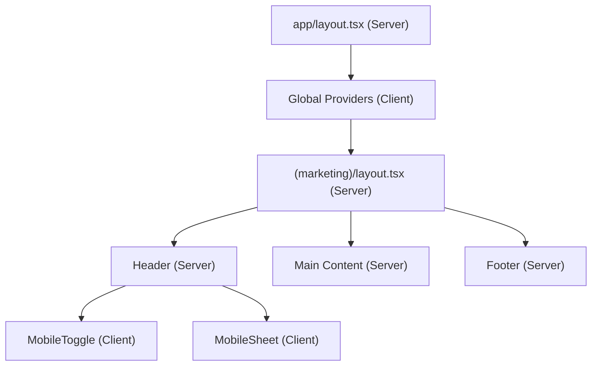

# Phase 2: Application Shell Architecture

> Complete architectural plan for Phase 2: Layout & Navigation.

## 1. Route Architecture

The App Router structure uses **Route Groups** to define the visual shell for different user contexts without injecting segments into the URL path.

```text
app/
├── (marketing)/           # Public-facing brand pages (Home, About, Contact, FAQ)
├── (platform)/            # Student-facing catalog (Partners, Offers, Newsletters)
├── (auth)/                # Authentication flows (Login, Register)
├── (admin)/               # Internal CMS & Management
├── (brand-portal)/        # Partner self-service dashboard
├── api/                   # Backend endpoints (future integrations)
├── layout.tsx             # Root layout (HTML, Body, Global Providers)
├── loading.tsx            # Global fallback skeleton
├── error.tsx              # Global error boundary
└── not-found.tsx          # Global 404 page
```

**Why this exists:**
- **Separation of Concerns:** Each audience (marketing visitor, student, brand, admin) requires a distinct navigation shell. Route groups isolate these layouts.
- **RSC Optimizations:** Grouping allows for highly targeted cache invalidation and targeted loading states without forcing a uniform layout across contexts.

---

## 2. Provider Hierarchy

Providers must be composed carefully to prevent pushing the entire app into client-side rendering.

```tsx
<RootLayout>
  <ThemeProvider>          {/* Handles dark/light mode */}
  <LenisProvider>          {/* Smooth scroll context (Client) */}
  <MotionConfig>           {/* Framer motion global config (Client) */}
  <ThreeProvider>          {/* React Three Fiber canvas (Client - Lazy Loaded) */}
    {/* Future: <AuthProvider> */}
    {/* Future: <AnalyticsProvider> */}
    <ErrorBoundary>
      {children}
    </ErrorBoundary>
  </ThreeProvider>
  </MotionConfig>
  </LenisProvider>
  </ThemeProvider>
</RootLayout>
```

**Ordering Rationale:**
- `ThemeProvider` wraps everything to avoid CSS flashes.
- `LenisProvider` and `MotionConfig` wrap the layout early to ensure scroll metrics and animation easings are globally available.
- `ThreeProvider` sits deep to avoid blocking primary DOM paints.

---

## 3. Layout Hierarchy

1. **Root Layout (`app/layout.tsx`)**
   - **Responsibility:** Injects fonts (`Inter`, `Playfair Display`), applies Tailwind base classes, configures the `<head>` metadata, and wraps the app in core context providers.
2. **Marketing Layout (`(marketing)/layout.tsx`)**
   - **Responsibility:** Contains the primary sticky `Header`, off-canvas `MobileNav`, and the comprehensive `Footer`. Designed for unrestricted vertical scroll.
3. **Platform Layout (`(platform)/layout.tsx`)**
   - **Responsibility:** Contains an authenticated-state header (e.g. search bar, user avatar) and a constrained container size optimized for grid discovery.
4. **Dashboard / Admin Layout (`(admin)/layout.tsx`)**
   - **Responsibility:** Introduces a persistent left-hand sidebar navigation, breadcrumbs, and a top-bar for notifications.
5. **Brand Layout (`(brand-portal)/layout.tsx`)**
   - **Responsibility:** Similar to the Admin layout but branded specifically for partners with isolated metrics.

**Container System & Spacing:**
- **Max Width:** Global `max-w-7xl` (1280px) for standard content, allowing bleed for hero images.
- **Margins:** Responsive horizontal padding (`px-4` on mobile, `md:px-8`, `lg:px-12`).

---

## 4. Navigation Architecture

- **Desktop Navigation:** A sticky `<header>` leveraging `backdrop-blur` mapped to `--surface-page` with alpha transparency. Utilizes Radix UI Navigation Menu for accessible dropdowns.
- **Mobile Navigation:** An off-canvas drawer (using Shadcn `Sheet` / Radix `Dialog`). It enforces a strict **focus trap** when open and disables background scrolling.
- **Scroll Behavior:** Navigations will listen to Lenis scroll events to hide on scroll-down and reveal on scroll-up (improving reading space), adhering to the Anti-AI Slop minimal design.
- **Accessibility:** Requires a hidden "Skip to content" link at the very top of the DOM. All links must be keyboard navigable (`tabIndex={0}`).

---

## 5. Footer Architecture

- **Structure:** A 4-column responsive grid on desktop, collapsing to an accordion or stacked list on mobile.
- **CMS/Newsletter Integration:** A dedicated block for the Newsletter CTA (Phase 7).
- **Partner Links:** Dynamic lists (future-proofed for Phase 8 CMS).
- **Accessibility:** Wrapped in a semantic `<footer>` tag with `aria-labelledby` for its internal navigation sections.

---

## 6. Metadata Strategy

The shell will establish the foundational SEO pipeline:
- **`metadata` export in `layout.tsx`:** Default title templates (`%s | HU Preferred Partner`), default descriptions, and canonical URLs.
- **OpenGraph & Twitter:** Default static fallback images for social sharing.
- **Robots & Sitemap:** `robots.ts` and `sitemap.ts` configured to crawl `(marketing)` and `(platform)` while explicitly blocking `(admin)`, `(brand-portal)`, and `(auth)`.
- **Icons & Manifest:** Apple touch icons and web app manifest for PWA capabilities.

---

## 7. Loading Strategy

- **Suspense Boundaries:** The shell leverages React `<Suspense>` wrapped around heavy components (e.g., specific navigation queries).
- **Skeleton Strategy:** `loading.tsx` will utilize the Shadcn `<Skeleton>` primitive to mimic the layout shape (e.g., a header skeleton, a grid skeleton). No spinners for primary layouts.
- **Streaming:** The shell allows immediate render of the Header/Footer while `children` streams in from the server.

---

## 8. Error Strategy

- **`error.tsx` (Nested):** Catches errors specific to a route segment, allowing the user to click a "Try Again" `reset()` button while keeping the Header/Footer intact.
- **`global-error.tsx`:** Replaces the root layout entirely in case of catastrophic provider or root layout failure.
- **`not-found.tsx`:** A highly curated, editorial 404 page (no generic "page not found").
- **API Errors:** Graceful degradation. If the navigation CMS fails, fallback to hardcoded links rather than crashing the layout.

---

## 9. Motion Strategy

- **Framer Motion Boundaries:** Used strictly for interactive layout elements (e.g., the mobile menu sliding in, dropdowns opening).
- **GSAP Boundaries:** Used strictly for scroll-driven reveals on page content. 
- **Page Transitions:** Coordinated via a template wrapper if necessary, but relies primarily on fast RSC navigation.
- **Reduced Motion:** Every motion component must consult the `useReducedMotion` hook (or CSS `@media (prefers-reduced-motion)`) to snap to end-states for users with accessibility needs.

---

## 10. Performance Strategy

- **Server Components:** The Header, Footer, and Layouts are RSCs. They only pass serialized props to client boundaries.
- **Client Components:** Pushed to the absolute leaves of the tree (e.g., `<MobileMenuToggle />` is a client component, but `<MobileNavLinks />` can be passed as `children` from the server).
- **Dynamic Imports:** Heavy client dependencies like Three.js are loaded via `next/dynamic` so they do not bloat the initial layout bundle.
- **Font Loading:** `next/font/google` with `display: 'swap'` ensures zero Cumulative Layout Shift (CLS).

---

## 11. Accessibility Strategy

- **Keyboard Navigation:** Strict logical tab ordering (Header -> Main Content -> Footer).
- **Skip Links:** `<a href="#main" className="sr-only focus:not-sr-only">Skip to main content</a>`.
- **ARIA Landmarks:** Explicit use of `<header>`, `<nav>`, `<main>`, `<aside>`, and `<footer>`.
- **Focus Restoration:** Closing the mobile menu must return focus to the toggle button.

---

## 12. Future Scalability

This architecture prepares the shell for upcoming phases:
- **Phase 5 (Partner Directory):** The `(platform)` layout constraints provide the exact canvas needed for complex CSS grids.
- **Phase 8 (CMS) & Phase 9 (Auth):** The layout hierarchy is already partitioned, meaning the `(admin)` layout can be safely wrapped in a Server-Side authentication check without blocking the rendering of `(marketing)`.
- **Phase 18 (ThreeJS):** The layout root establishes the non-blocking `<ThreeProvider>` so 3D canvases can persist across page navigations without re-mounting.

---

### Component Hierarchy (Mermaid)


