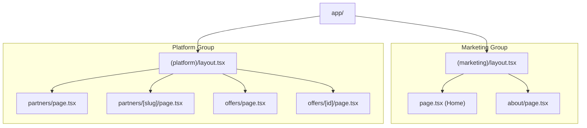
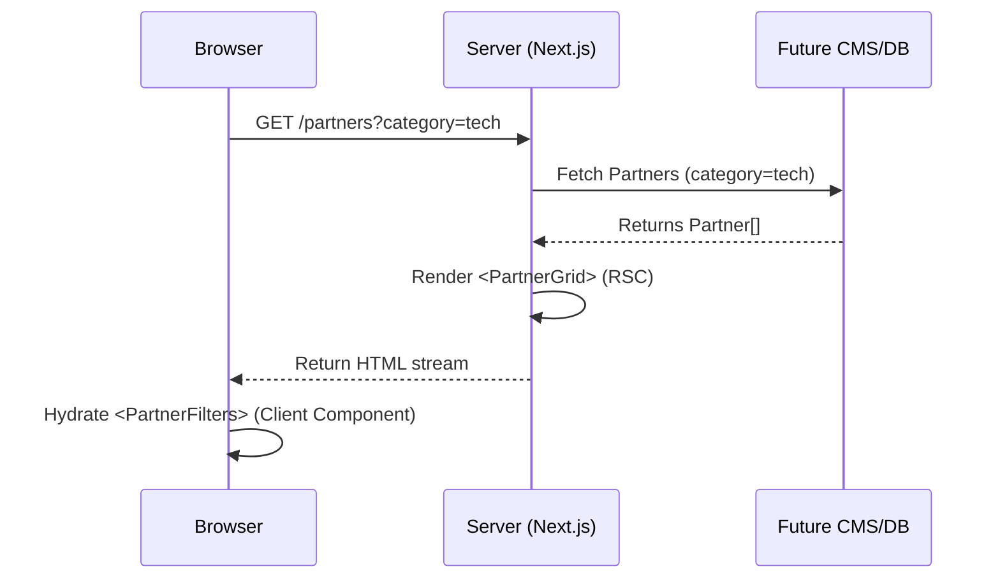

# Phase 3: Marketing Pages Architecture

> Complete architectural plan for the public-facing marketing experience (Home, Partners, Offers, Newsletters, About, Contact).

## 1. Goals

The public-facing marketing pages serve as the primary acquisition funnel and informational hub for Habib University students and prospective brand partners. The architectural goals are:
- **Museum-Quality Presentation:** Deliver an editorial, typography-driven visual experience that honors the Anti AI-Slop design philosophy.
- **Uncompromising Performance:** Achieve sub-second LCP (Largest Contentful Paint) and near-zero CLS (Cumulative Layout Shift) by serving React Server Components by default.
- **SEO & Accessibility Excellence:** Establish pristine structured data (JSON-LD), semantic HTML, and strict WCAG 2.2 AA compliance.
- **Future-Proof Data Binding:** Architect components to seamlessly integrate with the headless CMS (Phase 8) without requiring structural rewrites.

## 2. Design Principles

- **Data Honesty:** No fabricated numbers, no generic stock photo grids, and no "lorem ipsum". Components must gracefully handle empty states.
- **Progressive Enhancement:** Core content must be readable and navigable without JavaScript. Interactivity (like complex filtering or 3D elements) is layered on top.
- **Whitespace as a Feature:** Generous, mathematically sound spacing (Tailwind spacing scale) separates distinct sections.
- **Restrained Motion:** Animations exist solely for orientation, attention, or feedback—respecting `prefers-reduced-motion` at the OS level.

## 3. Route Map

All marketing pages reside within the `(marketing)` and `(platform)` route groups to utilize shared layouts established in Phase 2.

```text
app/
├── (marketing)/
│   ├── page.tsx                  # Home Page (Landing)
│   ├── about/page.tsx            # About / Program Overview
│   ├── contact/page.tsx          # Contact Form
│   └── faq/page.tsx              # Frequently Asked Questions
├── (platform)/
│   ├── partners/
│   │   ├── page.tsx              # Partners Listing (Directory)
│   │   └── [slug]/page.tsx       # Partner Detail Page
│   ├── offers/
│   │   ├── page.tsx              # Offers Listing
│   │   └── [id]/page.tsx         # Offer Detail Page
│   └── newsletters/
│       ├── page.tsx              # Newsletter Index
│       └── [slug]/page.tsx       # Newsletter Detail / PDF Viewer
```

## 4. Layout Hierarchy

- **Marketing Pages (`(marketing)/layout.tsx`):** Unbounded vertical scroll, immersive hero sections, and edge-to-edge imagery.
- **Platform Pages (`(platform)/layout.tsx`):** Constrained `max-w-7xl` container bounds. Optimized for structured data grids, filtering sidebars, and dense informational layouts.

## 5. Component Hierarchy

**Shared Marketing Components:**
- `HeroEditorial`: Typography-focused hero block with a primary headline and optional background asset.
- `ValuePropositionGrid`: Asymmetrical grid highlighting core benefits.
- `SectionHeading`: Standardized H2 block with a short descriptive subhead.
- `EmptyState`: Beautifully designed fallback when data (partners/offers) is missing.

**Domain-Specific Components:**
- **Partners:** `PartnerCard`, `PartnerGrid`, `PartnerHero`, `PartnerOffersList`
- **Offers:** `OfferCard`, `OfferGrid`, `OfferExpirationBadge`, `OfferDetailHeader`
- **Newsletters:** `NewsletterCard`, `NewsletterArchiveList`, `PDFViewerClient` (Client component)

## 6. Data Flow Boundaries

- **Server-Side Fetching:** Pages (`page.tsx`) act as data containers. They fetch data via API services (or CMS SDKs later) and pass serialized data down to UI components as props.
- **Client-Side State:** Only necessary for:
  - Filtering and Search inputs (`PartnerFilters`, `SearchCommand`).
  - Pagination controls.
  - Interactive galleries or PDF viewer rendering.
- **Draft Mode:** Data fetching must account for Next.js `draftMode()` to allow CMS previewing.

## 7. Provider Usage

- **Existing Providers:** Rely on the Phase 2 shell (`ThemeProvider`, `LenisProvider`, `MotionProvider`).
- **No New Global Providers:** Phase 3 requires no new global React Context. Local state (e.g., active filters) will be managed via URL Search Parameters (`?category=food`) to maintain shareability and SSR capabilities.

## 8. SEO and Metadata Strategy

- **Dynamic Metadata:** Every `[slug]/page.tsx` exports a `generateMetadata` function.
- **OpenGraph:** Dynamic `opengraph-image.tsx` generated via `@vercel/og` for partners and offers.
- **JSON-LD (Structured Data):**
  - **Home/About:** `Organization`, `WebSite`.
  - **Partners:** `LocalBusiness` or `Organization`.
  - **Offers:** `Offer` attached to a `Product` or `Service`.
  - **Newsletters:** `Article`.
- **Canonical Links:** Explicit canonical tags to prevent duplicate content penalties from filtered URLs.

## 9. Accessibility Strategy

- **Heading Hierarchy:** Strict `H1` -> `H2` -> `H3` nesting per page.
- **Color Contrast:** Verify all brand colors mapped to partner pages pass WCAG AA over `surface-page` backgrounds.
- **Screen Reader Support:** Use `aria-live="polite"` for dynamic filter results. Ensure `PartnerCard` images have descriptive `alt` tags (or are marked `aria-hidden="true"` if the brand name is in text).

## 10. Motion Strategy

- **Scroll Reveals:** Use GSAP ScrollTrigger (via shared utilities) to stagger `PartnerCard` entrances.
- **Page Transitions:** Keep native browser transitions for simplicity and performance, avoiding heavy single-page-app cross-fades unless specifically requested via Framer Motion's `AnimatePresence`.
- **Hover States:** Fast (150ms) CSS-based transforms for card elevations (`translate-y-[-2px]`).

## 11. Performance Strategy

- **Zero-JS Skeletons:** Rely heavily on CSS and HTML for the initial paint.
- **Debounced Inputs:** Partner/Offer filtering must debounce rapid inputs to avoid thrashing the server/database.
- **Static Generation:** Marketing pages (Home, About) are fully static (`force-static`). Partner and Offer pages utilize Incremental Static Regeneration (ISR) with a revalidation window (e.g., 3600s) until on-demand revalidation (Phase 8) is implemented.

## 12. Image Handling Strategy

- **next/image:** All raster imagery must use `next/image` with strictly defined `sizes` attributes for responsive srcset generation.
- **Formats:** Prefer AVIF and WebP.
- **Logos:** SVG is mandatory for partner logos to maintain crispness on Retina displays. If SVG is unavailable, high-res PNG with `quality={100}` is the fallback.

## 13. Error/Loading Strategy

- **Loading State:** Utilize the `loading.tsx` skeletons built in Phase 2 for route transitions. For dynamic grids (e.g., `PartnerGrid`), render `SkeletonCard` elements matching the expected payload count.
- **Not Found:** If `[slug]` does not exist in the database, call `notFound()` to trigger the editorial 404 page.

## 14. Future Integration Points

- **Phase 8 (CMS):** Hardcoded placeholder data arrays will be replaced by Prisma/API calls.
- **Phase 13 (Search):** The static filter sidebar will be enhanced with PostgreSQL full-text search.
- **Phase 14 (Analytics):** `<Link>` components and CTA buttons will receive `data-track-event` attributes for event delegation.

---

## 15. Diagrams

### Architecture & Routing Diagram



### Component Data Flow (Partner Directory)



---

## 16. Risks and Architectural Decisions

| Decision | Rationale | Risk | Mitigation |
|----------|-----------|------|------------|
| **URL-based Filtering** | Using `?category=X` instead of `useState` ensures shareable links and SSR compatibility. | Slower perceived filtering due to network roundtrips. | Prefetching and optimistic UI updates (via `useTransition`). |
| **ISR over SSR for Details** | Partner details don't change by the second. ISR offers static-site speeds with dynamic data. | Stale data on immediate CMS publish. | Phase 8 will introduce on-demand revalidation webhooks. |
| **No "Coming Soon" States** | If a section has no data, it collapses or shows a designed empty state. | Pages might look sparse at launch. | Emphasize typographic hierarchy and whitespace to make sparse pages feel intentional. |
