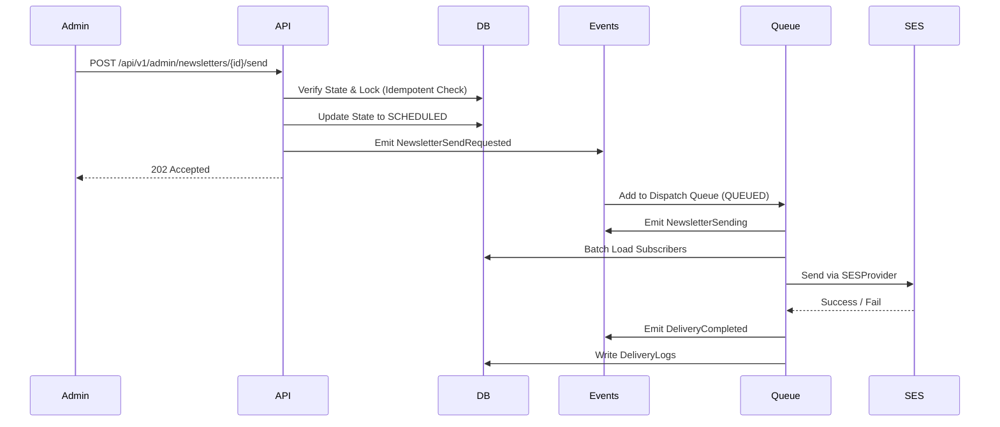

# Architecture: Phase 7 — Newsletter System

## 1. Executive Summary
The Phase 7 Newsletter System architecture defines the robust, event-driven infrastructure required to manage email subscriptions, handle double opt-in verification, deliver newsletters via abstracted providers (AWS SES), and maintain an accessible frontend archive. Integrating deeply with the existing Phase 8 CMS Foundation and Phase 9 Authentication architecture, this blueprint ensures a high-performance, spam-resistant system built for long-term scale and strict observability.

## 2. Goals
- Implement a secure, double opt-in subscription lifecycle using high-entropy SHA-256 hashed tokens.
- Architect an abstracted `EmailProvider` interface (with an initial `SESProvider` implementation) for reliable delivery.
- Establish a strict Domain Event architecture (`EventEmitter` pattern) to decouple newsletter lifecycles from synchronous operations.
- Provide a smooth, accessible frontend experience for subscribing and viewing past issues, respecting the "Anti AI-Slop" philosophy.

## 3. Scope
- **Backend:** `NewslettersModule`, `SubscriptionModule`, `EmailProvider` interface, `SESProvider`, Domain Event dispatching, Queue architecture.
- **Database:** Prisma schema expansion (`NewsletterSubscription`, `NewsletterPreference`, `DeliveryLog`, `EmailVerificationToken`).
- **Frontend:** Server Components for Newsletter archives, optional PDF viewer wrapper, preference management forms.
- **Security:** CSRF protection, endpoint-specific rate limiting, double opt-in, replay protection, HMAC/SHA-256 token hashing.
- **Observability:** Aggressive tracking of queue depths, bounce rates, and conversion metrics.

## 4. Out of Scope
- Marketing email drip campaigns (outside core newsletters).
- Third-party email marketing tools (MailChimp, SendGrid) – relying on raw AWS SES.
- Custom WYSIWYG builders – relying on the existing CMS structured content approach.
- Implementing Phase 13 Search (though metadata indexing is supported).

## 5. Current Repository Analysis
- **CMS Foundation (Phase 8):** `Newsletter` and `NewsletterIssue` models exist.
- **Authentication (Phase 9):** API endpoints are protected by `JwtAuthGuard` and `RolesGuard`.
- **Frontend (Phases 1-6):** The visual shell is built.

## 6. Gap Analysis
- **Missing Models:** Need `NewsletterSubscription`, `NewsletterPreference`, `DeliveryLog`, `EmailVerificationToken`.
- **Missing Abstractions:** Need `EmailProvider` and domain events.
- **Missing Background Processing:** Need a persistent job queue (e.g., BullMQ) with DLQ support.

## 7. Architecture Overview
The system employs an **event-driven, background-processed architecture**. The core principle is that synchronous API calls strictly modify state and emit Domain Events. The background job queues listen to these events (e.g., `NewsletterSendRequested`) and orchestrate the heavy lifting of payload generation and email dispatch. 

### Domain Events Catalog
The system utilizes a central `EventEmitter` to broadcast:
- `NewsletterPublished`
- `NewsletterSendRequested`
- `NewsletterQueued`
- `NewsletterSending`
- `NewsletterSent`
- `DeliveryCompleted`
- `BounceReceived`
- `ComplaintReceived`
- `SubscriptionVerified`
- `SubscriptionUnsubscribed`

## 8. Component Diagram

```mermaid
graph TD
    subgraph Frontend (Next.js)
        SF[Subscription Form]
        NA[Newsletter Archive]
        PM[Preference Management]
    end

    subgraph Backend (NestJS)
        SM[SubscriptionModule]
        NM[NewslettersModule]
        EE[EventEmitter]
        EP[EmailProvider Interface]
        SES[SESProvider]
        JQ[Job Queue / BullMQ]
    end

    subgraph Infrastructure
        DB[(PostgreSQL)]
        AWS_SES[AWS SES]
        S3[AWS S3]
    end

    SF -->|Server Action| SM
    NA -->|RSC Fetch| NM
    PM -->|Server Action| SM
    
    SM -->|Emit| EE
    NM -->|Emit| EE
    
    EE --> JQ
    JQ --> EP
    EP --> SES
    SES --> AWS_SES
    
    NM --> DB
    SM --> DB
    NM --> S3
```

## 9. Sequence Diagrams

### Event-Driven Delivery Flow


## 10. Database Design
- **NewsletterSubscription:** `id`, `email`, `status` (PENDING, ACTIVE, UNSUBSCRIBED), `verifiedAt`.
- **NewsletterPreference:** Tracks user preferences per category.
- **DeliveryLog Lifecycle:** `id`, `issueId`, `subscriptionId`, `status`. 
  - *Scalability:* Partitioned by `createdAt` (e.g., monthly partitions).
  - *Retention:* High-fidelity logs kept for 90 days, then rolled up into aggregate analytics and archived to cold storage.
- **EmailVerificationToken:** Hashed via SHA-256 (not bcrypt, which is too slow for high-volume tokens and unnecessary for high-entropy random strings).

### Newsletter Lifecycle State Machine
`Draft` ➔ `Review` ➔ `Scheduled` ➔ `Queued` ➔ `Sending` ➔ `Sent` ➔ `Archived`

## 11. API Design
All endpoints strictly adhere to the `/api/v1/` repository standard.

### Public Endpoints
- `POST /api/v1/subscriptions` (Rate Limit: 3 / hour / IP)
- `POST /api/v1/subscriptions/verify` (Rate Limit: 10 / hour / IP)
- `POST /api/v1/subscriptions/unsubscribe` (Rate Limit: 10 / minute / IP)
- `GET /api/v1/newsletters` (Rate Limit: 100 / minute / IP)
- `GET /api/v1/newsletters/:slug` (Rate Limit: 100 / minute / IP)

### Admin Endpoints (Protected by `@Roles(ADMIN, EDITOR)`)
- `POST /api/v1/admin/newsletters/:id/send` (Rate Limit: 1 / 10 mins / Newsletter ID). **Crucial:** Must be strictly **idempotent**. Database locks/state checks prevent duplicate queued sends.

## 12. Frontend Architecture
- **Archive Page:** Uses React Server Components (RSC) and ISR.
- **Metadata for Search (Phase 13 Prep):** The frontend and API structures expose `title`, `summary`, `publish date`, and `issue number` in preparation for future ingestion by the search subsystem.

## 13. Backend Architecture: Rendering Pipeline
The canonical rendering pipeline guarantees that HTML is the absolute source of truth.
1. **CMS Content** (Structured JSON/Blocks)
2. ➔ **React Email Template** (Component assembly)
3. ➔ **HTML Output**
4. ➔ **Plain Text** (Auto-generated from HTML for accessibility/deliverability)
5. ➔ **Optional PDF** (Only if requested/required; never the primary source)
6. ➔ **Email Provider**

## 14. Email Delivery Architecture & Retry Strategy
- **Provider Abstraction:** The `EmailProvider` interface allows swapping SES for another service without touching business logic.
- **Retry Policy:** Handled by the Queue (e.g., BullMQ).
  - Attempt 1: Immediate
  - Attempt 2: 30 seconds
  - Attempt 3: 2 minutes
  - Attempt 4: 10 minutes
  - Final: Moved to Dead Letter Queue (DLQ). No infinite retries.

## 15. Security Architecture
- **Verification Tokens:** Cryptographically secure high-entropy random strings, hashed via SHA-256 for DB storage. Strict one-time usage and short expiration windows.
- **Unsubscribe:** Secure, unguessable one-click unsubscribe links supporting standard `List-Unsubscribe` headers.

## 16. Observability & Performance
- **Metrics Tracked:** Queue depth, send duration, delivery success rate, bounce rate, complaint rate, verification conversion rate, unsubscribe rate, scheduler latency.
- **Performance:** Background job processing ensures the main Node event loop is never blocked by SES network latency.

## 17. Accessibility Strategy
- WCAG compliant forms with ARIA live regions.
- Optional PDFs are always backed by the canonical HTML content.

## 18. Deployment Considerations
- Requires Redis for the BullMQ backend.
- SES Production access and domain verification (DKIM, SPF, DMARC) are mandatory.

## 19. Risks
- SES reputation destruction if bounces/complaints are not processed correctly via SNS webhooks.

## 20. Testing Strategy
- Mock implementations of the `EmailProvider` interface to test the Queue and Event Emission logic without touching the network.

## 21. Definition of Done
- Domain Events emit correctly for all state changes.
- Email Provider abstraction implemented.
- DeliveryLogs actively partition.
- Post-send observability metrics hook into the event emitter.
