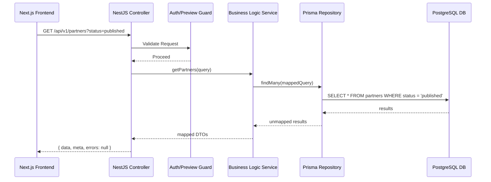
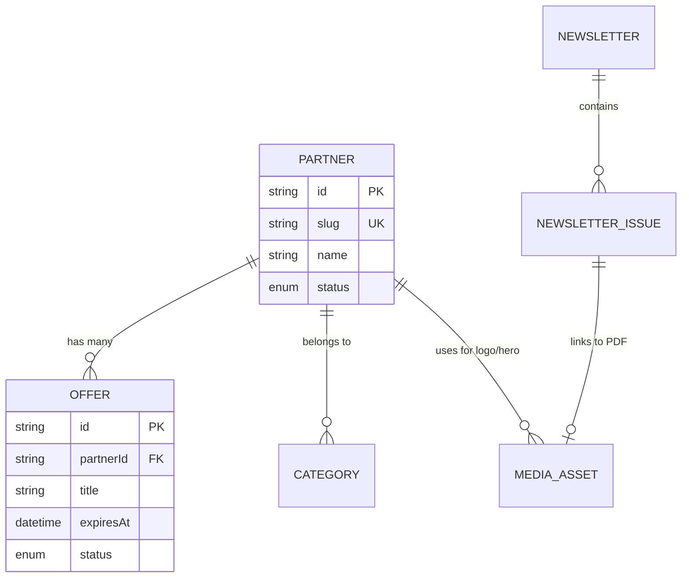
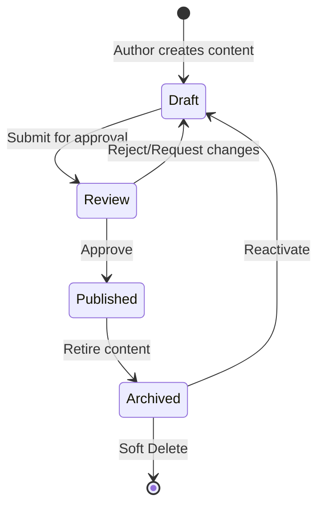

# Phase 8: CMS Foundation Architecture

> Architectural blueprint for the headless CMS foundation powering the Habib University Preferred Partner Platform.

## 1. Goals

The CMS Foundation establishes the backend infrastructure necessary to manage and deliver all dynamic content. Its primary goals are:
- **Headless Content Delivery:** Decouple content management from presentation, exposing a robust RESTful API for the Next.js frontend.
- **Data Integrity and Quality:** Enforce strict validation and editorial workflows to prevent "slop," empty entries, or fabricated data from reaching production.
- **High Performance & Edge Caching:** Architect data access patterns that seamlessly integrate with Next.js Incremental Static Regeneration (ISR).
- **Scalable Media Architecture:** Provide secure, optimized, and robust media storage (AWS S3) and delivery (CloudFront).

## 2. Design Principles

- **Separation of Concerns:** Strict adherence to the Controller-Service-Repository pattern within NestJS modules.
- **Editorial Safety First:** All content adheres to a strict lifecycle (Draft -> Review -> Published). Unapproved content cannot be fetched by public API endpoints.
- **No Fabricated Content:** Database seeders and migrations must use rigorous, deterministic, and realistic dummy data (or strict empty states) rather than low-quality "lorem ipsum."
- **Fail-Safe Integrity:** Enforce referential integrity, soft deletes for historical auditing, and explicit error envelopes.

## 3. High-Level System Architecture

The CMS acts as the core data broker between authorized content authors (via the Admin Dashboard in Phase 10) and the public-facing frontend.

- **Frontend (Consumer):** Next.js App Router (Public routes consume published data, Preview routes consume draft data).
- **Backend (Provider):** NestJS RESTful API serving as a headless CMS.
- **Database Layer:** PostgreSQL managed via Prisma ORM.
- **Storage Layer:** AWS S3 for media assets (images, PDFs) with CloudFront for edge delivery.

## 4. Module Boundaries

The backend is modularized by domain. Each module encapsulates its controllers, services, repositories, and data transfer objects (DTOs).

- **Partners Module:** Manages brand profiles, logos, descriptions, and category associations.
- **Offers Module:** Manages discounts, start/end dates, redemption instructions, and partner linkages.
- **Categories Module:** Manages the taxonomy used to tag and filter partners.
- **Newsletters Module:** Manages campaign metadata, associated PDF issues, and publication dates.
- **Media Module:** Handles file validation, S3 upload streams, signed URL generation, and asset tracking.
- **Pages Module:** Manages dynamic structured data (like the Value Propositions on the About page) and SEO metadata.
- **Preview Module:** Provides short-lived, authenticated tokens to allow the Next.js frontend to bypass the "Published" filter for draft content.

## 5. Entity Relationship Overview

*Relationships are logical and will be enforced via Prisma schema in implementation.*

- **Partner (1) to Many (Offers):** A brand can have multiple active or expired offers.
- **Partner (Many) to Many (Categories):** A brand can belong to multiple categories (e.g., "Food", "Technology").
- **Newsletter (1) to Many (Issues):** A newsletter campaign contains multiple sequential issues.
- **Partner/Offer (1) to Many (Media Assets):** Entities link to specific media records (e.g., Logos, Hero Images) rather than storing raw S3 strings.
- **User (1) to Many (Audit Logs):** System actions (publish, delete) record the authoring user.

## 6. Content Lifecycle

Content entities follow a strict State Machine:

1. **Draft:** The initial state. Content is incomplete or undergoing edits. Not visible on the public API.
2. **Review:** Content is complete and awaiting approval from a manager/admin. Not visible on the public API.
3. **Published:** Content is live. It is returned by public API endpoints and triggers ISR revalidation on the frontend.
4. **Archived:** Content is hidden from public view but retained for historical records and analytics.

*State Transitions:*
- Draft ↔ Review
- Review → Published
- Published → Archived
- Archived → Draft (Reactivation)

## 7. API Architecture

- **Protocol:** REST over HTTPS.
- **Versioning:** URI versioning (e.g., `/api/v1/partners`).
- **Standard Envelope:**
  ```json
  {
    "data": { ... },
    "meta": {
      "pagination": { "page": 1, "limit": 20, "total": 100 }
    },
    "errors": null
  }
  ```
- **Error Response:** Consistent mapping of HTTP status codes (400, 401, 403, 404, 500) with detailed validation messages (via Zod/class-validator) in the `errors` array.
- **Querying:** 
  - *Pagination:* Cursor-based for infinite scroll; Offset-based for data tables.
  - *Filtering:* via query params (e.g., `?category=food&status=published`).
  - *Sorting:* `?sort=-createdAt`.

## 8. Data Flow Diagrams

### Request Lifecycle Diagram



## 9. Media Architecture

- **Upload Flow:** Client requests an upload token/signed URL from the Media Module → Client uploads directly to S3 (bypassing Node.js memory limits) → Client confirms upload to Media Module → DB record created.
- **Validation:** Strict MIME-type checking (SVGs, WebP, AVIF, PDFs) and file size limits enforced at both the API and S3 bucket policy levels.
- **Optimization:** CloudFront serves images, potentially integrated with an image optimization lambda to automatically resize requested assets.

## 10. Security Architecture

- **Input Validation:** All incoming payloads are strictly validated against DTO schemas (stripping unknown properties).
- **Authorization:** While full RBAC is Phase 9, Phase 8 establishes the boundaries. Public endpoints implicitly filter by `status = 'published'`. Draft endpoints require a secure preview token.
- **Rate Limiting:** Protect public read endpoints against scraping.
- **Soft Deletes:** `DELETE` requests flag records (`deletedAt = now()`) rather than destroying rows, preventing accidental data loss and preserving referential integrity for analytics.

## 11. Performance Strategy

- **Database Indexing:** B-Tree indexes on foreign keys (e.g., `partnerId`), status fields, and highly queried columns (e.g., `slug`, `category`).
- **Query Optimization:** Prisma `select` and `include` boundaries must be strictly defined to prevent over-fetching (e.g., don't fetch all offers when listing partners).
- **Pagination Strategy:** Enforce maximum limits (e.g., `limit=100`) on all collection endpoints to prevent memory exhaustion.

## 12. Caching and ISR Strategy

- **Webhooks:** The CMS will expose a webhook mechanism (or direct API call) to the Next.js frontend to trigger On-Demand ISR Revalidation whenever a record transitions to or from the `Published` state.
- **CDN:** Public GET requests to the API are cached at the CloudFront/CDN layer using `Cache-Control` headers, with short TTLs for dynamic queries.

## 13. Error Handling

- **Global Exception Filter:** A unified NestJS exception filter catches `PrismaClientKnownRequestError` (e.g., unique constraint violations) and maps them to user-friendly 400/409 HTTP errors.
- **Not Found:** Fetching an archived or non-existent entity explicitly returns a standard 404 envelope, preventing data leakage.

## 14. Future Extensibility

- **Phase 9 (Auth):** The module boundaries seamlessly accept RBAC Guards on write operations.
- **Phase 13 (Search):** The repository layer will be extended to utilize PostgreSQL `tsvector` full-text search columns.
- **Phase 14 (Analytics):** Read endpoints will fire asynchronous tracking events.

---

## 15. Architectural Diagrams

### Module Architecture

```mermaid
graph TD
    subgraph Frontend
        NextJS["Next.js App Router"]
    end

    subgraph Backend API (NestJS)
        ControllerLayer["Controllers (Routing & DTO Validation)"]
        ServiceLayer["Services (Business Logic & State Machines)"]
        RepoLayer["Prisma Repositories (Data Access)"]
        
        NextJS <-->|REST| ControllerLayer
        ControllerLayer <--> ServiceLayer
        ServiceLayer <--> RepoLayer
    end

    subgraph Infrastructure
        DB[(PostgreSQL)]
        S3[(AWS S3 + CloudFront)]
        
        RepoLayer <--> DB
        ServiceLayer -.->|Generate Signed URLs| S3
        NextJS -->|Fetch Media| S3
    end
```

### Entity Relationships



### Content Publishing Workflow



---

## 16. Risks, Assumptions, and Architectural Decisions

| Decision | Rationale | Risk | Mitigation |
|----------|-----------|------|------------|
| **Headless CMS via NestJS** | Decoupling allows the frontend to be purely presentational and edge-cached, while the backend focuses purely on data integrity and security. | Increased infrastructure complexity (two distinct apps to deploy). | Use Docker Compose for local dev; strict monorepo boundaries via Turborepo. |
| **Soft Deletes by Default** | Preserves historical data for analytics (Phase 14) and prevents cascading deletion catastrophes. | Database bloat over time. | Implement periodic hard-delete cleanup jobs for records older than 5 years. |
| **Direct-to-S3 Uploads** | Prevents Node.js from becoming a bottleneck during large PDF or image uploads. | Malicious file uploads directly to the bucket. | Enforce strict CORS policies on S3, strict bucket limits, and validate media records asynchronously. |
| **Enveloped API Responses** | Ensures clients can predictably parse metadata (like pagination) alongside results, standardizing error handling on the frontend. | Slightly larger payload size. | GZIP/Brotli compression at the API gateway makes the JSON overhead negligible. |
