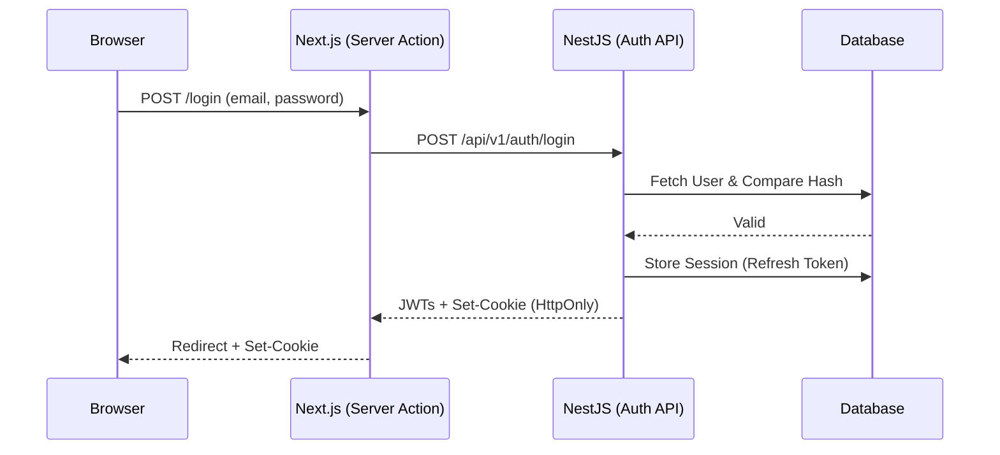
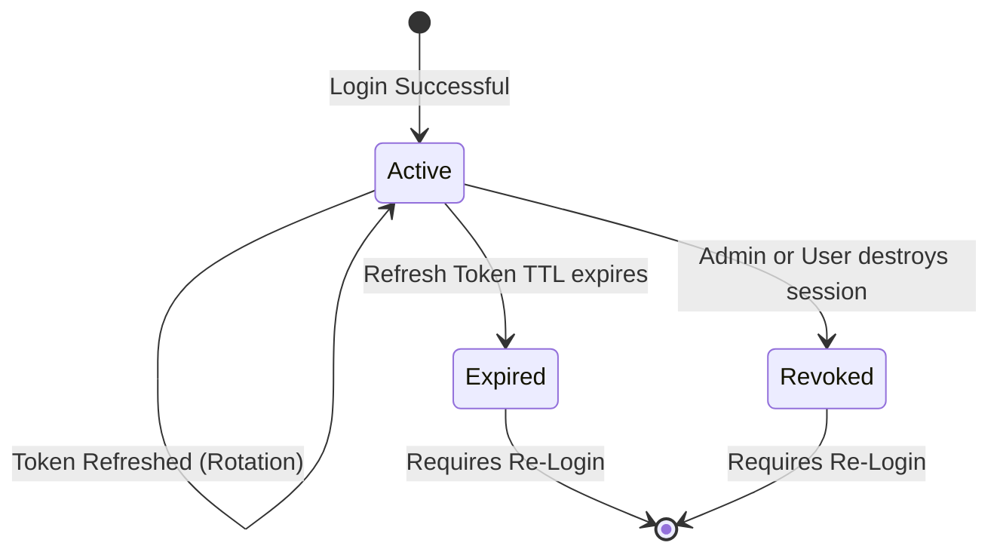
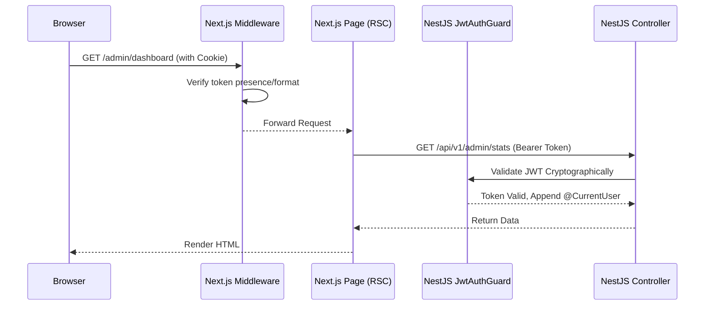
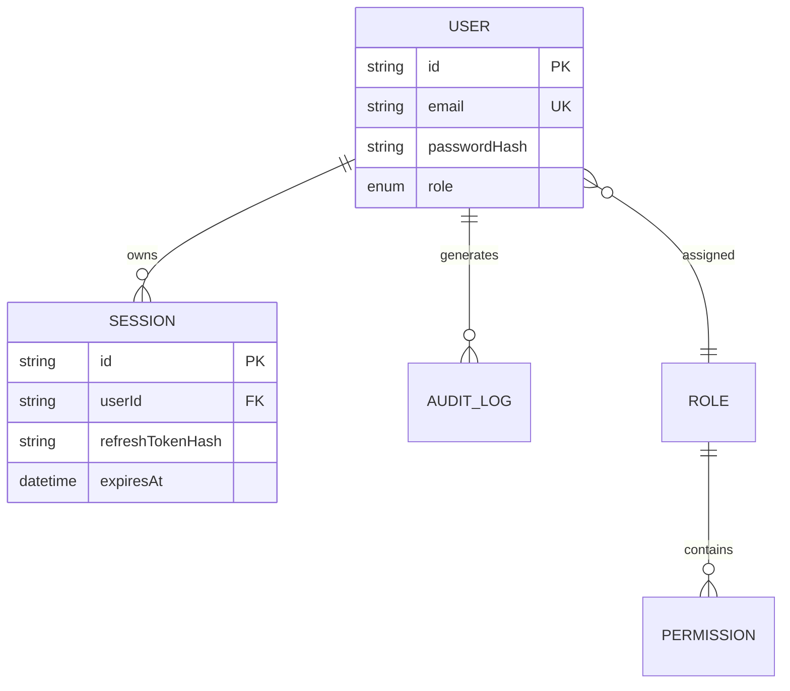

# Phase 9: Authentication & Authorization Architecture

> Architectural blueprint for secure identity, session management, and Role-Based Access Control (RBAC) in the Habib University Preferred Partner Platform.

## 1. Goals

The primary goals of the Authentication and Authorization phase are:
- **Zero-Trust Baseline:** Secure all backend CMS endpoints and frontend platform administrative routes by default.
- **Stateless/Stateful Hybrid:** Utilize stateless JWT access tokens for fast, distributed validation, coupled with stateful Refresh Tokens in the database to enable immediate session revocation.
- **Next.js Alignment:** Architect an auth flow that seamlessly supports Next.js React Server Components (RSC) and Server Actions via secure HttpOnly cookies.
- **Enterprise-Grade Security:** Enforce strict password hashing, brute-force protection, audit logging, and protection against XSS/CSRF vectors.

## 2. Design Principles

- **Security by Default:** Routes require explicit opt-out decorators (e.g., `@Public()`) rather than opt-in, preventing accidental data exposure.
- **Separation of Concerns:** Identity (Users), Authentication (Login/Tokens), and Authorization (Roles/Guards) are isolated domains within the backend.
- **Minimal JavaScript:** Frontend session persistence relies entirely on HTTP cookies rather than `localStorage` or heavy client-side SDKs.
- **Deterministic Traceability:** Every identity transaction (login, failure, role change) must generate an indelible Audit Log.

## 3. Authentication Architecture

- **Token Strategy:** 
  - **Access Tokens:** Short-lived JWTs (e.g., 15 minutes) signed with a robust secret key (RS256 or HS256). These are passed via the `Authorization: Bearer` header for API-to-API calls or extracted from cookies.
  - **Refresh Tokens:** Long-lived, opaque, cryptographically secure random strings (e.g., 7 days).
- **Storage:** 
  - On the web client, both tokens are stored in strict `HttpOnly`, `Secure`, `SameSite=Lax` cookies to mitigate XSS.
- **Token Rotation:** Every time a refresh token is used to acquire a new access token, the old refresh token is invalidated and a new one is issued (Refresh Token Rotation) to detect and prevent token theft replay attacks.

## 4. Authorization Architecture

- **Role-Based Access Control (RBAC):** Users are assigned a definitive `Role`.
- **Resource Ownership:** Authorization is not just global (e.g., "Is the user an admin?") but local (e.g., "Is the user the manager of *this specific* Brand?").
- **Backend Enforcement:**
  - `JwtAuthGuard`: Enforces that a valid Access Token is present.
  - `RolesGuard`: Evaluates the `@Roles()` decorator against the JWT payload.
  - `OwnershipGuard`: Database-aware guard validating that a `BrandManager` can only mutate their assigned `Partner` ID.

## 5. Session Management

- **Lifecycle:** A session is created upon successful password validation. It is represented by a `Session` record in the database tracking the `userId`, `refreshToken`, `device/userAgent`, and `expiresAt`.
- **Revocation:** Because Refresh Tokens are stateful, administrators (or the user themselves) can explicitly delete a `Session` record, immediately preventing new access tokens from being issued.
- **Remember Me:** Controlled via the TTL of the Refresh Token cookie (e.g., 30 days vs session-only).

## 6. RBAC Model

The system utilizes a hierarchical/discrete role model:

| Role | Scope | Description |
|------|-------|-------------|
| **ADMIN** | Global | Full access to all CRUD operations, User Management, and CMS settings. |
| **EDITOR** | Global | Can manage CMS content (Draft/Review/Publish) but cannot manage Users. |
| **BRAND_MANAGER**| Scoped | Can only edit content belonging to their assigned `Partner` ID. |
| **STUDENT** (Future) | Scoped | Read-only access to protected internal platform routes (if applicable). |

## 7. Backend Module Hierarchy

- **AuthModule:** Manages login, logout, password reset, and token generation. Contains `JwtStrategy`, `LocalStrategy`, and the `AuthService`.
- **UsersModule:** Manages identity CRUD, password hashing, and account recovery lifecycle.
- **SessionsModule:** Manages the database tracking of active refresh tokens and device revocation.
- **Common/Guards:** Contains global `JwtAuthGuard`, `RolesGuard`.
- **Common/Decorators:** `@CurrentUser()`, `@Roles()`, `@Public()`.

## 8. Frontend Integration Strategy

- **Authentication Flow:** 
  1. Next.js Server Action handles the login form submission.
  2. The server action calls the NestJS `/api/v1/auth/login` endpoint.
  3. NestJS sets `HttpOnly` cookies on the response.
  4. Next.js passes those cookies back to the browser.
- **Route Protection:** Next.js Middleware (`middleware.ts`) intercepts requests to protected route groups (e.g., `(admin)`, `(brand-portal)`). It validates the presence of the cookie before allowing SSR.
- **Server Components:** Layouts and Pages read the cookie and pass the token to backend API fetch calls.
- **Logout:** Server Action destroys cookies and calls the backend `/logout` endpoint to kill the DB session.

## 9. Security Architecture

- **Password Hashing:** `bcrypt` with a minimum cost factor of 12 (or Argon2id).
- **XSS Mitigation:** Tokens are strictly forbidden from entering `localStorage`.
- **CSRF Mitigation:** Cookie `SameSite=Lax` configuration combined with standard Next.js Server Action CSRF protections.
- **Brute-Force Protection:** Implement NestJS `@nestjs/throttler` specifically targeting the `/auth/login` route (e.g., max 5 attempts per 15 minutes per IP/email).
- **Key Rotation:** Secrets managed via AWS Secrets Manager, allowing seamless key rotation without code deployments.
- **Information Leakage:** Login failures return a generic "Invalid credentials", never confirming if an email exists.

## 10. Performance Strategy

- **Stateless Validation:** `JwtAuthGuard` validates tokens cryptographically without hitting the database, minimizing latency on every authenticated request.
- **Caching:** Role definitions and active user scopes can be temporarily cached in Redis (Phase 19) to speed up complex `OwnershipGuard` checks.
- **SSR Optimization:** Next.js Middleware parsing minimizes heavy database hits during initial page loads by relying on the stateless JWT payload for basic routing decisions.

## 11. Error Handling

- **Generic Responses:** Password resets and logins return generic success messages to prevent email enumeration.
- **Exception Filters:** Unauthorized (401) and Forbidden (403) exceptions are cleanly mapped to standard `{ errors: [...] }` envelopes. Token expiration explicitly returns a custom sub-code so the frontend knows to trigger the silent refresh flow.

## 12. Audit Logging

- Tracked Events: `LOGIN_SUCCESS`, `LOGIN_FAILED`, `PASSWORD_RESET_REQUEST`, `PASSWORD_CHANGED`, `SESSION_REVOKED`, `ROLE_CHANGED`.
- Data Logged: Timestamp, IP address, User-Agent, Target User ID, Actioning User ID (if different).

## 13. Future Extensibility

- **SSO/OAuth:** The `AuthModule` boundaries using Passport.js allow for seamless future integration of Google/Microsoft SSO strategies.
- **API Clients:** Brand partners can eventually be issued long-lived, scoped API keys mapping to the same `JwtStrategy` context.

---

## 14. Architectural Diagrams

### Authentication Flow (Login & Cookies)

### Session Lifecycle & Refresh Flow

### Protected Request Lifecycle

### RBAC Relationships

---

## 15. Risks, Assumptions, and Architectural Decisions

| Decision | Rationale | Risk | Mitigation |
|----------|-----------|------|------------|
| **HttpOnly Cookies for JWTs** | Maximizes protection against XSS payload extraction. | Cross-domain API requests can be complex (CORS). | Web and API are served on the same parent domain/subdomain, mitigating CORS issues. |
| **Refresh Token Rotation** | Crucial for detecting token theft in SPAs. | Concurrent requests may trigger token invalidation (race conditions). | Implement a small grace period (e.g., 30 seconds) on rotated refresh tokens to allow in-flight requests to complete. |
| **JWT Stateless Authorization** | Cryptographic verification eliminates DB lookups on 95% of requests. | Immediate role changes or bans are not reflected until the JWT expires. | Keep JWT lifespan short (15 mins) and force a refresh if the user record indicates a `securityStamp` change. |
| **Next.js Server Actions for Auth** | Moves the complexity of cookie parsing entirely to the server, resulting in 0kb client JS payload for authentication. | Requires Vercel/Node edge runtimes to correctly proxy headers. | Ensure exact header propagation in the Next.js `fetch` wrapper. |
