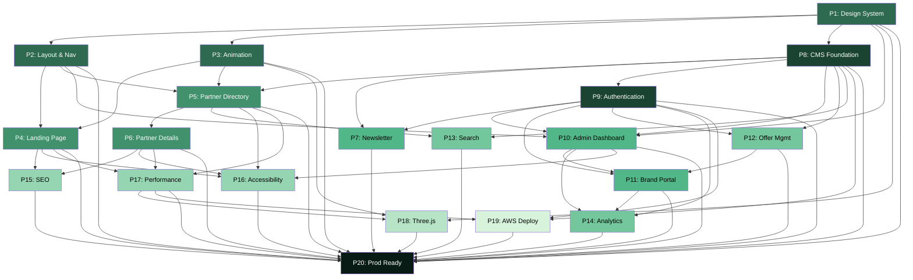
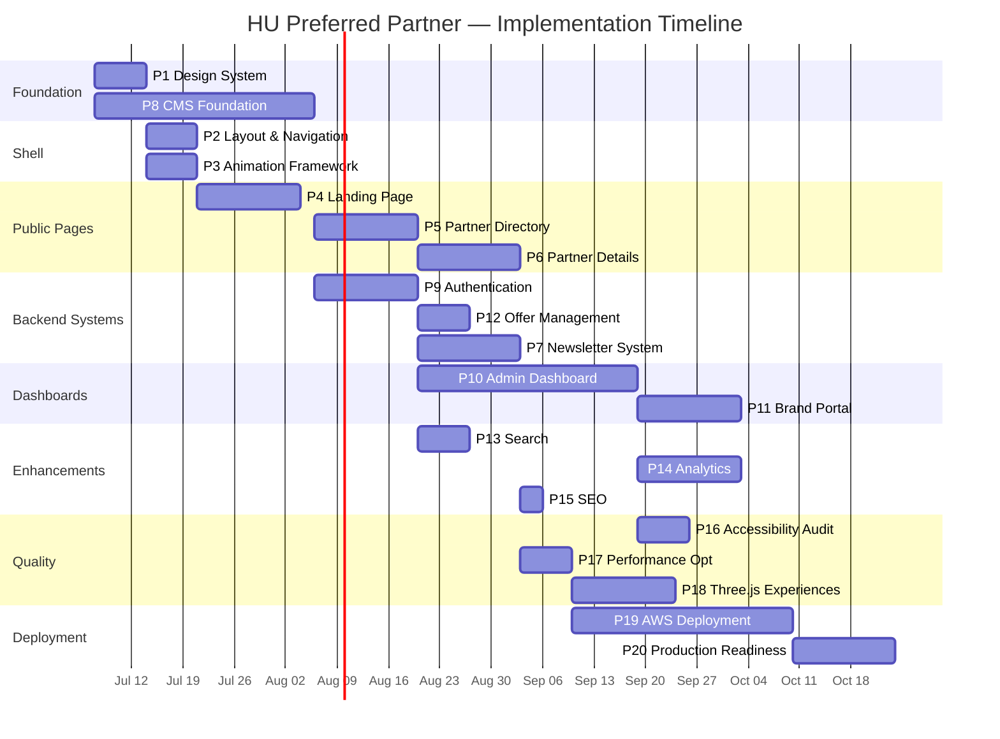

# Master Implementation Plan

> HU Preferred Partner Platform — 20-Phase Development Roadmap

---

## How to Read This Document

Each phase is a self-contained work package. Phases may run in parallel where dependencies allow. The [dependency diagram](#dependency-diagram) and [timeline](#timeline-estimation) at the end visualise the critical path.

**Complexity key:** S = 1–3 days · M = 3–7 days · L = 1–3 weeks · XL = 3–6 weeks

---

## Phase 1 — Design System

| Field | Detail |
|-------|--------|
| **Goal** | Establish a Tailwind-based design token system with shadcn/ui primitives so that every subsequent phase builds on a consistent visual language. |
| **Dependencies** | None — this is the foundation. |
| **Complexity** | **M** (3–7 days) |
| **Deliverables** | `apps/web/tailwind.config.ts` — full theme (colours, spacing, typography scale, radii, shadows) · `apps/web/src/styles/tokens.css` — CSS custom properties · `apps/web/src/styles/typography.css` — font-face declarations and type scale · `packages/ui/` — initial shadcn/ui primitives (Button, Input, Badge, Card, Dialog, Dropdown, Tooltip, Skeleton) · `apps/web/src/styles/globals.css` — reset and base styles |
| **Definition of Done** | ① All colour tokens pass WCAG AA contrast (4.5:1 body / 3:1 large) ② Type scale follows a modular ratio (Major Third 1.250) ③ Dark mode tokens defined alongside light ④ At least 8 shadcn/ui primitives installed and themed ⑤ Storybook or dev page renders all primitives without errors |
| **Suggested AI Specialist** | `design-system-engineer` |
| **Suggested Reviewer** | UI/UX Lead + Accessibility Specialist |
| **Suggested Tests** | Visual regression snapshots of each primitive · Contrast-ratio automated checks · Storybook interaction tests |

---

## Phase 2 — Layout & Navigation

| Field | Detail |
|-------|--------|
| **Goal** | Build the application shell — root layout, header, footer, mobile navigation, and route group layouts — so pages have a consistent frame. |
| **Dependencies** | Phase 1 (Design System) |
| **Complexity** | **M** (3–7 days) |
| **Deliverables** | `apps/web/src/app/layout.tsx` — root layout with font loading, metadata, providers · `apps/web/src/components/layout/Header.tsx` — responsive header with nav links · `apps/web/src/components/layout/Footer.tsx` — footer with links and brand mark · `apps/web/src/components/layout/MobileNav.tsx` — off-canvas mobile navigation · `apps/web/src/app/(public)/layout.tsx` — public route group layout · `apps/web/src/app/(auth)/layout.tsx` — auth route group layout · `apps/web/src/app/not-found.tsx` — custom 404 page |
| **Definition of Done** | ① Header is sticky, collapses gracefully below 768px ② Mobile nav opens/closes with accessible focus trap ③ Skip-to-content link present and functional ④ Active route is visually indicated ⑤ Footer renders at page bottom (not viewport bottom) on short pages ⑥ All layouts pass axe-core automated audit |
| **Suggested AI Specialist** | `frontend-engineer` |
| **Suggested Reviewer** | Frontend Lead + Accessibility Specialist |
| **Suggested Tests** | Responsive viewport tests (320px, 768px, 1280px, 1920px) · Keyboard navigation audit · axe-core integration tests |

---

## Phase 3 — Animation Framework

| Field | Detail |
|-------|--------|
| **Goal** | Create reusable animation utilities and motion variants so all future pages animate consistently and respect user preferences. |
| **Dependencies** | Phase 1 (Design System), Phase 2 (Layout & Navigation) |
| **Complexity** | **M** (3–7 days) |
| **Deliverables** | `apps/web/src/lib/motion.ts` — Framer Motion variant presets (fadeIn, slideUp, staggerChildren, scaleIn, etc.) · `apps/web/src/lib/gsap-utils.ts` — GSAP ScrollTrigger helpers and timeline factories · `apps/web/src/lib/lenis.ts` — Lenis smooth-scroll initialisation and cleanup · `apps/web/src/components/shared/MotionWrapper.tsx` — generic scroll-triggered reveal wrapper · `apps/web/src/hooks/useReducedMotion.ts` — `prefers-reduced-motion` hook · `apps/web/src/hooks/useSmoothScroll.ts` — Lenis integration hook |
| **Definition of Done** | ① All motion variants honour `prefers-reduced-motion` (instant or no animation) ② Scroll-triggered animations fire once on enter, do not replay on scroll-back ③ Lenis smooth scroll initialises without layout thrash ④ GSAP and Framer Motion do not conflict when used on the same page ⑤ No animation uses `width`, `height`, `top`, or `left` — only `transform` and `opacity` |
| **Suggested AI Specialist** | `animation-engineer` |
| **Suggested Reviewer** | Frontend Lead + Performance Engineer |
| **Suggested Tests** | Manual reduced-motion test (OS toggle) · Performance profiler: no frames >16ms during scroll · Unit tests for motion variant outputs |

---

## Phase 4 — Landing Page

| Field | Detail |
|-------|--------|
| **Goal** | Build the typography-driven landing page with hero, featured partners section, and value proposition — using real CMS data or graceful empty states (no fake content). |
| **Dependencies** | Phase 1, Phase 2, Phase 3 |
| **Complexity** | **L** (1–3 weeks) |
| **Deliverables** | `apps/web/src/app/(public)/page.tsx` — landing page (Server Component) · `apps/web/src/components/sections/Hero.tsx` — editorial hero with typographic focus · `apps/web/src/components/sections/FeaturedPartners.tsx` — dynamic partner showcase (or empty state) · `apps/web/src/components/sections/ValueProposition.tsx` — university partnership benefits · `apps/web/src/components/sections/NewsletterCTA.tsx` — newsletter signup prompt · Responsive layout for all breakpoints |
| **Definition of Done** | ① Hero headline uses the display typeface at the correct scale ② Featured partners section renders real data from API or shows designed empty state — zero lorem ipsum ③ LCP < 2.5s on 4G throttled connection ④ Page passes Lighthouse accessibility audit (score ≥ 95) ⑤ Scroll-triggered entrance animations fire correctly ⑥ Page is fully responsive (mobile-first) |
| **Suggested AI Specialist** | `frontend-engineer` + `animation-engineer` |
| **Suggested Reviewer** | UI/UX Lead + Design Principles Owner |
| **Suggested Tests** | Lighthouse CI checks (Performance ≥ 90, Accessibility ≥ 95) · Visual regression snapshot · Empty-state render test (0 partners) |

---

## Phase 5 — Partner Directory

| Field | Detail |
|-------|--------|
| **Goal** | Build a filterable, searchable, paginated partner grid that students use to discover brands. |
| **Dependencies** | Phase 1, Phase 2, Phase 3, Phase 8 (CMS Foundation — partial: needs data models) |
| **Complexity** | **L** (1–3 weeks) |
| **Deliverables** | `apps/web/src/app/(public)/partners/page.tsx` — partner directory page · `apps/web/src/app/(public)/partners/loading.tsx` — skeleton grid · `apps/web/src/components/sections/PartnerGrid.tsx` — responsive card grid · `apps/web/src/components/sections/PartnerFilters.tsx` — category/tag filters · `apps/web/src/components/sections/PartnerSearch.tsx` — search input with debounce · `apps/web/src/components/shared/Pagination.tsx` — cursor-based pagination · `apps/web/src/components/shared/EmptyState.tsx` — designed empty state for zero results |
| **Definition of Done** | ① Grid displays real partner data from API ② Filters narrow results by category without page reload ③ Search input debounces at 300ms ④ Pagination loads next set without full page refresh ⑤ Empty state renders when 0 results match ⑥ Loading skeleton matches the shape of real content ⑦ URL query params reflect active filters (shareable URLs) |
| **Suggested AI Specialist** | `frontend-engineer` |
| **Suggested Reviewer** | Frontend Lead + Backend Engineer (API contract) |
| **Suggested Tests** | Integration tests: filter + search combinations · Empty state unit test · Pagination boundary tests (first page, last page, out-of-range) · Performance: <100ms client-side filter |

---

## Phase 6 — Partner Detail Pages

| Field | Detail |
|-------|--------|
| **Goal** | Create dynamic `[slug]` routes that display full partner information, active offers, and brand identity. |
| **Dependencies** | Phase 1, Phase 2, Phase 3, Phase 5 (Partner Directory) |
| **Complexity** | **L** (1–3 weeks) |
| **Deliverables** | `apps/web/src/app/(public)/partners/[slug]/page.tsx` — dynamic partner detail · `apps/web/src/app/(public)/partners/[slug]/loading.tsx` — partner detail skeleton · `apps/web/src/components/sections/PartnerHero.tsx` — brand hero with logo, description, identity colours · `apps/web/src/components/sections/PartnerOffers.tsx` — active offers list with expiration badges · `apps/web/src/components/sections/PartnerAbout.tsx` — brand story and metadata · `apps/web/src/app/(public)/partners/[slug]/not-found.tsx` — partner 404 |
| **Definition of Done** | ① Dynamic route resolves partner by slug via API ② Partner page displays brand logo with typographic fallback on failure ③ Offers show real expiration dates with relative-time display ④ Invalid slug returns designed 404, not a crash ⑤ `generateMetadata` produces correct Open Graph tags per partner ⑥ Page is ISR-compatible (revalidates on content change) |
| **Suggested AI Specialist** | `frontend-engineer` |
| **Suggested Reviewer** | Frontend Lead + SEO Specialist |
| **Suggested Tests** | Dynamic route rendering test (valid slug, invalid slug) · Metadata generation test · ISR revalidation test · Image fallback test |

---

## Phase 7 — Newsletter System

| Field | Detail |
|-------|--------|
| **Goal** | Build end-to-end newsletter subscription, preference management, and delivery pipeline. |
| **Dependencies** | Phase 8 (CMS Foundation), Phase 9 (Authentication) |
| **Complexity** | **L** (1–3 weeks) |
| **Deliverables** | `apps/api/src/modules/newsletters/` — NestJS module (controller, service, repository, DTOs) · `apps/web/src/app/(public)/newsletters/page.tsx` — newsletter archive page · `apps/web/src/components/sections/NewsletterSubscribe.tsx` — subscription form · `apps/web/src/components/sections/NewsletterArchive.tsx` — past newsletters with PDF viewer · `prisma/schema.prisma` updates — Subscription and Newsletter models · Email template system (MJML or React Email) · Newsletter delivery service (SES integration) |
| **Definition of Done** | ① Users can subscribe with email + preferences ② Unsubscribe link works in one click ③ Admin can compose and send newsletters ④ Newsletter archive displays past issues ⑤ PDF newsletters render inline, no forced download ⑥ Delivery pipeline sends via AWS SES with bounce handling ⑦ Double opt-in flow for GDPR compliance |
| **Suggested AI Specialist** | `backend-engineer` + `frontend-engineer` |
| **Suggested Reviewer** | Backend Lead + Security Specialist |
| **Suggested Tests** | E2E: subscribe → verify → receive · Bounce handling unit test · Unsubscribe flow test · Email template rendering tests |

---

## Phase 8 — CMS Foundation

| Field | Detail |
|-------|--------|
| **Goal** | Establish content models, headless CMS integration, and draft/publish workflow so all content is managed, not hard-coded. |
| **Dependencies** | Phase 1 (Design System — for preview rendering) |
| **Complexity** | **XL** (3–6 weeks) |
| **Deliverables** | `prisma/schema.prisma` — full data models (Partner, Offer, Category, Newsletter, Page, Media) · `prisma/migrations/` — initial migration files · `prisma/seed.ts` — seed script with realistic sample data · `apps/api/src/modules/brands/` — NestJS brand/partner CRUD module · `apps/api/src/modules/offers/` — NestJS offer CRUD module · `apps/api/src/modules/categories/` — category management · CMS preview API route for draft content · Draft/publish state machine (draft → review → published → archived) |
| **Definition of Done** | ① Prisma schema compiles and migrates cleanly ② Seed script populates database with realistic (not fake) partner data ③ CRUD endpoints pass request validation via Zod DTOs ④ Draft content is accessible only in preview mode ⑤ Published content is cached and served via ISR ⑥ Media uploads go to S3 with signed URLs ⑦ API responses follow the `{ data, meta, errors }` envelope |
| **Suggested AI Specialist** | `backend-engineer` + `database-engineer` |
| **Suggested Reviewer** | Backend Lead + Architecture Owner |
| **Suggested Tests** | Prisma migration rollback test · CRUD integration tests (create, read, update, delete, list) · Draft/publish state transition tests · Seed idempotency test |

---

## Phase 9 — Authentication

| Field | Detail |
|-------|--------|
| **Goal** | Implement JWT-based authentication with role-based access control (RBAC) supporting admin, brand-manager, and student roles. |
| **Dependencies** | Phase 8 (CMS Foundation — User model) |
| **Complexity** | **L** (1–3 weeks) |
| **Deliverables** | `apps/api/src/modules/auth/` — full auth module (JWT strategy, refresh tokens, guards) · `apps/web/src/app/(auth)/login/page.tsx` — login page · `apps/web/src/app/(auth)/register/page.tsx` — registration page · `apps/web/src/lib/auth.ts` — client-side auth utilities · `apps/api/src/common/guards/roles.guard.ts` — RBAC guard · `apps/api/src/common/decorators/roles.decorator.ts` — `@Roles()` decorator · `prisma/schema.prisma` updates — User, Session, Role models · Password reset flow (token-based) |
| **Definition of Done** | ① Login returns JWT access + refresh token pair ② Refresh token rotation works (old tokens invalidated) ③ RBAC guard blocks unauthorised routes (returns 403) ④ Password is hashed with bcrypt (cost factor ≥ 12) ⑤ Rate limiting on login endpoint (5 attempts / 15 min) ⑥ Session invalidation on password change ⑦ CSRF protection on cookie-based sessions |
| **Suggested AI Specialist** | `backend-engineer` + `security-engineer` |
| **Suggested Reviewer** | Security Specialist + Backend Lead |
| **Suggested Tests** | Auth flow E2E (register → login → access protected → refresh → logout) · RBAC unit tests per role · Rate-limit integration test · Token expiration test |

---

## Phase 10 — Admin Dashboard

| Field | Detail |
|-------|--------|
| **Status** | ✅ **COMPLETE** |
| **Goal** | Build the internal admin dashboard for partner CRUD, offer management, user management, and platform overview. |
| **Dependencies** | Phase 1, Phase 2, Phase 8 (CMS), Phase 9 (Authentication) |
| **Complexity** | **XL** (3–6 weeks) |
| **Deliverables** | `apps/web/src/app/admin/layout.tsx` — admin shell with sidebar navigation · `apps/web/src/app/admin/page.tsx` — dashboard overview (real stats or empty states) · `apps/web/src/app/admin/partners/` — partner CRUD pages (list, create, edit) · `apps/web/src/app/admin/offers/` — offer management pages · `apps/web/src/app/admin/users/` — user management pages · `apps/web/src/app/admin/newsletters/` — newsletter compose and send · `apps/web/src/components/data-display/DataTable.tsx` — sortable, filterable data table · Form components for all CRUD operations |
| **Definition of Done** | ① Admin dashboard is only accessible to `admin` role ② Partner CRUD: create, read, update, delete, search, filter ③ Offer CRUD with scheduling (start/end dates) ④ User management: list, role assignment, deactivation ⑤ Dashboard overview shows real aggregate data ⑥ All forms validate client-side (Zod) and server-side ⑦ Optimistic UI updates with error rollback |
| **Suggested AI Specialist** | `frontend-engineer` + `backend-engineer` |
| **Suggested Reviewer** | Full-Stack Lead + UI/UX Lead |
| **Suggested Tests** | RBAC access control E2E · CRUD operation integration tests · Form validation edge cases · Data table sorting/filtering tests |

---

## Phase 11 — Brand Portal

| Field | Detail |
|-------|--------|
| **Status** | ✅ **COMPLETE** |
| **Goal** | Give partner brands a self-service portal to manage their profile, create offers, and view engagement analytics. |
| **Dependencies** | Phase 9 (Authentication), Phase 10 (Admin Dashboard — shares patterns), Phase 12 (Offer Management) |
| **Complexity** | **L** (1–3 weeks) |
| **Deliverables** | `apps/web/src/app/portal/layout.tsx` — brand portal shell · `apps/web/src/app/portal/page.tsx` — portal dashboard · `apps/web/src/app/portal/profile/page.tsx` — brand profile editor · `apps/web/src/app/portal/offers/` — offer management (CRUD for own offers) · `apps/web/src/app/portal/analytics/page.tsx` — engagement analytics view · `apps/api/src/modules/brands/` updates — brand-manager scoped endpoints |
| **Definition of Done** | ① Brand managers can only access/edit their own brand's data ② Profile edits go through draft → review → published workflow ③ Offer creation includes preview before publish ④ Analytics page shows offer views, engagement, and trends ⑤ Portal is responsive and mobile-accessible ⑥ File uploads (logos, images) go to S3 with size/type validation |
| **Suggested AI Specialist** | `frontend-engineer` + `backend-engineer` |
| **Suggested Reviewer** | Product Owner + Security Specialist |
| **Suggested Tests** | Data isolation tests (brand A cannot see brand B's data) · File upload validation tests · Analytics data accuracy tests |

---

## Phase 12 — Offer Management

| Field | Detail |
|-------|--------|
| **Goal** | Build full-lifecycle offer management: creation, scheduling, expiration, validation, and archival. |
| **Dependencies** | Phase 8 (CMS Foundation), Phase 9 (Authentication) |
| **Complexity** | **M** (3–7 days) |
| **Deliverables** | `apps/api/src/modules/offers/` — enhanced offer module with scheduling · `apps/api/src/modules/offers/offer-scheduler.service.ts` — cron-based expiration handler · `prisma/schema.prisma` updates — Offer model with status enum (draft, active, expired, archived) · Offer validation rules (date range, required fields, category assignment) · Offer notification service (alert admins on expiration) |
| **Definition of Done** | ① Offers support start and end dates with timezone handling ② Expired offers are automatically marked (cron job or event-driven) ③ Offers cannot be published without required fields ④ Offer status transitions follow defined state machine ⑤ Admin receives notification 7 days before expiration ⑥ Archived offers are excluded from public queries but retained in database |
| **Suggested AI Specialist** | `backend-engineer` |
| **Suggested Reviewer** | Backend Lead + Product Owner |
| **Suggested Tests** | Scheduling unit tests (timezone edge cases) · State transition tests · Expiration cron integration test · Validation rejection tests |

---

## Phase 13 — Search

| Field | Detail |
|-------|--------|
| **Goal** | Implement full-text search with filters and autocomplete across partners and offers. |
| **Dependencies** | Phase 5 (Partner Directory), Phase 8 (CMS Foundation) |
| **Complexity** | **M** (3–7 days) |
| **Deliverables** | `apps/api/src/modules/search/` — search module with PostgreSQL full-text search (tsvector/tsquery) · `apps/api/src/modules/search/search.controller.ts` — unified search endpoint · `apps/web/src/components/shared/SearchCommand.tsx` — command palette (⌘K) style search · `apps/web/src/hooks/useSearch.ts` — debounced search hook with SWR · Autocomplete suggestions endpoint · Search result highlighting |
| **Definition of Done** | ① Search returns results in <200ms for typical queries ② Autocomplete suggests results after 2+ characters ③ Results are ranked by relevance ④ Search works across partners and offers ⑤ Filters (category, status, date range) compose with search ⑥ No results state is handled gracefully ⑦ Command palette accessible via ⌘K / Ctrl+K |
| **Suggested AI Specialist** | `backend-engineer` + `frontend-engineer` |
| **Suggested Reviewer** | Backend Lead + UX Designer |
| **Suggested Tests** | Search relevance tests (expected ranking) · Autocomplete latency test · Edge cases: special characters, empty query, very long query · Load test: concurrent search requests |

---

## Phase 14 — Analytics

| Field | Detail |
|-------|--------|
| **Goal** | Build event tracking, engagement dashboards, and reporting for admins and partners. |
| **Dependencies** | Phase 9 (Authentication), Phase 10 (Admin Dashboard), Phase 11 (Brand Portal) |
| **Complexity** | **L** (1–3 weeks) |
| **Deliverables** | `apps/api/src/modules/analytics/` — analytics module (event ingestion, aggregation, reporting) · `apps/web/src/app/admin/analytics/page.tsx` — admin analytics dashboard · `apps/web/src/components/data-display/Chart.tsx` — chart components (line, bar, pie) · Event tracking middleware (page views, offer clicks, search queries) · `prisma/schema.prisma` updates — Event, Metric models · CSV/PDF export for reports |
| **Definition of Done** | ① Page view events tracked automatically via middleware ② Offer engagement (view, click-through) tracked per partner ③ Admin dashboard shows MAU, offer engagement rate, top partners ④ Partner portal shows their own engagement metrics ⑤ Data can be exported as CSV ⑥ Analytics data is anonymised (no PII in events) ⑦ Dashboard charts render with real data or show empty state |
| **Suggested AI Specialist** | `backend-engineer` + `data-engineer` |
| **Suggested Reviewer** | Product Owner + Privacy/Security Specialist |
| **Suggested Tests** | Event ingestion load test · Aggregation accuracy tests · Dashboard rendering with 0 data · CSV export format validation |

---

## Phase 15 — SEO

| Field | Detail |
|-------|--------|
| **Goal** | Implement comprehensive SEO: dynamic metadata, structured data (JSON-LD), sitemap, robots.txt, and Open Graph images. |
| **Dependencies** | Phase 4 (Landing Page), Phase 6 (Partner Detail Pages) |
| **Complexity** | **S** (1–3 days) |
| **Deliverables** | `apps/web/src/app/sitemap.ts` — dynamic sitemap generation · `apps/web/src/app/robots.ts` — robots.txt configuration · `apps/web/src/lib/metadata.ts` — shared metadata generation utility · `apps/web/src/app/opengraph-image.tsx` — dynamic OG image generation · JSON-LD structured data for Organisation, Offer, BreadcrumbList · `generateMetadata` implementation on all public pages · Canonical URL configuration |
| **Definition of Done** | ① Every public page has unique `<title>` and `<meta description>` ② Sitemap includes all public routes and partner pages ③ JSON-LD validates via Google Rich Results Test ④ Open Graph images generate dynamically per partner ⑤ Canonical URLs prevent duplicate content ⑥ robots.txt blocks admin/portal from indexing ⑦ Lighthouse SEO score ≥ 95 |
| **Suggested AI Specialist** | `seo-engineer` |
| **Suggested Reviewer** | Frontend Lead + Marketing Team |
| **Suggested Tests** | Structured data validation · Sitemap completeness test · Meta tag uniqueness test · Lighthouse SEO CI check |

---

## Phase 16 — Accessibility Audit

| Field | Detail |
|-------|--------|
| **Goal** | Conduct thorough WCAG 2.2 AA audit with automated testing, manual screen-reader testing, and remediation. |
| **Dependencies** | Phase 4, Phase 5, Phase 6, Phase 10 (all major UI surfaces must exist) |
| **Complexity** | **M** (3–7 days) |
| **Deliverables** | Accessibility audit report (documented findings with severity and fix plan) · axe-core CI integration (all pages pass with 0 violations) · Screen reader testing results (NVDA + VoiceOver) · Keyboard navigation audit (all interactive elements reachable) · ARIA landmark and role remediation · Focus management for modals, drawers, and dynamic content · Colour contrast remediation (any failures from Phase 1 review) |
| **Definition of Done** | ① Zero axe-core violations on all public pages ② All interactive elements have visible focus indicators ③ All images have meaningful alt text (or are decorative and hidden) ④ Tab order is logical on every page ⑤ Screen reader announces page transitions ⑥ Form errors are announced via `aria-live` ⑦ Skip-to-content link works across all route groups |
| **Suggested AI Specialist** | `accessibility-engineer` |
| **Suggested Reviewer** | Accessibility Specialist + QA Lead |
| **Suggested Tests** | axe-core CI pipeline · NVDA manual test script · VoiceOver manual test script · Keyboard-only navigation walkthrough |

---

## Phase 17 — Performance Optimisation

| Field | Detail |
|-------|--------|
| **Goal** | Analyse and optimise bundle size, image delivery, code splitting, and caching to meet Core Web Vitals targets. |
| **Dependencies** | Phase 4, Phase 5, Phase 6 (pages must exist to optimise) |
| **Complexity** | **M** (3–7 days) |
| **Deliverables** | Bundle analysis report (`@next/bundle-analyzer`) · Image optimisation pipeline (next/image, AVIF/WebP, srcset) · Dynamic imports for heavy components (Three.js, GSAP, charts) · Route-based code splitting verification · API response caching headers · Service worker for offline asset caching (optional) · Lighthouse CI budget configuration |
| **Definition of Done** | ① LCP < 2.5s on 4G throttled connection ② FID < 100ms ③ CLS < 0.1 ④ Total JS bundle (first load) < 150KB gzipped ⑤ Images served in modern format (AVIF/WebP) with responsive srcset ⑥ Three.js only loaded on pages that use it ⑦ Lighthouse Performance score ≥ 90 on all public pages |
| **Suggested AI Specialist** | `performance-engineer` |
| **Suggested Reviewer** | Frontend Lead + DevOps Engineer |
| **Suggested Tests** | Lighthouse CI budget checks · Bundle size regression test · Image format validation · Code-splitting verification (no unexpected chunks) |

---

## Phase 18 — Three.js Experiences

| Field | Detail |
|-------|--------|
| **Goal** | Add selective, meaningful 3D experiences using Three.js / React Three Fiber — only where they enhance understanding, with mobile fallbacks. |
| **Dependencies** | Phase 1, Phase 3 (Animation Framework), Phase 17 (Performance — budgets must be set) |
| **Complexity** | **L** (1–3 weeks) |
| **Deliverables** | `apps/web/src/components/three/` — R3F components · `apps/web/src/components/three/BrandShowcase.tsx` — 3D brand display (e.g., logo in spatial context) · `apps/web/src/components/three/PartnerGlobe.tsx` — interactive partner network visualisation (if meaningful) · `apps/web/src/hooks/useWebGLSupport.ts` — WebGL capability detection · Mobile/low-power fallback components (2D alternatives) · `apps/web/src/lib/three-utils.ts` — resource cleanup, LOD utilities · Performance budgets: < 30MB GPU memory, 60fps target |
| **Definition of Done** | ① 3D scenes load only via dynamic import (not in main bundle) ② WebGL detection shows graceful fallback on unsupported devices ③ Mobile devices get static/2D alternative, not degraded 3D ④ GPU memory stays below 30MB per scene ⑤ Frame rate holds 60fps on mid-range desktop ⑥ All 3D elements serve a demonstrable informational purpose (documented justification) ⑦ `dispose()` called on all Three.js resources on unmount |
| **Suggested AI Specialist** | `threejs-engineer` |
| **Suggested Reviewer** | Frontend Lead + Performance Engineer + Design Principles Owner |
| **Suggested Tests** | GPU memory profiling · FPS monitoring under load · Fallback rendering test (force WebGL off) · Resource cleanup test (no memory leaks) |

---

## Phase 19 — AWS Deployment

| Field | Detail |
|-------|--------|
| **Goal** | Deploy the full platform on AWS with ECS Fargate, RDS, S3, CloudFront, and automated CI/CD pipeline. |
| **Dependencies** | Phase 8, Phase 9, Phase 17 (core application must be functional and optimised) |
| **Complexity** | **XL** (3–6 weeks) |
| **Deliverables** | `infra/` — Infrastructure as Code (CDK or Terraform) · `docker/web.Dockerfile` — multi-stage Next.js production build · `docker/api.Dockerfile` — multi-stage NestJS production build · `docker/docker-compose.yml` — local development stack · `.github/workflows/ci.yml` — PR checks (lint, type-check, test, build) · `.github/workflows/deploy-staging.yml` — auto-deploy to staging on merge · `.github/workflows/deploy-prod.yml` — manual production deploy · AWS resources: VPC, ECS cluster, ALB, RDS, ElastiCache, S3, CloudFront, WAF, ACM · Environment variable management (AWS Secrets Manager) · Health check endpoints |
| **Definition of Done** | ① Staging environment auto-deploys on merge to `main` ② Production deploy is a manual trigger with rollback capability ③ RDS is Multi-AZ with automated backups ④ CloudFront serves static assets with immutable cache headers ⑤ WAF rules block common attack patterns ⑥ Health check endpoint returns system status ⑦ Zero-downtime deployments (blue-green or rolling) ⑧ CI pipeline runs in < 10 minutes |
| **Suggested AI Specialist** | `devops-engineer` |
| **Suggested Reviewer** | DevOps Lead + Security Specialist + Backend Lead |
| **Suggested Tests** | IaC plan validation (dry run) · Container health check test · Deployment rollback test · Load test against staging · SSL/TLS configuration scan |

---

## Phase 20 — Production Readiness

| Field | Detail |
|-------|--------|
| **Goal** | Final security audit, load testing, monitoring setup, and production launch checklist. |
| **Dependencies** | All previous phases (1–19) |
| **Complexity** | **L** (1–3 weeks) |
| **Deliverables** | Security audit report (OWASP Top 10 checklist) · Penetration test results (or self-assessment) · Load test results (target: 500 concurrent users) · Monitoring dashboards (CloudWatch, X-Ray) · Alerting rules (error rate, latency, CPU, memory) · Incident response runbook · Production launch checklist · Rollback procedure documentation · Data backup verification · GDPR/privacy compliance review |
| **Definition of Done** | ① No critical or high-severity security findings open ② Platform handles 500 concurrent users with P95 < 300ms ③ Monitoring alerts fire on: error rate > 1%, P95 > 500ms, CPU > 80% ④ Runbook covers: deployment, rollback, database recovery, incident response ⑤ Data backup restores successfully (tested) ⑥ All environment secrets are in Secrets Manager (none in code) ⑦ Launch checklist signed off by all stakeholders ⑧ DNS and SSL certificates configured for production domain |
| **Suggested AI Specialist** | `devops-engineer` + `security-engineer` |
| **Suggested Reviewer** | Engineering Manager + Security Specialist + Product Owner |
| **Suggested Tests** | OWASP ZAP automated scan · k6/Artillery load test · Backup restore drill · Monitoring alert trigger test |

---

## Dependency Diagram

---

## Timeline Estimation

### Estimated Calendar

| Sprint | Phases | Focus |
|--------|--------|-------|
| Weeks 1–2 | P1, P8 (start) | Foundation — tokens, schema, data models |
| Weeks 2–3 | P2, P3 | Shell — layout, navigation, animation |
| Weeks 3–5 | P4, P5, P8 (end) | Public pages + CMS completion |
| Weeks 5–7 | P6, P9, P12 | Partner details, auth, offer lifecycle |
| Weeks 7–9 | P7, P10, P13 | Newsletter, admin dashboard, search |
| Weeks 9–11 | P11, P14, P15 | Brand portal, analytics, SEO |
| Weeks 11–13 | P16, P17, P18 | Quality — accessibility, performance, 3D |
| Weeks 13–17 | P19, P20 | Deployment and production readiness |

**Total estimated duration: ~17 weeks (4 months)**

---

## Phase Summary Matrix

| # | Phase | Complexity | Dependencies | Specialist |
|---|-------|-----------|-------------|------------|
| 1 | Design System | M | — | `design-system-engineer` |
| 2 | Layout & Navigation | M | 1 | `frontend-engineer` |
| 3 | Animation Framework | M | 1, 2 | `animation-engineer` |
| 4 | Landing Page | L | 1, 2, 3 | `frontend-engineer` |
| 5 | Partner Directory | L | 1, 2, 3, 8 | `frontend-engineer` |
| 6 | Partner Detail Pages | L | 1, 2, 3, 5 | `frontend-engineer` |
| 7 | Newsletter System | L | 8, 9 | `backend-engineer` |
| 8 | CMS Foundation | XL | 1 | `backend-engineer` |
| 9 | Authentication | L | 8 | `backend-engineer` |
| 10 | Admin Dashboard | XL | 1, 2, 8, 9 | `frontend-engineer` |
| 11 | Brand Portal | L | 9, 10, 12 | `frontend-engineer` |
| 12 | Offer Management | M | 8, 9 | `backend-engineer` |
| 13 | Search | M | 5, 8 | `backend-engineer` |
| 14 | Analytics | L | 9, 10, 11 | `backend-engineer` |
| 15 | SEO | S | 4, 6 | `seo-engineer` |
| 16 | Accessibility Audit | M | 4, 5, 6, 10 | `accessibility-engineer` |
| 17 | Performance Optimisation | M | 4, 5, 6 | `performance-engineer` |
| 18 | Three.js Experiences | L | 1, 3, 17 | `threejs-engineer` |
| 19 | AWS Deployment | XL | 8, 9, 17 | `devops-engineer` |
| 20 | Production Readiness | L | 1–19 | `devops-engineer` |

---

## Related Documentation

- [Vision](../Vision.md) — Mission, outcomes, phased roadmap
- [Architecture](../Architecture.md) — System design and deployment
- [Tech Stack](../Tech-Stack.md) — Technology choices and versions
- [Design Principles](../Design-Principles.md) — Anti AI-Slop philosophy
- [Folder Structure](../Folder-Structure.md) — Monorepo layout
- [Definition of Done](../Definition-of-Done.md) — Quality gates
- [Testing Strategy](../Testing-Strategy.md) — Testing approach

---

*Last updated: July 2026*
*Owned by: HU Preferred Partner Engineering Team*
