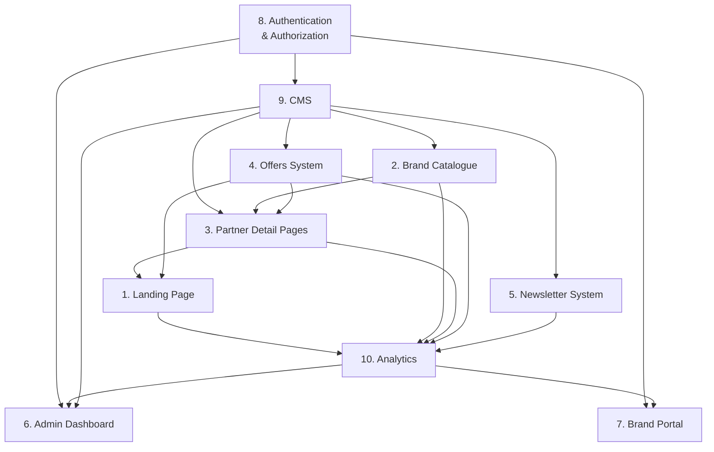

# Functional Requirements
## HU Preferred Partner Platform

| Field   | Detail                          |
|---------|---------------------------------|
| Version | 0.1                             |
| Date    | 2026-07-01                      |
| Status  | Draft                           |
| Relates | Product-Requirements.md         |

---

## 1. Landing Page

| ID       | Description                                                                 | Priority | Acceptance Criteria                                                        |
|----------|-----------------------------------------------------------------------------|----------|----------------------------------------------------------------------------|
| LP-001   | Hero section with 3D visual element (Three.js / R3F) and animated reveal    | P0       | Hero renders a performant 3D scene with graceful fallback on unsupported devices. |
| LP-002   | Animated value proposition text with staggered entry (Framer Motion / GSAP) | P0       | Text animates on viewport entry; respects `prefers-reduced-motion`.        |
| LP-003   | Featured partners carousel or grid showcasing top partners                  | P0       | Displays at least 4 featured partners with logos and names, linked to detail pages. |
| LP-004   | Primary CTAs — "Explore Partners" and "Become a Partner"                    | P0       | CTAs are above the fold, visually distinct, and route to correct destinations. |
| LP-005   | Smooth scroll experience powered by Lenis                                   | P1       | Page scrolls with inertia-based smoothing; no jank or layout shift.        |
| LP-006   | Responsive layout across mobile, tablet, and desktop breakpoints            | P0       | Content reflows correctly at 375px, 768px, and 1440px widths.              |
| LP-007   | SEO meta tags, Open Graph, and structured data                              | P1       | Lighthouse SEO score ≥ 90; OG tags render correct previews on social.      |

---

## 2. Brand Catalogue

| ID       | Description                                                                 | Priority | Acceptance Criteria                                                        |
|----------|-----------------------------------------------------------------------------|----------|----------------------------------------------------------------------------|
| BC-001   | Grid and list view toggle for brand display                                 | P0       | User can switch between grid and list layouts; preference persists in session. |
| BC-002   | Filter by category, industry, and partnership type                          | P0       | Filters update results in real-time without full page reload.              |
| BC-003   | Text search with debounced input                                            | P0       | Search returns matching partners within 300ms of last keystroke.           |
| BC-004   | Paginated results with configurable page size                               | P1       | Pagination controls render when results exceed page size; URL updates with page param. |
| BC-005   | Sort by name (A–Z, Z–A), date added, and popularity                        | P1       | Sort selection updates results immediately; default sort is alphabetical.  |
| BC-006   | Empty state and no-results messaging                                        | P1       | Friendly message and clear-filters CTA displayed when no results match.   |
| BC-007   | Skeleton loading states during data fetch                                   | P2       | Skeleton placeholders render during loading; no layout shift on data arrival. |

---

## 3. Partner Detail Pages

| ID       | Description                                                                 | Priority | Acceptance Criteria                                                        |
|----------|-----------------------------------------------------------------------------|----------|----------------------------------------------------------------------------|
| PD-001   | Brand hero section with logo, cover image, and partner name                 | P0       | Hero displays partner branding; images are optimized via Next.js Image.    |
| PD-002   | Partner description and about section with rich text                        | P0       | Renders formatted content from CMS including headings, lists, and links.   |
| PD-003   | Active offers section listing all current offers for the partner            | P0       | Only non-expired offers display; each links to offer detail or redemption. |
| PD-004   | Contact information and external links                                      | P1       | Displays website, email, and social links with proper `rel` attributes.    |
| PD-005   | Related partners section based on category or industry                      | P2       | Shows 3–4 related partners; excludes the current partner from suggestions. |
| PD-006   | Dynamic Open Graph images per partner for social sharing                    | P2       | Sharing a partner URL on social renders a branded preview card.            |

---

## 4. Offers System

| ID       | Description                                                                 | Priority | Acceptance Criteria                                                        |
|----------|-----------------------------------------------------------------------------|----------|----------------------------------------------------------------------------|
| OF-001   | Offer cards with title, partner logo, discount summary, and expiry badge    | P0       | Cards render all fields; expired offers show a visual "Expired" indicator. |
| OF-002   | Expiry date tracking with automatic status transitions                      | P0       | Offers transition to expired status at midnight of the expiry date (server time). |
| OF-003   | Category-based offer filtering                                              | P1       | Users can filter offers by category; active filters are visually indicated.|
| OF-004   | Featured offers section on landing page and catalogue                       | P1       | Admin can mark offers as featured; featured offers appear in designated slots. |
| OF-005   | Offer detail view with full terms and conditions                            | P1       | Detail view displays all offer metadata, terms, and a link back to the partner. |
| OF-006   | Offer click/view tracking for analytics                                     | P2       | Each offer view and CTA click increments a counter accessible in analytics.|

---

## 5. Newsletter System

| ID       | Description                                                                 | Priority | Acceptance Criteria                                                        |
|----------|-----------------------------------------------------------------------------|----------|----------------------------------------------------------------------------|
| NL-001   | Newsletter archive page with chronological listing                          | P0       | Newsletters display in reverse-chronological order with title and date.    |
| NL-002   | PDF upload by admin with metadata (title, date, description)                | P0       | Admin can upload PDF ≤ 20 MB; metadata fields validate before save.       |
| NL-003   | PDF download with click tracking                                            | P0       | Download button triggers file download; each download increments a counter.|
| NL-004   | Newsletter subscription form (email capture)                                | P1       | Form validates email format; duplicate submissions are handled gracefully. |
| NL-005   | Inline PDF preview (first page thumbnail)                                   | P2       | A thumbnail of the first page renders on the archive listing.             |
| NL-006   | Subscription management (unsubscribe)                                       | P2       | Subscribers can unsubscribe via a tokenized link in email footers.        |

---

## 6. Admin Dashboard

| ID       | Description                                                                 | Priority | Acceptance Criteria                                                        |
|----------|-----------------------------------------------------------------------------|----------|----------------------------------------------------------------------------|
| AD-001   | Analytics overview — total views, active partners, active offers, downloads | P0       | Dashboard loads key metrics on a summary card layout within 2 seconds.    |
| AD-002   | Content management — list, create, edit, delete partners and offers         | P0       | CRUD operations succeed with confirmation toasts; optimistic UI updates.  |
| AD-003   | User management — list users, assign roles, deactivate accounts             | P1       | Admin can change roles; role changes take effect on next user session.    |
| AD-004   | Recent activity feed showing latest content changes                         | P2       | Feed displays the 20 most recent actions with actor, action, and timestamp.|
| AD-005   | Export analytics data as CSV                                                | P2       | CSV export includes all visible metrics and downloads immediately.        |
| AD-006   | Dashboard accessible only to users with `admin` role                        | P0       | Non-admin users receive a 403 response when attempting to access.         |

---

## 7. Brand Portal

| ID       | Description                                                                 | Priority | Acceptance Criteria                                                        |
|----------|-----------------------------------------------------------------------------|----------|----------------------------------------------------------------------------|
| BP-001   | Self-service profile editing — logo, description, contact info              | P0       | Partner can update their profile; changes reflect publicly after save.     |
| BP-002   | Manage offers — create, edit, deactivate, and delete own offers             | P0       | Partners can only modify offers belonging to their organization.           |
| BP-003   | View partner-specific analytics — profile views, offer clicks, downloads    | P1       | Analytics scoped to the authenticated partner only; no cross-partner data. |
| BP-004   | Notification center for admin announcements and offer expirations           | P2       | Notifications display in-app; unread count shown on navigation badge.     |
| BP-005   | Portal accessible only to users with `partner` role                         | P0       | Non-partner users receive a 403 response when attempting to access.        |

---

## 8. Authentication & Authorization

| ID       | Description                                                                 | Priority | Acceptance Criteria                                                        |
|----------|-----------------------------------------------------------------------------|----------|----------------------------------------------------------------------------|
| AU-001   | Role-based access control with roles: `admin`, `partner`, `public`          | P0       | Each role maps to a defined set of permissions; unauthorized actions blocked. |
| AU-002   | Login page with email and password                                          | P0       | Valid credentials establish a session; invalid credentials show an error.  |
| AU-003   | Registration flow for new partner accounts (admin-approved)                 | P1       | New partner registrations enter a pending state until admin approval.      |
| AU-004   | Session management with secure, HTTP-only cookies                           | P0       | Sessions expire after configurable inactivity; tokens are not exposed client-side. |
| AU-005   | Password reset via email                                                    | P1       | Reset link expires after 1 hour; password updates invalidate prior sessions.|
| AU-006   | Protected route middleware for admin and partner areas                      | P0       | Middleware redirects unauthenticated users to login; returns 403 for wrong role. |

---

## 9. Content Management System

| ID       | Description                                                                 | Priority | Acceptance Criteria                                                        |
|----------|-----------------------------------------------------------------------------|----------|----------------------------------------------------------------------------|
| CM-001   | CRUD operations for all content types (partners, offers, newsletters)       | P0       | Create, read, update, and delete succeed with proper validation.           |
| CM-002   | Media library for image and PDF uploads                                     | P0       | Uploads accept JPG, PNG, WebP, and PDF; files stored with unique keys.    |
| CM-003   | Draft and publish workflow                                                  | P1       | Content can be saved as draft; only published items appear on the public site. |
| CM-004   | Version history with rollback capability                                    | P2       | System retains last 10 versions per content item; admin can restore any.  |
| CM-005   | Rich text editor for descriptions and about sections                        | P1       | Editor supports headings, bold, italic, links, and lists.                 |
| CM-006   | Scheduled publishing — set future publish date                              | P3       | Content auto-publishes at the scheduled date/time without manual action.  |

---

## 10. Analytics & Reporting

| ID       | Description                                                                 | Priority | Acceptance Criteria                                                        |
|----------|-----------------------------------------------------------------------------|----------|----------------------------------------------------------------------------|
| AN-001   | Page view tracking across all public pages                                  | P0       | Each page load increments a view counter; bot traffic is excluded.         |
| AN-002   | Engagement metrics — session duration, scroll depth, interaction count      | P1       | Metrics are captured per session and aggregated in the admin dashboard.    |
| AN-003   | Offer performance — views, clicks, and conversion proxy (CTA clicks)       | P1       | Per-offer metrics accessible from both admin dashboard and brand portal.   |
| AN-004   | Newsletter download tracking — total and per-issue downloads                | P0       | Download counts are accurate and visible in the admin dashboard.           |
| AN-005   | Date range filtering on all analytics views                                 | P1       | Admin can select custom date ranges; default is last 30 days.             |
| AN-006   | Real-time active users indicator on admin dashboard                         | P3       | Dashboard shows approximate count of currently active sessions.            |

---

## Feature Dependency Map

---

> **Note:** All priority labels follow the scale **P0** (launch blocker) → **P1** (high value, target for launch) → **P2** (post-launch enhancement) → **P3** (future consideration).
