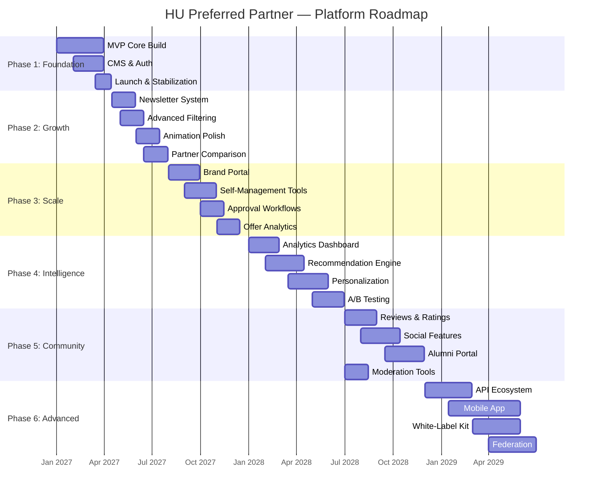

# Future Roadmap — Habib University Preferred Partner

> [!NOTE]
> This roadmap outlines six strategic phases from platform foundation through advanced capabilities. Each phase is gated by measurable success criteria before progression.

---

## Roadmap Overview

---

## Phase Details

### Phase 1: Foundation — Q1 2027

**Focus:** Ship a stable MVP with core brand catalogue, partner pages, and admin dashboard.

**Key Deliverables:**
- Animated landing page (Framer Motion, GSAP, Three.js/R3F, Lenis)
- Brand catalogue with category browsing
- Individual partner pages with offer details
- Admin dashboard for content management
- Authentication system (NextAuth)
- CMS integration for content pipeline

**Success Gate:** Platform live with ≥10 partner brands onboarded, <3s LCP on 4G, zero critical bugs for 2 weeks.

---

### Phase 2: Growth — Q2–Q3 2027

**Focus:** Deepen engagement through content distribution, discovery, and visual refinement.

**Key Deliverables:**
- Newsletter generation and PDF archive system
- Multi-faceted filtering (category, offer type, relevance)
- Partner comparison tool
- Scroll-driven animation sequences and micro-interaction polish
- WCAG 2.2 AA accessibility audit

**Success Gate:** Newsletter subscriber base established, average session duration increased, filtering adoption rate tracked.

---

### Phase 3: Scale — Q4 2027 – Q1 2028

**Focus:** Enable partner self-service to reduce admin overhead and improve content freshness.

**Key Deliverables:**
- Brand portal with partner-facing dashboard
- Self-management for offers, media, and scheduling
- Admin approval workflow for partner submissions
- Per-offer engagement analytics
- In-app and email notification system

**Success Gate:** ≥50% of active partners using self-service tools, admin content workload reduced, approval cycle time under 48 hours.

---

### Phase 4: Intelligence — Q2–Q3 2028

**Focus:** Leverage accumulated data to drive personalization and strategic insights.

**Key Deliverables:**
- Advanced analytics dashboard with trends and cohort analysis
- Content-based recommendation engine
- Personalized landing experiences
- A/B testing framework with feature flags
- Predictive offer performance insights

**Success Gate:** Recommendation click-through rate measurable, personalized experiences live, at least 2 A/B tests completed.

---

### Phase 5: Community — Q3–Q4 2028

**Focus:** Build social trust and extend platform reach to alumni.

**Key Deliverables:**
- Verified student review and rating system
- Social sharing, wishlists, peer recommendations
- Alumni portal with exclusive partner tiers
- Content moderation queue and automated flagging

**Success Gate:** Review moderation pipeline operational, alumni onboarding initiated, community guidelines published and enforced.

---

### Phase 6: Advanced — Q1–Q2 2029

**Focus:** Transform into a platform with external integrations and multi-institution potential.

**Key Deliverables:**
- Public REST/GraphQL API with developer portal
- Native mobile app (iOS/Android)
- White-label theming kit for other institutions
- Multi-university federation architecture

**Success Gate:** API documentation published, mobile app in app stores, at least one white-label pilot initiated.

---

## Resource Requirements Summary

| Phase | Engineering | Design | Content/Ops | Duration |
|---|---|---|---|---|
| Foundation | 2–3 FE, 1 BE | 1 UI/UX | 1 Content Lead | ~3 months |
| Growth | 2 FE, 1 BE | 1 UI/UX | 1 Content Lead | ~3 months |
| Scale | 2 FE, 2 BE | 1 UI/UX | 1 Ops | ~4 months |
| Intelligence | 2 FE, 2 BE, 1 Data | 1 UI/UX | — | ~5 months |
| Community | 2 FE, 1 BE | 1 UI/UX | 1 Moderator | ~4 months |
| Advanced | 3 FE, 2 BE, 1 Mobile | 1 UI/UX | 1 DevRel | ~6 months |

> [!IMPORTANT]
> Resource estimates assume dedicated team members. Shared resources will extend timelines proportionally. Each phase gate requires formal stakeholder sign-off before advancing.
