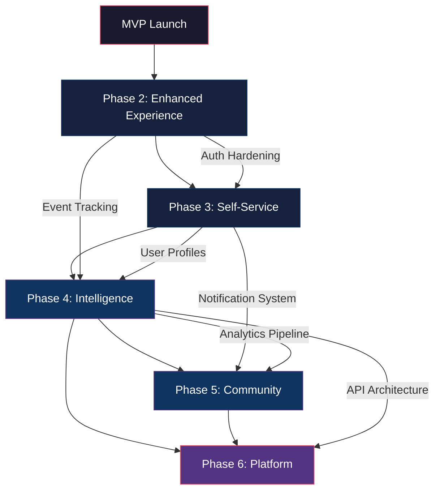

# Future Scope — Post-MVP Phases & Dependency Map

> [!NOTE]
> This document outlines the post-MVP evolution of the Habib University Preferred Partner platform across five distinct phases. Each phase builds on prior deliverables and is gated by prerequisite completion.

---

## Phase 2: Enhanced Experience

**Timeline:** Q2–Q3 2027  
**Estimated Effort:** 8–12 weeks  
**Prerequisites:** MVP launch, stable CMS pipeline, core analytics baseline

### Features

| Feature | Description | Effort |
|---|---|---|
| Newsletter System | PDF newsletter generation, email distribution, archive browser | 3 weeks |
| Advanced Filtering | Multi-faceted brand filtering by category, offer type, popularity | 2 weeks |
| Partner Comparison | Side-by-side comparison of partner offers and benefits | 2 weeks |
| Animation Refinements | GSAP scroll-triggered sequences, Lenis smooth-scroll polish, R3F scene transitions | 2 weeks |
| Accessibility Audit | WCAG 2.2 AA compliance pass across all interactive components | 1 week |

### Dependencies

- CMS content model must support newsletter metadata and PDF uploads
- Filtering requires normalized taxonomy in the brand data schema
- Comparison UI depends on a standardized offer data structure

---

## Phase 3: Self-Service

**Timeline:** Q4 2027 – Q1 2028  
**Estimated Effort:** 10–14 weeks  
**Prerequisites:** Phase 2 complete, auth system hardened, role-based access control (RBAC)

### Features

| Feature | Description | Effort |
|---|---|---|
| Brand Portal | Dedicated dashboard for partners to manage their profiles and offers | 4 weeks |
| Partner Self-Management | CRUD operations for offers, media uploads, schedule management | 3 weeks |
| Offer Analytics | Per-offer engagement metrics — views, clicks, redemptions | 2 weeks |
| Approval Workflow | Admin review queue for partner-submitted content changes | 2 weeks |
| Notification System | Email/in-app alerts for approval status, offer expiry, performance summaries | 2 weeks |

### Dependencies

- Brand Portal requires RBAC and multi-tenant auth (Phase 2 auth hardening)
- Offer Analytics depends on event tracking infrastructure from Phase 2
- Approval Workflow requires CMS content versioning support

---

## Phase 4: Intelligence

**Timeline:** Q2–Q3 2028  
**Estimated Effort:** 12–16 weeks  
**Prerequisites:** Phase 3 complete, sufficient engagement data (minimum 6 months), analytics pipeline

### Features

| Feature | Description | Effort |
|---|---|---|
| Advanced Analytics Dashboard | Trend analysis, cohort breakdowns, partner ROI visualizations | 4 weeks |
| Recommendation Engine | Content-based and collaborative filtering for personalized offer suggestions | 4 weeks |
| Personalization Layer | User-specific landing experiences based on browsing history and preferences | 3 weeks |
| A/B Testing Framework | Controlled experiments for layout, copy, and offer presentation | 2 weeks |
| Predictive Insights | Offer performance forecasting, churn risk indicators for partners | 3 weeks |

### Dependencies

- Recommendation engine requires sufficient historical interaction data
- Personalization depends on user profile enrichment from Phase 3
- A/B testing framework requires feature flag infrastructure

---

## Phase 5: Community

**Timeline:** Q4 2028 – Q1 2029  
**Estimated Effort:** 10–14 weeks  
**Prerequisites:** Phase 4 complete, user identity system matured, moderation tooling

### Features

| Feature | Description | Effort |
|---|---|---|
| Student Reviews | Verified review system for partner offers with rich text and media | 3 weeks |
| Ratings System | Star-based aggregate ratings with breakdown by category | 2 weeks |
| Social Features | Share offers, wishlists, peer recommendations within the HU community | 3 weeks |
| Alumni Portal | Extended access for Habib University alumni with exclusive partner tiers | 3 weeks |
| Moderation Tools | Content moderation queue, automated flagging, community guidelines enforcement | 2 weeks |

### Dependencies

- Reviews require verified student identity (university SSO integration)
- Alumni Portal depends on alumni database integration
- Social features require notification system from Phase 3
- Moderation tooling must be in place before community features go live

---

## Phase 6: Platform

**Timeline:** Q2–Q4 2029  
**Estimated Effort:** 16–20 weeks  
**Prerequisites:** Phases 4–5 complete, API architecture finalized, legal/compliance review

### Features

| Feature | Description | Effort |
|---|---|---|
| API Ecosystem | Public REST/GraphQL API for third-party integrations | 4 weeks |
| Mobile App | Native iOS/Android app with offline offer browsing and push notifications | 6 weeks |
| White-Label Kit | Configurable theme and branding toolkit for other universities | 4 weeks |
| Marketplace Extensions | Plugin architecture for partner-built integrations | 3 weeks |
| Multi-University Federation | Shared partner network across multiple university instances | 3 weeks |

### Dependencies

- API requires rate limiting, versioning, and developer portal
- Mobile app depends on stable API layer
- White-label requires complete design token abstraction
- Federation requires multi-tenant data isolation

---

## Dependency Diagram

---

## Effort Summary

| Phase | Timeline | Effort | Key Gate |
|---|---|---|---|
| Phase 2 | Q2–Q3 2027 | 8–12 weeks | MVP stability confirmed |
| Phase 3 | Q4 2027 – Q1 2028 | 10–14 weeks | RBAC and auth hardening |
| Phase 4 | Q2–Q3 2028 | 12–16 weeks | 6+ months engagement data |
| Phase 5 | Q4 2028 – Q1 2029 | 10–14 weeks | Moderation tooling ready |
| Phase 6 | Q2–Q4 2029 | 16–20 weeks | API architecture finalized |

> [!IMPORTANT]
> Phase timelines are estimates and subject to resourcing, stakeholder alignment, and prerequisite completion. Each phase gate should be formally reviewed before proceeding.
