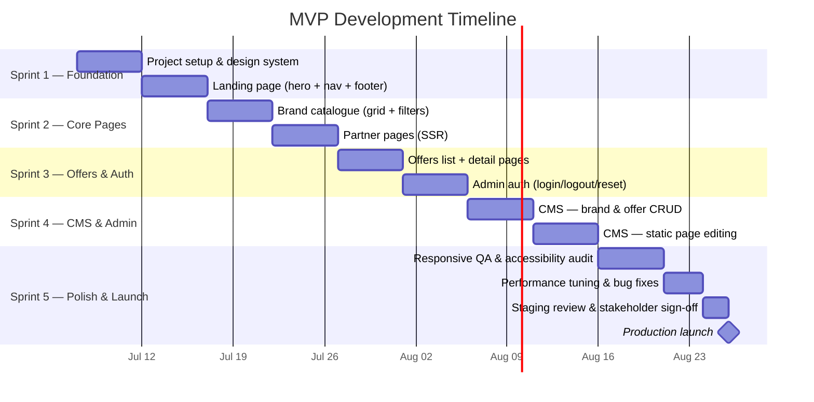

# MVP Scope — Habib University Preferred Partner

> **Document Owner:** Product  
> **Last Updated:** 2026-07-01  
> **Status:** Draft  
> **Target Launch:** [TBD]

---

## 1 · MVP Philosophy

The MVP is not a "bad v1" — it is the smallest credible version of the platform that:

1. **Ships fast** — a 4–6 week build window forces ruthless prioritisation.  
2. **Validates assumptions** — do visitors actually engage with the catalogue? Do brand partners find value?  
3. **Creates an iteration surface** — every post-MVP feature is informed by real usage data, not speculation.

We optimise for *learning velocity* over *feature completeness*. If a feature doesn't help us answer a core question, it waits.

---

## 2 · IN Scope (MVP)

| # | Feature | Description | Priority |
|---|---------|-------------|----------|
| 1 | Landing Page (Core) | Hero section, value proposition, featured brands, and footer. Smooth-scroll via Lenis. Framer Motion entrance animations. | 🔴 P0 |
| 2 | Brand Catalogue (Basic) | Grid view of all partner brands with category filtering. No search in MVP. | 🔴 P0 |
| 3 | Partner Pages | Individual pages per brand — logo, description, partnership details, linked offers. SSR for SEO. | 🔴 P0 |
| 4 | Offers (Basic) | List of active offers with title, brand, validity, and terms. Sorting by newest. Expired offers auto-hidden. | 🔴 P0 |
| 5 | Auth (Admin Only) | Email/password login for admins. HTTP-only session cookies. Logout and basic password reset. | 🔴 P0 |
| 6 | CMS (Basic CRUD) | Admin can create, read, update, and delete brands, offers, and static page content. No scheduling, no media library. | 🔴 P0 |
| 7 | Responsive Design | Fully responsive across 320 px → 1440 px. Mobile-first approach with hamburger nav. | 🔴 P0 |

---

## 3 · OUT of Scope (MVP)

| Feature | Reason for Deferral | Target Phase |
|---------|---------------------|--------------|
| Newsletter System | Requires PDF viewer integration, upload pipeline, and archive UI — adds complexity without validating core value. | Phase 2 |
| Brand Portal | Self-service brand editing needs approval workflows and scoped auth — build after validating partner interest. | Phase 2 |
| Advanced Analytics | Dashboards, CSV export, and search-query tracking depend on sufficient traffic volume to be meaningful. | Phase 2 |
| 3D / Three.js Animations | R3F hero scenes are high-impact but high-effort; ship with Framer Motion first, layer 3D later. | Phase 2–3 |
| Email Subscriptions | Requires transactional email provider, opt-in flows, and GDPR-style consent management. | Phase 3 |
| Alumni-Specific Features | Needs alumni verification and role-based access — out of scope until user segmentation is validated. | Phase 3 |
| Drag-and-Drop Reordering | Admin UX nicety; manual ordering via sort fields is sufficient for MVP. | Phase 2 |
| Content Scheduling | Immediate publish is acceptable at launch scale. | Phase 2 |

---

## 4 · MVP Feature Matrix

| Area | MVP Includes | MVP Excludes |
|------|-------------|--------------|
| **Landing** | Hero, featured brands, nav, footer, Framer Motion animations | Three.js/R3F scenes, parallax storytelling sections |
| **Catalogue** | Grid view, category filters, empty states | Search, list view toggle, pagination |
| **Partner Pages** | Static content, linked offers, SSR | Brand portal edits, analytics per brand |
| **Offers** | Active list, detail view, sort by newest | Saved/bookmarked offers, push notifications |
| **Auth** | Admin login/logout, password reset | Brand partner login, OAuth/SSO, MFA |
| **CMS** | Brand CRUD, offer CRUD, static page editing | Media library, revision history, scheduled publishing |
| **Design** | Responsive, accessible, dark-mode-ready | Full dark-mode toggle, custom themes |
| **Performance** | Image optimisation, SSR, code splitting | Edge caching, ISR, service worker |

---

## 5 · Launch Criteria

### 5.1 Technical

- [ ] Lighthouse Performance score ≥ 90 on mobile  
- [ ] Lighthouse Accessibility score ≥ 95  
- [ ] No critical or high-severity security findings (OWASP Top 10 review)  
- [ ] All public pages render correctly at 320 px, 768 px, 1024 px, 1440 px  
- [ ] LCP ≤ 2.5 s and CLS ≤ 0.1 on representative pages  

### 5.2 Content

- [ ] Minimum **[TBD]** partner brands with complete profiles  
- [ ] Minimum **[TBD]** active offers published  
- [ ] All static pages (About, FAQ, T&C, Privacy) populated with approved copy  

### 5.3 Organisational

- [ ] Stakeholder sign-off from Habib University communications team  
- [ ] Admin accounts provisioned and tested  
- [ ] Analytics tracking (basic page views) confirmed operational  
- [ ] Deployment pipeline validated (staging → production)  

---

## 6 · MVP Timeline

---

## 7 · Success Criteria

> ⚠️ All metrics below are placeholders. Actual targets will be set after baseline data is collected in the first 30 days post-launch.

| Metric | Target | Measurement Method |
|--------|--------|--------------------|
| Monthly unique visitors | [TBD] | Analytics dashboard |
| Avg. session duration | [TBD] | Analytics dashboard |
| Catalogue page → Partner page conversion | [TBD] | Funnel tracking |
| Offer detail page views / month | [TBD] | Page-level analytics |
| Admin content updates / week | [TBD] | CMS audit log |
| Lighthouse Performance (mobile) | ≥ 90 | Automated CI check |
| Lighthouse Accessibility | ≥ 95 | Automated CI check |
| Partner brands onboarded (30-day) | [TBD] | Manual count |
| Stakeholder satisfaction (qualitative) | Positive | Post-launch survey |

### How We Know MVP Succeeded

1. **Visitors engage beyond the landing page** — catalogue and partner pages receive meaningful traffic (target: [TBD]% of visitors navigate past the hero).  
2. **Partners see value** — at least [TBD] brand partners express interest in the Brand Portal (Phase 2 validation).  
3. **Content stays fresh** — admins publish at least [TBD] new offers within the first 30 days without engineering support.  
4. **Technical quality holds** — no P0 bugs reported in the first 14 days post-launch.

---

*This document is a living artefact. It will be revised as discovery progresses and stakeholder feedback is incorporated.*
