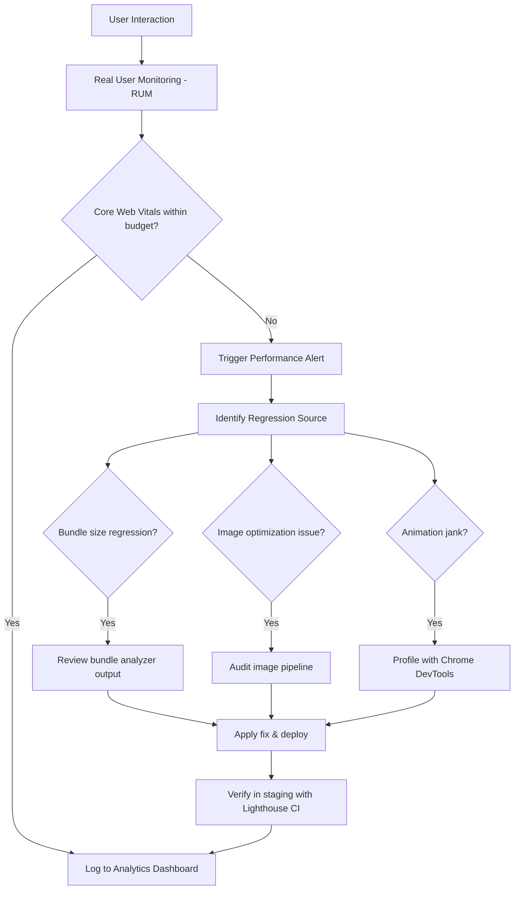

# Non-Functional Requirements

> Habib University Preferred Partner Platform

This document defines the non-functional requirements (NFRs) that govern the quality attributes of the platform beyond its feature set. Every implementation decision must satisfy these constraints.

---

## 1. Performance

### 1.1 Core Web Vitals Targets

| Metric | Target | Measurement |
|---|---|---|
| Largest Contentful Paint (LCP) | < 2.5s | 75th percentile, field data |
| First Input Delay (FID) | < 100ms | 75th percentile, field data |
| Cumulative Layout Shift (CLS) | < 0.1 | 75th percentile, field data |
| Interaction to Next Paint (INP) | < 200ms | 75th percentile, field data |
| Time to First Byte (TTFB) | < 800ms | 75th percentile, field data |

### 1.2 Performance Budgets

| Resource | Budget |
|---|---|
| Initial JS bundle (compressed) | ≤ 200 KB |
| Total page weight (initial load) | ≤ 1.5 MB |
| Critical CSS (inlined) | ≤ 14 KB |
| Web font payload | ≤ 100 KB |
| Hero image (above-fold) | ≤ 200 KB |
| Third-party scripts | ≤ 50 KB |

### 1.3 Page Load

- Full interactive load **< 3 seconds** on a simulated 3G connection (1.6 Mbps down, 750ms RTT).
- Static pages (brand catalogue, landing) served via ISR/SSG with edge caching.
- Admin dashboard pages may have relaxed targets (< 5s on 3G) due to authenticated, data-heavy nature.

### 1.4 Image Optimization

- Serve images in **WebP** with **AVIF** fallback where supported.
- All below-fold images must use `loading="lazy"` and `decoding="async"`.
- Use `next/image` with responsive `srcSet` and `sizes` attributes.
- Brand logos stored at max 2x resolution with automatic resizing via the image CDN.

### 1.5 Animation Performance

- All animations must run at **60 fps** on target devices.
- GSAP and Framer Motion animations must be **GPU-accelerated** — use `transform` and `opacity` only; avoid animating `width`, `height`, `top`, `left`, or `box-shadow`.
- Three.js / R3F scenes must implement LOD (Level of Detail) and dispose unused geometries/textures.
- Lenis smooth scroll must not block the main thread; defer initialization until after hydration.

### 1.6 Performance Monitoring Flow

---

## 2. Scalability

- **Concurrent users:** Platform must support **[TBD]** concurrent users without degradation.
- **Content scaling:** CMS must handle **500+ brand entries** and **1,000+ offers** without query performance impact. Database queries must complete in < 200ms.
- **CDN:** All static assets served via a CDN (Vercel Edge Network or equivalent) with edge nodes in South Asia.
- **ISR revalidation:** Incremental Static Regeneration with a revalidation window of **60 seconds** for catalogue pages.
- **API rate limiting:** Public API endpoints rate-limited to **100 requests/minute** per IP. Authenticated endpoints: **300 requests/minute** per user.

---

## 3. Availability & Reliability

- **Uptime target:** 99.9% availability (< 8.76 hours downtime/year), excluding scheduled maintenance.
- **Error handling:** All API errors return structured JSON responses with appropriate HTTP status codes. User-facing errors display friendly messages — never raw stack traces.
- **Graceful degradation:**
  - If Three.js/R3F fails to load → fall back to static hero image.
  - If GSAP/Framer Motion is blocked → content renders without animation.
  - If newsletter PDF fails to load → display inline error with retry option.
  - If CMS is unreachable → serve last cached version via ISR.
- **Health checks:** `/api/health` endpoint returning system status for uptime monitoring.

---

## 4. Security

### 4.1 Authentication & Authorization

- Auth sessions use **HTTP-only, Secure, SameSite=Strict** cookies.
- JWT tokens expire after **15 minutes**; refresh tokens after **7 days**.
- Role-based access control (RBAC) enforced at both API and UI layers.
- Admin and brand portal routes protected with middleware-level auth guards.
- Password policy: minimum 8 characters, at least one uppercase, one number, one special character.

### 4.2 Data Protection

- All traffic served over **HTTPS/TLS 1.3**.
- Sensitive data encrypted at rest using AES-256.
- PII handled in compliance with applicable Pakistani data protection regulations.
- Database backups encrypted and stored in a geographically separate region.

### 4.3 OWASP Top 10 Mitigation

- **Injection:** Parameterized queries via ORM. No raw SQL concatenation.
- **XSS:** All user-generated content sanitized on input and output-encoded on render.
- **CSRF:** Anti-CSRF tokens on all state-changing requests.
- **Broken Access Control:** Server-side authorization checks on every protected endpoint.

### 4.4 Content Security Policy

- Strict CSP headers enforced: `default-src 'self'`; explicit allowlists for CDN, font, and analytics domains.
- `X-Frame-Options: DENY` to prevent clickjacking.
- `X-Content-Type-Options: nosniff` on all responses.

---

## 5. Accessibility (WCAG 2.2 AA)

- **Keyboard navigation:** All interactive elements reachable and operable via keyboard. Logical tab order enforced.
- **Screen readers:** Semantic HTML throughout. All images have descriptive `alt` text. Icon-only buttons have `aria-label`.
- **Color contrast:** Minimum **4.5:1** ratio for normal text, **3:1** for large text (≥ 18px bold or ≥ 24px regular).
- **Focus management:** Visible focus indicators on all interactive elements. Focus trapped within modals when open.
- **Reduced motion:** Respect `prefers-reduced-motion: reduce` — disable GSAP timelines, Framer Motion animations, Lenis smooth scroll, and Three.js camera movements.
- **ARIA:** Use ARIA landmarks (`role="banner"`, `role="navigation"`, `role="main"`, `role="contentinfo"`). Dynamic content updates announced via `aria-live` regions.
- **Touch targets:** Minimum **44×44 px** on all interactive elements for mobile.

---

## 6. Browser & Device Support

### 6.1 Browser Matrix

| Browser | Version | Support Level |
|---|---|---|
| Chrome | Latest 2 major | Full |
| Firefox | Latest 2 major | Full |
| Safari | Latest 2 major | Full |
| Edge | Latest 2 major | Full |
| Samsung Internet | Latest 2 major | Full |
| Opera | Latest major | Graceful degradation |
| IE 11 | — | Not supported |

### 6.2 Responsive Breakpoints

| Breakpoint | Width | Target |
|---|---|---|
| `sm` | ≥ 640px | Mobile landscape |
| `md` | ≥ 768px | Tablets |
| `lg` | ≥ 1024px | Small laptops |
| `xl` | ≥ 1280px | Desktops |
| `2xl` | ≥ 1536px | Large displays |

- Mobile-first approach. Base styles target < 640px.
- All pages must be fully functional and visually coherent across all breakpoints.

### 6.3 PWA

- Service worker for offline caching of static assets and previously visited pages.
- Web app manifest with HU branding (icons, theme color, splash screen).
- Installable on Android and iOS via "Add to Home Screen."

---

## 7. SEO

- **Rendering:** Public pages use **SSG** (Static Site Generation) or **ISR** for full search engine crawlability. No client-only rendered content for public pages.
- **Meta tags:** Every page includes unique `<title>`, `<meta name="description">`, and Open Graph / Twitter Card tags.
- **Structured data:** JSON-LD schema markup for `Organization`, `Offer`, `BreadcrumbList`, and `WebPage` entities.
- **Sitemap:** Auto-generated `sitemap.xml` updated on each build/revalidation. Submitted to Google Search Console.
- **Robots:** `robots.txt` configured to block `/admin`, `/api`, and `/brand-portal` from crawlers.
- **Canonical URLs:** Every page specifies `<link rel="canonical">` to prevent duplicate content issues.

---

## 8. Internationalization

- **Primary language:** English (`en-PK`).
- **Future RTL support:** Architecture must accommodate Urdu (`ur-PK`) with RTL layout via `dir="rtl"` on the `<html>` element. Use CSS logical properties (`margin-inline-start` over `margin-left`) from the start.
- **Date/time formatting:** Use `Intl.DateTimeFormat` with `en-PK` locale. Display Pakistan Standard Time (PKT, UTC+5).
- **Number formatting:** Use `Intl.NumberFormat` for currency (PKR) and percentage values.

---

## 9. Code Quality

- **TypeScript:** Strict mode enabled (`"strict": true`). No `any` types outside explicit escape hatches (documented with `// eslint-disable-next-line`).
- **Linting:** ESLint with `next/core-web-vitals` and `prettier` configs. Zero warnings policy in CI.
- **Testing targets:**
  - Unit tests: **[TBD]** coverage target.
  - Integration tests: Critical user flows (auth, offer redemption, newsletter access).
  - E2E tests: Playwright for cross-browser smoke tests on every deploy.
  - Visual regression: [TBD] tool for screenshot diffing.
- **Commit conventions:** Conventional Commits enforced via commit-lint. PR descriptions must reference related requirements.
- **Bundle analysis:** `@next/bundle-analyzer` run on every PR to catch size regressions against budgets defined in §1.2.
