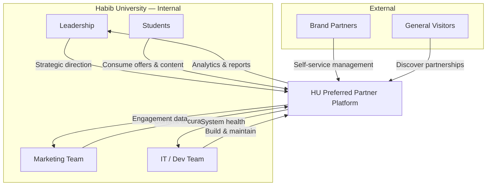

# Product Requirements Document
## HU Preferred Partner Platform

| Field   | Detail                          |
|---------|---------------------------------|
| Version | 0.1                             |
| Date    | 2026-07-01                      |
| Status  | Draft                           |
| Owner   | Habib University — Marketing    |

---

## 1. Executive Summary

The **HU Preferred Partner** platform is a digital showcase for Habib University's brand partnerships. It serves as a centralized, publicly accessible destination where students, faculty, and visitors can discover the university's corporate and brand partners, browse exclusive offers, and access archived newsletters — while providing partners and administrators with dedicated portals for self-service management and data-driven decision-making.

Built on a philosophy of **typographic intentionality and museum-quality design** (Anti AI-Slop), the platform elevates Habib University's brand identity through editorial aesthetics, purposeful animation, and generous whitespace.

---

## 2. Problem Statement

Habib University's partnership ecosystem currently suffers from:

- **Fragmented information** — Partner details, offers, and newsletters are scattered across emails, social media posts, and static PDFs with no single source of truth.
- **No centralized showcase** — There is no dedicated digital presence that communicates the breadth and prestige of the university's brand partnerships to students or external audiences.
- **Manual administrative processes** — Onboarding partners, updating offers, and distributing newsletters rely on manual coordination, increasing overhead and error rates.
- **Limited engagement visibility** — Without analytics infrastructure, stakeholders cannot measure how students interact with partner content or which partnerships generate the most value.

---

## 3. Product Vision

> *To create the definitive digital stage for Habib University's brand partnerships — one that reflects the university's commitment to design excellence, empowers partners with self-service tools, and delivers measurable engagement insights to leadership.*

---

## 4. Target Audience

| Audience             | Description                                                                 |
|----------------------|-----------------------------------------------------------------------------|
| **Students**         | Primary consumers of partner offers, newsletters, and brand content.        |
| **Brand Partners**   | Corporate and commercial partners managing their profiles and offers.       |
| **University Admin** | Marketing and operations staff responsible for content and partner relations.|
| **Marketing Team**   | Curates content, monitors engagement, and drives partnership strategy.      |
| **General Visitors** | Prospective students, parents, and external stakeholders exploring HU.     |

---

## 5. Product Goals

1. **Centralize Partnerships** — Consolidate all partner information, offers, and collateral into a single, authoritative platform.
2. **Elevate Brand Perception** — Showcase partnerships through a premium, design-forward digital experience that reinforces HU's identity.
3. **Streamline Administration** — Replace manual workflows with structured CMS tools, self-service portals, and role-based access.
4. **Increase Student Engagement** — Drive discovery and interaction with partner content through intuitive UX, search, and filtering.
5. **Enable Data-Driven Decisions** — Provide stakeholders with actionable analytics on views, engagement, offer performance, and downloads.

---

## 6. Success Metrics Framework

| Category        | Metric                              | Target                        |
|-----------------|-------------------------------------|-------------------------------|
| **Engagement**  | Monthly active visitors             | [TBD - Baseline post-launch] |
| **Engagement**  | Avg. session duration               | [TBD - Baseline post-launch] |
| **Engagement**  | Pages per session                   | [TBD - Baseline post-launch] |
| **Conversion**  | Offer click-through rate            | [TBD - Baseline post-launch] |
| **Conversion**  | Newsletter subscription rate        | [TBD - Baseline post-launch] |
| **Conversion**  | Partner inquiry submissions         | [TBD - Baseline post-launch] |
| **Performance** | Lighthouse performance score        | [TBD - Baseline post-launch] |
| **Performance** | Core Web Vitals (LCP, CLS, INP)     | [TBD - Baseline post-launch] |
| **Performance** | Time to first meaningful paint      | [TBD - Baseline post-launch] |
| **Content**     | Partner profiles published          | [TBD - Baseline post-launch] |
| **Content**     | Active offers listed                | [TBD - Baseline post-launch] |
| **Content**     | Newsletter downloads per issue      | [TBD - Baseline post-launch] |

---

## 7. Stakeholders

### RACI Matrix

| Activity                     | Marketing | IT / Dev | Brand Partners | Students | Leadership |
|------------------------------|-----------|----------|----------------|----------|------------|
| Platform strategy            | A         | C        | I              | I        | R          |
| Content creation & curation  | R         | C        | C              | I        | I          |
| Technical implementation     | C         | R        | I              | I        | I          |
| Partner onboarding           | R         | C        | A              | I        | I          |
| Offer management             | A         | C        | R              | I        | I          |
| Analytics & reporting        | R         | C        | I              | I        | A          |
| Design & brand compliance    | R         | C        | I              | I        | A          |
| User acceptance testing      | A         | R        | C              | C        | I          |

> **R** = Responsible · **A** = Accountable · **C** = Consulted · **I** = Informed

### Stakeholder Ecosystem

---

## 8. Constraints & Assumptions

### Constraints

- The platform must comply with Habib University's existing brand guidelines and visual identity.
- Initial launch targets English-language content only.
- Hosting and infrastructure must align with IT's approved cloud providers.
- The design must maintain Anti AI-Slop principles — no generic templates, stock-heavy layouts, or gratuitous animation.

### Assumptions

- Brand partners will provide their own logos, descriptions, and offer details during onboarding.
- The Marketing team will serve as the primary content editors post-launch.
- Student authentication may integrate with existing university SSO in a future phase.
- Newsletter PDFs already exist and will be uploaded retroactively for the archive.

---

## 9. Dependencies

| Dependency                          | Owner        | Impact                                          |
|-------------------------------------|--------------|--------------------------------------------------|
| Brand assets from partners          | Partners     | Blocks partner profile content                   |
| University brand guidelines         | Marketing    | Informs design system and visual direction       |
| Hosting infrastructure provisioning | IT / Dev     | Blocks deployment                                |
| SSO / Identity provider access      | IT           | Blocks authenticated student features (Phase 2)  |
| Newsletter PDF archive              | Marketing    | Blocks newsletter section content                |
| Analytics tooling selection         | IT / Dev     | Informs dashboard implementation                 |

---

## 10. Glossary

| Term                    | Definition                                                                                   |
|-------------------------|----------------------------------------------------------------------------------------------|
| **HU**                  | Habib University — a private liberal arts university in Karachi, Pakistan.                    |
| **Preferred Partner**   | A brand or organization with a formal partnership agreement with Habib University.           |
| **Anti AI-Slop**        | A design philosophy emphasizing typography, whitespace, intentional animation, and editorial quality over generic, template-driven output. |
| **Brand Portal**        | A self-service interface for partners to manage their profile, offers, and view analytics.   |
| **CMS**                 | Content Management System — the admin-facing tooling for creating and managing platform content. |
| **RACI**                | Responsible, Accountable, Consulted, Informed — a stakeholder responsibility matrix.         |
| **LCP**                 | Largest Contentful Paint — a Core Web Vital measuring loading performance.                   |
| **CLS**                 | Cumulative Layout Shift — a Core Web Vital measuring visual stability.                       |
| **INP**                 | Interaction to Next Paint — a Core Web Vital measuring interactivity responsiveness.         |
| **SSO**                 | Single Sign-On — an authentication scheme allowing unified login across systems.             |
