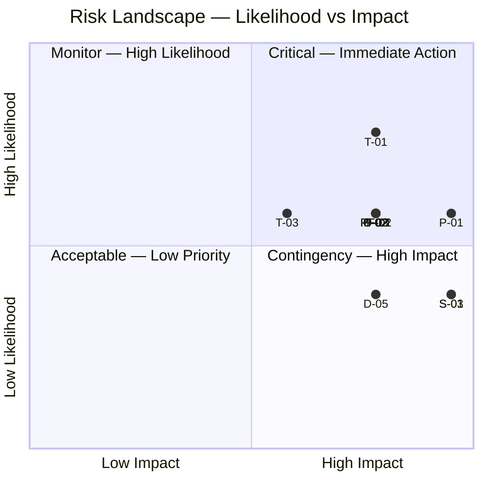

# Risk Register — Habib University Preferred Partner

> [!NOTE]
> This register catalogs identified risks across six categories. Each risk is scored using a Likelihood × Impact matrix (1–5 scale). Risks scoring ≥12 are flagged as critical.

---

## Risk Scoring Guide

| Score | Level | Action Required |
|---|---|---|
| 1–4 | Low | Monitor periodically |
| 5–9 | Medium | Active mitigation plan required |
| 10–15 | High | Immediate mitigation, escalate to leads |
| 16–25 | Critical | Block release, executive escalation |

---

## Risk Matrix

|  | Impact 1 | Impact 2 | Impact 3 | Impact 4 | Impact 5 |
|---|---|---|---|---|---|
| **Likelihood 5** | 5 | 10 | 15 | 20 | 25 |
| **Likelihood 4** | 4 | 8 | 12 | 16 | 20 |
| **Likelihood 3** | 3 | 6 | 9 | 12 | 15 |
| **Likelihood 2** | 2 | 4 | 6 | 8 | 10 |
| **Likelihood 1** | 1 | 2 | 3 | 4 | 5 |

---

## Technical Risks

| ID | Description | L | I | Score | Mitigation | Owner | Status |
|---|---|---|---|---|---|---|---|
| T-01 | Animation performance degradation on mid-range devices due to GSAP + Three.js + Framer Motion stack | 4 | 4 | 16 | Progressive enhancement tiers; disable R3F on low-end devices; frame budget monitoring | FE Lead | Open |
| T-02 | Three.js / R3F browser compatibility failures (WebGL context loss, mobile GPU limits) | 3 | 4 | 12 | Graceful fallback to 2D; WebGL capability detection; tested device matrix | FE Lead | Open |
| T-03 | JavaScript bundle size exceeding performance budget (>300KB gzipped) | 3 | 3 | 9 | Dynamic imports, route-based code splitting, tree shaking audit, bundle analyzer CI check | FE Lead | Open |
| T-04 | Lenis smooth scroll conflicts with native browser behaviors (focus management, back/forward cache) | 2 | 3 | 6 | Feature-flag Lenis; fallback to native scroll; accessibility testing with screen readers | FE Dev | Open |
| T-05 | CMS schema migrations breaking production content rendering | 2 | 4 | 8 | Schema versioning, staged rollouts, content snapshot backups before migration | BE Lead | Open |

---

## Product Risks

| ID | Description | L | I | Score | Mitigation | Owner | Status |
|---|---|---|---|---|---|---|---|
| P-01 | Low student adoption — platform fails to reach critical engagement mass | 3 | 5 | 15 | Launch campaign with HU marketing, onboarding flow optimization, student ambassador program | Product Lead | Open |
| P-02 | Poor content quality from partners degrading editorial aesthetic | 3 | 4 | 12 | Content guidelines, admin review workflow, template system for partner submissions | Content Lead | Open |
| P-03 | Partner offers not compelling enough to drive repeat visits | 3 | 4 | 12 | Partner onboarding consultation, competitive benchmarking, offer refresh cadence requirements | Product Lead | Open |
| P-04 | Anti AI-Slop philosophy misunderstood — team produces generic designs | 2 | 3 | 6 | Design system documentation, design review gates, editorial design references | Design Lead | Open |

---

## Security Risks

| ID | Description | L | I | Score | Mitigation | Owner | Status |
|---|---|---|---|---|---|---|---|
| S-01 | Authentication bypass via misconfigured NextAuth providers or session handling | 2 | 5 | 10 | Security audit, OWASP checklist, session rotation, CSRF protection, penetration testing | BE Lead | Open |
| S-02 | Data breach exposing student PII or partner commercial data | 1 | 5 | 5 | Encryption at rest and in transit, minimal PII collection, access logging, incident response plan | BE Lead | Open |
| S-03 | Admin dashboard privilege escalation through RBAC misconfiguration | 2 | 5 | 10 | Role-based access tests, principle of least privilege, admin action audit log | BE Lead | Open |
| S-04 | XSS or injection via CMS-rendered partner content | 2 | 4 | 8 | Content sanitization pipeline, CSP headers, input validation on all CMS fields | FE Lead | Open |

---

## Performance Risks

| ID | Description | L | I | Score | Mitigation | Owner | Status |
|---|---|---|---|---|---|---|---|
| PF-01 | Core Web Vitals failures (LCP >2.5s, CLS >0.1, INP >200ms) | 3 | 4 | 12 | Performance budget CI gates, Lighthouse audits, image optimization pipeline, font loading strategy | FE Lead | Open |
| PF-02 | Unacceptable experience on 3G networks (common in parts of Karachi) | 3 | 4 | 12 | Aggressive code splitting, service worker caching, reduced motion/3D on slow connections, skeleton loading | FE Lead | Open |
| PF-03 | Three.js scene memory leaks causing tab crashes on extended sessions | 2 | 4 | 8 | Dispose patterns for geometries/materials/textures, scene lifecycle management, memory profiling in CI | FE Dev | Open |
| PF-04 | Image-heavy partner pages causing layout shift and slow loads | 3 | 3 | 9 | Next.js Image component, responsive srcsets, blur placeholders, lazy loading below fold | FE Dev | Open |

---

## Dependency Risks

| ID | Description | L | I | Score | Mitigation | Owner | Status |
|---|---|---|---|---|---|---|---|
| D-01 | Breaking changes in Three.js / R3F major versions | 2 | 3 | 6 | Pin major versions, monitor changelogs, allocate upgrade sprints, maintain abstraction layer | FE Lead | Open |
| D-02 | shadcn/ui component library deprecation or architectural shift | 2 | 3 | 6 | Components are copied into project (not installed as package), reducing external dependency | FE Dev | Open |
| D-03 | CDN outage affecting font/asset delivery | 2 | 3 | 6 | Self-host critical fonts, fallback font stacks, asset caching strategy | DevOps | Open |
| D-04 | GSAP licensing changes affecting commercial use | 1 | 4 | 4 | Monitor GSAP license terms, evaluate CSS-only animation alternatives for non-critical effects | FE Lead | Open |
| D-05 | Next.js major version upgrade requiring significant refactoring | 2 | 4 | 8 | Stay within LTS cycle, incremental adoption of new features, migration guide review on release | FE Lead | Open |

---

## Organizational Risks

| ID | Description | L | I | Score | Mitigation | Owner | Status |
|---|---|---|---|---|---|---|---|
| O-01 | Stakeholder misalignment on design philosophy (editorial vs. conventional) | 3 | 3 | 9 | Design vision document, stakeholder workshops, prototype reviews at each phase gate | Product Lead | Open |
| O-02 | Resource constraints — insufficient dedicated engineering time | 3 | 4 | 12 | Phased delivery model, clear priority matrix, scope negotiation framework | Project Lead | Open |
| O-03 | Knowledge concentration — critical expertise held by single team members | 3 | 4 | 12 | Pair programming, documentation requirements, cross-training sprints | Project Lead | Open |
| O-04 | Partner onboarding velocity slower than projected | 2 | 3 | 6 | Streamlined onboarding kit, dedicated partner success contact, template-based setup | Product Lead | Open |

---

## Risk Distribution

---

## Summary

| Category | Total Risks | Critical (≥16) | High (10–15) | Medium (5–9) | Low (1–4) |
|---|---|---|---|---|---|
| Technical | 5 | 1 | 1 | 3 | 0 |
| Product | 4 | 0 | 2 | 2 | 0 |
| Security | 4 | 0 | 2 | 2 | 0 |
| Performance | 4 | 0 | 2 | 2 | 0 |
| Dependency | 5 | 0 | 0 | 4 | 1 |
| Organizational | 4 | 0 | 2 | 2 | 0 |
| **Total** | **26** | **1** | **9** | **15** | **1** |

> [!WARNING]
> Risk T-01 (animation performance) is the only critical-scored risk. It must be addressed before MVP launch through progressive enhancement and device-tiered rendering strategies.

> [!IMPORTANT]
> This register should be reviewed bi-weekly during active development and monthly post-launch. Risk owners are responsible for updating mitigation status and re-scoring as conditions change.
