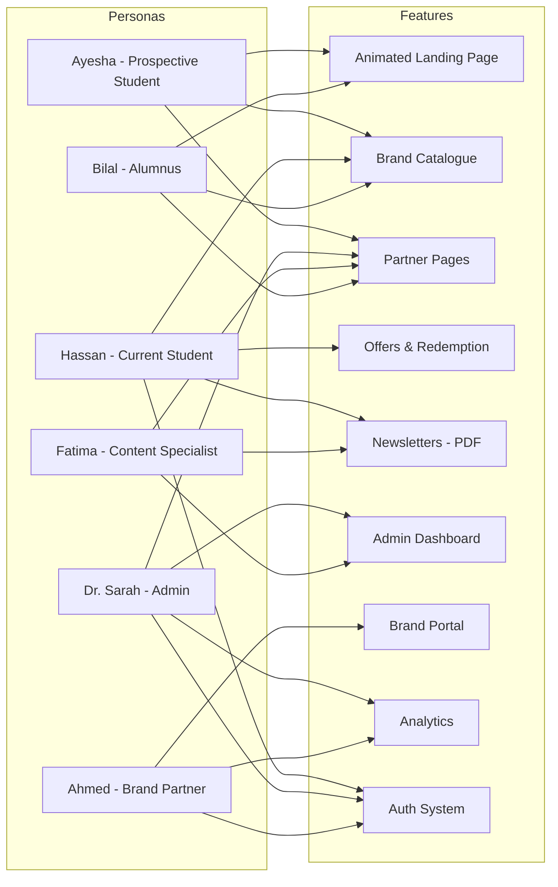

# User Personas

> Habib University Preferred Partner Platform

This document defines the primary user personas that inform feature prioritization, UX decisions, and content strategy across the platform.

---

## 1. Ayesha Rahman — Prospective Student

| Attribute | Detail |
|---|---|
| **Age** | 18 |
| **Location** | Lahore, Pakistan |
| **Education** | A-Levels (completing) |
| **Role** | Prospective HU applicant |
| **Tech Comfort** | High — daily smartphone user, active on Instagram and TikTok |
| **Devices** | iPhone 14, family laptop (shared) |

### Bio

Ayesha is a high-achieving A-Level student in Lahore weighing university options. She's drawn to Habib University's liberal arts philosophy but needs to justify the investment to her parents. She's researching what tangible benefits — beyond academics — set HU apart from other private universities. Student perks and brand partnerships are a surprisingly strong factor in her decision-making, signalling the lifestyle and community HU offers.

### Goals

1. Discover what exclusive student benefits HU offers that competitors don't.
2. Show her parents concrete, real-world value tied to the HU experience.
3. Get a feel for HU's culture and brand identity through its digital presence.
4. Compare HU's partnership ecosystem with other universities informally.

### Frustrations

1. University websites are often outdated, cluttered, and hard to navigate on mobile.
2. Benefits and partnerships are buried deep — never highlighted upfront.
3. No easy way to see all offers at a glance without creating an account.
4. Skeptical of marketing fluff — wants to see real brands and real discounts.

### Scenario

Ayesha finds the HU Preferred Partner page linked from an Instagram story. She opens it on her phone during a break. She scrolls the landing page — the editorial design catches her eye. She browses the brand catalogue, filters by "Lifestyle," and screenshots three offers to send to her mother on WhatsApp. She doesn't sign up yet but bookmarks the page.

### Key Quote

> *"If a university partners with brands I actually care about, it tells me they understand students like me."*

---

## 2. Hassan Ali — Current Student

| Attribute | Detail |
|---|---|
| **Age** | 21 |
| **Location** | Karachi, Pakistan (on-campus) |
| **Education** | BS Computer Science, 3rd year |
| **Role** | Active HU student |
| **Tech Comfort** | Very high — developer, power user |
| **Devices** | MacBook Pro, Samsung Galaxy S24 |

### Bio

Hassan is a third-year CS student deeply embedded in campus life. He's budget-conscious and actively seeks out every discount available to him as an HU student. He values efficiency — he wants to find, verify, and redeem offers with minimal friction. He's also the kind of student who notices (and critiques) poor UX.

### Goals

1. Quickly find active offers relevant to his interests (tech, food, fitness).
2. Redeem offers seamlessly — minimal steps between discovery and use.
3. Stay updated on new partnerships and limited-time deals.
4. Share good deals with friends and classmates.

### Frustrations

1. Offers that have expired but are still displayed on the platform.
2. Redemption processes that require printing or visiting a physical office.
3. No push notifications or alerts for new deals in his preferred categories.
4. Slow page loads on campus Wi-Fi during peak hours.

### Scenario

Hassan checks the platform every Monday on his phone between classes. He filters by "New This Week" and "Food & Dining." He taps an offer from a Karachi café chain, sees the terms, and saves the redemption code to his phone's notes. Later that evening, he uses it when ordering with friends. He wishes he could just tap "redeem" and have it stored in-app.

### Key Quote

> *"I don't want to hunt for discounts — I want them served to me, filtered and ready."*

---

## 3. Dr. Sarah Khan — Platform Administrator

| Attribute | Detail |
|---|---|
| **Age** | 42 |
| **Location** | Karachi, Pakistan |
| **Education** | PhD Marketing |
| **Role** | Director of Marketing & Communications, Habib University |
| **Tech Comfort** | Moderate — comfortable with CMS tools, not a developer |
| **Devices** | Dell laptop (work-issued), iPhone 13 |

### Bio

Dr. Sarah Khan oversees HU's brand image and all partnership communications. She's ultimately responsible for the Preferred Partner platform's content accuracy, visual consistency, and strategic alignment with the university's positioning. She needs to approve content, monitor partner activity, and report on platform engagement to university leadership — without relying on the dev team for every update.

### Goals

1. Manage and approve all brand partner content from a single dashboard.
2. Maintain visual and editorial consistency with HU's brand guidelines.
3. Generate engagement reports for quarterly presentations to leadership.
4. Onboard new brand partners with minimal technical overhead.

### Frustrations

1. Having to email the dev team for simple content changes (logo swaps, copy edits).
2. No centralized view of which partners are active, expiring, or pending approval.
3. Analytics scattered across multiple tools — hard to compile into a single report.
4. Brand partners uploading off-brand or low-resolution assets.

### Scenario

A new food delivery partner has been finalized. Dr. Khan logs into the admin dashboard, creates a new partner entry, uploads the approved logo and offer details, sets the campaign dates, and publishes — all within 15 minutes. She then checks the analytics tab to see last month's top-performing partner page before her leadership meeting.

### Key Quote

> *"I need the platform to make me look organized, not give me another thing to manage."*

---

## 4. Ahmed Raza — Brand Partner Representative

| Attribute | Detail |
|---|---|
| **Age** | 35 |
| **Location** | Karachi, Pakistan |
| **Education** | MBA Marketing |
| **Role** | Regional Marketing Manager, retail brand partner |
| **Tech Comfort** | Moderate — uses CRM and marketing platforms daily |
| **Devices** | HP laptop (work-issued), iPhone 15 Pro |

### Bio

Ahmed manages university partnerships for a national retail chain. He works with multiple universities and doesn't have time for platforms that require hand-holding. He needs to update his brand's offers, upload assets, and track performance independently through a self-service portal. He evaluates the ROI of each university partnership quarterly.

### Goals

1. Update offers, banners, and brand information without contacting HU staff.
2. Track engagement metrics for his brand's page (views, clicks, redemptions).
3. Upload campaign assets that meet platform specifications easily.
4. Manage multiple active offers with different date ranges simultaneously.

### Frustrations

1. Platforms that don't provide self-service — every change requires an email chain.
2. No visibility into how his brand's page is actually performing.
3. Asset upload rejecting files without clear guidance on required specifications.
4. Slow approval processes that delay time-sensitive campaigns.

### Scenario

Ahmed's brand is launching a back-to-school campaign. He logs into the brand portal, creates a new offer with a 2-week window, uploads the campaign banner (the portal guides him on dimensions), and submits for approval. He checks back the next day — it's live. He monitors the real-time view count over the campaign period and exports a summary PDF for his quarterly review.

### Key Quote

> *"Give me a portal, give me metrics, and get out of my way."*

---

## 5. Fatima Malik — Marketing Team Member

| Attribute | Detail |
|---|---|
| **Age** | 28 |
| **Location** | Karachi, Pakistan |
| **Education** | MS Mass Communication |
| **Role** | Content Specialist, HU Marketing Team |
| **Tech Comfort** | High — proficient with design tools, CMS, email marketing |
| **Devices** | MacBook Air (work-issued), iPhone 14 |

### Bio

Fatima is the hands-on content creator within Dr. Khan's marketing team. She writes newsletter copy, designs visual assets, coordinates with brand partners on content calendars, and publishes updates to the platform weekly. She needs the CMS to be fast, intuitive, and supportive of her editorial workflow — draft, preview, review, publish.

### Goals

1. Publish and manage weekly newsletters (PDF format) through the CMS.
2. Schedule content publications in advance to align with campaign calendars.
3. Preview exactly how content will appear to students before publishing.
4. Maintain a consistent publishing cadence without bottlenecks.

### Frustrations

1. CMS tools that don't offer a live preview of published content.
2. No scheduling — everything must be published manually at the right time.
3. PDF newsletter uploads that break formatting or display incorrectly.
4. Version control confusion when multiple team members edit the same content.

### Scenario

It's Thursday — Fatima's publishing day. She logs into the admin dashboard, navigates to Newsletters, uploads this week's PDF (already designed in InDesign), fills in the title and summary, previews the newsletter card as it will appear on the student-facing page, schedules it for Friday 9:00 AM, and moves on to drafting next week's content brief.

### Key Quote

> *"The CMS should feel like a creative tool, not a database form."*

---

## 6. Bilal Sheikh — General Visitor (Alumnus)

| Attribute | Detail |
|---|---|
| **Age** | 30 |
| **Location** | Karachi, Pakistan |
| **Education** | BS Electrical Engineering (HU '18) |
| **Role** | Software Engineer; HU alumnus |
| **Tech Comfort** | Very high |
| **Devices** | Personal MacBook, Google Pixel 8 |

### Bio

Bilal graduated from Habib University six years ago and remains loosely connected to the HU community. He occasionally checks HU's platforms out of nostalgia and genuine interest in the university's growth. He's curious whether alumni get any access to the partner benefits and sees the platform as a signal of how far HU has come since his time.

### Goals

1. Explore whether alumni have access to any partner benefits.
2. Stay informed about HU's growth and new brand partnerships.
3. Share interesting HU initiatives with his professional network.
4. Reconnect with the HU community through its digital presence.

### Frustrations

1. No clear indication of whether alumni are eligible for any offers.
2. Being asked to log in with student credentials he no longer has.
3. The platform feeling exclusively student-focused with no alumni acknowledgment.
4. Outdated content that makes the platform feel neglected.

### Scenario

Bilal sees a LinkedIn post from HU's official page mentioning a new corporate partner. He clicks through to the Preferred Partner platform. The landing page animation impresses him. He browses the catalogue but notices there's no "Alumni" filter or section. He checks the FAQ — no mention of alumni eligibility. He leaves, mildly disappointed, but shares the link on his WhatsApp alumni group anyway because the design is impressive.

### Key Quote

> *"I'm proud of HU. I just wish they'd remember that alumni are part of the community too."*

---

## Persona–Feature Mapping

---

> **Usage:** Reference these personas during feature design, UX reviews, and prioritization discussions. Every user story should trace back to at least one persona.
